# 情感分析很难，但 AI 可能有答案。

> 原文：<https://towardsdatascience.com/sentiment-analysis-is-difficult-but-ai-may-have-an-answer-a8c447110357?source=collection_archive---------15----------------------->

Image by [Magic Creative](https://pixabay.com/users/CreativeMagic-480360/?utm_source=link-attribution&utm_medium=referral&utm_campaign=image&utm_content=1041796) from [Pixabay](https://pixabay.com/?utm_source=link-attribution&utm_medium=referral&utm_campaign=image&utm_content=1041796)

最近，当我在亚马逊上购买一个笔记本电脑包时，我偶然发现了一条非常有趣的顾客评论:

*“这是有史以来最好的电脑包。它太好了，用了不到两个月，就配当杂货袋用了。”*

评论中固有的讽刺是显而易见的，因为用户对包的质量不满意。然而，由于该句包含“最好”、“好”和“值得”等词，该评论很容易被误认为是积极的。这种幽默但隐晦的评论在社交媒体上传播是一种常见现象。如果这种反应没有被发现并采取行动，可能会损害公司的声誉，特别是如果他们计划举行新的发布会。检测评论中的讽刺是自然语言处理的一个重要用例，我们将看到机器学习如何在这方面有所帮助。

# 情感分析:从非结构化数据中获得重要见解

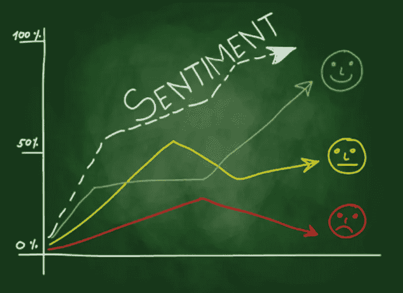

**Source:** [5 ways sentiment analysis can boost your business](https://thenextweb.com/contributors/2017/08/06/5-ways-sentiment-analysis-can-boost-business/)

在我们进入讽刺检测的本质之前，让我们试着对情感分析有一个整体的概述。

**情感分析**，也被称为观点挖掘，是[自然语言处理](https://en.wikipedia.org/wiki/Natural_language_processing?source=post_page---------------------------)的一个子领域，试图从给定的文本中识别和提取观点。

早些时候，公司依靠调查和焦点小组研究等传统方法来获得消费者的反馈。然而，机器学习和人工智能支持的技术使得分析来自各种来源的文本更加准确和精确成为可能。不用说，从文本中提取情感的能力是一个非常有价值的工具，有可能极大地提高许多企业的投资回报率。

## 情感分析的重要性

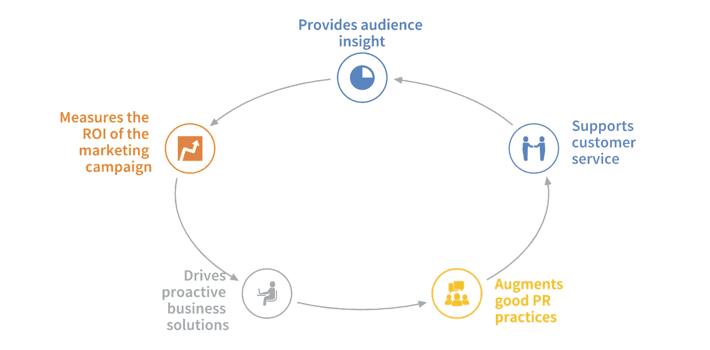

[**Advantages of Sentiment Analysis in driving Busines**](https://thenextweb.com/contributors/2017/08/06/5-ways-sentiment-analysis-can-boost-business/)**s**

时空洞察的首席技术官保罗·霍夫曼曾经说过*“如果你想理解人们，尤其是你的客户……那么你必须具备强大的文本分析能力*”。我们完全同意 Paul 的观点，因为文本分析给企业带来的力量在最近几年已经非常明显。随着社交媒体活动的激增，从商业角度来看，情感被视为有价值的商品。通过仔细衡量人们的意见和情绪，公司可以合理地了解人们对产品的看法，并相应地纳入反馈。

# 讽刺:用积极的词语表达消极的情绪

情感分析不是一项容易完成的任务。文本数据通常预先加载了大量噪声。讽刺是一种天生存在于社交媒体和产品评论中的噪音，可能会干扰结果。

讽刺性的文章展示了一种独特的行为。与简单的否定不同，讽刺性的句子只使用词语的正面含义来表达负面情绪。这里有几个明显带有讽刺意味的例子。

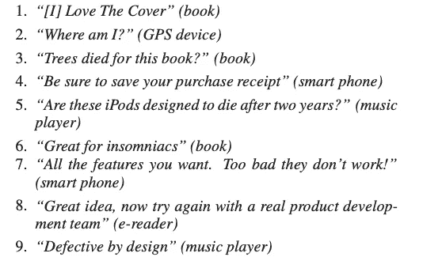

source: [Semi-Supervised Recognition of Sarcastic Sentences in Online Product Reviews](https://pdfs.semanticscholar.org/9ce8/e449151d4cb9047168f3a90c257035768847.pdf)

情感分析很容易被这种讽刺性词语的存在误导，因此，讽刺检测是许多 NLP 任务中至关重要的预处理步骤。在为 NLP 应用训练模型之前，识别并去除噪声样本是有用的。

# 使用无人驾驶人工智能(DAI)的讽刺检测

[无人驾驶 AI](https://www.h2o.ai/products/h2o-driverless-ai/) 是来自 [H2O.ai](https://www.h2o.ai/) 的自动机器学习产品。它配备了用于文本分类和回归问题的自然语言处理(NLP)方法。该平台支持独立文本和具有其他数值的文本作为预测特征。以下配方和模型已在 DAI 中实施:

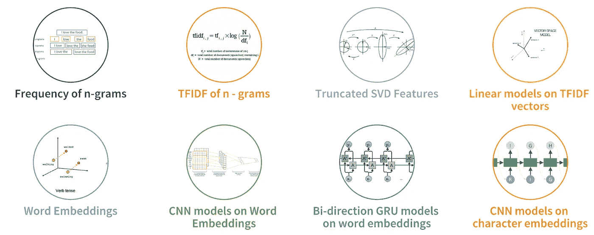

Key Capabilities of the Driverless AI NLP Recipe

该平台使用 TFIDF、CNN 和 GRU 等强大的技术自动将文本字符串转换为特征。通过 TensorFlow，无人驾驶 AI 还可以处理更大的文本块，并使用所有可用的数据建立模型来解决商业问题。无人驾驶人工智能具有最先进的情感分析 NLP 能力，我们将利用它来建立一个讽刺检测分类器。

## 资料组

该数据集由互联网评论网站 Reddit 的 130 万条讽刺评论组成，分为讽刺和非讽刺两类。数据集的来源是一篇论文，题目是:“ [**一个大型的自我注释讽刺语料库**](https://arxiv.org/abs/1704.05579) ”。数据集的处理版本也可以在 [Kaggle](https://www.kaggle.com/danofer/sarcasm) 上找到，让我们在运行各种分类算法之前探索一下数据集。

**导入数据**

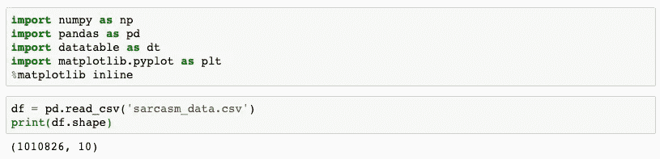

数据集包含一百万行，每条记录包含十个属性:

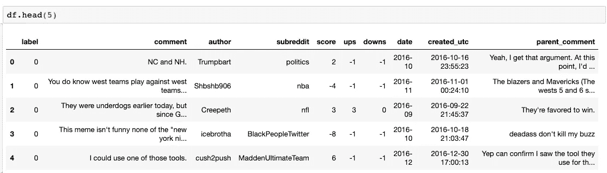

我们主要对以下两列感兴趣:

*   `label` : `0`用于讽刺性评论，`1`用于非讽刺性评论
*   `comment`:将用于运行实验的文本栏

**探索性数据分析**

数据集非常平衡，讽刺和非讽刺的推特数量相等。

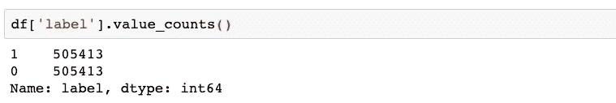

讽刺和正常评论的长度分布也几乎相同。

Distribution of Sarcastic vs Non-Sarcastic Comments

由于数据集已被转换为表格格式，它已准备好输入无人驾驶人工智能。请注意，文本特征将在特征工程过程中自动生成和评估

# 启动实验

我们将分三部分进行实验，以获得尽可能好的结果。

*   **内置 TF/IDF NLP 配方**

在第一部分中，我们将使用 DAI 的内置 TF/IDF 功能。

> 如果你想更新一下关于无人驾驶人工智能入门的知识，请随时参加 [**试驾**](https://h2oai.github.io/tutorials/test-drive/#1) 。试驾是 H2O 在 AWS 云上的无人驾驶人工智能，你可以探索它的所有功能，而不必下载它。

重新开始戴的生活。接下来，以 70:30 的比例将数据集分成训练集和测试集，并将`label`指定为**目标列**。我们还将取消选择所有其他列，只保留数据集中的`comment`列。最后，选择`LogLoss`作为评分者，其他参数保持默认，开始实验。屏幕应该如下所示:

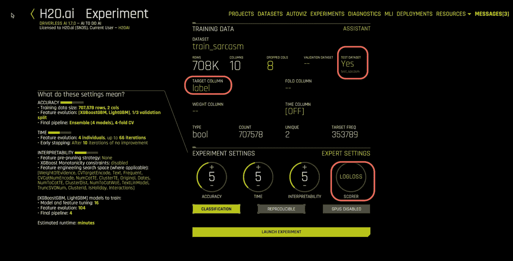

Sentiment Analysis with built-in NLP recipes

*   **内置 Tensorflow NLP 配方**

作为替代，我们将启动相同实验的另一个实例，但是使用 Tensorflow 模型。这是因为 TextCNN 依赖于张量流模型。点击“`Expert Settings’`选项卡，打开`‘TensorFlow Models’`。其余的过程保持不变。

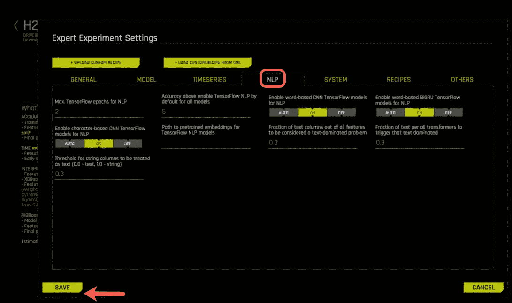

Sentiment Analysis with built-in Tensorflow recipes

*   **带自定义人气食谱**

如果内置的配方还不够，那么就有必要构建我们自己的配方，专注于我们的特定用例。DAI 的最新版本(1.7.0)实现了一个名为 **BYOR** 的关键功能，代表 [**【自带菜谱】**](https://github.com/h2oai/driverlessai-recipes/blob/master/FAQ.md?source=post_page---------------------------#faq)。该功能旨在使数据科学家能够根据其业务需求定制 DAI。你可以在这里阅读更多关于这个功能[的信息。](https://medium.com/@parulnith/custom-machine-learning-recipes-the-ingredients-for-success-3761c3c4fdda)

要上传定制配方，请进入**专家设置**并上传所需配方。H2O 已经构建并开源了超过 [80 个食谱](http://r)可以作为模板。这些食谱可以从 https://github.com/h2oai/driverlessai-recipes[获得。对于这个实验，我们将使用下面的配方:](https://github.com/h2oai/driverlessai-recipes)

*   使用来自 TextBlob 的预训练模型从文本中提取情感。

TextBlob 是一个 python 库，提供了一个简单的 API 来访问它的方法和执行基本的 NLP 任务。它可以执行许多 NLP 任务，如情感分析、拼写检查、摘要创建、翻译等。点击**专家设置选项卡**并导航至`driverlessai-recipes > transformers > nlp`并选择所需的制作方法。点击`save`保存设置。

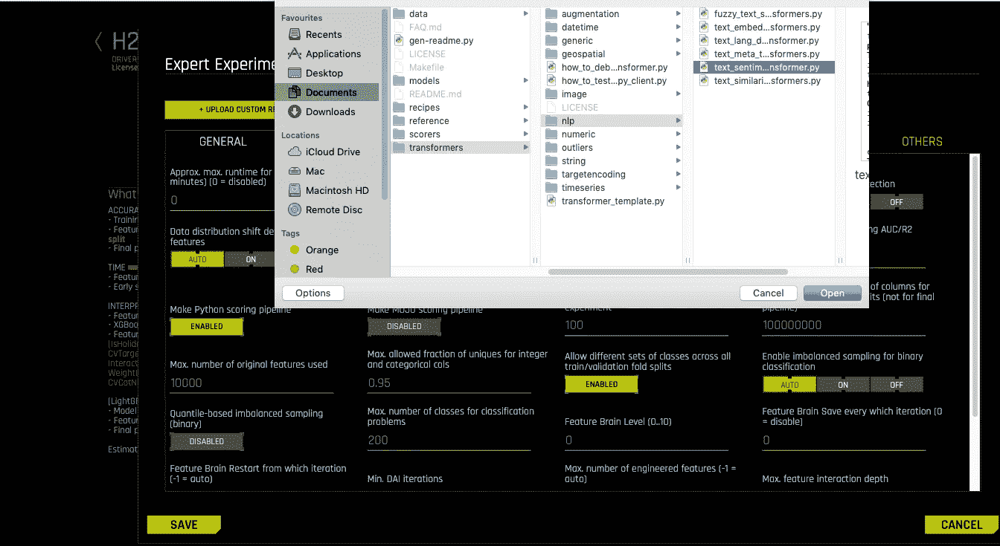

接下来，您还可以选择特定的变压器并取消选择其余的变压器。

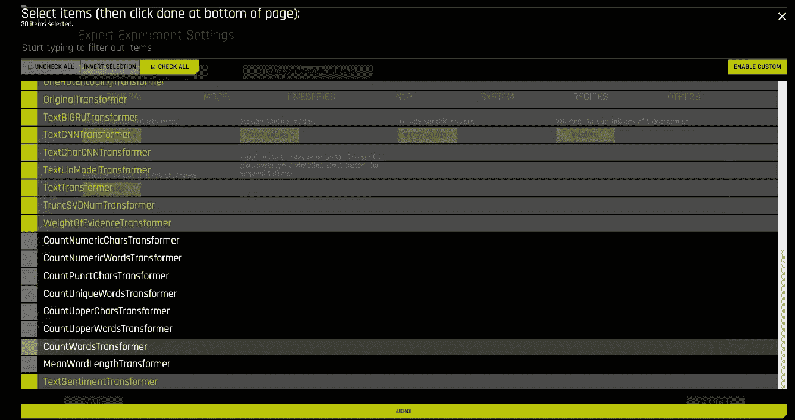

# 实验结果总结

下面的截图显示了不同配方的戴的三个实例之间的比较。自定义配方的引入将 Logloss 组件从 0.54 减少到 0.50，当转换到业务领域时，可以具有巨大的价值。

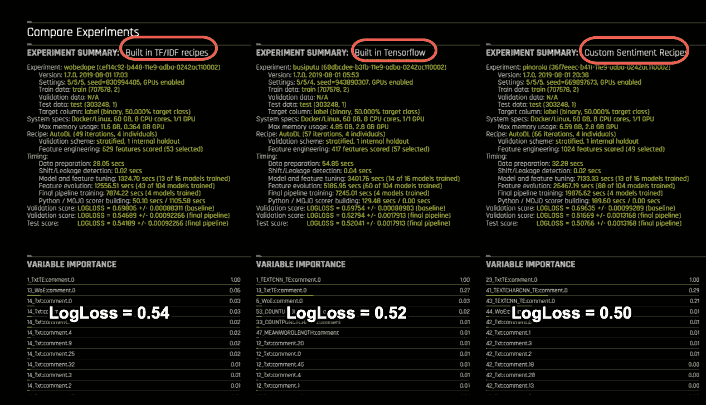

一旦实验完成，用户可以进行新的预测，并下载评分管道，就像其他任何无人驾驶 AI 实验一样。

# 结论

情感分析在营销领域可以发挥至关重要的作用。它可以帮助创建有针对性的品牌信息，并帮助公司了解消费者的偏好。对于一家公司来说，这些见解对于扩大其在一系列行业的影响力至关重要。