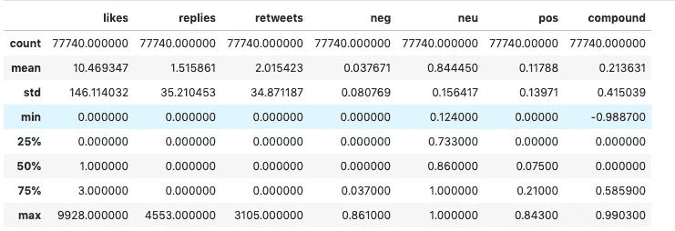
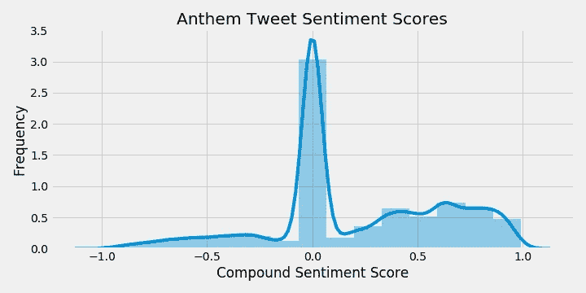
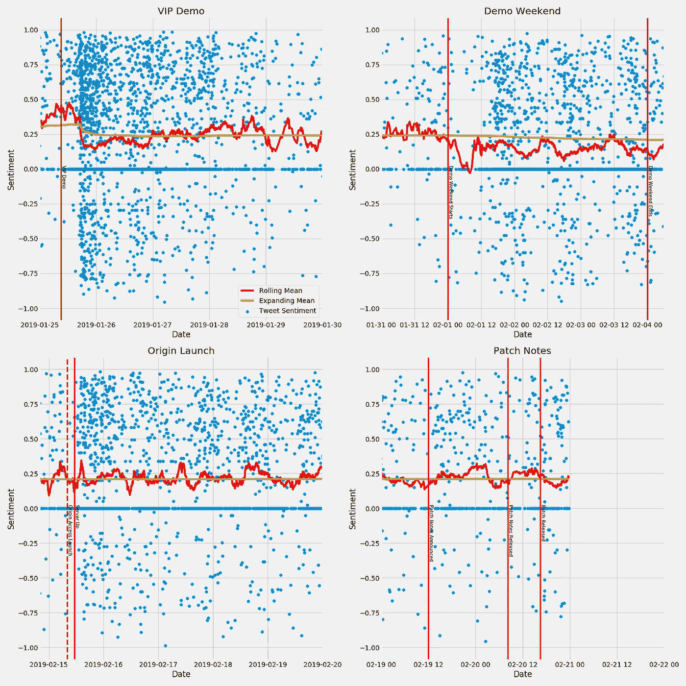

# Python 中 Anthem 游戏发布的情感分析

> 原文：<https://towardsdatascience.com/sentiment-analysis-of-anthem-game-launch-in-python-16be9e5083d2?source=collection_archive---------14----------------------->

视频游戏的发布受到戏剧的困扰。从误导性的预购捆绑包，到发布时远未完成的游戏，大型发行商在决定游戏发布的方式和时间时有相当大的风险要管理。我认为这可能是一个有趣的项目，看看一个游戏在推出期间的情绪变化，AAA 冠军国歌是这个小项目的完美游戏。*(仅供参考，我在 2 月 22 日游戏正式发布前写这篇文章)*

在我们开始之前，Anthem 有一个独特的发布时间表，可能会影响个人对游戏的看法。

*   Anthem 从 2 月 1 日星期五到 2 月 3 日星期日有一个“演示周末”
*   Anthem 于 2 月 15 日星期五“提前”面向 EA Access 成员推出
*   Anthem 将于 2 月 22 日正式面向所有人发布

所以让我们开始吧！

*我将尽力描述我使用的所有软件包，但这里有我的重要陈述供参考！*

```
%matplotlib inline
from twitterscraper import query_tweets
from vaderSentiment.vaderSentiment import SentimentIntensityAnalyzer
import datetime as dt
import pandas as pd
from langdetect import detect
import matplotlib.pyplot as plt
import seaborn as snsanalyzer = SentimentIntensityAnalyzer()
```

# 抓取 Twitter 数据

从 twitter 获取数据的方法有一百万种，但我选择使用 taspinar 的软件包[twitterscraper](https://github.com/taspinar/twitterscraper)，它是 beautifulSoup 的一个包装器，使获取 tweets 变得容易。我喜欢这个包，不仅因为你不必向 twitter 请求 API 密钥，还因为 webscraper 没有 Twitter API 的任何限制。

有了`from twitterscraper import query_tweets`，获取我需要的所有推文变得简单了。

```
begin_date = dt.datetime.strptime("Jan 15 2019", "%b %d %Y").date()
tweets = query_tweets("#Anthem OR #AnthemGame",begindate=begin_date)
```

这需要一些时间…所以在你等待的时候去攻克一个要塞吧！完成后，你应该有一个很长的 twitterscraper 对象列表。

```
print(len(tweets))
102418
```

102418 条关于 Anthem 的推文！

Twitterscraper 对象有一个易于使用的 __dict__ 方法，它以字典的形式返回我们想要的所有 tweet 数据。

```
tweets[1].__dict__{'user': '_WECKLESS',
 'fullname': 'WECKLESS™',
 'id': '1085323189738192897',
 'url': '/_WECKLESS/status/1085323189738192897',
 'timestamp': datetime.datetime(2019, 1, 15, 23, 49, 47),
 'text': 'Here is my GIF #AnthemGame pic.twitter.com/jCNjiWQnmJ',
 'replies': 0,
 'retweets': 0,
 'likes': 2,
 'html': '<p class="TweetTextSize js-tweet-text tweet-text" data-aria-label-part="0" lang="en">Here is my GIF <span class="twitter-hashflag-container"><a class="twitter-hashtag pretty-link js-nav" data-query-source="hashtag_click" dir="ltr" href="/hashtag/AnthemGame?src=hash"><s>#</s><b><strong>AnthemGame</strong></b></a><a dir="ltr" href="/hashtag/AnthemGame?src=hash"></a></span> <a class="twitter-timeline-link u-hidden" data-pre-embedded="true" dir="ltr" href="https://t.co/jCNjiWQnmJ">pic.twitter.com/jCNjiWQnmJ</a></p>'}
```

我们可以看到这本字典有用户名，唯一的推文 id，回复数，转发数，推文的点赞数，最重要的是推文的文本！我们将把所有这些推文放入一个熊猫数据框架中，这样它们就容易使用了！此时，我还将我的推文保存到一个文件中，这样，如果我想重新运行我的分析，我就不必再次经历网络搜集过程。)

```
tweet_list = (t.__dict__ for t in tweets)
df = pd.DataFrame(tweet_list)
```

这是我们新的数据框架的样子！


Notice how some tweets are not in english. We’ll deal with that in the next step!

# 语言和情感分析

下一步我们要解决两件事。首先，请注意，我们的推文并非都是英文的。虽然我们可以翻译我们的推文，并试图从它们那里获得一些情感，但我认为删除非英语推文会更容易、更干净。要做到这一点，我们需要给每条推文贴上语言标签。别担心，那里有一个图书馆！ [Langdetect by Mimino66](https://github.com/Mimino666/langdetect) 的 detect 功能就是我们识别推文语言所需要的一切。我们可以用`from langdetect import detect`载入必要的功能

我们将通过在文本数据上映射 detect()函数，在数据帧中创建一个新列，然后只保留英语的 tweets。

```
df['lang'] = df['text'].map(lambda x: detect(x))
df = df[df['lang']=='en']
```

当这一步完成时，我只剩下 77，740 条推文。

现在，我们可以开始对我们的推文进行一些文本分析了。 [VADER 情感分析](https://github.com/cjhutto/vaderSentiment)是一个流行的 python 包，用于获取一段文本的情感，它特别适合社交媒体数据，并且随时可以开箱即用！

我们需要导入它的 SentimentIntensityAnalyzer 并初始化它。

```
from vaderSentiment.vaderSentiment import SentimentIntensityAnalyzer
analyzer = SentimentIntensityAnalyzer()
```

VADER 会为你传递的任何文本返回一个 4 分的字典；正分数、中性分数、负分数和复合分数，范围从-1 到 1。我们最感兴趣的是追踪推文整体情绪的复合分数。

从这里，我们制作了一系列新的数据，包含我们的推文文本的情感，并将其连接到我们的原始数据帧。

```
sentiment = df['text'].apply(lambda x: analyzer.polarity_scores(x))
df = pd.concat([df,sentiment.apply(pd.Series)],1)
```

这是我们最终的数据帧。我们可以看到我们的推文是英文的，每条推文都有一组相关的情感评分。


现在开始分析！

# 分析情绪

首先，让我们调用`df.describe()`并获取数据集的一些基本信息。



我们有 77，740 条推文，平均有 10 个赞，35 个回复和 2 个转发。查看复合得分，我们可以看到平均推文是积极的，平均情绪为 0.21。

绘制这些数据会让我们更好地了解它的样子。在我们绘图之前，为了方便使用，我对我的数据框架做了一些更改，按时间戳对所有值进行排序，使它们有序，将时间戳复制到索引以使绘图更容易，并计算复合情感得分的扩展和滚动平均值。

```
df.sort_values(by='timestamp', inplace=True)
df.index = pd.to_datetime(df['timestamp'])df['mean'] = df['compound'].expanding().mean()
df['rolling'] = df['compound'].rolling('6h').mean()
```

现在使用 matplotlib 和`import matplotlib.pyplot as plt`，我们可以创建一个快速图表，显示我们的推文和他们的情绪随时间的变化。

```
fig = plt.figure(figsize=(20,5))
ax = fig.add_subplot(111)
ax.scatter(df['timestamp'],df['compound'], label='Tweet Sentiment')
ax.plot(df['timestamp'],df['rolling'], color ='r', label='Rolling Mean')
ax.plot(df['timestamp'],df['mean'], color='y', label='Expanding Mean')
ax.set_xlim([dt.date(2019,1,15),dt.date(2019,2,21)])
ax.set(title='Anthem Tweets over Time', xlabel='Date', ylabel='Sentiment')
ax.legend(loc='best')
fig.tight_layout()
plt.show(
```


我们可以马上注意到一些有趣的事情。

*   有很多推特的情绪分是 0。
*   我们有很多数据。
*   在我们的数据中，平均值似乎有些稳定，除了第 25 天，那里的负面推文数量有所增加，平均值的扩大受到了严重影响。
*   似乎有更高密度的区域有更多的推文出现。我们将看看我们是否能把这些与游戏发布的相关事件联系起来。

让我们试着一次解决一个问题。首先让我们看看那些情绪为 0 的推文。Seborn 的 distplot 是一种快速查看我们推文中情感分数分布的方法。

```
fig = plt.figure(figsize=(10,5))
ax = fig.add_subplot(111)
sns.distplot(df['compound'], bins=15, ax=ax)
plt.show()
```



Just over 30% of our tweets have a sentiment of 0.

我选择暂时将这些推文留在我的数据集中。但值得注意的是，如果不包括这些因素，平均情绪会高得多。

让我们看看，随着时间的推移，我们是否能对自己的情绪有一个更清晰的了解。总的来说，我们的数据是嘈杂的，实在是太多了。从我们的数据中提取一个样本可能会让我们更容易看到趋势的发展。我们将使用 pandas sample()函数来保留 77，740 条推文中的十分之一。

```
ot = df.sample(frac=.1, random_state=1111)
ot.sort_index(inplace=True)ot['mean'] = ot['compound'].expanding().mean()
ot['rolling'] = ot['compound'].rolling('6h').mean()
```

我按日期重新排序，并为我们的数据计算新的扩展和滚动平均值，并绘制新数据集的图表。


By sampling the dataset we can get a much better idea of how sentiment is changing over time.

这个图表好得多，让我们可以看到随着时间的推移，情绪的一些下降和趋势。现在剩下要做的就是找出是什么导致了情绪的变化。

我在本文开头提到了 Anthem 发布的一些重要注意事项。让我们在图表中添加一些重要的日期，看看它们是否符合我们数据中的趋势。

*   Anthem 从 2 月 1 日到 2 月 3 日有一个“免费演示周末”。
*   Anthem 于 2 月 15 日面向 Origin Access 会员上线。
*   Anthem 在 2 月 15 日发布后不久就出现了服务器问题，并于上午 7:30 发布到他们的 twitter 帐户上，这些问题得到了解决，EA 于上午 11:06 发布了一篇 twitter 帖子。
*   EA 于 19 日发布了第一天补丁，20 日上午 8:13 发布了完整的补丁说明，补丁于当天下午 4:27 上线。

添加一些行。axvline()和。text()我在这里结束了这个图表。


These lines might not line up perfectly, as I’m not sure the ‘official’ time of each release.

我们可以看到，两大群推文与游戏发布时间一致，都是“演示周末”和 Origin Access 发布。

此外，我们可以看到，在演示周末，情绪下降。演示周末期间的平均情绪为 0.138，相比之下，演示周末之前的同一时期的平均情绪为 0.239。

你也可以很快注意到，1 月下旬还有另一组推文未被解释。快速浏览 Twitter，我发现这实际上是一个 VIP 演示周末，也遇到了服务器问题，加载时间长，需要多个补丁修复。这与市场人气的大幅下降不谋而合。我们也将这条线添加到我们的图表中，并创建一些支线剧情，让我们可以看到一些个别事件的细节。

这里是图形的最终代码，后面是图形本身。

```
fig = plt.figure(figsize=(20,5))
ax=fig.add_subplot(111)ax.scatter(ot['timestamp'],ot['compound'], label='Tweet Sentiment')
ax.plot(ot['timestamp'],ot['rolling'], color ='r', label='Rolling Mean')
ax.plot(ot['timestamp'],ot['mean'], color='y', label='Expanding Mean')
ax.set_xlim([dt.date(2019,1,15),dt.date(2019,2,21)])
ax.set(title='Anthem Tweets over Time', xlabel='Date', ylabel='Sentiment')
ax.legend(loc='best')#free demo weekend
ax.axvline(x=dt.datetime(2019,2,1) ,linewidth=3, color='r')
ax.text(x=dt.datetime(2019,2,1), y=0, s='Demo Weekend Starts', rotation=-90, size=10)ax.axvline(x=dt.datetime(2019,2,4) ,linewidth=3, color='r')
ax.text(x=dt.datetime(2019,2,4), y=0, s='Demo Weekend Ends', rotation=-90, size=10)#origin access launch
ax.axvline(x=dt.datetime(2019,2,15) ,linewidth=3, color='r', linestyle='dashed')
ax.text(x=dt.datetime(2019,2,15), y=0, s='Origin Access Launch', rotation=-90, size=10)#server fix
ax.axvline(x=dt.datetime(2019,2,15,11,6) ,linewidth=3, color='r')
ax.text(x=dt.datetime(2019,2,15,11,6), y=0, s='Server Up', rotation=-90, size=10)#patchnotes announced
ax.axvline(x=dt.datetime(2019,2,19,12) ,linewidth=3, color='r')
ax.text(x=dt.datetime(2019,2,19,12), y=0, s='Patch Notes Announced', rotation=-90, size=10)#patchnotes released
ax.axvline(x=dt.datetime(2019,2,20,8,13) ,linewidth=3, color='r')
ax.text(x=dt.datetime(2019,2,20,8,13), y=0, s='Patch Notes Released', rotation=-90, size=10)#patch realeased
ax.axvline(x=dt.datetime(2019,2,20,16,27) ,linewidth=3, color='r')
ax.text(x=dt.datetime(2019,2,20,16,27), y=0, s='Patch Released', rotation=-90, size=10)#vip weekend
ax.axvline(x=dt.datetime(2019,1,25,9,0) ,linewidth=3, color='r')
ax.text(x=dt.datetime(2019,1,25,9,0), y=0, s='VIP Demo', rotation=-90, size=10)fig.tight_layout()
plt.show()
```



Again, the lines might not be perfect as I’m unsure of the ‘official’ time of each launch.

这是添加了 VIP 演示的大图。


我们最终的图表向我们展示了一些有趣的事情。首先，VIP 演示对情绪影响最大。很明显，个人对围绕 VIP 演示的所有问题感到不安。

公开演示周末也显示了情绪的显著下降。这两个都是有趣的案例，在这两个案例中，开发者在游戏没有完全测试之前就决定允许公众玩游戏。一方面，开发者和发行商得到了关于游戏、服务器容量和需要修复的错误的有价值的反馈。问题是，这是以游戏周围的情绪为代价的吗？

也许不是！我们可以看到，当 EA Access 发布开始时，人气已经恢复到原来的水平(尽管从未像 VIP 试玩前那样高。)

游戏开发商和发行商需要权衡让公众作为早期游戏发布的 beta 测试者的价值，以及公众对游戏的看法。如果演示周末被宣传为“测试”周末，或许个人情绪会更高..

总而言之，这是一个有趣的项目，同样的分析可以应用于各种事物，政治，电影等等。现在我想我要从统计中休息一会儿，去参加我的标枪飞行。