# 《神盾局》主角的情感分析

> 原文：<https://towardsdatascience.com/sentiment-analysis-of-the-lead-characters-on-f-r-i-e-n-d-s-51aa5abf1fa6?source=collection_archive---------29----------------------->


Central Perk — Where this beautiful journey began.

我是这部美国情景喜剧的最大爱好者之一——自从我开始看这部剧以来就是朋友。最近，我开始在网上寻找这个节目的文字记录([https://fangj.github.io/friends/](https://fangj.github.io/friends/))。我在这些抄本上找不到太多的数据科学，除了每个角色对话数量的简单统计，他们说出的名字的数量和类似的统计。我想如果我能为像我一样的观众做更多的事情，从数据科学的角度更广泛地了解这部剧，那将会很有趣。

作为第一步，我整理了 plain 可以获得的所有 html 脚本(全部 10 季)。csv 文件(也可以复制成文本，不会造成差异)。皈依者。所有赛季的 csv 文件都可以从我的 github 链接获取——([https://github . com/shilpibattacharyya/Friends _ Analysis/tree/master/transcripts _ Friends](https://github.com/shilpibhattacharyya/Friends_Analysis/tree/master/transcripts_friends))。然后，我使用下面的命令将它们合并在一起。

```
## Command to append multiple files in a directory - 1* represent all files for season1 and so on ...#sed 1d 1*.csv 2*.csv 3*.csv 4*.csv 5*.csv 6*.csv 7*.csv 8*.csv 9*.csv 100*.csv> merged.csv *
```

然后使用下面的实用程序将每个角色(瑞秋、罗斯、乔伊、菲比、钱德勒、莫妮卡)的对白分开:

```
def rem_tabs_newline(str_val):
    str_val = str_val.strip('\\n')
    str_val = str_val.strip('\\t')
    str_val = str_val.replace('\\n','')
    str_val = str_val.replace('\\t','')
    return str_valfriends_chars={} 
Rachel=''
Ross=''
Joey=''
Chandler=''
Phoebe=''
Monica=''
with open("transcripts_friends/season_all/merged.csv", "r+") as fp:
    for cnt, line in enumerate(fp):
        if line.startswith('Rachel:'):
            Rachel=Rachel+' '+(line[8:])
        elif line.startswith('Ross:'):
            Ross=Ross+' '+(line[6:])
        elif line.startswith('Monica:'):
            Monica=Monica+' '+(line[8:])
        elif line.startswith('Chandler:'):
            Chandler=Chandler+' '+(line[10:])
        if line.startswith('Phoebe:'):
            Phoebe=Phoebe+' '+(line[8:])
        if line.startswith('Joey:'):
            Joey=Joey+' '+(line[6:])friends_chars['RACHEL']=rem_tabs_newline(Rachel)
friends_chars['ROSS']=rem_tabs_newline(Ross)
friends_chars['MONICA']=rem_tabs_newline(Monica)
friends_chars['PHOEBE']=rem_tabs_newline(Phoebe)
friends_chars['CHANDLER']=rem_tabs_newline(Chandler)
friends_chars['JOEY']=rem_tabs_newline(Joey)
```

下面的代码使用 nltk 库清除数据，删除停用词、制表符和换行符。

```
from nltk.corpus import stopwords 
from nltk.tokenize import word_tokenize 
from nltk.tokenize import sent_tokenizestop_words = set(stopwords.words('english'))def clean_data(val):
    val = val.strip('\\n')
    val = val.strip('\\t')
    val = val.replace('\\n','')
    val = val.replace('\\t','')
    word_tokens = word_tokenize(str(val).lower().strip('[]') )
    filtered_sentence = [w for w in word_tokens if not w in stop_words]filtered_sentence = []for w in word_tokens: 
        if w not in stop_words: 
            filtered_sentence.append(w)
    return list(filtered_sentence)
```

一旦我清理了数据并收集了单词，我就为每个字符创建一个集合语料库列表，如下所示。

```
rachel_corpus=list(set(clean_data(str(friends_chars['RACHEL']).strip('[]'))))
ross_corpus=list(set(clean_data(str(friends_chars['ROSS']).strip('[]'))))
mon_corpus=list(set(clean_data(str(friends_chars['MONICA']).strip('[]'))))
joe_corpus=list(set(clean_data(str(friends_chars['JOEY']).strip('[]'))))
phoebs_corpus=list(set(clean_data(str(friends_chars['PHOEBE']).strip('[]'))))
chandler_corpus=list(set(clean_data(str(friends_chars['CHANDLER']).strip('[]'))))
```

然后，只过滤掉长度大于 3 的单词，这样我就可以去掉常见的单词，如下所示。

```
words_rach=[w for w in rachel_corpus if len(w)>3]
words_mon=[w for w in mon_corpus if len(w)>3]
words_ross=[w for w in ross_corpus if len(w)>3] 
words_phoebs=[w for w in phoebs_corpus if len(w)>3]
words_joe=[w for w in joe_corpus if len(w)>3]
words_chandler=[w for w in chandler_corpus if len(w)>3]
```

我将进一步使用 nltk lemmatizer 来查找所有单词的词干作为有效单词。请注意，我在避免使用 portstemmer，因为它也会产生一些无效单词。

```
WNLemma=nltk.WordNetLemmatizer()
stem_freq_words_rach=[WNLemma.lemmatize(t) for t in words_rach]
stem_freq_words_ross=[WNLemma.lemmatize(t) for t in words_ross]
stem_freq_words_chandler=[WNLemma.lemmatize(t) for t in words_chandler]
stem_freq_words_mon=[WNLemma.lemmatize(t) for t in words_mon]
stem_freq_words_phoebs=[WNLemma.lemmatize(t) for t in words_phoebs]
stem_freq_words_joe=[WNLemma.lemmatize(t) for t in words_joe]
```

接下来，我将添加所有单词，并为每个角色创建一个口语单词字符串，以提供给 IBM Watson NLU 服务进行情感分析。

```
s_rachel=""
for w in stem_freq_words_rach:
   s_rachel=s_rachel+' '+ws_ross=""
for w in stem_freq_words_ross:
   s_ross=s_ross+' '+ws_phoebs=""
for w in stem_freq_words_phoebs:
   s_phoebs=s_phoebs+' '+ws_joe=""
for w in stem_freq_words_joe:
   s_joe=s_joe+' '+ws_chandler=""
for w in stem_freq_words_chandler:
   s_chandler=s_chandler+' '+ws_mon=""
for w in stem_freq_words_mon:
   s_mon=s_mon+' '+w
```

然后，我会调用沃森 NLU 服务，并传递每个角色的口语单词进行情感分析，如下所示。

```
import json
from ibm_watson import NaturalLanguageUnderstandingV1
from ibm_watson.natural_language_understanding_v1 import Features, EmotionOptions
import pandas as pd
import matplotlib.pyplot as pltdicti={}
natural_language_understanding = NaturalLanguageUnderstandingV1(
        version='2019-07-12',
        iam_apikey='please put your api key here',
        url='[https://gateway.watsonplatform.net/natural-language-understanding/api'](https://gateway.watsonplatform.net/natural-language-understanding/api'))#rachelresponse = natural_language_understanding.analyze(
    text=s_rachel,
    features=Features(emotion=EmotionOptions())).get_result()
print("Rachel")
print("======================================")
dicti["Rachel"]=response["emotion"]["document"]["emotion"]
print(json.dumps(response["emotion"]["document"]["emotion"], indent=2))#ross
response = natural_language_understanding.analyze(
    text=s_ross,
    features=Features(emotion=EmotionOptions())).get_result()
dicti["Ross"]=response["emotion"]["document"]["emotion"] #monica
response = natural_language_understanding.analyze(
    text=s_mon,
    features=Features(emotion=EmotionOptions())).get_result()
dicti["Monica"]=response["emotion"]["document"]["emotion"] #phoebe
response = natural_language_understanding.analyze(
    text=s_phoebs,
    features=Features(emotion=EmotionOptions())).get_result()
dicti["Phoebe"]=response["emotion"]["document"]["emotion"] #chandler
response = natural_language_understanding.analyze(
    text=s_chandler,
    features=Features(emotion=EmotionOptions())).get_result()
dicti["Chandler"]=response["emotion"]["document"]["emotion"] #joey
response = natural_language_understanding.analyze(
    text=s_joe,
    features=Features(emotion=EmotionOptions())).get_result()
dicti["Joey"]=response["emotion"]["document"]["emotion"]print(json.dumps(dicti, indent=2))
```

我将输出转换成 dataframe 并打印如下。

```
df = pd.DataFrame(dicti)
df
```

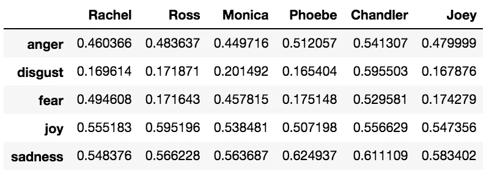

Sentiment density distribution for each of the Characters

为了更好的形象化，我绘制了如下图。

```
df.transpose().plot(kind='bar')
plt.show()
```

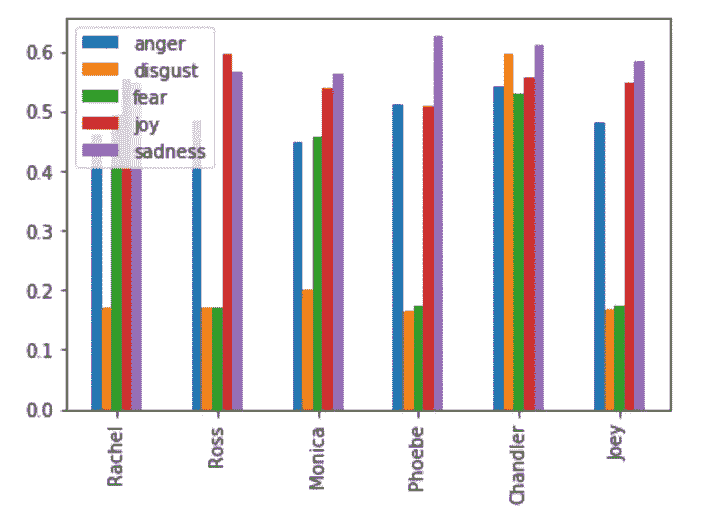

Bar chart for sentiment density distribution for each of the Characters

**从上面的条形图推断**

根据情感密度分布，节目中的所有角色都非常相似。这可能是他们相处融洽、形影不离的原因。这些角色充满了欢乐、悲伤和厌恶:)。

然后，我可视化一个饼图，以便更好地理解这些角色，如下所示(代码可以为每个角色复制—这里只为 Rachel 提供)。

```
colors = ['b', 'g', 'r', 'c', 'm']
labels = ['Anger', 'Disgust', 'Fear', 'Joy', 'Sadness']
explode = (0.2, 0.2, 0.2, 0.2, 0.1)
plt.pie(df.Rachel, colors=colors, labels=labels,
explode=explode, autopct='%1.1f%%',
counterclock=False, shadow=True)
plt.title('Sentiment Density Index for Rachel')
plt.show()
```

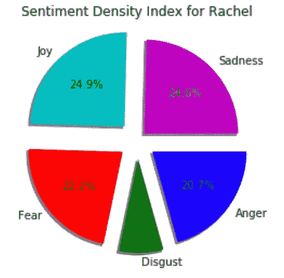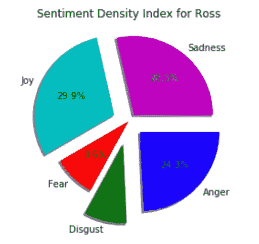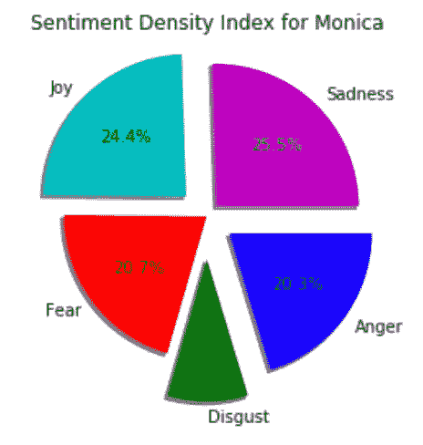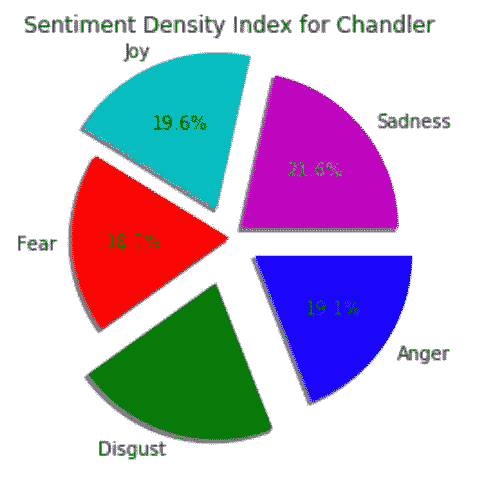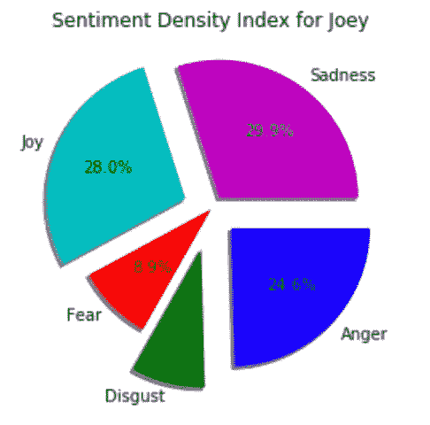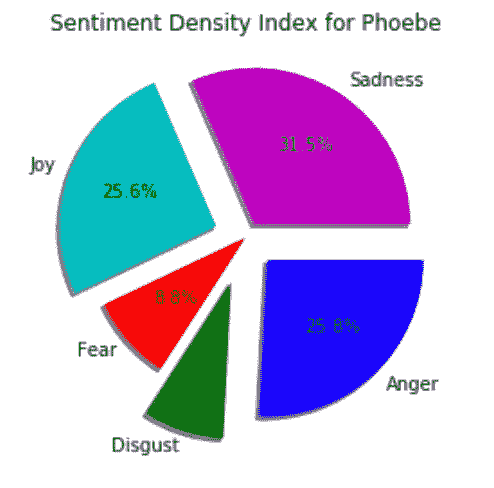

**从上面的饼状图推断**

最平衡的角色是钱德勒，其次是瑞秋和莫妮卡。菲比和乔伊彼此非常相似，罗斯、瑞秋和莫妮卡也是。

我还引入了一个新的变量“快乐商数”,来计算每个角色的快乐相对于其他情绪的比例。

我们可以用类似的方式来评估所有其他情感的这个商。

```
happy_quotient_Rach=df.Rachel.joy/df['Rachel'].sum()
happy_quotient_Ross=df.Ross.joy/df['Ross'].sum()
happy_quotient_Joey=df.Joey.joy/df['Joey'].sum()
happy_quotient_Monica=df.Monica.joy/df['Monica'].sum()
happy_quotient_Phoebe=df.Phoebe.joy/df['Phoebe'].sum()
happy_quotient_Chandler=df.Chandler.joy/df['Chandler'].sum()
```

让我们看一个散点图，找出最幸福的人物。

```
x = ['Rachel','Ross','Joey','Monica','Phoebe','Chandler']
y = [happy_quotient_Rach,happy_quotient_Ross,happy_quotient_Joey,happy_quotient_Monica,happy_quotient_Phoebe,happy_quotient_Chandler]colors = np.where(df_hq.Happiness_Quotient > 0.25, '#ff748c', '#497087')
plt.scatter(x,y,s=120, c=colors)
plt.show(
```

情商的曲线图如下。

```
x_happy = ['Rachel','Ross','Joey','Monica','Phoebe','Chandler']
y_happy = [happy_quotient_Rach,happy_quotient_Ross,happy_quotient_Joey,happy_quotient_Monica,happy_quotient_Phoebe,happy_quotient_Chandler]
colors = ['r','g','b','y','cyan','m']
plt.scatter(x_happy,y_happy,s=120, c=colors)
plt.title('Happiness Quotient for the Characters')
plt.show()
```

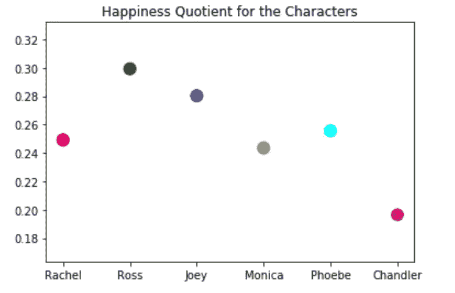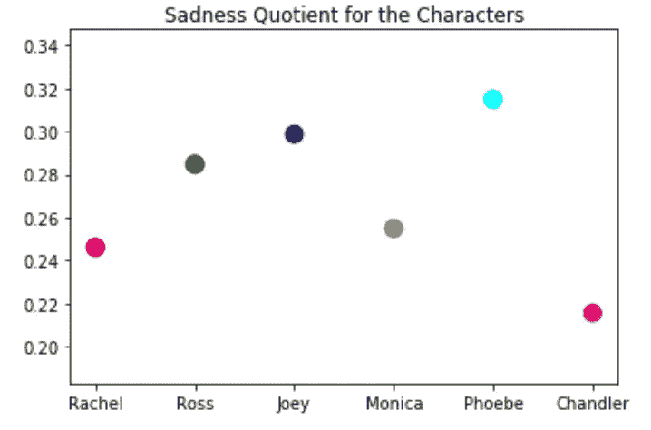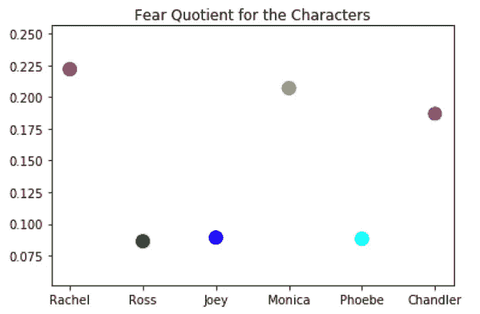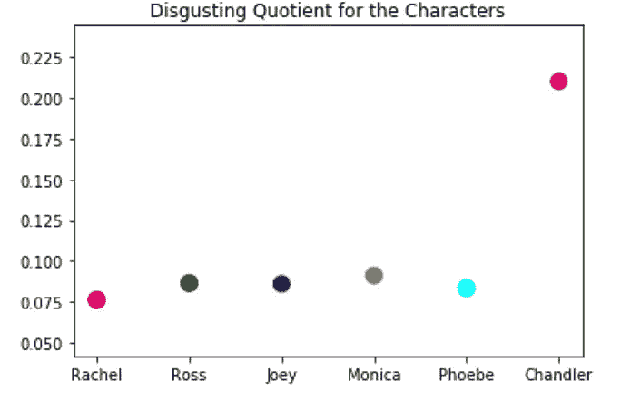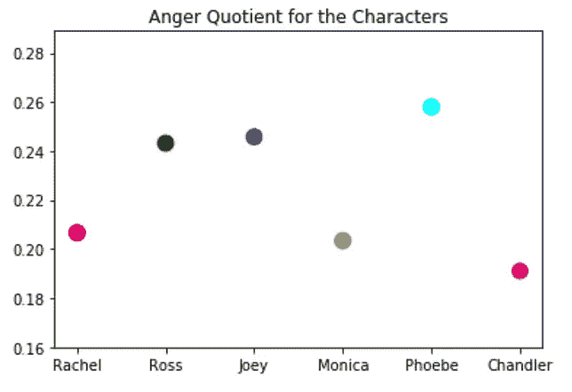

**从上面的散点图推断**

最幸福的**角色依次是:罗斯、乔伊、菲比、瑞秋、钱德勒**

最悲伤的**角色依次是:菲比、乔伊、罗斯、莫妮卡、瑞秋、钱德勒**

最恶心的**角色依次是:钱德勒、莫妮卡、罗斯、乔伊、菲比、瑞秋**

最害怕的角色依次是:瑞秋、莫妮卡、钱德勒、乔伊、菲比、罗斯

最愤怒的**角色依次是:菲比、乔伊、罗斯、瑞秋、莫妮卡、钱德勒**

**备注**

这是一次尝试，通过网上的文字记录来了解角色的情感，看看我是否能把它与我在观看这部剧时对这些角色的感受联系起来。

我会继续研究这个数据集，希望很快能有更多的见解。