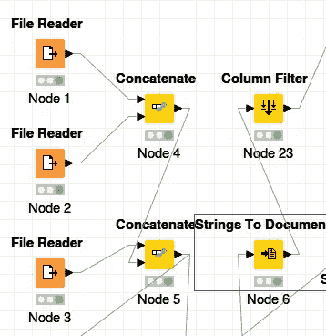
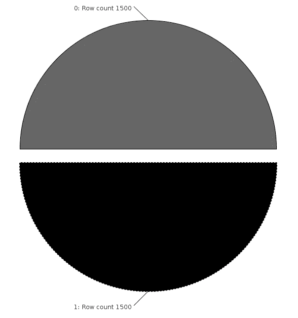
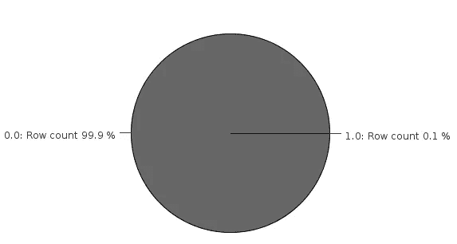
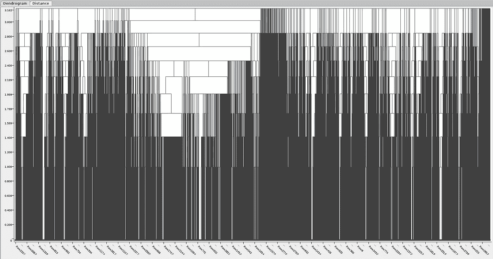
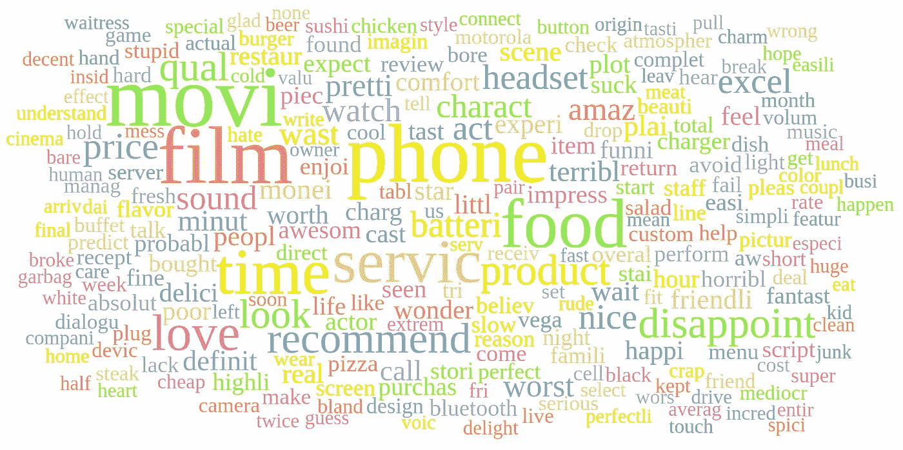
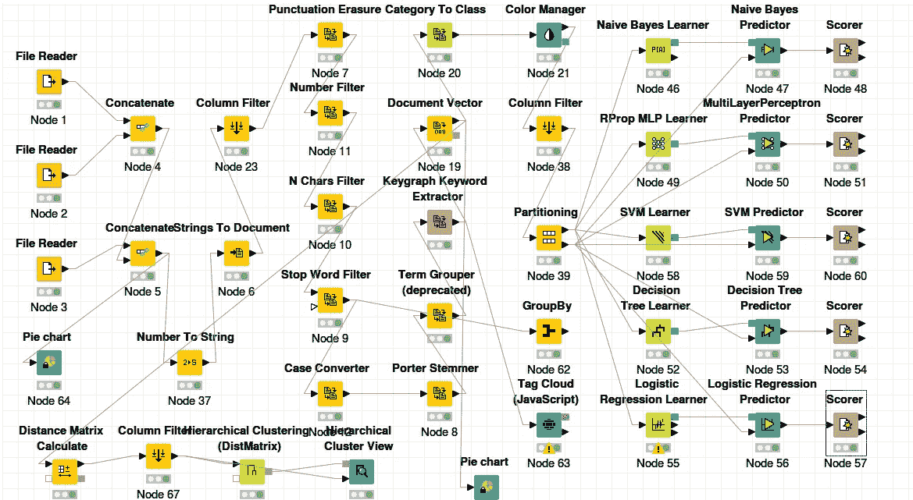

# 有效地预处理文本数据第 2 部分:实现

> 原文：<https://towardsdatascience.com/sentiment-analysis-on-raw-text-using-amazon-imdb-and-yelp-f2547c805f1?source=collection_archive---------16----------------------->

这篇文章是我之前关于文本预处理的文章的直接延续。这是一些重要的文本预处理步骤的实际实现，这些步骤在输入到机器学习模型之前使用。我没有通过编写脚本来使用传统的预处理和学习方法，而是使用了一个叫做 [Knime](https://www.knime.com/) 的工具。

# 数据选择和分析

该数据集可在 UCI 数据库上获得，标题为“**情感标签句子数据集**”。数据集基本上被收集并手工标记为积极或消极情绪。

数据集由三个原始文本文件组成，分别命名为 amazon _ cells _ labelled.txt、imdb _ labelled.txt 和 yelp _ labelled.txt。每个文件包含 1000 个带标签的评论及其对应的标签，这些标签可以是 0，表示负面情绪，1 表示正面情绪。

在大规模了解单个客户的情绪/行为时，情绪分析是一个主要问题。文本是人类用来传递信息的最广泛的一种交流方式。该消息可以是一些信息、反馈、警告或其他人可以理解的任何类型的信息。当遇到大量用户反馈的情况时，几乎不可能手动检查每条记录，然后试图理解数百万条反馈的整体语义。换句话说，人类几乎不可能总结数百万条信息。因此，抽取文本的情感是解决上述问题的关键部分。最简单的情感分析形式是，我们需要判断某段文字对某个主题是正面情感还是负面情感。

在文本分析领域中，这种需要将消息分类为两个或更多不同类别的问题被称为分类问题。

分类是监督学习的一部分，在监督学习中，我们不仅可以获得数据集实例，还可以获得特定实例所属的标签或类。

在这项总体任务中，我们将回答以下基本数据挖掘问题:

1.)对于原始文本形式的可用数据，定义的预处理步骤是什么？

我们将看到预处理和清理文本与普通的数据预处理任务完全不同。存在依赖于语言的算法，这使得很难提出通用的文本预处理任务。在数据分析部分，将详细解释文本预处理步骤。

2.)通过文本提取什么样的特征？

我们有不同的方法来提取数字特征，如 TF-IDF、BoW 等，这些将在下面的文本挖掘部分进行解释。

现在，我们将看到有成千上万个不同的单词，这意味着我们将使用非常巨大的向量，我们的训练数据集矩阵将是一个非常稀疏的矩阵。

让我们看看稀疏矩阵是什么样的。

Figure 1: Bag of Words features with first 15 rows

经过预处理后，我们剩下 3035 个唯一项，这意味着每个向量将有 3035 个 1 和 0(大部分是 0)。

3.)说到情感分析，哪些分类技术是最强的？

这个问题没有简单的答案，但是，考虑到这是一个二元分类，我们应该期待逻辑回归是最好的结果生产者之一。除此之外，SVM 可以给出很好的结果，因为支持向量机在维数较高的地方更好。就神经网络而言，其架构的变化，即层数和神经元数量的变化，几乎会改变一切。简而言之，神经网络既可以是这项任务的最佳选择，也可以是最差的选择。

4.)什么样的聚类技术比较合适？

正如我们上面讨论的，数据非常稀疏，K-Means 聚类不适合这些场景。我们知道只有几个 1 和大多数 0，这意味着在 3035 维向量空间模型中，如果我们应用 K-Means，我们将得到一个没有太多差异的高密度集群。因此，我们将了解分层聚类是如何进行的。考虑到数据量，使用层次聚类将会产生一个非常复杂的树形图。

5.)整个数据中的整体候选子集看起来如何，意思是，数据呈现的核心主题是什么？

我们将在该报告的数据分析部分看到数据中最热门的关键词趋势。考虑到积极情绪和消极情绪的数量相等，可以预计会有很多混淆的关键词来描述积极情绪和消极情绪。

## 数据分析

由于缺乏结构，文本数据分析是最麻烦的任务之一。但是，我们将执行基本的文本和数据分析，以找到数据集的摘要。数据集是从三个不同公司的三个不同文件中读取的，在对数据进行任何分析之前，我们必须合并所有记录。这种数据合并在第一步中执行，如下图所示:

Figure 2: Reading and Concatenating multiple files

如果我们观察正类与负类的比率，我们看到在 3000 条记录中，1500 条对应于正类，1500 条对应于负类。在机器学习中，类的数量相等是更可取的，因为当类的数量不相等时，模型预计会变得有偏差。对于一个类，该模型将暴露给数据集的更多实例，并且该类的权重将会更高，最终，与其他类相比，该模型更有可能预测该类。

Figure 3: Row counts for each class

另一种重要的文本数据分析技术叫做词云，或者标签云。标签云很重要，因为它们不是一些具有可解释意义的图形或图表，相反，它们只是代表整个文本集合的基于关键字的总结，这样，我们就能够直接推断出讨论最多的趋势。这种分析被公司用来判断某个产品是否存在特定的问题。即使在竞选活动的数据收集期间，这些来自社交媒体账户的数据也是由这些机构收集的，最高发生趋势通过标签云可视化，以了解公众在大规模上真正谈论的是什么。

虽然数据集非常平衡，这对训练分类模型来说是一件好事，但是图 1 中一个值得注意的事情是数据的稀疏性。观点大多很短，在大多数情况下不超过一句话。这将是一项具有挑战性的任务，因为数据实例之间的决策边界将非常模糊，因此很难训练一个具有真正良好准确性的分类器。

考虑一下“书”这个术语。下面是一个饼图，显示了总评论中出现的术语的比率。

Figure 4: Percentage of the term “book” appearing in the reviews

这说明 99.9%的行不包含“书”这个词，只有 0.1%的行/句包含“书”这个词。其他许多术语也有类似的情况。这种数据很难处理。虽然平衡的课程对我们来说是一个机会，但稀疏的数据集对我们来说是一个挑战，因为评论通常不是非常详细。

我们对整个数据集应用了层次聚类来得到一个树状图，这实际上是一个非常紧凑的树。

Figure 5: Dendogram of the entire corpus

虽然很难判断树突图中到底显示了什么，但我们可以看到密集的区域，并知道数据中存在某些“分组”，这是因为评论来自不同的语言领域。

# 文本挖掘

我们只有文本评论和它们的情感标签，因此如果没有任何文本挖掘方法，这个问题是不可能解决的。如果没有任何实体文本挖掘方法，我们将无法计算数字特征，没有这些数字特征，就不会有训练好的分类器。

该任务的文本预处理有 9 个主要步骤，如下所示:

*   去掉标点符号，因为它们在文本数据中表现为噪音，因为它们没有特定的语义。
*   去掉数字和数字，因为我们想进行定性分析(肯定或否定)，而不是任何涉及数字的定量分析。
*   删除所有少于或等于三个字符的单词，因为这些单词可能是停用词，也可能是充当俚语的单词。
*   删除 and、or、of、is、am、had 等停用词。停用词是如此普遍，并且持有如此少的语义信息，以至于它们的移除是有利的，因为它不仅降低了向量空间模型的维度，而且在大多数情况下增加了分类的准确性。
*   将整个文本转换为小写，因为计算机会将“awesome”和“Awesome”解释为两个不同的术语，因为小写和大写“A”和“A”的编码不同。
*   应用波特·斯特梅尔。词干提取是一个重要的阶段，因为它将单词或术语还原到它们的根源。例如，术语“更快”被转换成“快”，“推荐”转换成“推荐”，“吃”转换成“吃”，等等。这有助于保留句子的语义，同时简化重复。
*   按文档对术语进行分组。
*   从分组的术语中提取关键字，因为我们不希望每隔一个单词都被限定为一个特征。我们只考虑数据集中最重要的术语，并且只保留合格的关键字术语。
*   将提取的关键词转换成稀疏向量，或者我称之为“矢量化”。

向量化是一个重要的决定，因为将英语单词转换成向量，使得它们的语义可以通过非常高维的数字向量来表示，这是一个有点棘手的过程。对于我们的具体问题，我们可以选择使用 TF-IDF 特性，它代表 term frequency-InvertedDocumentFrequency。当我们要开发一些信息检索系统时，这些类型的特征是首选的，在这些系统中，不仅存在，而且术语存在的次数以及术语(单词)存在的文档数量也很重要。TF-IDF 特性基本上为稀有词提供较高的值，为常用词提供较低的权重值。我们将计算的特征被称为 BoW(单词包)特征，它们背后的思想是，我们将一个文档(在我们的例子中，是一篇评论)视为一个集合，或者说，一个由不同术语(单词)组成的“包”。一个单词要么存在于文档中，要么不存在。弓的整个概念是基于非常大的二进制向量。每个单词代表一个唯一的维度，因此如果在 D 个文档的整个集合中有 W 个唯一的单词，那么每个文档将被表示为 W 维向量。考虑四个单词的词汇表，比如“阿尔法、贝塔、查理和德尔塔”。现在，每个单词或术语都有一个索引。假设这些索引是按照字母顺序排序的。在这种情况下，术语“alpha”位于索引 0，“beta”位于索引 1，依此类推。现在，如果我们想要表示一个文档，上面写着“alpha beta delta delta”，那么它可以表示为一个四维向量[1，1，0，1]。请注意，由于“charlie”不是文档的一部分，并且术语“charlie”的索引是 2(从零开始的索引)，这意味着向量中的第二个索引仍然是 0，而其他索引是 1。另一个例子可以是文档“alpha alpha charlie”，它将被表示为[1，0，1，0]。

上述任务的总体流程如下图所示:

Figure 6: Text preprocessing flow

我们的数据集是关于常见产品和电影的评论。因此，让我们看看我们的数据集中前 250 个术语是什么，然后我们可以讨论用户通过他们的反馈和评论集体传达了什么样的信息。

Figure 7: Tagcloud of the entire dataset

因此，正如我们所见，“电影”、“影片”、“电话”、“食物”、“时间”、“推荐”、“爱情”、“失望”，这些术语主宰了数据集。我们可以很容易地推断出，大多数人都在谈论手机，通过查看标签云，我们可以估计评论数据集中产品的业务流。

预处理非结构化数据是数据科学和机器学习中最困难的任务之一，因为没有特定的统计准则可用。一旦我们完成了所有步骤，我们只需要将数据分为训练和测试，并对数据应用一些机器学习，以查看基于我们所做的预处理的模型有多好。整个 Knime 工作流程的视图(有点混乱)如下所示:

Figure 8: Overall view of the Knime workflow

我们可以看到不同的机器学习模型，如朴素贝叶斯、多层感知器、SVM、逻辑回归和决策树，以及它们相应的学习器、预测器和评分器节点。作为一个小小的提示，我将给出一个简短的表格，按照分类器的准确度进行分类。我们可以使用其他更高级的评估指标，如 precision、recall 和 F1-Score，但是由于这两个类的行数相当相同，因此只根据准确性来评估模型的性能并不是一个坏主意。

对于二进制分类问题，朴素贝叶斯的表现不到 50%，这比扔硬币还糟糕。总的来说，模型性能不是很好，但是对于一些不同的、更高级的文本矢量化工具，如 Word2Vec、GloVe、BERT 等，还有很大的改进空间。

# 结论

1.  如果你不是一个编码爱好者，有一些令人惊讶的工具可以让你开始学习数据科学和机器学习。
2.  在处理非结构化数据时，预处理步骤的选择以及这些步骤的顺序可能很重要([请参考上一篇文章，以了解更多关于那篇文章的信息](/effectively-pre-processing-the-text-data-part-1-text-cleaning-9ecae119cb3e))。
3.  在某些情况下，最简单的解决方案可以胜过高度复杂的解决方案，所以永远不要低估简单的解决方案。
4.  尝试执行情感分析时，TF-IDF 不是最佳选择。