# 使用 Twitter 对 Swachh Bharat 进行情感分析

> 原文：<https://towardsdatascience.com/sentiment-analysis-on-swachh-bharat-using-twitter-216369cfa534?source=collection_archive---------6----------------------->

情感分析是提取人们对特定问题、品牌、方案等的看法。，(感悟)来自文字资料。它的应用范围很广，从品牌监控、产品评论分析到政策制定。在本文中，我们对带有 Swachh Bharat 标签的推文进行情感分析。这个项目的完整代码可在[这里](https://github.com/SivaAndMe/Sentiment-Analysis-on-Swachh-Bharat-using-Twitter)获得。

本文分为以下几个部分。

1.  执行情感分析的不同方法
2.  收集数据
3.  将有用的数据转换为 CSV
4.  删除重复的行和不必要的列
5.  清理推文
6.  停止单词删除
7.  词汇化和词干化
8.  数据可视化
9.  将推文文本矢量化
10.  从 sklearn 实现分类器
11.  实施 Gensim 模型
12.  摘要

# 执行情感分析的不同方法

有两种主要的方法来执行情感分析——基于词典的方法或使用机器学习模型。任何基于词典的方法基本上都是使用带有语义分数的单词词典来计算推文的最终极性。例如，考虑句子“我爱这部电影，尽管第二部分有点慢”。现在，像这样的每个单词将被分配一个(总)情感分数。

```
“I:0, love:0.750, this:0.0, movie:0.0, eventhough:0.0 the:0.0 second :0.0,part:0.0,is :0.0,boring:-0.250”
```

正的分数表示这个词是正面的，负的分数表示它是负面的。现在，如果我们把这句话的所有分数加起来，将是-0.500，这是一个积极的情绪。所以这条推文会被贴上正面的标签。可用的重要词库资源有- [SentiWordNet](https://github.com/aesuli/SentiWordNet) 、 [TextBlob](https://textblob.readthedocs.io/en/dev/) 、 [Afinn](https://github.com/fnielsen/afinn) 、[MPQA(多视角问答)主观性词库和](https://mpqa.cs.pitt.edu/lexicons/)模式。我用 SentiWordNet 使用这种词典方法来标记我的推文(稍后解释)。

第二种，机器学习方法，在预处理数据之后，使用分类器将问题作为文本分类任务来处理。我们遵循后一种方法，这将被详细解释。

**关于该任务所需的工具**

有许多用于文本处理和分类的库——NLTK(综合和艰难的学习曲线)、TextBlob(易于使用，适合初学者)、Spacy(行业工作的理想选择)等等。我选择 NLTK，因为它提供了许多支持库来实现许多文本处理技术

开始吧！

# 收集数据

现在我需要文字资料来表达人们对 Swachh Bharat 的看法。很少有选择是使用 Reddit API、脸书 API、Twitter API，以及从网页中抓取数据。我决定使用 twitter API 来收集关于 Swachh Bharat 的推文，因为许多人认为 twitter 是一个巨大的心理数据库。这个项目的推文是使用 python 中的 Tweepy 库从 Twitter 数据库收集的。为了访问推特，你必须创建一个推特开发者账户。有不同类型的开发人员帐户:标准搜索(免费)，高级(付费)和企业(付费)。API 的功能或可访问性从标准帐户增加到企业帐户。例如，通过标准帐户，你可以访问过去七天的推文，而这是 30 英镑的高级帐户。为了创建账户，你必须提供核心用例的细节、意图、使用的商业目的、关于你计划进行的分析的细节以及方法或技术。我建议在第一次尝试中提供尽可能多的细节(也可以添加与你的项目相似的网页链接或项目的主题，只要你想澄清事情),否则你必须写长邮件一遍又一遍地解释相同的内容，以防他们需要更多的信息。Twitter 团队将彻底审查你的申请。[这篇](https://www.toptal.com/python/twitter-data-mining-using-python)是一篇关于 Twitter 数据挖掘的好文章。

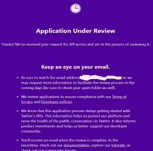

如果你的信息是完整的，通常不到一天就可以收到批准邮件。

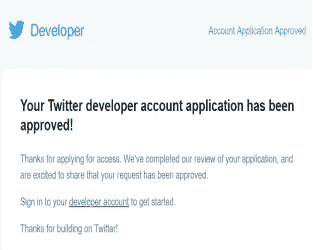

之后，您需要在他们的界面中创建一个新的应用程序，并提供其描述(如下),该描述将生成 API 密钥、API 密钥、访问令牌和访问令牌密钥，我们将使用这些信息通过终端登录。

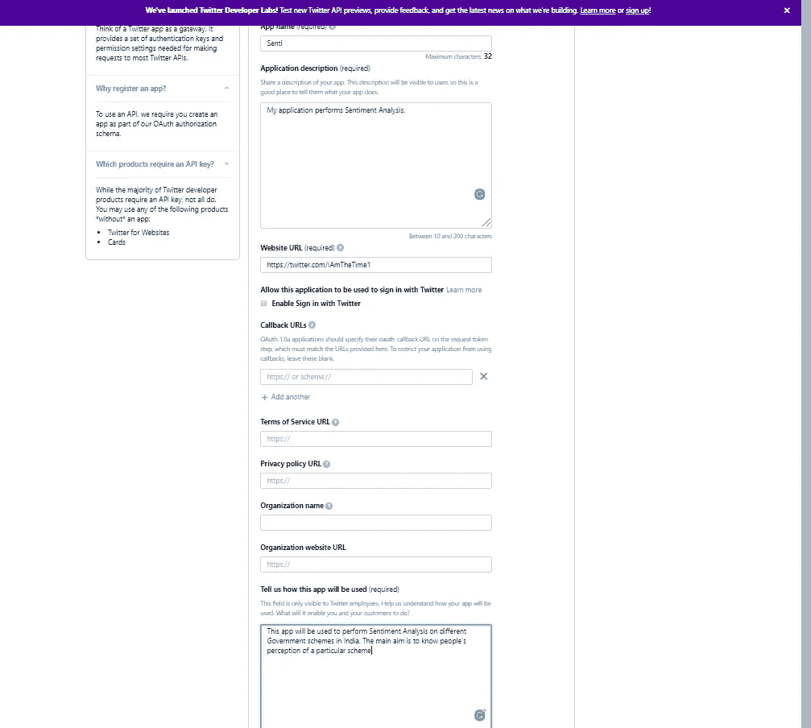

Creating a new application

现在让我们使用 tweepy 来验证我们的详细信息。AppAuthHandler()函数。用您的身份验证详细信息替换“*”。

```
import tweepy
API_KEY="*********************"
API_SECRET="*************************"
ACCESS_TOKEN="*******************************"
ACCESS_TOKEN_SECRET="******************************"
auth = tweepy.AppAuthHandler(API_KEY, API_SECRET)
auth.set_access_token(ACCESS_TOKEN, ACCESS_TOKEN_SECRET)
api = tweepy.API(auth)
print(api.me().name)
```

如果验证成功，您应该会看到打印出的帐户名称。

```
IAmSai
```

认证之后，我们就可以下载推文了。我们使用 [API.search()](http://docs.tweepy.org/en/v3.5.0/api.html#help-methods) 方法来获取 tweets。使用 Tweepy 搜索 Tweepy 有两种主要方式——按标签(或关键字)搜索和按 Tweepy 的 id 搜索(每个 Tweepy 的 id 都是唯一的)。第二种方法在你需要收集所有 tweet 的 id 时很有用(比如，你想收集关于给定 id 的去货币化的 tweet。这些 id 将由那些以前收集过关于该主题的数据的人给出)。因为我没有任何 id，所以我使用第一种方法。

```
search_query="#SwachhBharat"
new_tweets = api.search(q=search_query,count=tweetsPerQuery,lang="en",tweet_mode='extended')
auth = tweepy.AppAuthHandler(API_KEY,API_SECRET)
api = tweepy.API(auth,wait_on_rate_limit=True,wait_on_rate_limit_notify=True)
fName = 'sb_04_08_19.txt' # where i save the tweets
```

上面的代码片段中没有给出几行重要的代码。详细代码请看[本](https://github.com/SivaAndMe/Sentiment-Analysis-on-Swachh-Bharat-using-Twitter/blob/master/fetch_tweets.py)。

我们使用关键字“#SwachhBharat”进行搜索。后来，在清理数据时，我意识到带有标签的推文——“# myclean India”和“#SwachhBharatUrban”也可以用来搜索关于 Swachh Bharat 的推文。我们使用 AppAuthHandler(第三行)而不是最常用的-OAuthHandler 来为[授权](http://docs.tweepy.org/en/v3.5.0/auth_tutorial.html#authentication-tutorial)API。OAuthHandler 允许每个 15 分钟窗口最多 180 个请求(每个请求最多 100 条 tweets)。所以我们只能在 15 分钟内获得 18000 条推文。但是 AppAuthHandler 有其最大请求速率限制，即每个请求 450 条和 100 条 tweets。因此，它有助于在 15 分钟内获得 45，000 条推文。此外，我使用了扩展 tweet 模式(第二行),以确保我们获得完整的 tweet，而不是被截断的 tweet。下载后，我们将把推文保存在一个文本文件中(或者，我们也可以把它们保存在一个. json 文件中)。我又重复了几次以上的过程，以便以后收集更多的 tweet(两次数据收集之间的间隔超过 7 天，否则我们会得到很多重复的 tweet)。


Downloading the tweets

# 将有用的数据转换为 CSV

这是我最初很难理解的部分，因为我从未使用过 API 和 JSON。这个文本文件很大，大约有 1100 页的信息。在“sb.txt”(文本文件)中，推文是 JSON (JavaScriptObjectNotation)格式的。看一看它。

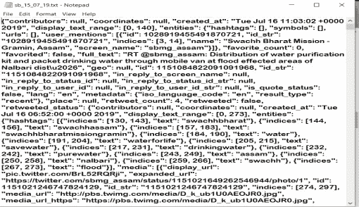

Data is full of many JSON objects

只需扫一眼，您就可以看到有许多特性(对象)对我们的任务来说并不重要，比如元数据、索引、屏幕名称。所以我浏览了[这个](https://developer.twitter.com/en/docs/tweets/data-dictionary/overview/user-object.html)页面，找出我的任务可能需要的对象。我决定使用这些对象——full _ text(推文的全文)、retweet_count(推文的)、favorite_count(推文的)、geo(地理位置)、coordinates(地点的纬度和经度坐标)、place(推文的来源)、follower_count(推文用户的)、created_at(推文的时间和日期)、id_str(推文的字符串格式的 id)。我将上述对象保存在我的 CSV 文件中，并丢弃其余的。

```
inputFile='sb_04_08_19.txt'
tweets = []
for line in open(inputFile, 'r'):
    tweets.append(json.loads(line))
for tweet in tweets:
    try:
        csvWriter.writerow([tweet['full_text'],tweet['retweet_count'],tweet['user']['followers_count'],tweet['favorite_count'],tweet['place'],tweet['coordinates'],tweet['geo'],tweet['created_at'],str(tweet['id_str'])])
        count_lines+=1
    except Exception as e:
        print(e)
```

上面给出了从文本文件转换为 CSV 文件的几行重要代码。请参见[这个](https://github.com/SivaAndMe/Sentiment-Analysis-on-Swachh-Bharat-using-Twitter/blob/master/convert_text_to_csv.py)以了解更多信息。我们创建一个 tweets 列表，从文件中读取每一行(第一个 for-loop)。然后，我们使用 csvWriter.writerow()将每个 tweet 的必要信息写入 CSV 文件。而且我们只收集上面提到的对象。

让我们尝试在 Jupyter 笔记本中加载 CSV 文件。有必要在 read_csv()函数中将编码参数设置为“unicode_escape ”,因为一些推文也包含表情符号，这会给默认编码带来困难。

```
import pandas as pd
df = pd.read_csv('somall.csv', encoding = 'unicode_escape')
df.head(5)
```

看一下输出。

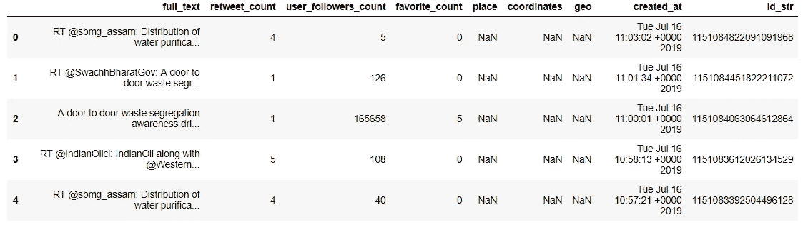

# 删除重复行

让我们查看并删除重复的行(如果有的话)。有两种类型的重复——所有列都具有相同值的重复(当 tweet-collector 再次收集相同的 tweet 时会发生这种重复)和 tweet 具有相同文本的重复(当两个或更多用户发布相同的 tweet 时会发生这种重复。)

```
print(len(df.index))#14195
serlis=df.duplicated().tolist()
print(serlis.count(True))#112
serlis=df.duplicated(['full_text']).tolist()
print(serlis.count(True))#8585
```

我们可以看到，在 full_text 列中有 112 个重复行和 8585 个重复行，行重复是 full_text 重复的一个子集。所以我们删除了所有重复的行。

```
df=df.drop_duplicates(['full_text'])
```

起初，我没有注意到重复。因此，当使用文本分类器时，它们给我的准确率高达 99.54%，这并不好。

# 删除不必要的列

似乎有几个像“地点”、“地理”这样的特征有更多的非数字(NaN)值。让我们检查一些选定的列中有多少空行

```
print(df['geo'].isna().sum())
print(df['place'].isna().sum())
print(df['coordinates'].isna().sum())
```

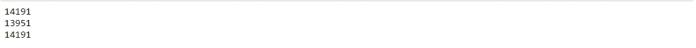

我们的数据集中总共有 14，195 行。我们看到 14191 行地理列是空的。“位置”和“坐标”中的空行也很高(13951 和 14191)。所以我们把这些列和‘id _ str’(tweet 的 id)一起删除了，因为 tweet id 对我们来说用处不大。虽然我们在上下文中没有使用 retweet_count、user_followers_count、favorite_count，但是我们没有删除它们，因为它们可以用于其他任务(比如估计 tweet 的受欢迎程度，这可以用于为 tweet 分配权重)。

```
df=df.drop([‘place’,’coordinates’,’geo’,’id_str’],axis=1)
df.head(5)
```

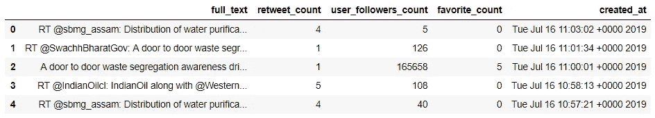

First five rows of the dataset after dropping a few columns

# 清理推文

在一条推文的文本中，可能会有一些不必要的符号，这些符号对于我们的分析并不重要。所以让我们继续清理我们的推文。

让我们观察任何特定推文的全文。

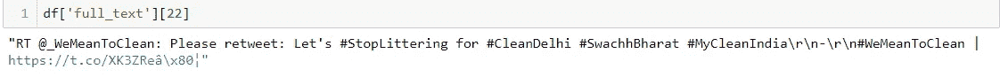

full text of a tweet at row number 22

正如我们所看到的，一些不必要的文本和符号被删除——用户名 _ 标签(如@_WeMeanToClean)，转发符号(RT)，标签(如#MyCleanIndia)，网址(如 https://t.co/XK3ZReâ\x80)，数字和标点符号。一些有意义的标签传达了意思，在单词被分割成有用的部分后可以有一些情绪在里面(比如#ILoveSwachhBharat)。因此，不是删除所有以 hashtag 符号开头的单词，而是只删除' # '符号。我们使用 python 中的 **re** 模块来执行文本清理。re.sub()函数搜索一个模式并用我们指定的文本进行替换。我们用空白字符替换所有这些符号。

```
import re
for i in range(len(df)):
    txt = df.loc[i]["full_text"]
    txt=re.sub(r'@[A-Z0-9a-z_:]+','',txt)#replace username-tags
    txt=re.sub(r'^[RT]+','',txt)#replace RT-tags
    txt = re.sub('https?://[A-Za-z0-9./]+','',txt)#replace URLs
    txt=re.sub("[^a-zA-Z]", " ",txt)#replace hashtags
    df.at[i,"full_text"]=txt
```

现在，我们可以看到我们的推文看起来很干净。

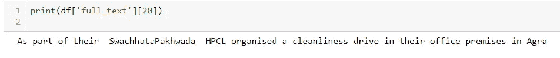

A tweet after cleaning

# 词性标注和情感标注

我们已经完成了文本数据的基本清理工作。在 ML 算法中，我们将实现 tweet 的“full_text”作为预测变量(如果我们想要预测 tweet 的影响，可以使用的其他变量是 retweet-count、favorite-count，但这不是我们当前任务的一部分)。很明显，我们需要为我们的数据创建目标变量(情感得分)。为此，我们使用 SentiWordNet。 [SentiWordNet](https://github.com/aesuli/SentiWordNet/tree/master/data) 是一个增强的词汇资源，专为支持情感分类和观点挖掘应用而设计。它有一个很大的词类标注英语单词及其情感的语料库。

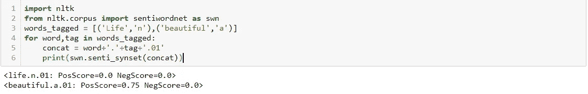

Predicting sentiment of few words using SentiWordNet-An example

和上面的例子一样，SWN 给出了每个单词的 pos_score 和 neg_score。pos_score 越高，这个词越正面。我们使用这些分数的简单线性求和(我们将 tweet 中所有单词的 pos_score 相加以形成 pos_total，以类似的方式，我们获得 neg_total。然后我们把这两个加起来得到 sent_total)并把一个句子标注为正(1)如果它(sent_total)大于 0，负(-1)如果它小于 0，中性(0)，否则。你可能已经发现，为了使用 SWN，我们需要找到我们推文的词性标签。nltk 的 pos_tag 特性可以帮助我们标记文本，但是它并没有被简化(除了名词、代词、形容词、动词之外，它还可以用更多的标签来标记文本，比如 adposition、连接词、限定词等等。,).但是 SWN 只接受简化的标签。所以我们尝试使用 nltk 库中的 map_tag 函数来简化标签。

```
for i in range(len(df_copy.index)):
        text = df_copy.loc[i]['full_text']
        tokens = nltk.word_tokenize(text)
        tagged_sent = pos_tag(tokens)
        store_it = [(word, map_tag('en-ptb', 'universal', tag)) for word, tag in tagged_sent]
```

第二行将 tweet 文本转换成标记，这些标记将在以后用它们各自的词性进行标记。然后，我们将单词和标签存储在 store_it 列表中。该列表随后将被传递给使用 SWN 的情感标签。

当使用 pos_tag()和简化的 POS-tag 进行标记时，推文的标签(“旁遮普省尼赫鲁·尤瓦·肯德拉的成员开展了挨家挨户的垃圾分类宣传活动”)如下所示。

```
Tagged Parts of Speech: [('a', 'DT'), ('door', 'NN'), ('to', 'TO'), ('door', 'VB'), ('waste', 'NN'), ('segregation', 'NN'), ('awareness', 'NN'), ('drive', 'NN'), ('was', 'VBD'), ('carried', 'VBN'), ('out', 'RP'), ('by', 'IN'), ('members', 'NNS'), ('of', 'IN'), ('nehru', 'JJ'), ('yuva', 'NN'), ('kendra', 'NN'), ('in', 'IN'), ('kapurthala', 'NN'), ('punjab', 'NN')]Tagged Parts of Speech- Simplified: [('a', 'DET'), ('door', 'NOUN'), ('to', 'PRT'), ('door', 'VERB'), ('waste', 'NOUN'), ('segregation', 'NOUN'), ('awareness', 'NOUN'), ('drive', 'NOUN'), ('was', 'VERB'), ('carried', 'VERB'), ('out', 'PRT'), ('by', 'ADP'), ('members', 'NOUN'), ('of', 'ADP'), ('nehru', 'ADJ'), ('yuva', 'NOUN'), ('kendra', 'NOUN'), ('in', 'ADP'), ('kapurthala', 'NOUN'), ('punjab', 'NOUN')]
```

然后，我们通过上面介绍中提到的方法来查找 tweet 的情感。请查看完整的[代码](https://github.com/SivaAndMe/Sentiment-Analysis-on-Swachh-Bharat-using-Twitter/blob/master/swn_sentiment_labeling.py)以了解更多关于情感标签的信息。从 SWN 获得意见后，我们在我们的 CSV 中增加了三列——“积极得分”、“消极得分”、“发送得分”。tweet 的“pos_score”是 tweet 中所有单词的净正分，类似的还有“neg_score”。

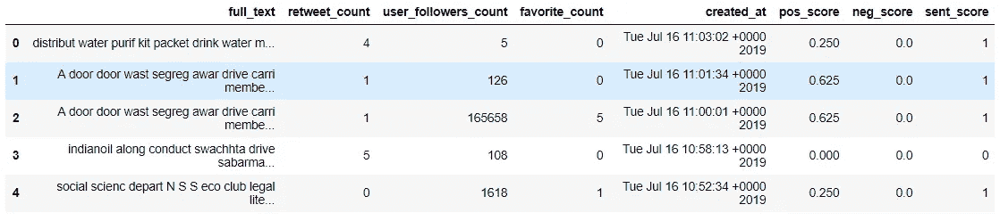

Dataset after adding sentiment score for tweets

正面推文的值为 1(pos _ score > neg _ score)，中性推文的值为 0(pos _ score = neg _ score)，负面推文的值为-1(pos _ score<neg_score there="" are="" positive="" tweets="" neutral="" and="" negative="" tweets.="" i="" also="" used="" class="ae kl" href="https://github.com/SivaAndMe/Sentiment-Analysis-on-Swachh-Bharat-using-Twitter/blob/master/textblob_sentiment_labeling.py" rel="noopener ugc nofollow" target="_blank">text blob 和 [Afinn](https://github.com/SivaAndMe/Sentiment-Analysis-on-Swachh-Bharat-using-Twitter/blob/master/afinn_sentiment_labeling.py) 用于推文的情感分配)。结果如下:</neg_score>

```
TEXTBLOB:
Total tweets with sentiment: 5610
positive tweets: 2171
negative tweets: 591
neutral tweets: 2848AFINN:
Total tweets: 5610
positive tweets: 2551
negative tweets: 572
neutral tweets: 2487
```

来自每个情感的推文数量在每个分类器中的比例是一致的，这让我们对情感标签更有信心。此外，我们可以推断出大多数推文是积极的。

现在我们已经完成了情感标注，我们将进一步准备我们的文本数据，以馈入 ML 分类器。

# 停止单词删除

停用词是常用词，如 of、the、for 等。在我们的语境中，它们并没有给情感增加多少分量。此外，它们增加了数据的维度。所以我们使用 nltk 库删除了停用词(在下一部分)。

在将这些文本数据提供给 ML 算法之前，我们将它转换成向量(在本文的后面部分)。我们不希望相似的单词有不同的(向量)值。我们希望所有这些词都有相同的价值——“分发”、“分配”、“已分发”、“分发”，因为它们本质上表达了相同的意思。如果我们使用 nltk 模块执行词汇化和词干化，这(为相似的单词分配相同的值)可以更好地实现。

# 词汇化和词干化

词干化将单词缩减为它们的词干。词干提取算法主要是基于规则的。例如，他们把上面所有的单词“distribute”简化为“distribute”。一个词条解释器做了和斯特梅尔一样的事情，但是把这个词的语言学保持在上下文中。例如，以上所有的单词都将被浓缩为“distribute”。

```
from nltk.corpus import stopwords
from nltk.stem import WordNetLemmatizer
from nltk.stem import PorterStemmer
pstem = PorterStemmer()
lem = WordNetLemmatizer()
stop_words = stopwords.words('english')for i in range(len(df.index)):
     text = df.loc[i]['full_text']
     tokens = nltk.word_tokenize(text)
     tokens = [word for word in tokens if word not in stop_words]for j in range(len(tokens)):
         tokens[j] = lem.lemmatize(tokens[j])
         tokens[j] = pstem.stem(tokens[j])tokens_sent=' '.join(tokens)
     df.at[i,"full_text"] = tokens_sent
```

第三行删除 tokens-list 中的停用词。经过词汇化和词干化，我们最终用新的文本代替旧的文本。

值得注意的是，上述三个清理过程(停用词去除、词干化、词条化)在(情感标注)之前不执行，因为这样做会导致情感检测的不规则性。像“distribut”、“cleanin”这样的词在 SWN 的英语词汇语料库中是找不到的，因此 SWN 没能检测出这些词的正负分值。这使得只有一部分数据集的推文标有情感分数。我们还使用 nltk 库将所有 tweets 转换成小写。

# 数据可视化

我们使用 WordCloud 来表示每个情感中的大多数单词。为此，我们将所有带有正标签的 tweets 文本相加，形成一个字符串，并将该字符串表示为 pos_string。对于负面和中性文本，我们也遵循同样的方法。

```
for i in range(len(df_copy.index)):
    if(df_copy.loc[i]["sent_score"]==1):
        pos_text+=df_copy.loc[i]["full_text"]
    elif(df_copy.loc[i]["sent_score"]==-1):
        neg_text+=df_copy.loc[i]["full_text"]
    else:
        neut_text+=df_copy.loc[i]["full_text"]
```

文本表示使用 python 中的 WordCloud 模块生成，并使用 matplotlib 绘制。

```
list_text = [pos_text,neg_text,neut_text]
for txt in list_text:
    word_cloud = WordCloud(width = 600,height = 600,max_font_size = 200).generate(txt)
    plt.figure(figsize=(12,10))# create a new figure
    plt.imshow(word_cloud,interpolation="bilinear")
    plt.axis("off")
    plt.show()
```

我们应该记住，单词之前已经被词干化和词条化，所以我们可能无法看到少数几个单词的完整单词。

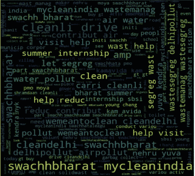

Positive sentiment WordCloud

如你所见，标签由正面文本 Wordcloud 中的重要单词组成。这很直观，因为我们没有从文本中完全删除标签。虽然是一个印地语单词，但“swachh”(一个肯定的词)在这里经常出现。还有其他有用的词，如垃圾分类、垃圾收集、清洁等。,

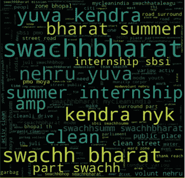

Neutral sentiment WordCloud

在中性词 Cloud 中，除去少数标签，我们可以看到许多中性词，如-零件、街道、道路、周围环境、实习等。,

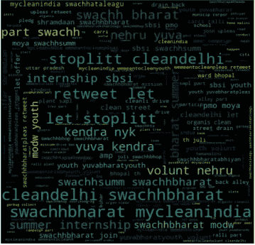

Negative sentiment WordCloud

停止乱扔垃圾，排水回来，排水是云的几个负面词汇，我们也可以看到它包含了许多其他情绪的词汇。

# 拆分数据

我们使用 nltk 库中 model_selection 模块的 train_test_split 函数将数据分为训练集、验证集和测试集。划分如下— 90%的训练数据，5%的验证数据，5%的测试数据。更多的数据用于训练，记住推特的数量更少。

```
import sklearn
from sklearn.model_selection import train_test_split
SEED=4
x = df.full_text
y = df.sent_score
x_train,x_val_test,y_train,y_val_test = train_test_split(x,y,test_size=0.1,random_state=SEED)
x_val,x_test,y_val,y_test = train_test_split(x_val_test,y_val_test,test_size=0.5,random_state=SEED)
```

# 将推文文本矢量化

在我们实现不同的 ML 文本分类器之前，我们需要将文本数据转换成向量。这是至关重要的，因为算法期望数据是某种数学形式，而不是文本形式。Quora 的这个回答解释了为什么转换到向量空间是必要的。这里，我们实现了来自 sklearn- Count 矢量器和 Tfidf 矢量器的两个矢量器。他们都属于词汇袋模式。

计数矢量器计算一个单词在文档中出现的次数(在每个 tweet 中),并使用这个值作为它的权重。为了形象化，向量中的列(矢量化后)由所有 tweet 中的所有不同单词组成，每行包含 tweet。计数器矢量器给我们一个稀疏矩阵(填充了许多零)作为矢量。

```
from sklearn.feature_extraction.text import CountVectorizer
cv=CountVectorizer(decode_error='ignore',lowercase=False,max_features=11)
x_traincv=cv.fit_transform(x_train.values.astype('U'))
```

让我们来看看 CountVectorizer 中的热门词(在所有推文中出现频率最高的词)。见[这个](https://github.com/SivaAndMe/Sentiment-Analysis-on-Swachh-Bharat-using-Twitter/blob/master/count_vectorizer_top_words.py)的代码可视化顶词。

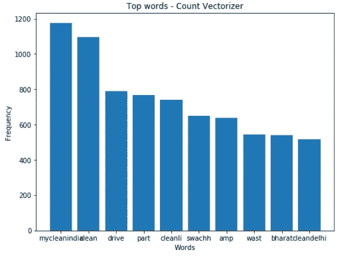

Count Vectorizer-Top words

让我们也实现 Tfidf 矢量器。TF-IDF 代表“术语频率-逆文档频率”。分配给标记的权重是术语(单词)频率和单词的文档频率的倒数的乘积。因此，如果一个词在 tweets 中出现得越频繁，它在这个矢量器中的重要性就越低(IDF-weight)。

```
from sklearn.feature_extraction.text import TfidfVectorizer
tf=TfidfVectorizer(decode_error='ignore',lowercase=False,max_features=11)
x_traintf=tf.fit_transform(x_train_copy.values.astype('U'))
```

Tfidf 的[热门词汇](https://github.com/SivaAndMe/Sentiment-Analysis-on-Swachh-Bharat-using-Twitter/blob/master/tfidf_top_words.py)是:

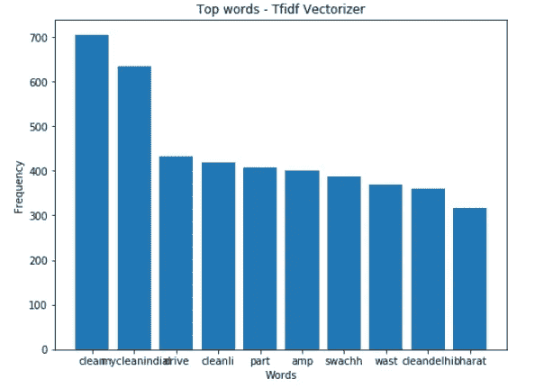

Top words- Tfidf Vectorizer

对比 CV 和 Tfidf 中的 top 词，我们看到虽然词是一样的，但是顺序和频率不同。此外，Tfidf 有频率的小数值，而 CV 只有整数值。

**N-grams**

简单来说，n-grams 是我们在文本(tweets)中可以找到的所有相邻单词的组合。句子“我喜欢玩具”的所有可能组合:单字母词-(“我”、“喜欢”、“玩具”)、双字母词-(“我喜欢”、“喜欢玩具”)、三字母词-(“我喜欢玩具”)。“Swachh”这个词后面更常跟“Bharat”。因此，bi-grams 为我们提供了“Swachh Bharat”以及“Swachh”和“Bharat”。CV 和 Tfidf 都给出了一个名为 ngram_range 的参数。ngram_range as (1，1)表示一元模型，(1，2)表示二元模型，(1，3)表示三元模型等等。我们用 CV 和 Tfidf 实现了 uni、bi 和三元模型，并观察它们中的哪一个给出了更高的准确度分数。

# 从 sklearn 实现分类器

在对我们的推文进行矢量化之后，我们就可以开始实施分类算法了。我们要实现的分类器是-朴素贝叶斯模型(MultinomialNB，BernoulliNB，)线性模型(LogisticRegression，RidgeClassifier，PassiveAggressiveClassifier，感知器)，集成模型(RandomForest 分类器，AdaBoostClassifier)和 SVM 模型(LinearSVC)。我们使用精确度分数来衡量模型的性能(精确度分数、召回和混淆矩阵也被计算)。

使用 sklearn 中的 cross_validate 模块，对每个分类器执行 K-fold 交叉验证，以验证模型性能的一致性。折叠数设为 10，记录交叉验证分数的平均值和标准偏差。训练每个分类器所花费的时间也使用 time.time()函数来测量。之后，结果将存储在 CSV 文件中。下面给出了几行重要的(不是全部)代码。完整代码请看[本](https://github.com/SivaAndMe/Sentiment-Analysis-on-Swachh-Bharat-using-Twitter/blob/master/ml_all_classifiers_cv_tf.py)。

```
classifiers = [MultinomialNB(),BernoulliNB(),LogisticRegression(),LinearSVC(),AdaBoostClassifier(),RidgeClassifier(),PassiveAggressiveClassifier(),Perceptron(),RandomForestClassifier()]
**for clf in classifiers**:     
 model = make_pipeline(vec,clf)#vec is CV or Tfidf
           model.fit(x_train.values.astype('U'),y_train.values.astype('U'))
 labels = model.predict(x_val_copy.values.astype('U'))
 ac = accuracy_score(y_val_copy.values.astype('U'),labels)
 kfold = KFold(n_splits=10,shuffle=False,random_state=None)
 results = cross_validate( model,x_train_copy.values.astype('U'),   y_train_copy.values.astype('U'),cv=kfold)

            data.append([vec_gram,clf_names[i],ac,crossval_train_score_mean,crossval_test_score_mean,crossval_train_score_std,crossval_test_score_std, end-start])
            i+=1
d = pd.DataFrame(data,columns=['Vec_Gram','Classifier','Ac','crossval_train_score_mean','crossval_test_score_mean','crossval_train_score_std','crossval_test_score_std','Time.2'])
d.to_csv('all_clfs.csv')
```

结果如下。

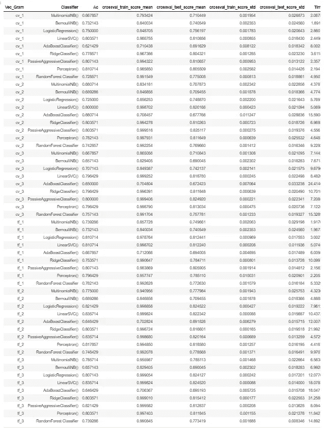

Results of all classifiers using Count Vectorizer, Tfidf Vectorizer, each with uni, bi, and trigrams.

在上图中，“Ac”代表准确度分数，“cv_1”表示带有 unigrams 的 CountVectorizer。PassiveAggressiveClassifier(tfi df-bigrams)和 LinearSVC(Tfidf-trigrams)给出了 83.5714%的最高准确度。但是前者只需要 4.5 秒就可以训练好，而后者需要 18 秒。在交叉验证均值和标准差方面，LinearSVC 似乎更好。值得注意的是，我们的数据集是不平衡的——正面和负面的推文比中性推文更多。因此，在这种情况下，准确性分数可能会导致我们得出错误的结论。为了避免这种情况，我们还使用了具有平衡类权重的随机森林分类器。该分类器的平均准确率为 74.94%，最高准确率为 78.21%。

# 实施 Gensim 模型

我们已经使用单词袋模型(CV 和 Tfidf)对文本文档进行数字表示。从数学上来说，这是一个非常简单的方法。在这种方法中，单词之间的语义关系没有被保留。说，一句话有四个字:国王，王后，女人，男人。在 BoW 模型中，这些单词中的每一个都被唯一地分配了 id。因此，单词“king”可能更接近于“woman”而不是“queen”。因此，我们需要一个复杂的模型来保存单词之间的关系，从而给出文本的更好的数学表示。[doc 2 vec](https://medium.com/scaleabout/a-gentle-introduction-to-doc2vec-db3e8c0cce5e)(word 2 vec 的扩展)模型为我们做到了这一点。

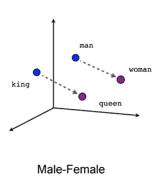

It would be better if the words are semantically related as in above figure rather than being assigned some random ids

Doc2Vec 算法来自 python 中的 Gensim 库。Gensim 是一个免费的 Python 库，旨在尽可能高效地从文档中自动提取语义主题。我们实现了 doc 2 vec-DBOW(Distributrb Bag of Words)、DMC(Distributed Memory Concatenated)、DMM(Distributed Memory Mean)三种算法以及这三种算法的几种组合。稍后，我们使用所有这些模型来训练相同的分类器，就像我们在上面使用 sklearn 所做的那样。这些算法中的每一个要完成的步骤如下——连接所有数据集(训练、验证和测试),给所有推文(可以是随机标签)提供索引(标签),训练模型(DBOW、DMC 或 DMM ),从每个模型中获取向量。

```
x_all = pd.concat([x_train,x_val,x_test])
```

串联的第一步是可选的(即，我们可以仅使用训练数据集)，但是建议串联以获得更好的结果。然后我们用‘d2v _ index’标记文本，其中‘index’是 tweet 索引。

```
def label_tweets(tweets,label):
    result = []
    prefix = label
    i=0
    for i, t in zip(tweets.index, tweets):
     t=str(t)
     result.append(LabeledSentence(t.split(), [prefix + '_%s' % i]))
  return result
x_all_w2v = label_tweets(x_all,'d2v')#x_all is obtained above by conatenating.
```

然后，我们训练这三个模型。

**DBOW**

```
cpu_count = multiprocessing.cpu_count()
model_dbow = Doc2Vec(dm=0,size=100,negative=5,min_count=2,alpha=0.065,workers=cpu_count,min_alpha=0.065)
model_dbow.build_vocab([each for each in tqdm(x_all_w2v)])for epoch in range(30):
    model_dbow.train(utils.shuffle([each for each in tqdm(x_all_w2v)]),total_examples=len(x_all_w2v),epochs=1)
    model_dbow.alpha-=0.002
    model_dbow.min_alpha = model_dbow.alphatrain_vecs_dbow = get_d2v_vectors(model_dbow,x_train,100)
val_vecs_dbow = get_d2v_vectors(model_dbow,x_val,100)
```

在第一行中，我们获得了并行处理的 CPU 数量。在定义了模型(第二行)之后，我们使用三个带标签的 tweets (x_all_w2v)来构建我们的词汇表。稍后，我们训练模型，在每次迭代中调整我们的学习率。请阅读[本](https://radimrehurek.com/gensim/models/doc2vec.html#gensim.models.doc2vec.Doc2Vec)文档以了解更多关于 Doc2Vec 函数的参数。

在定义了每个模型的特定参数后，以相同的方式训练其他两个模型。

**DMC**

```
cpu_count = multiprocessing.cpu_count()
model_dmc = Doc2Vec(dm=1,dm_concat=1,size=100,negative=5,min_count=2,alpha=0.065,workers=cpu_count,min_alpha=0.065)
model_dmc.build_vocab([each for each in tqdm(x_all_w2v)])for epoch in range(30):
    model_dmc.train(utils.shuffle([each for each in tqdm(x_all_w2v)]),total_examples=len(x_all_w2v),epochs=1)
    model_dmc.alpha-=0.002
    model_dmc.min_alpha = model_dmc.alphatrain_vecs_dmc = get_d2v_vectors(model_dmc,x_train,100)
val_vecs_dmc = get_d2v_vectors(model_dmc,x_val,100)
```

**数字万用表**

```
cpu_count = multiprocessing.cpu_count()
model_dmm = Doc2Vec(dm=1,dm_mean=1,size=100,negative=5,min_count=2,alpha=0.065,workers=cpu_count,min_alpha=0.065)
model_dmm.build_vocab([each for each in tqdm(x_all_w2v)])for epoch in range(30):
    model_dmm.train(utils.shuffle([each for each in tqdm(x_all_w2v)]),total_examples=len(x_all_w2v),epochs=1)
    model_dmm.alpha-=0.002
    model_dmm.min_alpha = model_dmm.alphatrain_vecs_dmm = get_d2v_vectors(model_dmm,x_train,100)
val_vecs_dmm = get_d2v_vectors(model_dmm,x_val,100)
```

我们保存了所有三个模型，以消除任何未来使用的重新培训。

```
model_dbow.save('d2v_model_dbow.doc2vec')
model_dmm.save('d2v_model_dmm.doc2vec')
model_dmc.save('d2v_model_dmc.doc2vec')
#AFTER THE FIRST TIME DON'T RETRAIN ALL THE MODELS,JUST LOAD THESE #like mod = model_dmm.load()
```

训练后，我们还使用 get_d2v_vectors()函数提取每个模型的向量，如下所示(还记得吗？这是我们使用 Gensim 模型的主要目的——获得文本数据的矢量化表示。下面的函数是在训练完模型后调用的(在上面的代码片段中)。

```
def get_d2v_vectors(model,corpus,size):
    vecs = np.zeros((len(corpus),size))
    n=0
    for i in corpus.index:
        prefix='d2v_'+str(i)
        vecs[n] = model.docvecs[prefix]
        n+=1
    return vecs
```

我们已经准备好了使用 doc2vec 模型的三种矢量表示。(train_vectors_dbow，train_vectors_dmc，train_vectors_dmm)。在将它们用于分类器之前，还有另一个有用的步骤要执行——连接这些向量(例如，DBOW+DMM)。为了获得更好的结果，Doc2vec 的作者建议采取这一步骤。我们使用 numpy.append()函数来连接这些向量。

```
#FUNCTION TO CONCAT 2-MODELS VECTORS..NO SPECIAL TRAINING IS REQUIRED
def get_concat_vectors(model1,model2,corpus,size):
    vecs = np.zeros((len(corpus),size))
    n=0
    for i in corpus.index:
        prefix='d2v_'+str(i)
        vecs[n] = np.append(model1.docvecs[prefix],model2.docvecs[prefix])
        n+=1
    return vecs
```

我们将 DBOW 与 DMM 以及 DBOW 与 DMC 连接起来。

```
train_vecs_dbow_dmm = get_concat_vectors(model_dbow,model_dmm,x_train,200)
val_vecs_dbow_dmm = get_concat_vectors(model_dbow,model_dmm,x_val,200)train_vecs_dbow_dmc = get_concat_vectors(model_dbow,model_dmc,x_train,200)
val_vecs_dbow_dmc = get_concat_vectors(model_dbow,model_dmc,x_val,200)
```

现在，我们使用相同的 sklearn 算法，以类似的方式使用这五个向量进行分类(就像我们对 CV 和 Tfidf 所做的那样)。

```
vecs = [(train_vecs_dbow,val_vecs_dbow),(train_vecs_dmc,val_vecs_dmc),(train_vecs_dmm,val_vecs_dmm),(train_vecs_dbow_dmm,val_vecs_dbow_dmm),(train_vecs_dbow_dmc,val_vecs_dbow_dmc)]
classifiers = [BernoulliNB(),LogisticRegression(),LinearSVC(),AdaBoostClassifier(),RidgeClassifier(),PassiveAggressiveClassifier(),Perceptron()]
gensim_names = ['DBOW','DMC','DMM','DBOW+DMM','DBOW+DMC']
data=[]
for train_vecs,val_vecs in vecs:
    for clf in classifiers:
        clf.fit(train_vecs,y_train)
        ac = clf.score(val_vecs,y_val)
        data.append([gensim_names[j],clf_names[i],ac,end-start])
d = pd.DataFrame(data,columns=['Model','Classifier','Ac','Time'])
d.to_csv('gensim_all_clfs.csv')
```

上面只给出了几行重要的代码。参见[本](https://github.com/SivaAndMe/Sentiment-Analysis-on-Swachh-Bharat-using-Twitter/blob/master/ml_all_classifiers_d2v.py)。

让我们看看结果。

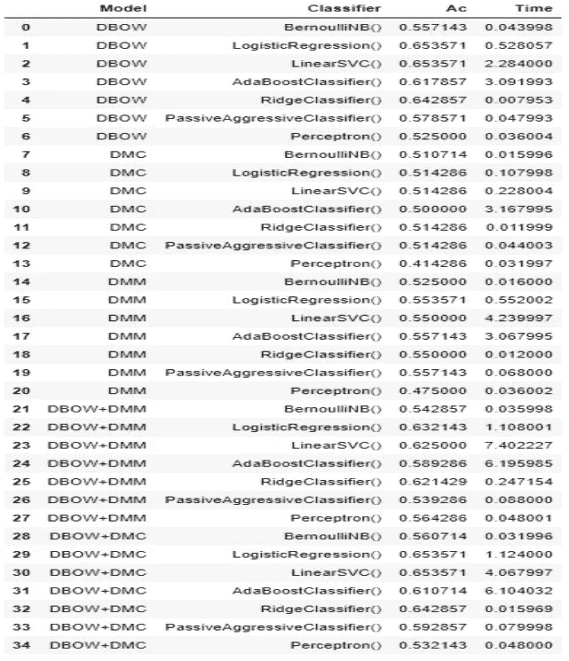

Results using Gensim models

逻辑回归(DBOW)、线性 SVC(DBOW)、逻辑回归(DBOW +DMC)和线性 SVC(DBOW+DMC)给出了 65.35%的最高准确度。考虑到训练时间，逻辑回归(DBOW)是其中最好的一个(0.52 秒)。RidgeClassifier(DBOW)也表现出良好的性能，准确率为 64.2%，训练时间仅为 0.007 秒。DBOW 模型优于其他两个模型，平均准确率(在所有分类器中)为 60.4%。Gensim 模型的性能比 CV 和 Tfidf 模型稍差。

总之，被动主动分类器(Tfidf-bigrams)的性能最好，准确率为 83.57%。所以我们用测试数据来评估一下。

```
from sklearn.feature_extraction.text import TfidfVectorizer
from sklearn.linear_model import PassiveAggressiveClassifier
from sklearn.pipeline import make_pipeline
from sklearn.metrics import confusion_matrix
from sklearn.metrics import accuracy_score,precision_score,recall_score
import time
b=2
st = time.time()
tfidf = TfidfVectorizer(ngram_range=(1,b))
model = make_pipeline(tfidf,PassiveAggressiveClassifier())
model.fit(x_train.values.astype('U'),y_train.values.astype('U'))##
labels = model.predict(x_test.values.astype('U'))###cm = confusion_matrix(y_test.values.astype('U'),labels)
ac = accuracy_score(y_test.values.astype('U'),labels)
pr = precision_score(y_test.values.astype('U'),labels,average=None)
rc = recall_score(y_test.values.astype('U'),labels,average=None)
en = time.time()
print(b,"-gram",ac,pr.mean(),rc.mean(),en-st)
```

当在测试数据上评估该模型时，它给出了 80.42%的准确度。

# 摘要

使用 Tweepy 库收集推文，然后选择对我的任务有用的功能并转换为 CSV。然后，执行数据清理，如删除 URL、转发符号、用户名标签和标签。SentiWordNet 词典用于标注推文的情绪。对文本数据执行诸如停用词移除、词汇化、词干化之类的步骤。后来用 WordCloud 做数据可视化。拆分数据后，Count 矢量器和 Tfidf 矢量器用于文本的数学表示。然后，对先前获得的向量实施九种分类算法。后来，doc2vec 模型(DBOW、DMC、DMM)被训练并使用向量(通过这些模型获得)用于分类目的，因为这些模型保留了单词之间的语义关系。最后，使用测试数据评估最佳模型。

欢迎对这个项目的改进提出任何建议。感谢您的阅读！

**参考文献**

1[https://towards data science . com/another-Twitter-opinion-analysis-with-python-part-6-doc 2 vec-603 f 11832504](/another-twitter-sentiment-analysis-with-python-part-6-doc2vec-603f11832504)

2[https://bhaskarvk . github . io/2015/01/how-to-use-twitters-search-rest-API-most-effectively。/](https://bhaskarvk.github.io/2015/01/how-to-use-twitters-search-rest-api-most-effectively./)

3[https://medium . com/analytics-vid hya/Twitter-opinion-analysis-for-the-2019-election-8f 7d 52 af 1887](https://medium.com/analytics-vidhya/twitter-sentiment-analysis-for-the-2019-election-8f7d52af1887)

[4 https://chrisalbon . com/machine _ learning/trees _ and _ forests/handle _ unbalanced _ classes _ in _ random _ forests/](https://chrisalbon.com/machine_learning/trees_and_forests/handle_imbalanced_classes_in_random_forests/)