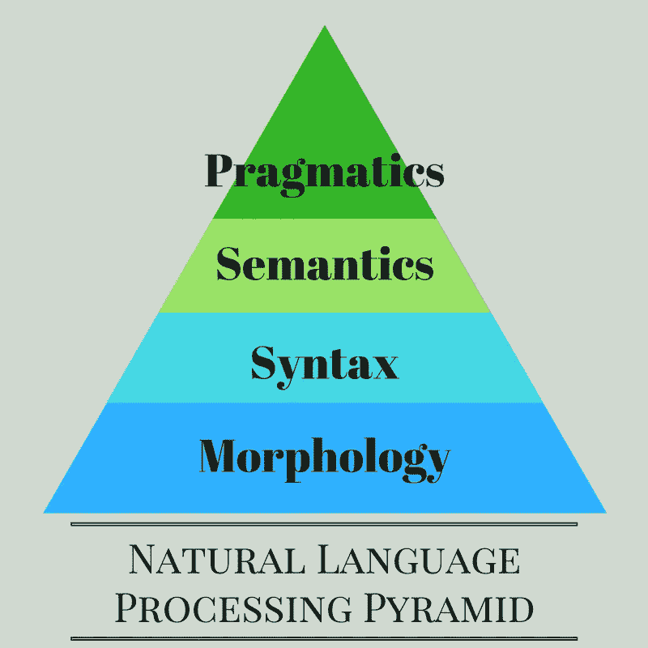
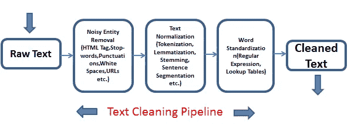
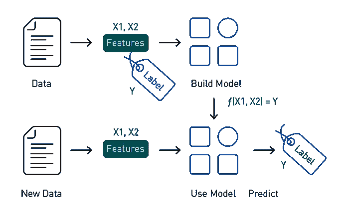

# 情感分析:简化

> 原文：<https://towardsdatascience.com/sentiment-analysis-simplified-ac30720a5827?source=collection_archive---------19----------------------->

## 看看自然语言处理的“你好世界”

## 什么是情感分析？

情感分析是自然语言处理的一个领域，负责从自然语言中提取观点的系统。NLP 的目标是创建能够像我们人类一样理解语言的管道。情感分析是自然语言处理中最基本的问题之一，也是学生在自然语言处理课程中首先面临的问题之一。

## 为什么要进行情感分析？

从能够从产品评论中挖掘意见到能够通过研究推文来预测股票价格，情绪分析有非常广泛的应用。由于问题的直观性，情感分析构成了我们称之为自然语言理解的几乎所有其他管道的基础。

从讲师的角度来看，情感分析包含了在 NLP 工作的数据科学家应该了解的一切。句子处理和 NLP 中使用的所有通用模型/架构都可以包含在情感分析的范围内。

## 情感分析的类型

情感分析本质上是一个分类问题。虽然情感分析包含各种各样的问题，但最常见的类型可以大致分为:

1.  极性检测:谈论句子的极性，即正、负或中性。有时，分类甚至可以更精细，如非常积极、积极、中性、消极和非常消极。
2.  情感检测:从句子中检测说话者的情感，例如，高兴、悲伤、生气等。
3.  意图检测:不仅能够检测出句子中的内容，还能检测出句子的意图。

## 基本管道

让我们首先讨论从原始文本中提取特征。提供给情感分析的输入并不都是有用的。虽然最近的深度学习模型已经促进了将所有特征工程转移到这些模型，但是 NLP 实践者仍然更喜欢在通过任何管道之前清理输入。

在将单词转换成数学特征后，情感分析就变得类似于一个时间序列问题。这是因为在一个句子中使用的单词彼此相关，它们在句子中出现的顺序也很重要。最近，基于 LSTM 的深度学习模型在情感分析方面非常成功。

## 下一步是什么？

情感分析的最大挑战之一是能够捕捉句子出现的上下文及其语气。*讽刺*是普通情感分析系统面临的最大问题之一。研究人员目前正在努力提高理解上下文的能力。

*这个博客是努力创建机器学习领域简化介绍的一部分。点击此处查看完整系列*

 [## 机器学习:简化

### 在你一头扎进去之前就知道了

towardsdatascience.com](/machine-learning-simplified-1fe22fec0fac) 

*或者只是阅读系列的下一篇博客*

 [## 社交网络中有影响力的社区:简化版

### 为什么要研究社交网络中的社区？社交网络是大规模现实世界网络的主要例子。他们…

towardsdatascience.com](/influential-communities-in-social-network-simplified-fe5050dbe5a4) 

## **参考文献**

*【1】*[*https://monkey learn . com/情操-分析/#情操-分析-用例-应用*](https://monkeylearn.com/sentiment-analysis/#sentiment-analysis-use-cases-and-applications) *【2】刘、冰。"情感分析和观点挖掘."人类语言技术综合讲座 5.1(2012):1–167。
[3]帕克、亚历山大、帕特里克·帕鲁贝克。" Twitter 作为情感分析和观点挖掘的语料库."LREc。第十卷。№2010.2010.
[4]王、叶泉、黄敏烈、李昭。"面向方面级情感分类的基于注意力的 LSTM . "2016 年自然语言处理经验方法会议论文集。2016.*