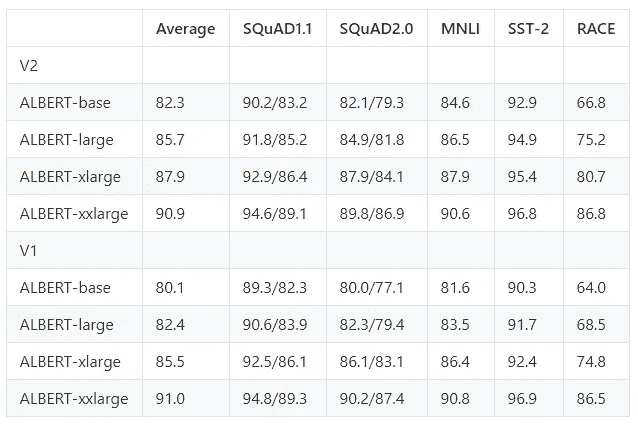

# 使用 ALBERT 进行情感分析

> 原文：<https://towardsdatascience.com/sentiment-analysis-using-albert-938eb9029744?source=collection_archive---------14----------------------->

## 使用 Albert 进行情感分析

## 让我们微调谷歌最新的情感分析任务的自然语言处理模型

每个研究人员或 NLP 从业者都很清楚 2018 年到来的 BERT。从那时起，NLP 行业已经发生了很大的变化。

阿尔伯特是一个 Lite 伯特是在焦点，使它尽可能轻，通过减少参数大小。

深度学习对于情感分析任务的巨大优势是我们预处理数据的步骤减少了。唯一需要的预处理是将它们转换成小写字母。如果我们使用机器学习方法，如 TF-IDF 的逻辑回归，那么你需要将单词词条化，并删除不必要的单词。如果你正在考虑删除停用词，那么看看这篇文章

[](/why-you-should-avoid-removing-stopwords-aa7a353d2a52) [## 为什么应该避免删除停用词

### 删除停用词真的能提高模型性能吗？

towardsdatascience.com](/why-you-should-avoid-removing-stopwords-aa7a353d2a52) 

如果您想了解最新的文本预处理步骤，请查阅这篇文章。

[](/updated-text-preprocessing-techniques-for-sentiment-analysis-549af7fe412a) [## 面向情感分析的文本预处理技术

### 让我们讨论一些技术的缺点以及如何改进它们

towardsdatascience.com](/updated-text-preprocessing-techniques-for-sentiment-analysis-549af7fe412a) 

Photo by [Headway](https://unsplash.com/@headwayio?utm_source=unsplash&utm_medium=referral&utm_content=creditCopyText) on [Unsplash](https://unsplash.com/s/photos/learning?utm_source=unsplash&utm_medium=referral&utm_content=creditCopyText)

# 微调

1.  首先克隆这个 [GitHub repo](https://github.com/gaganmanku96/Albert-Sentiment-Analysis/blob/master/README.md) 。
2.  准备数据集。制表符分隔的(。tsv)文件是必需的。数据集需要放在同一目录的文件夹中。
3.  数据集将有 2 列。一个包含文本，另一个包含标签。
4.  写入列车命令

```
$ python run_glue.py --data_dir data --model_type albert --model_name_or_path albert-base-v2 --output_dir output --do_train --task_type sst-2
```

## 命令行参数-

**数据目录** -存放 train.tsv 文件的地方

**model_type** -您想要用于情感分析任务的模型。这里我们用的是**阿尔伯特**。

**model _ name _ or _ path**-**您要使用的模型的变体。这里我们使用的是 albert-base-v2。**

****输出-目录-** 你想要保存模型的目录。该脚本将自动创建文件夹。**

****do-train -** 因为我们正在进行列车运行。**

****task_type -** 可以执行两个任务——SST-2 和 SST-5。**

**以下是您可以使用的各种型号的列表**

****

**[source](https://github.com/google-research/google-research/tree/master/albert)**

**5.在模型被训练之后，所有的模型文件都将在一个文件夹中。**

**6.替换 api.py 文件中的模型目录。**

**7.运行 api.py 文件**

```
$ python api.py
```

**8.如果你想调用它的预测方法**

```
$ from api import SentimentAnalyzer
$ classifier = SentimentAnalyszer()
$ classifier.predict('It was a good movie')
```

# **参考**

1.  **[https://github . com/Google-research/Google-research/tree/master/Albert](https://github.com/google-research/google-research/tree/master/albert)**
2.  **[https://github.com/huggingface/transformers](https://github.com/huggingface/transformers/)**