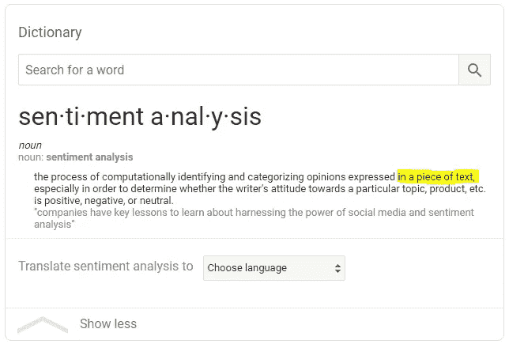
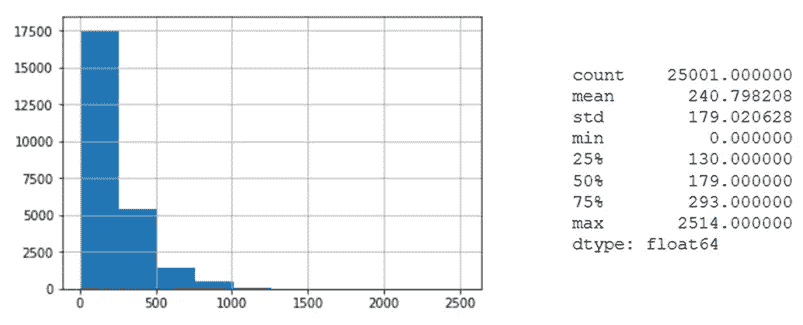
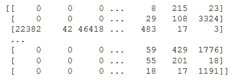
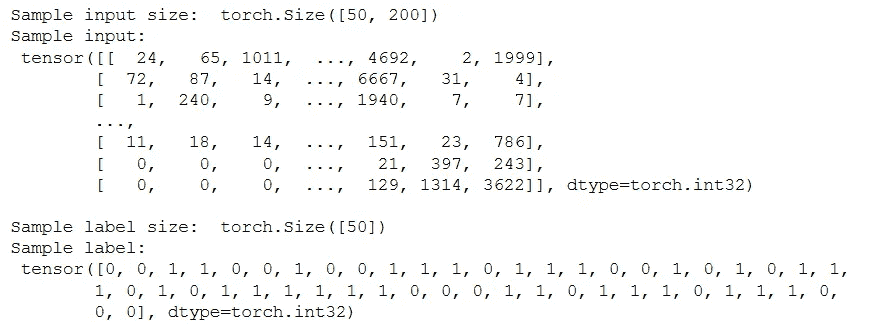
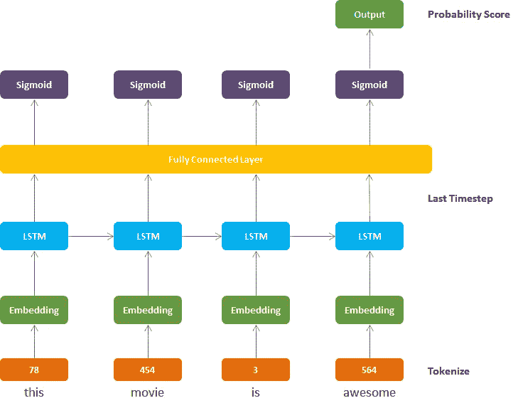

# 使用 LSTM 进行情感分析(循序渐进教程)

> 原文：<https://towardsdatascience.com/sentiment-analysis-using-lstm-step-by-step-50d074f09948?source=collection_archive---------0----------------------->

## 使用 PyTorch 框架进行深度学习


Sentiment Analysis, Image by: [Monkeylearn](https://monkeylearn.com/sentiment-analysis/)

# **什么是情绪分析:**



Sentiment Analysis from Dictionary

我认为谷歌词典的这个结果给出了一个非常简洁的定义。我不用再强调情感分析变得多么重要了。因此，这里我们将在 [IMDB 电影数据集](http://ai.stanford.edu/~amaas/data/sentiment/)上建立一个分类器，使用一种叫做 RNN 的[深度学习](https://en.wikipedia.org/wiki/Deep_learning)技术。

我概述了如何使用[长短期记忆(LSTM)](https://en.wikipedia.org/wiki/Long_short-term_memory) 架构实现[递归神经网络(RNN)](https://en.wikipedia.org/wiki/Recurrent_neural_network) 的逐步过程:

1.  加载并可视化数据
2.  数据处理—转换为小写
3.  数据处理—删除标点符号
4.  数据处理—创建评论列表
5.  Tokenize 创建 Vocab 到 Int 映射字典
6.  标记化—对单词进行编码
7.  标记化—对标签进行编码
8.  分析评论长度
9.  去除离群值——去除过长或过短的评论
10.  填充/截断剩余数据
11.  训练、验证、测试数据集分割
12.  数据加载器和批处理
13.  定义 LSTM 网络架构
14.  定义模型类
15.  训练网络
16.  测试(针对测试数据和用户生成的数据)

> 1 ***)载入并可视化数据***

我们正在使用 [IMDB 电影评论数据集](http://ai.stanford.edu/~amaas/data/sentiment/)。如果它以 txt 文件的形式存储在你的机器中，那么我们只需把它加载进来

```
**# read data from text files**
with open(‘data/reviews.txt’, ‘r’) as f:
 reviews = f.read()
with open(‘data/labels.txt’, ‘r’) as f:
 labels = f.read()print(reviews[:50])
print()
print(labels[:26])**--- Output ---**bromwell high is a cartoon comedy . it ran at the same time as some other programs about school life  such as  teachers  . my   yearspositive
negative
positive
```

> 2 ***)数据处理—转换成小写***

```
reviews = reviews.lower()
```

> 3 ***数据处理—去掉标点符号***

```
from string import punctuation
print(punctuation)**--- Output ---**!"#$%&'()*+,-./:;<=>?@[\]^_`{|}~
```

我们看到了 python 中预定义的所有标点符号。为了去掉所有这些标点符号，我们将简单地使用

```
all_text = ''.join([c for c in reviews if c not in punctuation])
```

> ***4)数据处理—创建评论列表***

我们把所有的字符串都放在一个大字符串中。现在，我们将分离出单独的评论，并将它们存储为单独的列表元素。像【点评 _1，点评 _2，点评 _3……】。复习 _n]

```
reviews_split = all_text.split(‘\n’)
print ('Number of reviews :', len(reviews_split))
```

评论数量:25001

> ***5)标记化—创建 Vocab 到 Int 的映射字典***

在大多数 NLP 任务中，您将创建一个索引映射字典，以便为经常出现的单词分配较低的索引。最常见的方法之一是使用`Collections`库中的`Counter`方法。

```
from collections import Counterall_text2 = ' '.join(reviews_split)
# create a list of words
words = all_text2.split()# Count all the words using Counter Method
count_words = Counter(words)

total_words = len(words)
sorted_words = count_words.most_common(total_words)
```

让我们来看看我们创建的这些对象

```
print (count_words)**--- Output ---**Counter({'the': 336713, 'and': 164107, 'a': 163009, 'of': 145864
```

为了创建一个 vocab 到 int 的映射字典，您只需这样做

```
vocab_to_int = {w:i for i, (w,c) in enumerate(sorted_words)}
```

这里有一个小技巧，在这个映射中，索引将从 0 开始，即“the”的映射将是 0。但是稍后我们将为较短的评论填充，填充的常规选择是 0。所以我们需要从 1 开始索引

```
vocab_to_int = {w:i+1 for i, (w,c) in enumerate(sorted_words)}
```

让我们来看看这个映射字典。我们可以看到“the”的映射现在是 1

```
print (vocab_to_int)**--- Output ---**{'the': 1, 'and': 2, 'a': 3, 'of': 4,
```

> ***6)标记化——对单词进行编码***

到目前为止，我们已经使用来自所有评论的 vocab 创建了 a)评论列表和 b)索引映射字典。所有这些都是为了创建评论的编码(用整数代替评论中的单词)

```
reviews_int = []
for review in reviews_split:
    r = [vocab_to_int[w] for w in review.split()]
    reviews_int.append(r)
print (reviews_int[0:3])**--- Output ---**[[21025, 308, 6, 3, 1050, 207, 8, 2138, 32, 1, 171, 57, 15, 49, 81, 5785, 44, 382, 110, 140, 15, .....], [5194, 60, 154, 9, 1, 4975, 5852, 475, 71, 5, 260, 12, 21025, 308, 13, 1978, 6, 74, 2395, 5, 613, 73, 6, 5194, 1, 24103, 5, ....], [1983, 10166, 1, 5786, 1499, 36, 51, 66, 204, 145, 67, 1199, 5194.....]]
```

注意:我们现在创建的是一个列表列表。每个评论都是一个整数值列表，所有这些都存储在一个巨大的列表中

> ***7)标记化——对标签进行编码***

这很简单，因为我们只有 2 个输出标签。因此，我们将“正”标记为 1，“负”标记为 0

```
encoded_labels = [1 if label =='positive' else 0 for label in labels_split]
encoded_labels = np.array(encoded_labels)
```

> ***8)分析评论长度***

```
import pandas as pd
import matplotlib.pyplot as plt
%matplotlib inlinereviews_len = [len(x) for x in reviews_int]
pd.Series(reviews_len).hist()
plt.show()pd.Series(reviews_len).describe()
```



Review Length Analysis

**观察结果** : a)平均评论长度= 240 b)部分评论长度为 0。保留此评论对我们的分析没有任何意义 c)大多数评论少于 500 字或更多 d)有相当多的评论非常长，我们可以手动调查它们，以检查我们是否需要将它们包括在我们的分析中或从我们的分析中排除

> ***9)剔除异常值——剔除过长或过短的评论***

```
reviews_int = [ reviews_int[i] for i, l in enumerate(reviews_len) if l>0 ]
encoded_labels = [ encoded_labels[i] for i, l in enumerate(reviews_len) if l> 0 ]
```

> ***10)填充/截断剩余数据***

为了处理短评论和长评论，我们会将所有评论填充或截断到特定长度。我们用**序列长度来定义这个长度。**该序列长度与 LSTM 层的时间步数相同。

对于比`seq_length`短的评论，我们会用 0 填充。对于长于`seq_length`的评论，我们会将其截断为第一个 seq_length 单词。

```
def pad_features(reviews_int, seq_length):
    ''' Return features of review_ints, where each review is padded with 0's or truncated to the input seq_length.
    '''
    features = np.zeros((len(reviews_int), seq_length), dtype = int)

    for i, review in enumerate(reviews_int):
        review_len = len(review)

        if review_len <= seq_length:
            zeroes = list(np.zeros(seq_length-review_len))
            new = zeroes+review elif review_len > seq_length:
            new = review[0:seq_length]

        features[i,:] = np.array(new)

    return features
```

注意:我们正在创建/维护一个 2D 数组结构，就像我们为`reviews_int`创建的一样。输出将如下所示

```
print (features[:10,:])
```



> ***11)训练、验证、测试数据集拆分***

一旦我们把数据整理好，我们将把它分成训练集、验证集和测试集

训练= 80% |有效= 10% |测试= 10%

```
split_frac = 0.8
train_x = features[0:int(split_frac*len_feat)]
train_y = encoded_labels[0:int(split_frac*len_feat)]remaining_x = features[int(split_frac*len_feat):]
remaining_y = encoded_labels[int(split_frac*len_feat):]valid_x = remaining_x[0:int(len(remaining_x)*0.5)]
valid_y = remaining_y[0:int(len(remaining_y)*0.5)]test_x = remaining_x[int(len(remaining_x)*0.5):]
test_y = remaining_y[int(len(remaining_y)*0.5):]
```

> ***12)数据加载器和批处理***

在创建我们的训练、测试和验证数据之后。下一步是为这些数据创建数据加载器。我们可以使用生成器函数将我们的数据分批，而不是使用 [TensorDataset](https://pytorch.org/docs/stable/data.html#torch.utils.data.TensorDataset) 。这是 PyTorch 中一个非常有用的实用程序，可以像使用 [torchvision 数据集](https://pytorch.org/docs/stable/torchvision/datasets.html)一样轻松地使用[数据加载器](https://pytorch.org/docs/stable/data.html#torch.utils.data.DataLoader)的数据

```
import torch
from torch.utils.data import DataLoader, TensorDataset# create Tensor datasets
train_data = TensorDataset(torch.from_numpy(train_x), torch.from_numpy(train_y))
valid_data = TensorDataset(torch.from_numpy(valid_x), torch.from_numpy(valid_y))
test_data = TensorDataset(torch.from_numpy(test_x), torch.from_numpy(test_y))# dataloaders
batch_size = 50# make sure to SHUFFLE your data
train_loader = DataLoader(train_data, shuffle=True, batch_size=batch_size)
valid_loader = DataLoader(valid_data, shuffle=True, batch_size=batch_size)
test_loader = DataLoader(test_data, shuffle=True, batch_size=batch_size)
```

为了获得一批可视化的训练数据，我们将创建一个数据迭代器

```
# obtain one batch of training data
dataiter = iter(train_loader)
sample_x, sample_y = dataiter.next()print('Sample input size: ', sample_x.size()) # batch_size, seq_length
print('Sample input: \n', sample_x)
print()
print('Sample label size: ', sample_y.size()) # batch_size
print('Sample label: \n', sample_y)
```



这里，50 是批量大小，200 是我们定义的序列长度。现在，我们的数据准备步骤已经完成，接下来我们将查看 LSTM 网络架构，以开始构建我们的模型

> 13 ***)定义 LSTM 网络架构***



LSTM Architecture for Sentiment Analysis. Image by Author

这些层如下所示:

0.令牌化:这不是 LSTM 网络的一个层，而是将我们的单词转换成令牌(整数)的一个强制步骤

1.  嵌入层:将单词标记(整数)转换成特定大小的嵌入
2.  LSTM 层:由隐藏状态变暗和层数定义
3.  全连接图层:将 LSTM 图层的输出映射到所需的输出大小
4.  Sigmoid 激活层:将所有输出值转换为 0 到 1 之间的值
5.  输出:最后一个时间步长的 Sigmoid 输出被认为是该网络的最终输出

注:如果你想更多地了解这些 LSTM 层，并获得事物的微观观点。读读这个—

[](/reading-between-the-layers-lstm-network-7956ad192e58) [## 层间阅读(LSTM 网络)

### 使用 PyTorch 框架进行深度学习

towardsdatascience.com](/reading-between-the-layers-lstm-network-7956ad192e58) 

> ***14)定义模型类***

> ***15)训练网络***

*   实例化网络

```
# Instantiate the model w/ hyperparams
vocab_size = len(vocab_to_int)+1 # +1 for the 0 padding
output_size = 1
embedding_dim = 400
hidden_dim = 256
n_layers = 2net = SentimentLSTM(vocab_size, output_size, embedding_dim, hidden_dim, n_layers)print(net)SentimentLSTM(
  (embedding): Embedding(74073, 400)
  (lstm): LSTM(400, 256, num_layers=2, batch_first=True, dropout=0.5)
  (dropout): Dropout(p=0.3)
  (fc): Linear(in_features=256, out_features=1, bias=True)
  (sig): Sigmoid()
)
```

*   训练循环

training loop 中的大多数代码都是非常标准的深度学习训练代码，您可能会在所有使用 PyTorch 框架的实现中经常看到这些代码。

> ***16)测试***

*   关于测试数据

*   关于用户生成的数据

首先，我们将定义一个负责预处理步骤的`tokenize`函数，然后我们将创建一个`predict`函数，它将在解析用户提供的评论后给出最终输出。

# **结果:**

```
test_review = 'This movie had the best acting and the dialogue was so good. I loved it.'seq_length=200 # good to use the length that was trained onpredict(net, test_review_neg, seq_length)
```

**阳性审查检出**

## **感谢阅读！**

*   如果你喜欢这个，[关注我的 medium](https://samarthagrawal86.medium.com) 了解更多。
*   你们的掌声对写更多、写得更好是一个巨大的鼓励和帮助。
*   有兴趣合作吗？我们在 [Linkedin](https://www.linkedin.com/in/samarth-agrawal-2501/) 上连线吧。
*   请随意写下您的想法/建议/反馈。

**更新**:另一篇文章给你一个在层内发生的事情的微观视角。

[](/reading-between-the-layers-lstm-network-7956ad192e58) [## 层间阅读(LSTM 网络)

### 使用 PyTorch 框架进行深度学习

towardsdatascience.com](/reading-between-the-layers-lstm-network-7956ad192e58)