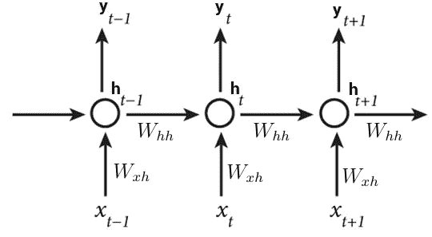
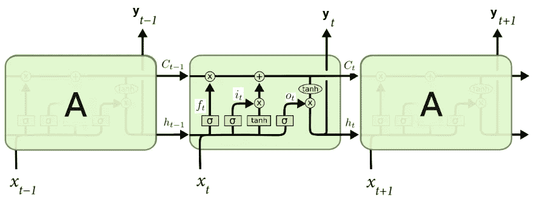
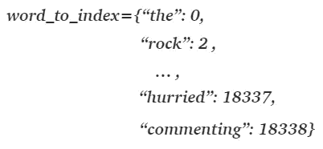
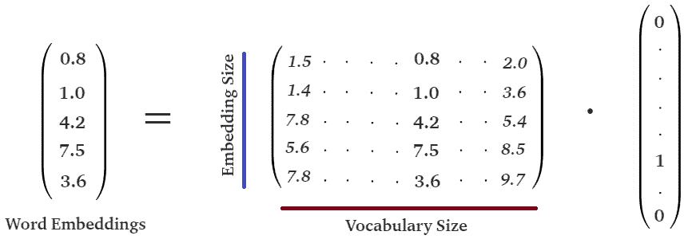
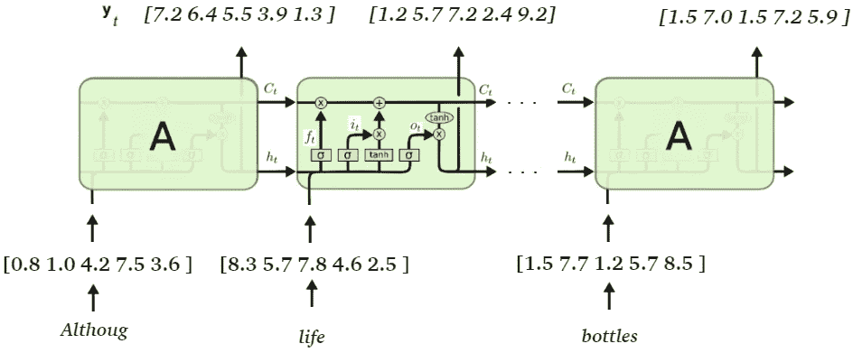

# 基于深度学习的网飞评论情感分析

> 原文：<https://towardsdatascience.com/sentiment-analysis-with-deep-learning-62d4d0166ef6?source=collection_archive---------5----------------------->

## [深入分析](https://towardsdatascience.com/in-depth-analysis/home)

## 网飞评论中人类情感的识别和分类

**在这篇文章中，我将涉及情感分析的主题，以及如何实现一个深度学习模型，该模型可以识别和分类*网飞*评论中的人类情感。**


## 如果你喜欢这篇文章，想分享你的想法，问问题或保持联系，请随时通过 LinkedIn 与我联系。

对企业来说，最重要的因素之一是**与客户群**保持联系。对于这些公司来说，准确地了解消费者或客户对新的和现有的产品或服务、最近的计划和客户服务的想法是至关重要的。

**情感分析是完成这一必要任务的一种方式。**

情感分析是自然语言处理(NLP)的一个领域，它建立模型，试图识别和分类表达的属性，例如:

*   **极性**:如果说话人表达了*正面*或*负面*的意见，
*   **主题**:正在谈论的事情，
*   **意见持有人**:表达意见的个人或实体。

在我们每天产生 2.5 万亿字节数据的世界里，情感分析已经成为理解这些数据的关键工具。这使得公司能够获得关键的洞察力，并自动化各种流程。

情感分析可以帮助将非结构化信息自动转换为公众对产品、服务、品牌、政治或人们可以表达意见的任何其他主题的意见的结构化数据。这些数据对于商业应用非常有用，如**市场分析**、**公共关系**、**产品评论**、**网络推广评分**、**产品反馈**、**和客户服务**。

在下文中，我将向您展示如何实现一个深度学习模型，该模型可以将*网飞*的评论分为正面或负面。该模型将整个评论作为输入(一个词接一个词)，并提供百分比评级，以检查评论是否传达了积极或消极的情绪。

我使用的数据集包含大约 5000 个负面和 5000 个正面评论。这里是来自数据集的 5 个样本评论，在文章的最后将按照模型进行分类:

```
 ***"The film is a hoot and is just as good if not better than much of what s on saturday morning tv, especially the pseudo educational stuff we all can’t stand.” 

"The things this movie tries to get the audience to buy just won’t fly with most intelligent viewers.”******"Although life or something like it is very much in the mold of feel good movies, the cast and director stephen herek’s polished direction pour delightfully piquant wine from aged bottles.”

"This is the case of a pregnant premise being wasted by a script that takes few chances and manages to insult the intelligence of everyone in the audience.”

"One of the finest most humane and important holocaust movies ever made."***
```

深度学习模型+所有必要的数据可以在[我的 GitHub repo](https://github.com/artem-oppermann/Sentiment-Analysis-of-Netflix-Reviews) 中找到。

让我们从一些理论开始。

# 1.递归神经网络

*递归神经网络* ( *RNNs* )是流行的模型，在许多 NLP 任务中显示出巨大的前景。

RNN 的利用文本等顺序信息。在“传统的”前馈神经网络中，我们假设所有的输入都是相互独立的。但是对于许多任务来说，这是一个非常糟糕的想法。例如，一个句子具有清晰的语法结构和顺序，其中每个单词都依赖于前一个单词。如果你想让你的神经网络学习意思(或者在我们的例子中是情感)，网络必须知道哪些单词以什么顺序出现。

*rnn*被称为*递归*，因为它们对序列的每个元素执行相同的任务，其输出取决于之前的计算。另一种看待 rnn 的方式是，它们有一个“记忆”,这个“记忆”记录了到目前为止已经计算过的信息。这是一个典型的 RNN 的样子:



Fig. 1 Recurrent Neural Network architecture.

***【x(t-1)***、 ***x(t)*** 、 ***x(t+1)*** 是相互依赖的顺序输入(如句子中的词)。***【y(t _ 1)******y(t)******y(t+1)***都是输出。对 RNN 来说独一无二的是，计算当前隐藏状态***【t】***的神经元对于输入的***【t】***依赖于先前的隐藏状态***【t-1】***对于先前的输入***【t-1】***。 ***Wxh*** 和 ***Whh*** 是连接输入***【x(t)***与隐藏层***【t】***，以及 ***h(t)*** 与***【t-1】***的权重矩阵这样，我们向神经网络引入了一个递归，该递归可以被认为是对先前输入的记忆。理论上，这种方式“香草” *RNNs* 可以利用任意长序列中的信息，但在实践中，它们被限制为只能回顾几步。

这就是 LSTMs 派上用场的地方。

## 1.1 个 LSTMs

长短期记忆网络——通常简称为“*lstm*”——是一种特殊的 *RNN* ，能够学习长期依赖关系。lstm 的架构与*rnn*没有本质上的不同，但是它们集成了额外的组件。



*LSTMs* 的关键是单元格状态***【C(t)***，贯穿图表顶部的水平线。单元状态是除了仅使用隐藏状态***【t】***之外的另一种存储内存的方式。然而， ***C(t)*** 使得 *LSTMs* 可以与普通 *RNNs* 相反地处理更长的序列。

此外，LSTMs 有能力删除或添加信息到细胞状态，由称为门的结构仔细调节。门是选择性地让信息通过的一种方式。一个 *LSTM* 有三个这样的门，用来保护和控制细胞状态。

*   **遗忘门**:在得到隐藏状态 ***h(t-1 )*** of 之前的输入 ***x(t-1)*** 之后，遗忘门帮助我们决定什么必须从***【t-1】***状态中删除，从而只保留相关的东西。
*   **输入门:**在输入门中，我们决定将当前输入*的新东西添加到我们当前的单元格状态***【C(t)***。*
*   ***输出门:**输出门顾名思义，决定从当前单元状态***【C(t)***到下一个***【C(t+1)***输出什么。对于语言模型示例，由于它刚刚看到了一个主题，它可能希望输出与一个动词相关的信息，以防接下来会出现这个信息。例如，它可能会输出主语是单数还是复数，这样我们就知道动词应该变成什么形式，如果接下来是什么形式的话。*

*每种状态背后都有独立的神经网络。可以想象，这使得 LSTMs 非常复杂。在这一点上，我不会去更多的关于 LSTMs 的细节。*

# *2.预处理*

*在我们可以使用评论作为递归神经网络的输入之前，需要对数据进行一些预处理。**我们在这里的主要目的是缩小观察空间。***

## *2.1 单词的统一拼写*

*考虑一下“ ***有事*** ”和“ ***有事*** ”这样的词。对于我们人类来说，这些单词有着相同的意思，它们之间唯一的区别是第一个单词是大写的，因为它可能是一个句子中的第一个单词。但是对于神经网络来说，这些单词将会有(至少在开始时)不同的意思，因为它们的拼写不同。只有在训练期间，神经网络可能会也可能不会学会识别这些单词的意思。我们的目标是防止这种误解。*

*正因为如此，预处理的第一步就是把所有的单词都变成小写的单词。*

## *2.2 删除特殊字符*

*特殊字符如**。，** **！** **？**等。不会影响评论的情绪，因此可以删除。*

## *最终结果*

*考虑以下未处理的审查样本:*

```
****"Although life or something like it is very much in the mold of feel good movies, the cast and director stephen herek’s polished direction pour delightfully piquant wine from aged bottles.”****
```

*在我们完成前面提到的预处理步骤后，review 示例如下所示:*

```
****"although life or something like it is very much in the mold of feel good movies the cast and director stephen hereks polished direction pour delightfully piquant wine from aged bottles”****
```

*预处理应用于数据集中的每个评论。*

## *2.3 词对索引*

*另一个主要步骤是创建所谓的*单词到索引映射*，它为数据集中的每个单词分配一个唯一的整数值。我在这个项目中使用的包含所有正面和负面评论的数据集由 18339 个独特的单词组成。因此，单词-索引映射具有相同数量的条目。这个数字也被称为**词汇量**。*

*我获得的单词到索引映射中的第一个和最后一个条目如下所示:*

**

*为数据集中的单词分配唯一整数的这一步至关重要，因为我们不能将字符串数据输入到神经网络中。相反，word-to-index 允许我们使用整数来表示整个句子和评论。考虑下面的评论:*

```
****"the things this movie tries to get the audience to buy just wont fly with most intelligent viewers”****
```

*使用单词到索引的映射，评论可以由整数数组表示，其中每个整数根据映射表示一个单词:*

```
****[0, 5094, 147, 81, 1269, 5, 532, 0, 1303, 5, 1835, 652, 236, 1101, 125, 188, 712, 855]****
```

# *3.单词嵌入*

*当然，神经网络既不能接受字符串，也不能接受单个整数值作为输入。相反，我们必须使用*单词嵌入*。*

**单词嵌入*是文本的分布式表示，这可能是深度学习方法在挑战 NLP 问题上令人印象深刻的表现的关键突破之一。*单词嵌入*实际上是一类技术，其中单个单词由一个实值向量表示，通常有几十或几百维。每个单词被映射到一个特定的向量，向量值由神经网络学习。*

*这与稀疏单词表示所需的数千或数百万维形成对比，例如一键编码。例如，我们可以嵌入单词 ***“虽然”*** 和 ***“生活”*** 作为 10 维向量:*

```
****although = [0.8 1.0 4.2 7.5 3.6]
life = [8.3 5.7 7.8 4.6 2.5 ]****
```

*代表数据集中一个单词的每个向量都是从一个称为嵌入矩阵的大矩阵中获得的。该矩阵的行数表示单词嵌入的维度，列数表示词汇大小或数据集中唯一单词的数量。**因此，该矩阵的每一列代表数据集中唯一单词的嵌入向量。***

*我们怎么知道哪一列代表哪个单词？这就是我们使用单词到索引映射的地方。考虑你想要得到单词 ***【虽然】，*** 的嵌入向量，根据单词到索引的映射，这个单词由数字 2511 表示。在下一步中，需要创建一个大小为 *18339 (* 数据集*中的字数)，*的单热编码向量，其中除了值为 1 的第 2511 个条目之外，每个条目都为 0。*

*通过在嵌入矩阵和一位热编码向量之间做点积，我们获得矩阵的第 2511 列，这是单词 ***“虽然”的嵌入向量。****

**

*这样，我们可以将整个字符串或*网飞*评论输入到 *LSTM* 中。我们只需在单词到索引的映射中查找每个单词的整数值，创建适当的一个热编码向量，并用矩阵执行点积。这篇评论然后被一个字一个字地(一个向量接一个向量地)输入 LSTM 的网络。*

**

# *4.获取评论的情绪*

*到目前为止，您已经看到了如何预处理数据以及如何在 LSTM 网络中输入评论。现在，让我们讨论如何最终获得给定评论的情感。*

*对于每个时间步长 **t** ，LSTM 网络接收输入向量 **x(t)** ，这产生输出向量 **y(t)** 。重复该过程，直到 **x(n)，n** 是评论中的字数。就说 **n** =20 个字吧。直到**x(n)***LSTM*网络产生了 **y(n)** 输出向量。这 20 个向量中的每一个都代表了一些东西，但不是我们要寻找的情感。更确切地说，向量 y 是评论特征的编码表示，其(根据神经网络)在确定情感方面将是重要的。*

***y(8)** 代表神经网络为评论的前 8 个单词识别的特征。另一方面， **y(20)** 代表整个评论的特征。尽管在实践中仅使用最后的输出向量 **y(20)** 就足够了，但是我已经发现，如果我们使用所有的向量 **y(0) — y(20)** 来确定情感，则会导致更准确的结果。这可以通过计算所有向量的平均值来实现。我们姑且称这个均值向量 **y_mean。***

*最后，在 **y_mean** 中编码的评论的特征表示可用于将评论分类为正面或负面的类别。为了做到这一点，需要添加一个最终的分类层，它无非是 **y_mean** 和另一个权重矩阵 **W** 之间的点积。*

***我刚才描述的这个情感分析的过程是在我的**[**GitHub repo**](https://github.com/artem-oppermann/Sentiment-Analysis-of-Netflix-Reviews)**中的一个深度学习模型中实现的。欢迎大家来看看，亲自尝试一下。在模型被训练之后，可以对尚未看到的评论执行情感分析:***

```
***Test Samples:****Review**: "the film is a hoot and is just as good if not better than   much of whats on saturday morning tv especially the pseudo educational stuff we all cant stand"**pos. sentiment:** 0.96 %
**neg. sentiment:** 0.04 % **Review:** "the things this movie tries to get the audience to buy just wont fly with most intelligent viewers"**pos. sentiment:** 0.11 % **neg. sentiment:** 0.89 % **Review:** "although life or something like it is very much in the mold of feel good movies the cast and director stephen hereks polished direction pour delightfully piquant wine from aged bottles"**pos. sentiment:** 0.97 %
**neg. sentiment:** 0.03 % **Review:** "this is the case of a pregnant premise being wasted by a script that takes few chances and manages to insult the intelligence of everyone in the audience"**pos. sentiment:** 0.02 %
**neg. sentiment:** 0.98 %*
```