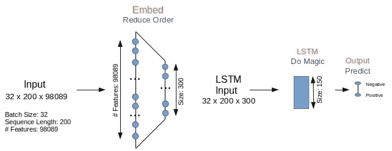
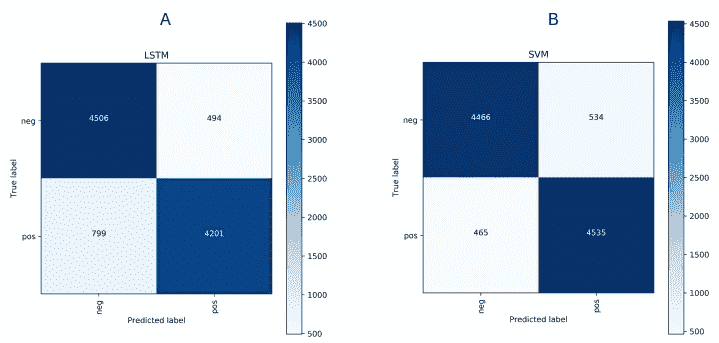

# 基于词包和词序列的情感分析

> 原文：<https://towardsdatascience.com/sentiment-analysis-with-word-bags-and-word-sequences-8f99593d76f8?source=collection_archive---------22----------------------->

## 对于一般文本，词袋方法在文本分类方面非常有效。对于本文研究的二进制文本分类任务，LSTM 处理单词序列的质量与 SVM 使用 tf-idf 向量的质量相当。但是性能是另一回事…



将文档转换成数字向量的单词包方法忽略了文档中单词的顺序。然后，使用这种向量的分类器将为没有考虑特定单词序列对其含义和隐含目标类别的影响而付出代价。有道理。这是在考虑更新的深度学习方法时的争论，例如可以处理序列的 LSTM(长短期记忆)神经网络。在[之前的文章](http://xplordat.com/2019/01/13/word-bags-vs-word-sequences-for-text-classification/)中，我们确实已经表明，当单词序列是*决定分类因素的*时，使用单词包向量的朴素贝叶斯分类器(具体来说是 tf-idf)在 LSTM 的手中遭受了重创(朴素贝叶斯的 0.23 分/tf-idf 对 LSTM 的 0.91 分)。

但是文本语料库是人工。建造*的目的是为了展示 LSTM 等模型中最好的一面，以及忽视上述序列的其他模型中最差的一面。LSTM 方面的这种表现会扩展到现实生活中的文本语料库吗？在现实生活中，单词序列可能不是分类的决定性因素。这就是我们在这里探讨的问题。在这篇文章中，我们从一个简单的二元分类任务开始，在后面的文章中考虑一个多标签分类任务。我们使用具有 tf-idf 向量的支持向量机(SVM)作为单词袋方法的代理，使用 LSTM 作为序列尊重方法的代理。SVM 通过 [SciKit](https://scikit-learn.org/stable/modules/generated/sklearn.svm.LinearSVC.html) 实现，LSTM 通过 [Keras](https://keras.io/layers/recurrent/) 实现。当我们在这里浏览一些代码片段时，可以从 [github](https://github.com/ashokc/Sentiment-Analysis-with-Word-Bags-and-Sequences) 下载重现结果的完整代码。*

## 1.将电影评论符号化

来自斯坦福的文本语料库[大型电影评论](http://ai.stanford.edu/~amaas/data/sentiment/)通常用于二元情感分类，即基于评论电影是好还是坏。正面和负面评论被下载到磁盘的不同目录中。下面是“清理”文档并对其进行标记以供分析的代码片段。

*   第 10-11 行。符号化。删除所有标点符号和 NLTK 停用词。确保所有单词/标记都以字母开头。并且只保留长度在 3 到 15 个字符之间的单词。
*   第 15–24 行:遍历每个文件夹中的电影评论文件并标记。
*   第 25 行:记下每个文档中的字数有助于我们稍后为 LSTM 选择合理的序列长度。对 *nTokens* 的百分位数统计显示，超过 86%的文档中的单词少于 200 个。

```
Token Summary:
min  avg    median   std     85/86/87/90/95/99         max
3    116      86      88    189/195/203/230/302/457    1388
```

## 2.打包行李和序列

LSTM 使用单词序列作为输入，而传统的分类器使用单词包，如 tf-idf 向量。手里有了每个文档作为令牌列表，我们就可以做好准备。

## 2.1 SVM 的 Tf-Idf 矢量

我们使用 Scikit 的 [Tf-Idf 矢量器](https://scikit-learn.org/stable/modules/generated/sklearn.feature_extraction.text.TfidfVectorizer.html)从令牌构建词汇表和文档矢量。

## 2.2 的序列

Keras 中的 text [处理器](https://keras.io/preprocessing/text/)将每个文档转换成一个整数序列/字符串，其中的整数值表示相同处理生成的 *{word:index}* 字典中的实际单词。我们使用 200 长的序列，因为令牌上的统计数据显示，超过 86%的文档少于 200 个单词。在下面代码的第 8 行中，少于 200 个单词的文档将用嵌入层忽略的索引值 0 进行“post”填充(在第 3 节的嵌入层定义中设置了 *mask_zero=True* )。

## 3.模型

[LSTM](https://keras.io/layers/recurrent/) 通过 Keras 实现，而 [SVM](https://scikit-learn.org/stable/modules/generated/sklearn.svm.LinearSVC.html#sklearn.svm.LinearSVC) 通过 SciKit 实现。两者都使用相同的训练/测试分割，因此比较是公平的。整个语料库(即 10，000 个文档)的 20%被留出用于测试，同时对剩余的 40，000 个文档进行训练。

## 3.1 LSTM

正如在前面的文章中，我们使用最简单的 LSTM 模型，有一个嵌入层，一个 LSTM 层和输出层。


Figure 1\. A simple LSTM model for binary classification.

图 1 中的嵌入层将特征的数量从 98089(语料库中唯一单词的数量)减少到 300。LSTM 图层输出一个 150 长的矢量，该矢量将被输入到输出图层进行分类。模型本身的定义非常简单。

*   第 4 行:嵌入层被训练成将 98089 长的 1-hot vetcors 转换成密集的 300 长的向量
*   第 6 行:下降域有助于防止过度拟合

在下面代码的第 6 行中，通过提前停止来完成训练，以防止过度训练。最终输出图层生成一个与标注数量一样长的矢量，该矢量的 argmax 就是预测的分类标注。

## 3.2 SVM

SVM 的模型要简单得多，因为需要决定的运动部件和参数要少得多。这当然总是一件好事。

## 4.模拟

混淆矩阵和获得的 F1 分数是我们感兴趣的。有了这两种方法的预测标签，我们就可以使用 SciKit 的 API 来计算它们。

虽然我们以不同的顺序浏览了一些片段，但是运行 lstm 的 *lstm_movies.py* 和运行 svm 的 *svm_movies.py* 的完整代码在 [github](https://github.com/ashokc/Sentiment-Analysis-with-Word-Bags-and-Sequences) 上。如[上一篇文章](http://xplordat.com/2019/01/13/word-bags-vs-word-sequences-for-text-classification/)所述，各种随机种子被初始化以获得可重复性。

## 4.1 LSTM

运行 LSTM 与:

```
#!/bin/bash

echo "PYTHONHASHSEED=0 ; pipenv run python ./lstm_movies.py"
PYTHONHASHSEED=0 ; pipenv run python ./lstm_movies.py
```

由于早期停止，F1 分数在 6 个时期内收敛，产生约 0.87。

```
Using TensorFlow backend.
Token Summary:min/avg/median/std 85/86/87/88/89/90/95/99/max:
3 116.47778 86.0 88.1847205941687 189.0 195.0 203.0 211.0 220.0 230.0 302.0 457.0 1388
X, labels #classes classes 50000 (50000,) 2 ['neg', 'pos']
Vocab padded_docs 98089 (50000, 200)
_________________________________________________________________
Layer (type)                 Output Shape              Param #   
=================================================================
embedding_1 (Embedding)      (None, 200, 300)          29427000  
_________________________________________________________________
lstm_1 (LSTM)                (None, 150)               270600    
_________________________________________________________________
dense_1 (Dense)              (None, 2)                 302       
=================================================================
Total params: 29,697,902
Trainable params: 29,697,902
Non-trainable params: 0
_________________________________________________________________
None
Train on 40000 samples, validate on 10000 samples
Epoch 1/50
 - 1197s - loss: 0.3744 - acc: 0.8409 - val_loss: 0.3081 - val_acc: 0.8822
Epoch 2/50
 - 1195s - loss: 0.1955 - acc: 0.9254 - val_loss: 0.4053 - val_acc: 0.8337
...
Epoch 6/50
 - 1195s - loss: 0.0189 - acc: 0.9938 - val_loss: 0.5673 - val_acc: 0.8707
Epoch 00006: early stopping
[[4506  494]
 [ 799 4201]]
              precision    recall  f1-score   support

         neg     0.8494    0.9012    0.8745      5000
         pos     0.8948    0.8402    0.8666      5000

   micro avg     0.8707    0.8707    0.8707     10000
   macro avg     0.8721    0.8707    0.8706     10000
weighted avg     0.8721    0.8707    0.8706     10000

Time Taken: 7279.333829402924
```

## 4.2 SVM

管理 SVM

```
#!/bin/bash

echo "PYTHONHASHSEED=0 ; pipenv run python ./svm_movies.py"
PYTHONHASHSEED=0 ; pipenv run python ./svm_movies.py
```

F1 值为 0.90

```
Token Summary. min/avg/median/std/85/86/87/88/89/90/95/99/max:
3 116.47778 86.0 88.1847205941687 189.0 195.0 203.0 211.0 220.0 230.0 302.0 457.0 1388
X, labels #classes classes 50000 (50000,) 2 ['neg', 'pos']
Vocab sparse-Xencoded 98089 (50000, 98089)
.....*
optimization finished, #iter = 59
Objective value = -6962.923784
nSV = 20647
[LibLinear][[4466  534]
 [ 465 4535]]
              precision    recall  f1-score   support

         neg     0.9057    0.8932    0.8994      5000
         pos     0.8947    0.9070    0.9008      5000

   micro avg     0.9001    0.9001    0.9001     10000
   macro avg     0.9002    0.9001    0.9001     10000
weighted avg     0.9002    0.9001    0.9001     10000

Time Taken: 0.7256226539611816
```

## 5.结论

显然，F1 值为 0.90 的 SVM 和 0.87 的 LSTM 在二元分类方面做得非常好。混淆矩阵如预期的那样表现出极好的对角优势。



Figure 2\. Both LSTM and SVM have done very well for this binary sentiment classification exercise

虽然他们在质量方面是平等的，但 LSTM 需要更长的时间——2 小时而不是不到一秒。这是一个不容忽视的巨大差异。

我们以此结束这篇文章。在下一篇文章中，我们将回顾多标签分类练习的结果以及外部单词嵌入(如 fasttext)的影响。

…

*原载于 2019 年 1 月 28 日*[*xplordat.com*](http://xplordat.com/2018/09/27/word-embeddings-and-document-vectors-part-1-similarity/)*。*