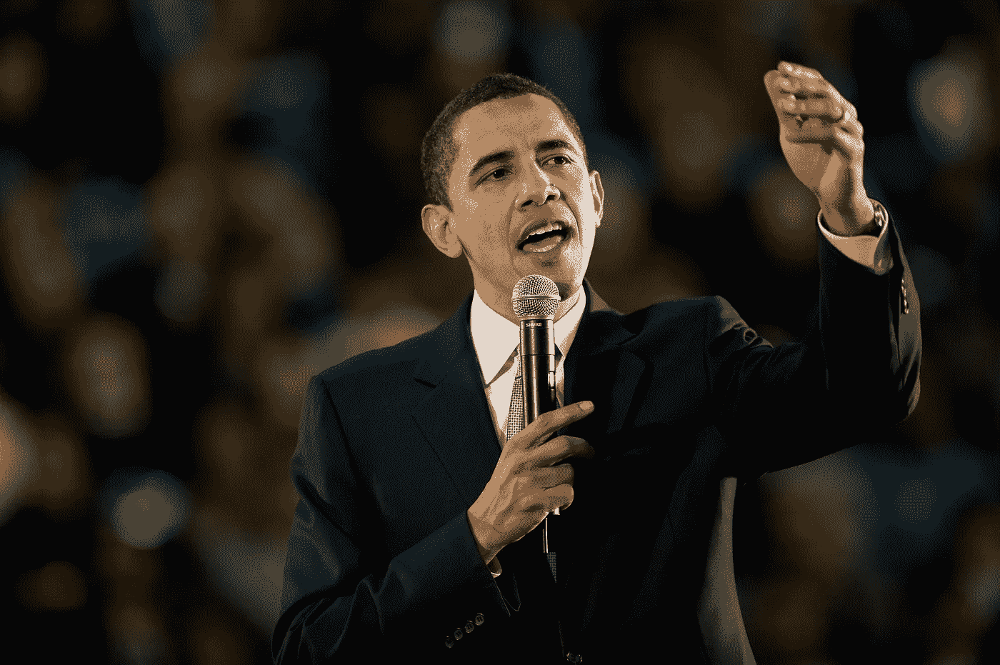
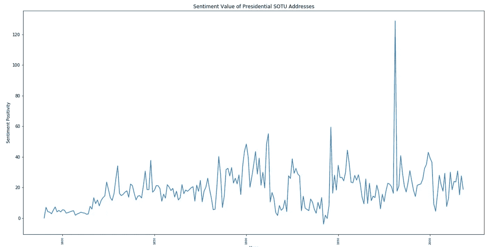
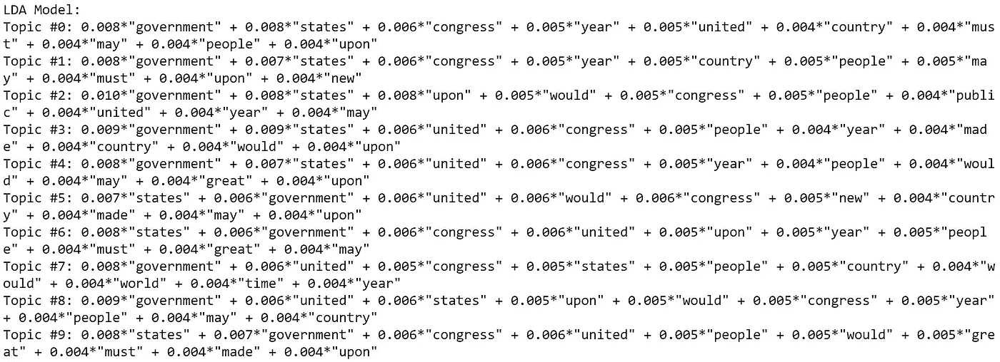
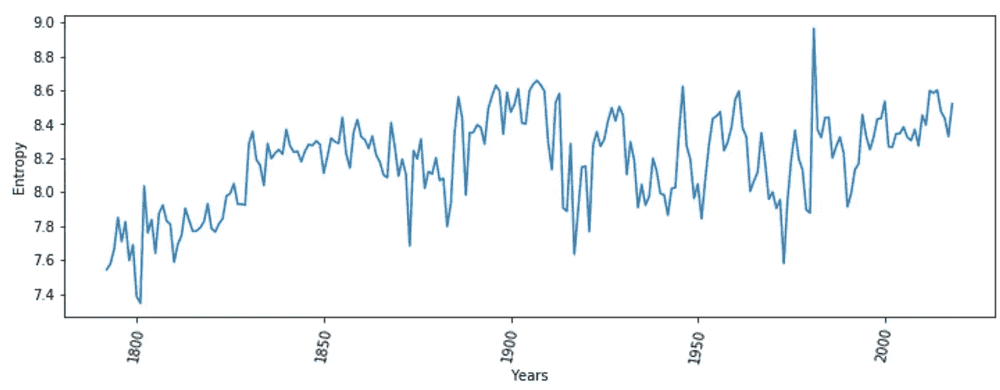
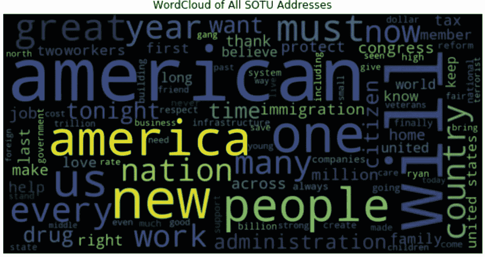
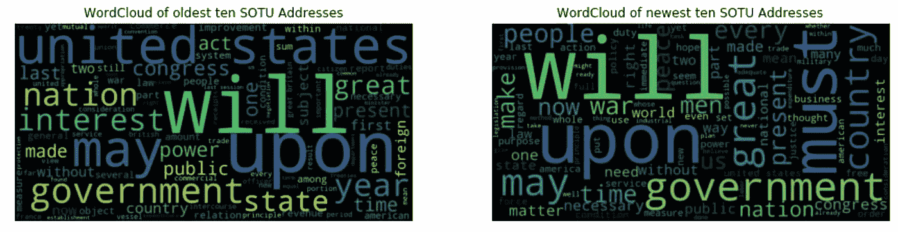
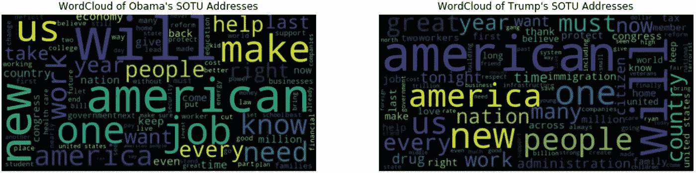

# 工会的情绪

> 原文：<https://towardsdatascience.com/sentiment-of-the-union-analyzing-presidential-state-of-the-union-addresses-with-python-2a8667a578b9?source=collection_archive---------19----------------------->

## 使用情感分析和 Python 工具分析总统国情咨文

Photo from [271277](https://pixabay.com/en/users/271277-271277/) on [Pixabay](https://pixabay.com/)

在《宪法》第二条第三款中，美国总统被指示“向国会提交国情咨文，并建议国会考虑他认为必要和适宜的措施。”

随着特朗普 2019 年国情咨文演讲的新闻，随着时间的推移，看看这些演讲，看看我们是否能注意到自乔治·华盛顿发表第一次演讲以来的任何有趣趋势和变化，可能会很有趣。在本文中，我们将采用 Python 中的数据驱动方法，并利用情绪分析等工具来更好地了解这些演讲随时间的发展。

在一系列的 [python 笔记本](https://github.com/db7894/sentiment-of-the-union)中，我查看了不同演讲的*情感值*，执行了*主题建模*，创建了*文字云*，最后通过查看每篇演讲的熵值构建了一个“说了多少”的初步衡量标准。

情感分析是自然语言处理中的一种流行工具，它通过理解文本表达的观点来帮助形成对文本的更好理解和分析。因为我们在这里考虑几种不同的方法，所以我们不会深入探讨。首先，我们将考虑用一个数字来表示每个演讲的情绪(“积极”或“消极”)，然后看看主题建模是否能帮助我们获得任何进一步的见解。

在开始之前，让我们考虑一下我们可能会从将要分析的地址中得到什么。当华盛顿在 1790 年发表第一份国情咨文时，对他作为第一任总统的审查使他采取了谨慎和顺从的语气，提出了建议，而不是我们在 9/11 后从乔治·W·布什那里看到的行动呼吁。因此，我们可能会认为华盛顿讲话的情绪值相对“中性”(不赋予数值)。

这是足够的猜测。让我们看看我们的结果。我将第一个笔记本产生的情绪值绘制在下面:

你会注意到图表右侧的一个尖峰，像一个疼痛的拇指一样突出——那是吉米·卡特总统发表的 1981 年国情咨文。如果我们忽略这段数据，其余地址的情感值会显得更加密切相关。不管怎样，当我们开始审视对总统个人的情绪变化时，我们会看一看这个特别的演讲。

让我们再往前推一点——因为我们知道每位总统演讲的情绪值，我们可以看看他们从第一次到最后一次国情咨文演讲的情绪变化。也许这将与他们总统任期的成功有一些关联。

运行这些数字，我们有以下观察结果:

*   增幅最大的是卡特，为 106.6 亿美元。这有点令人惊讶，我们将在下面考虑它。
*   排名第二的学校比这落后了不少:麦金利大学，33.0699999999999 美元。虽然他总统任期的开始涉及古巴危机和与西班牙的战争，但麦金利设法实现了与西班牙的和平并获得了一些领土。在他遇刺前，他总统任期的结束是乐观的，因此这一数值似乎与历史事件相符。
*   降幅最大的是杜鲁门，为-35.07 亿。杜鲁门在二战盟军胜利后就职，并在第一任期领导了马歇尔计划和中国不确定性等理论。杜鲁门第二任期内的朝鲜战争对美国来说是一个令人沮丧的僵局，到 1952 年，杜鲁门获得了在任美国总统的最低支持率。同样，数据似乎与历史相符。
*   罗斯福以-31 紧随杜鲁门之后。33300 . 000000000335 我们可能会想起一个矛盾的开端，罗斯福以压倒性优势战胜杜鲁门，但在大萧条期间担任总统，并创下了四届任期的纪录。他有一个多产的开始，带头主要立法和制定新政。有趣的是，1934 年的演讲并没有“向[美国人]展示一幅对世界事务完全乐观的画面。”虽然罗斯福描绘了一幅更有希望和乐观的画面，描绘了第二次世界大战结束的伟大成就和纳粹法西斯在欧洲统治的结束，但他的长篇演讲提到了“相当大的损失”、“敌人的绝望企图”以及相当于德国“分裂宣传”的“邪恶和毫无根据的谣言”。这可能是我们正在考虑的最有趣的结果，因为虽然 1945 年的演讲在许多方面肯定是积极的和充满希望的，但我们的模型可能会采用过多的令人讨厌的和负面的词汇来描述二战期间的敌人。
*   特朗普的负面因素相当高，到他任期的第二年，负面因素的变化为-8.7699999999989。现在画出完整的轨迹并解释一切还为时过早，但关于俄罗斯调查的指控和证据的持续趋势表明，这种负面情绪的趋势可能会持续到 2019 年的国情咨文中，如果真的发生的话。

在滞胀的一年开始他的总统任期时，如果卡特成功地遏制了这种现象，那么他在讲话中表达的情绪将会显著增加，这可能是有道理的。有趣的是，卡特作为总统的最后 15 个月被包括伊朗人质危机和苏联入侵阿富汗在内的危机所破坏，而卡特本人通常被评价为低于平均水平的总统。

同样有趣的是，尽管人们一致认为波尔克总体上是一位成功的总统(尽管经常被忽视)，但对他演讲的看法变化大约是 7。与此同时，不难想象，像波尔克这样的总统会在演讲中采用慎重的语气。另一方面，我们的情绪模型可能会从卡特 1981 年的演讲中获得积极和充满希望的陈述，如下面的段落:

“然而，我坚信，由于过去四年在许多国内和国际领域取得的进展，我们的国家比四年前更加强大、更加富有、更加富有同情心和更加自由。我为此感到自豪。我相信国会也应该感到自豪，因为过去四年来所取得的这么多成就都归功于国会的辛勤工作、远见卓识和通力合作。我为国会的努力和成就喝彩。”

语言本身并不反常，但卡特演讲的整体长度，加上明显充满希望和积极的语言，肯定会有助于我们的模型给演讲打分。虽然卡特没有回避提及困难，但他讲话的意图是描绘四年来的进步。很自然，卡特想总结他认为是他的政府的决定性成就，并为未来设定一个积极的基调。这导致了一个比平常更冗长和更有希望的演讲。

在第二个笔记本中，我进行了主题建模，这是一种帮助我们发现出现在文档和文本中的抽象主题的统计建模。我在演讲的子集上使用了两个模型，潜在狄利克雷分配(LDA)和潜在语义索引(LSI)，保留了特朗普给出的最后两个地址。

对于那些寻找这两个模型的技术解释的人，你可以在[马志威的文章](/2-latent-methods-for-dimension-reduction-and-topic-modeling-20ff6d7d547)中找到对 LDA 和 LSI 的很好的解释。在这里，我将主要关注他们能告诉我们什么关于我们感兴趣的演讲。LDA 模型为我们提供了以下主题群(LSI 模型的输出可以在笔记本 2 中找到):

Topics produced by the LDA Model

如果我们跳过那些在所有话题中明显无处不在的词(“美国”、“美国”、“国会”、“年份”)，那么这些话题能做的就是让我们对演讲中使用的语言类型有所了解。不幸的是，值得注意的是，该模型并没有给我们太多的主题，例如“农业”或“关系”。另一方面，“必须”、“伟大”和“人民”等词可以告诉我们更多关于演讲语气的信息，以及它们在历史上如何被用作更新和呼吁行动，激发美国人对自己国家的强烈自豪感。

在我们探索的下一部分，我们将试图通过单独计算每个地址的熵来构建一个(非常)基本的“总统说了多少”的度量。在信息论中，**熵**被定义为随机(random)数据源产生信息的平均速率。在这种情况下，熵表达了我们对一个演讲的**信息内容**的期望，或者它解决了多少不确定性。

就我们的目的而言，我们可以认为熵值是文本的简洁程度。一个演讲的熵值越高，它就越不简洁，因此“说”得越多。我们将把这种想法作为起点，从那里开始。以下是每场演讲的熵图，从华盛顿开始，到特朗普结束:

Entropy of State of the Union Addresses

不要太深入，值得注意的是，平均而言，随着时间的推移，熵值似乎会随着相当数量的下降而增加。然而，这些值下降得足够明显，以至于我们可能会说，从早期到后期，熵显著增加了。高熵演讲的一个特点是更长的长度，但在这个笔记本上的进一步探索表明，这并不能解释全貌。如果你有兴趣看到一些进一步的分析，或许你自己也可以继续下去，请查看题为“熵”的笔记本。

在探索的最后一步，我生成了一些文字云来可视化以下内容:

*   所有 SOTU 地址的汇编
*   比较最早的 10 个地址和最晚的 10 个地址
*   比较一下奥巴马的演讲和特朗普的两个演讲

WordCloud of compilation of SOTU addresses

如果我们考虑所有地址的词云，我们不应该太惊讶最突出的词是最普遍的，广泛适用于美国人民:“美国”，“美国”，“国家”，“新”和“人民”是特色。我们在主题建模中看到的单词，如“must”和“will”也出现了。

与此同时，虽然它们的优先地位较低，但近年来引发大量辩论且有历史根源的话题也出现了——这些话题包括“毒品”、“移民”和“恐怖分子”。

接下来，我们将查看 10 个最老的地址和 10 个最新的地址。

将最老的地址与最新的地址进行比较，会发现一些显著的变化。在最新的演讲词云中，“美国”几乎被完全删除，而“必须”、“伟大”和“国家”的出现比以前多得多。“利益”和“国家”这两个词也消失了，这表明从早期到当代总统的演讲中出现了一些有趣的修辞变化。

如果我们记得总统任期最初几年的不稳定性，那么呼吁采取行动将比当时更成为当今世界的常态是有道理的——此外，当代话语引发了大量利用美国人自豪感的言论，解释了“伟大”一词。“利益”和“国家”等词的消失可能标志着一种转变，即远离建国之父们如此深入思考的关于民族国家功能的更多理论论述。

最后，让我们比较一下我们最近的两位总统:巴拉克·奥巴马和唐纳德·特朗普发表的国情咨文的文字云。

值得注意的是，在奥巴马的词汇云中，“我们”、“制造”、“新”、“帮助”、“工作”和“每一个”出现的次数更多。特朗普的云以“美国”和“国家”为特色，更强调“人民”和“国家”。我们还可以轻松地发现“毒品”这个词，尽管在奥巴马的云中我们不能。虽然一些最重要的词汇是通用的，但两朵云彩之间的差异及其隐含的修辞暗示表明了奥巴马和特朗普的利益和政策的差异。

奥巴马是积极变革的支持者，也是一位经常利用演讲(正如他在竞选中所做的那样)在听众中产生社区感的政治家，这解释了“我们”和“每一个”等词的存在，而他的国内医疗政策和对这一政策的关注可能解释了“帮助”等词的存在。我们在特朗普的云中注意到的词语反映了他演讲中相当大剂量的民族主义。“will”这个词在两朵云彩中占主导地位，暗示着两位总统的承诺。

作为总结，我们分析了自乔治·华盛顿以来历届总统发表的国情咨文，首先使用一种基本的情绪测量方法来观察演讲中的积极和消极情绪，以及每位总统在这些价值观上的转变。然后，我们考虑主题建模，看看我们是否可以对国情咨文中感兴趣的主题进行推断。接下来，我们认为熵是可压缩性的度量，也是语音“内容”的基本度量。最后，我们使用 WordClouds 来研究这些演讲中与所有总统密切相关的话题，以及一些有趣的团体和个人之间的差异。

像 NLP 这样的工具可以帮助我们分析从演讲到书籍的历史文献中的有趣趋势，并开发新的见解。总统的国情咨文很重要，因为它能告诉我们美国历史上的时事状况，并描绘出乐观和悲观的图景。虽然有帮助，但如果我们不花时间自己检查文件，对形势的纯技术分析可能会导致我们得出误导性的结论，就像罗斯福的情况一样。在我们前进的过程中，我们应该继续使用情感分析等工具，因为它们可以提供强大的洞察力，但请记住，在分析文本和演讲时，尤其是在分析文本和演讲时，有必要考虑大量的上下文和修辞因素，这些因素通常无法像人类一样理解。

来源:

[1] G .华盛顿，[第一次向国会发表年度演说](https://www.mountvernon.org/library/digitalhistory/digital-encyclopedia/article/first-annual-address-to-congress/) (1790)。

[2] J .卡特，[国情咨文](https://www.jimmycarterlibrary.gov/assets/documents/speeches/su81jec.phtml) (1981)。

[3]f·罗斯福，[国情咨文](http://www.let.rug.nl/usa/presidents/franklin-delano-roosevelt/state-of-the-union-1934.php) (1934)。

[4]f·罗斯福，[国情咨文](http://www.let.rug.nl/usa/presidents/franklin-delano-roosevelt/state-of-the-union-1945.php) (1945)。

[5] [威廉·麦金利](https://en.wikipedia.org/wiki/William_McKinley)，维基百科。

[6] [哈里·S·杜鲁门](https://en.wikipedia.org/wiki/Harry_S._Truman)，维基百科。

[7] [富兰克林·罗斯福总统任期](https://en.wikipedia.org/wiki/Presidency_of_Franklin_D._Roosevelt)，维基百科。

[8] E. Ma， [2 潜在的降维和主题建模方法](/2-latent-methods-for-dimension-reduction-and-topic-modeling-20ff6d7d547) (2018)，走向数据科学。