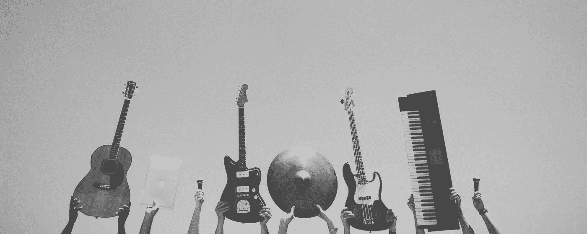
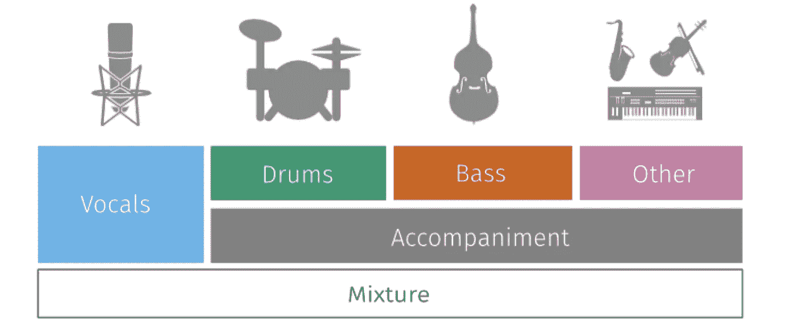
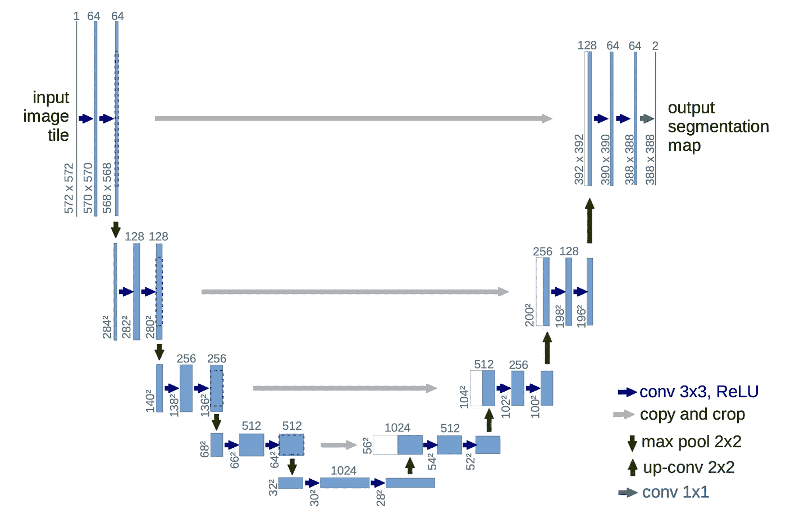
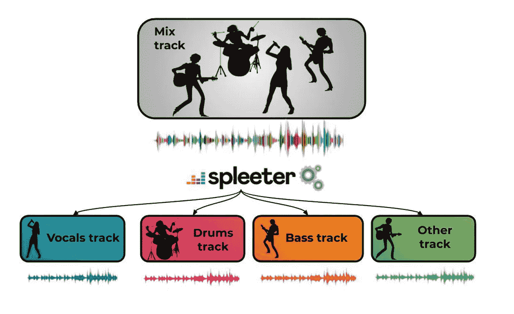

# 用深度学习分离音乐曲目

> 原文：<https://towardsdatascience.com/separate-music-tracks-with-deep-learning-be4cf4a2c83?source=collection_archive---------7----------------------->

## 如何使用 Deezer 的 library spleeter 开始创建您的卡拉 ok。



如果你是一名 DJ，一名音乐采样员或类似的人，通常你会花几个小时从原始音乐中创作歌曲，甚至花上几千美元购买软件来帮助你。这个过程中的一个步骤是能够分离人声和音乐，有时是人声、低音、鼓等等。

Deezer 的出色人员刚刚发布了一个包，它将帮助您快速、轻松且免费地做到这一点！！

# 它是如何工作的



[https://sigsep.github.io/](https://sigsep.github.io/)

在论文[“歌声分离:训练数据研究”](https://ieeexplore.ieee.org/document/8683555)中，Deezer 的人员解释了使用深度神经网络分离音轨的过程。这是要点:

> 在本文中，我们将重点放在深度神经网络来执行分离。我们选择的基准模型是 U-Net[……]U-Net 与卷积自动编码器采用相同的架构，具有额外的跳跃连接，可将编码阶段丢失的详细信息带回解码阶段。它在编码器中有 5 个步长 2D 卷积层，在解码器中有 5 个步长 2D 去卷积层。

所以他们使用一个 U 型网络，看起来像这样:



[https://arxiv.org/pdf/1505.04597.pdf](https://arxiv.org/pdf/1505.04597.pdf)

这个架构是由 Ronneberger 和其他人创建的，用于医学领域的图像分类任务，现在我们将它用于音乐和更多。该网络是从完全卷积网络中构思出来的，经过修改和扩展，它可以使用非常少的训练图像进行工作，并产生更精确的分割。

U-Net 架构还依赖于对数据扩充的大量使用，以便更有效地使用可用的带注释的样本。如果你没有那么多信息，这是很棒的。

Deezer 的人做的主要修改是集成立体声处理:

> 我们使用 3D 张量(通道、时间步长、频率仓)作为网络的输入和输出。

用于训练网络的数据集:MUSBD 和 Bean。MUSDB 是用于源分离的最大和最新的公共数据集，而 Bean 是包含大部分流行/摇滚歌曲的私有数据集，并且包括作为独立录音的声乐和器乐音轨。

然后他们重建了数据集并做了一些数据扩充，具体来说他们做了:

*   频道交换。
*   时间拉伸。
*   音高移位
*   使再混合
*   逆高斯滤波
*   响度标度

以及更多的组合。最后一句话:

> 预训练模型的性能非常接近已发布的技术水平，并且据作者所知，在即将公开发布的通用 musdb18 基准测试中，这是性能最好的 4 茎分离模型。Spleeter 的速度也非常快，因为它可以使用预训练的 4 茎模型在单个图形处理单元(GPU)上将混合音频文件分成 4 个茎，比实时 1 快 100 倍。

# 如何使用它



[https://deezer.io/releasing-spleeter-deezer-r-d-source-separation-engine-2b88985e797e](https://deezer.io/releasing-spleeter-deezer-r-d-source-separation-engine-2b88985e797e)

为了使用这个包，我创建了一个 MatrixDS repo，这样你就可以试一试了:

 [## MatrixDS |数据项目工作台

### MatrixDS 是一个构建、共享和管理任何规模的数据项目的地方。

community.platform.matrixds.com](https://community.platform.matrixds.com/community/project/5dc40ffa9550a3c2d251bcb8/files) 

要开始使用该库，首先要做的是安装它:

```
pip install --user spleeter
```

对我来说，最好使用康达方式:

```
git clone https://github.com/deezer/spleeter
conda env create -f spleeter/conda/spleeter-cpu.yaml
conda activate spleeter-cpu
```

您还需要安装 ffmpeg:

```
sudo apt-get update
sudo apt-get install ffmpeg
```

如果您正在运行 mac:

```
brew install ffmpeg
```

我将用这些歌曲来测试:

免责声明:我不拥有这些歌曲的权利，版权属于官方音乐创作者和唱片公司。

然后对第一首歌这样做:

```
spleeter separate -i songs/breath.mp3 -o output/
```

这将下载用于分离人声和音乐的预训练模型。

对于第一首歌，“你的每一次呼吸”，这些是分离人声和音乐的结果:

 [## 伴奏. wav

### 编辑描述

drive.google.com](https://drive.google.com/file/d/1nQX9c_gkr0ulofnbF2aG2GNS0d8fHAm1/view?usp=sharing)  [## vocals.wav

### 编辑描述

drive.google.com](https://drive.google.com/open?id=1tym_4LCTj0Jt6-cQ8Ui7GdyHK3pfk6td) 

以下是“懒歌”的搜索结果:

 [## 伴奏(1)。声音资源文件

### 编辑描述

drive.google.com](https://drive.google.com/file/d/1_Wkdnr4dpxndDAXv9e-zzkXnZf_3GRje/view?usp=sharing)  [## 人声(1)。声音资源文件

### 编辑描述

drive.google.com](https://drive.google.com/file/d/1D62XMBDzvsGAdNfI0UuCj_3KTWSttxjZ/view?usp=sharing) 

现在让我们用“不要让我失望”这首歌的 4 茎模型来分离人声/低音/鼓/其他:

```
spleeter separate -i songs/dont.mp3 -o audio_output -p spleeter:4stems
```

这将下载用于分离所有音乐源的预训练模型。

以下是这首歌的结果:

[](https://drive.google.com/drive/folders/1qA3xsUf71qrk23pwdf65roWvGM_yhsm6?usp=sharing) [## 不要让我失望-谷歌驱动

### 编辑描述

drive.google.com](https://drive.google.com/drive/folders/1qA3xsUf71qrk23pwdf65roWvGM_yhsm6?usp=sharing) 

你会在那里找到足迹。

这个库的强大给我留下了非常深刻的印象，所有这些只需要几秒钟就可以运行，而且输出非常好。我知道可以改进，你也可以！因为代码是开源的，你可以去那里看看哪里可以让声音更清晰。你甚至可以用特定音乐来训练你自己的模型，这样它就能被更好地识别。

所有相关信息都在这里:

[](https://github.com/deezer/spleeter) [## 除雾器/分离器

### Spleeter 是 Deezer 源分离库，具有用 Python 编写的预训练模型，并使用 Tensorflow。

github.com](https://github.com/deezer/spleeter) 

还有这里:

[](https://github.com/deezer/spleeter/wiki/2.-Getting-started) [## 除雾器/分离器

### Deezer 源分离库，包括预训练模型。- deezer/spleeter

github.com](https://github.com/deezer/spleeter/wiki/2.-Getting-started) 

感谢 Deezer 的出色人员发布了这个库。

如果你想更多地了解我并看到其他文章，请点击这里关注我:

[](https://twitter.com/FavioVaz) [## 法维奥·巴斯克斯

### Favio Vázquez 的最新推文(@FavioVaz)。数据科学家。物理学家和计算工程师。我有一个…

twitter.com](https://twitter.com/FavioVaz)