# 用独立分量分析分离混合信号

> 原文：<https://towardsdatascience.com/separating-mixed-signals-with-independent-component-analysis-38205188f2f4?source=collection_archive---------3----------------------->


Image modified from [garageband](https://pixabay.com/users/garageband-4200899/)

周围的世界是各种来源信号的动态混合体。就像上图中的颜色相互融合，产生新的色调，我们所感知的一切都是简单成分的融合。大多数时候，我们甚至没有意识到我们周围的世界是独立过程的混乱混合体。只有在不同的刺激，没有很好地混合，竞争我们的注意力的情况下，我们才意识到这种混乱。一个典型的例子是在鸡尾酒会上，一个人在听另一个人的声音，同时过滤掉所有其他客人的声音。根据房间的响度，这可能是一项简单或困难的任务，但不知何故，我们的大脑能够将信号与噪音分开。虽然还不清楚我们的大脑是如何进行这种分离的，但有几种计算技术旨在将信号分成其基本成分。其中一种方法被称为**I**n 独立 **C** 组件 **A** 分析( *ICA* )，在这里我们将仔细看看这个算法是如何工作的，以及如何用 Python 代码写下来。如果你对代码比对解释更感兴趣，你也可以直接查看 Github 上这篇文章的 Jupyter 笔记本。

# 什么是独立分量分析？

现在让我们继续以鸡尾酒会为例。想象有两个人在说话，你可以听到他们两个，但是其中一个比另一个离你更近。两个声源的声波将混合在一起，作为一个组合信号到达你的耳朵。你的大脑会将两个声音源分开，你会分别听到两个客人的声音，离你近的那个声音更大。现在让我们用一种更抽象和简化的方式来描述它。每个源都是频率恒定的正弦波。这两种来源的混合取决于你的立场。这意味着离你更近的信号源比离你更远的信号源在混合信号中占主导地位。我们可以用向量矩阵符号将它写下来如下:

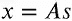

其中 *x* 为观察信号， *s* 为源信号， *A* 为混合矩阵。换句话说，我们的模型假设信号 *x* 是通过源信号的线性组合产生的。在 Python 代码中，我们的示例如下所示:

```
>> import numpy as np>>> # Number of samples 
>>> ns = np.linspace(0, 200, 1000)>>> # Sources with (1) sine wave, (2) saw tooth and (3) random noise
>>> S = np.array([np.sin(ns * 1), 
                  signal.sawtooth(ns * 1.9),
                  np.random.random(len(ns))]).T>>> # Quadratic mixing matrix
>>> A = np.array([[0.5, 1, 0.2],
                  [1, 0.5, 0.4],
                  [0.5, 0.8, 1]])>>> # Mixed signal matrix
>>> X = S.dot(A).T
```

从图 1 的*图中可以看出，代码产生一个正弦波信号、一个锯齿信号和一些随机噪声。这三个信号是我们独立的来源。在下图中，我们还可以看到源信号的三种线性组合。此外，我们看到第一混合信号受锯齿分量支配，第二混合信号受正弦波分量影响更大，最后混合信号受噪声分量支配。*

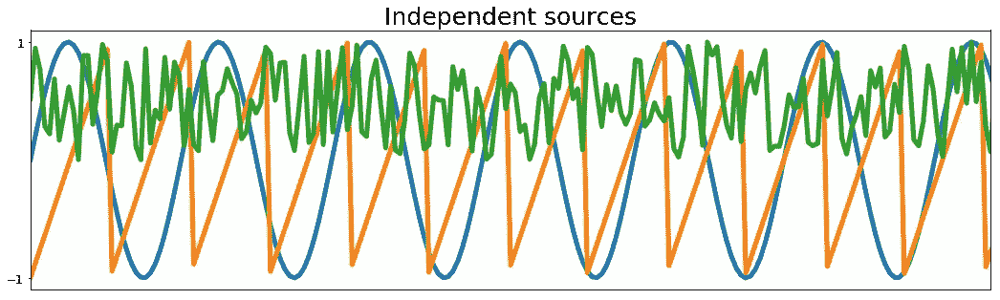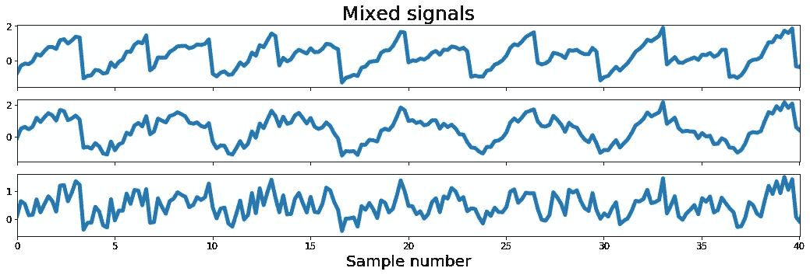

Figure 1: Source signals (upper plots) and linear combinations of the source signals (lower plots).

现在，根据我们的模型，我们可以通过将 *x* 乘以 *A* 的倒数，再次从混合信号中检索源信号:

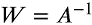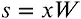

这意味着为了找到源信号，我们需要计算 *W* 。因此，这篇文章剩余部分的任务将是找到 *W* 并从三个混合信号中检索三个独立的源信号。

# ICA 发挥作用的先决条件

现在，在我们继续之前，我们需要多考虑一下源信号需要具备什么样的属性，以便 ICA 能够成功估计出 *W* 。算法工作的第一个先决条件是混合信号是任意数量的源信号的线性组合。**第二个前提条件**是源信号独立。那么独立是什么意思呢？如果信号 *s1* 中的信息没有给出关于信号 *s2* 的任何信息，则两个信号是独立的。这意味着它们不相关，这意味着它们的协方差是 0。然而，这里必须小心，因为不相关并不自动意味着独立。第三个前提条件是独立分量是非高斯的。这是为什么呢？两个独立的非高斯信号的联合密度分布在正方形上将是均匀的；参见下面图 2 中的左上图。用正交矩阵混合这两个信号将导致两个信号不再独立，而是在平行四边形上均匀分布；参见图 2 中*的左下图。这意味着，如果我们处于一个混合信号的最小值或最大值，我们就知道另一个信号的值。因此他们不再独立。对两个高斯信号进行同样的操作将会产生其他结果(参见图 2* 中*的右图)。源信号的联合分布是完全对称的，混合信号的联合分布也是如此。因此，它不包含任何关于混合矩阵的信息，我们想要计算混合矩阵的逆矩阵。因此，在这种情况下，ICA 算法将会失败。*

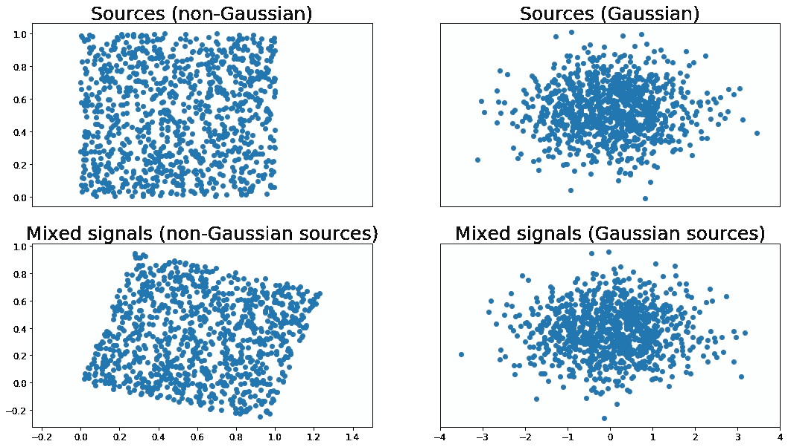

Figure 2: Gaussian and non-Gaussian sources and their mixtures

因此，总之，为了使 ICA 算法工作，需要满足以下先决条件:我们的源是( **2** )独立的( **3** )非高斯信号的( **1** )线性混合。

所以让我们快速检查一下上面的测试信号是否满足这些前提条件。在下面的左图中，我们看到正弦波信号与锯齿波信号的关系，而每个点的颜色代表噪声成分。如非高斯随机变量所预期的，信号分布在正方形上。同样，混合信号在图 3 的右图中形成平行四边形，这表明混合信号不再是独立的。

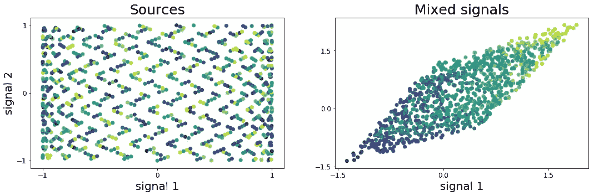

Figure 3: Scatter plots of source and mixed signals

# 预处理步骤

现在，将混合信号直接馈入 ICA 并不是一个好主意。为了获得独立分量的最佳估计，建议对数据进行一些预处理。下面将更详细地解释两种最重要的预处理技术。

## 定中心

我们在这里讨论的第一个预处理步骤是*定心*。这是从我们的输入数据中减去平均值的简单方法。结果，居中的混合信号将具有零均值，这意味着我们的源信号 *s* 也具有零均值。这简化了 ICA 计算，均值可以在以后加回去。Python 中的*居中*功能如下。

```
>>> def center(x):
>>>     return x - np.mean(x, axis=1, keepdims=True)
```

## 白粉

我们需要的第二个预处理步骤是信号 *X* 的*白化*。这里的目标是对 *X* 进行线性变换，从而消除信号之间的潜在相关性，使其方差等于 1。结果，白化信号的协方差矩阵将等于单位矩阵:

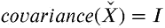

其中 *I* 是单位矩阵。因为我们还需要在白化过程中计算协方差，所以我们将为它编写一个小的 Python 函数。

```
>>> def covariance(x):
>>>     mean = np.mean(x, axis=1, keepdims=True)
>>>     n = np.shape(x)[1] - 1
>>>     m = x - mean
>>> return (m.dot(m.T))/n
```

白化步骤的代码如下所示。它基于 *X* 的协方差矩阵的奇异值分解(SVD)。如果你对这个程序的细节感兴趣，我推荐[这篇文章](https://machinelearningmastery.com/singular-value-decomposition-for-machine-learning/)。

```
>>> def whiten(x):
>>>     # Calculate the covariance matrix
>>>     coVarM = covariance(X) >>>     # Singular value decoposition
>>>     U, S, V = np.linalg.svd(coVarM)

>>>     # Calculate diagonal matrix of eigenvalues
>>>     d = np.diag(1.0 / np.sqrt(S)) 

>>>     # Calculate whitening matrix
>>>     whiteM = np.dot(U, np.dot(d, U.T))

>>>     # Project onto whitening matrix
>>>     Xw = np.dot(whiteM, X) 

>>>     return Xw, whiteM
```

# FastICA 算法的实现

好了，现在我们已经有了预处理函数，我们终于可以开始实现 ICA 算法了。基于测量独立性的对比度函数，有几种实现 ICA 的方法。在这里，我们将在名为 FastICA 的 ICA 版本中使用 *负熵*的*近似值。*

那么它是如何工作的呢？如上所述，ICA 工作的一个先决条件是我们的源信号是非高斯的。关于两个独立的非高斯信号，有趣的是它们的和比任何源信号都更高斯。因此，我们需要优化 *W* ，使得 *Wx* 的结果信号尽可能是非高斯的。为了做到这一点，我们需要一种高斯度量。最简单的测量方法是*峰度*，它是数据的四阶矩，用于测量分布的“尾部”。正态分布的值为 3，像我们在图 2 中使用的均匀分布的峰度为< 3。从下面的代码可以看出，Python 中的实现非常简单，它还计算数据的其他矩。第一个矩是均值，第二个是方差，第三个是偏度，第四个是峰度。这里从四阶矩中减去 3，使得正态分布的峰度为 0。

```
>>> def kurtosis(x):
>>>     n = np.shape(x)[0]
>>>     mean = np.sum((x**1)/n) # Calculate the mean
>>>     var = np.sum((x-mean)**2)/n # Calculate the variance
>>>     skew = np.sum((x-mean)**3)/n # Calculate the skewness
>>>     kurt = np.sum((x-mean)**4)/n # Calculate the kurtosis
>>>     kurt = kurt/(var**2)-3>>> return kurt, skew, var, mean
```

然而，对于 ICA 的实现，我们不会使用峰度作为对比函数，但我们可以在以后使用它来检查我们的结果。相反，我们将使用以下对比函数 *g(u)* 及其一阶导数 *g'(u)* :

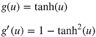

FastICA 算法在[定点迭代方案](https://homepage.math.uiowa.edu/~whan/072.d/S3-4.pdf)中以如下方式使用上述两个函数:

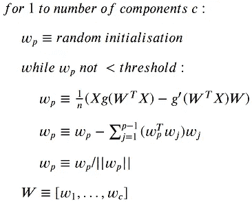

因此，根据上述内容，我们要做的是随机猜测每个组件的重量。随机权重和混合信号的点积被传递到两个函数 *g* 和*g’*。然后我们从 *g* 中减去*g’*的结果，并计算平均值。结果是我们新的权重向量。接下来，我们可以将新的权重向量直接除以其范数，并重复上述操作，直到权重不再变化。这没什么不对的。然而，我们在这里面临的问题是，在第二个组件的迭代中，我们可能会识别出与第一次迭代中相同的组件。为了解决这个问题，我们必须从先前识别的权重中去相关新的权重。这是在更新权重和除以它们的范数之间的步骤中发生的事情。在 Python 中，实现如下所示:

```
>>> def fastIca(signals,  alpha = 1, thresh=1e-8, iterations=5000):
>>>     m, n = signals.shape>>>     # Initialize random weights
>>>     W = np.random.rand(m, m)>>>     for c in range(m):
>>>             w = W[c, :].copy().reshape(m, 1)
>>>             w = w/ np.sqrt((w ** 2).sum())>>>             i = 0
>>>             lim = 100
>>>             while ((lim > thresh) & (i < iterations)):>>>                 # Dot product of weight and signal
>>>                 ws = np.dot(w.T, signals)>>>                 # Pass w*s into contrast function g
>>>                 wg = np.tanh(ws * alpha).T>>>                 # Pass w*s into g'
>>>                 wg_ = (1 - np.square(np.tanh(ws))) * alpha>>>                 # Update weights
                    wNew = (signals * wg.T).mean(axis=1) - 
>>>                         wg_.mean() * w.squeeze()>>>                 # Decorrelate weights              
>>>                 wNew = wNew - 
                           np.dot(np.dot(wNew, W[:c].T), W[:c])
>>>                 wNew = wNew / np.sqrt((wNew ** 2).sum())>>>                 # Calculate limit condition
>>>                 lim = np.abs(np.abs((wNew * w).sum()) - 1)

>>>                 # Update weights
>>>                 w = wNew

>>>                 # Update counter
>>>                 i += 1>>>             W[c, :] = w.T
>>>     return W
```

现在我们已经写好了所有的代码，让我们运行整个程序吧！

```
>>> # Center signals
>>> Xc, meanX = center(X)>>> # Whiten mixed signals
>>> Xw, whiteM = whiten(Xc)>>> # Run the ICA to estimate W
>>> W = fastIca(Xw,  alpha=1)>>> #Un-mix signals using W
>>> unMixed = Xw.T.dot(W.T)>>> # Subtract mean from the unmixed signals
>>> unMixed = (unMixed.T - meanX).T
```

ICA 的结果显示在下面的*图 4* 中，其中上图表示原始源信号，下图表示 ICA 实现检索到的独立分量。结果看起来非常好。我们把三个来源都拿回来了！

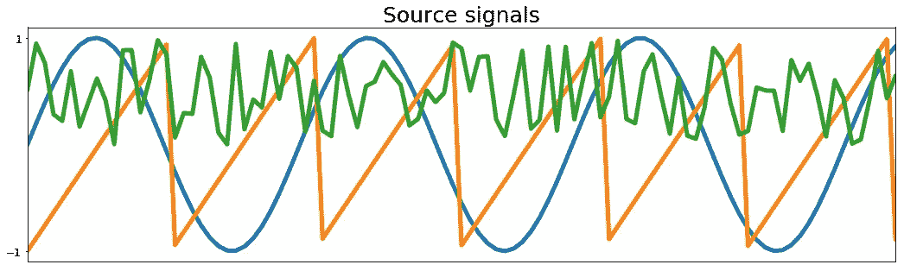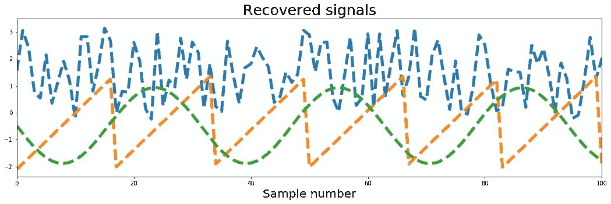

Figure 4: Results of the ICA analysis. Above true sources; below recovered signals.

最后让我们检查最后一件事:信号的峰度。正如我们在*图 5* 中看到的，我们所有的混合信号的峰度都≤ 1，而所有恢复的独立分量的峰度都为 1.5，这意味着它们的高斯性低于它们的源。这是必须的，因为 ICA 试图最大化非高斯性。它也很好地说明了上面提到的事实，即非高斯信号的混合将比源更高斯。

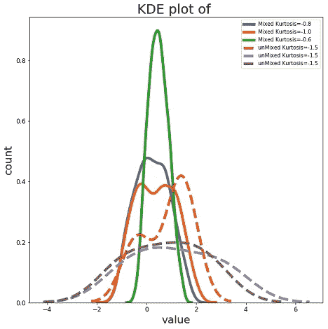

Figure 5: Kernel Density Estimates of the three mixed and source signals.

总结一下:我们看到了 ICA 是如何工作的，以及如何用 Python 从头开始实现它。当然，有许多 Python 实现可以直接使用。然而，了解该方法的基本原理以知道何时以及如何使用它总是明智的。如果你有兴趣深入研究 ICA 并了解其细节，我向你推荐[这篇论文，作者是 Aapo hyvrinen 和 Erkki Oja，2000 年](https://www.cs.helsinki.fi/u/ahyvarin/papers/NN00new.pdf)。

否则你可以在这里查看完整的[代码](https://github.com/akcarsten/Independent_Component_Analysis)，在 [Twitter](https://twitter.com/ak_carsten) 上关注我或者通过 [LinkedIn](https://www.linkedin.com/in/carsten-klein/) 联系我。

这个项目的代码可以在 [Github](https://github.com/akcarsten/Independent_Component_Analysis) 上找到。

[](https://github.com/akcarsten/Independent_Component_Analysis) [## akcarsten/独立 _ 组件 _ 分析

### 快速 ICA 算法的 Python 实现——akcarsten/Independent _ Component _ Analysis

github.com](https://github.com/akcarsten/Independent_Component_Analysis)