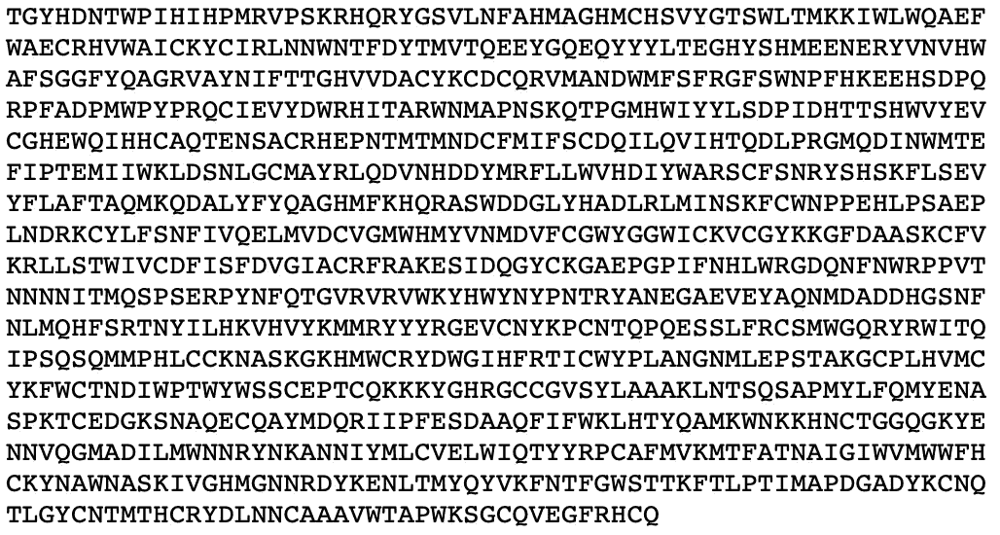
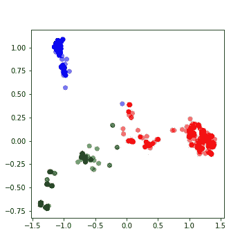

# 用于聚类和分类的序列嵌入

> 原文：<https://towardsdatascience.com/sequence-embedding-for-clustering-and-classification-f816a66373fb?source=collection_archive---------6----------------------->


在这里，我们将学习一种方法来获得字符串序列的矢量嵌入。这些嵌入可用于聚类和分类。

序列建模一直是一个挑战。这是因为序列数据固有的非结构化。就像自然语言处理(NLP)中的文本一样，序列是任意的字符串。对于计算机来说，这些字符串没有任何意义。因此，建立数据挖掘模型非常困难。

对于文本，我们已经提出了嵌入，如 word2vec，它将一个单词转换为一个 n 维向量。本质上，把它放在欧几里得空间。在这篇文章中，我们将学习对序列做同样的事情。

在这里，我们将介绍一种为序列创建嵌入的方法，这种方法将序列带入欧几里得空间。通过这些嵌入，我们可以在序列数据集上执行传统的机器学习和深度学习，例如 kmeans、PCA 和多层感知器。我们提供并处理两个数据集——蛋白质序列和博客。

序列数据集在我们身边随处可见。例如，科技行业的点击流、音乐收听历史和博客。在生物信息学中，我们有大型的蛋白质序列数据库。蛋白质序列由 20 种氨基酸的某种组合组成。典型的蛋白质序列如下所示，其中每个字母对应一种氨基酸。



Fig. 1\. Example of a protein sequence.

一个蛋白质序列不一定包含所有的 20 个氨基酸，而是它的一个子集。为了清楚起见，我们将定义一些在这篇文章中使用的关键词。

> 字母表*:组成一个序列的离散元素。例如氨基酸。*
> 
> alphabet-set *:将在语料库中构成序列的所有字母表的集合。例如，语料库中的所有蛋白质序列都由一组 20 个氨基酸组成。*
> 
> 序列*:离散*字母*的有序序列。语料库中的*序列*包含*字母表*的子集。*

序列语料库通常包含数千到数百万个序列。给定我们已标记或未标记的数据，通常需要聚类和分类。然而，由于序列的非结构化——任意长度的任意字符串，这样做并不简单。

为了克服这一点，可以使用序列嵌入。这里我们将使用 SGT 嵌入，将序列中的长期和短期模式嵌入到一个有限维向量中。SGT 嵌入的优点是，我们可以很容易地调整长期/短期模式的数量，而不会增加计算量。

下面的源代码和数据是[这里是](https://github.com/cran2367/sgt/tree/master/python)。在继续之前，我们需要安装`sgt`包。

```
$ pip install sgt
```

# 使聚集

**蛋白质序列聚类**

这里使用的数据取自[www.uniprot.org](http://www.uniprot.org)。这是一个蛋白质的公共数据库。该数据包含蛋白质序列及其功能。在这一节中，我们将对蛋白质序列进行聚类，在下一节中，我们将使用它们的功能作为构建分类器的标签。

我们首先读取序列数据，并将其转换为一个列表列表。如下所示，每个序列都是一个字母列表。

```
>>> protein_data = pd.DataFrame.from_csv('../data/protein_classification.csv')
>>> X = protein_data['Sequence']
>>> def split(word): 
>>>    return [char for char in word]>>> sequences = [split(x) for x in X]
>>> print(sequences[0])
['M', 'E', 'I', 'E', 'K', 'T', 'N', 'R', 'M', 'N', 'A', 'L', 'F', 'E', 'F', 'Y', 'A', 'A', 'L', 'L', 'T', 'D', 'K', 'Q', 'M', 'N', 'Y', 'I', 'E', 'L', 'Y', 'Y', 'A', 'D', 'D', 'Y', 'S', 'L', 'A', 'E', 'I', 'A', 'E', 'E', 'F', 'G', 'V', 'S', 'R', 'Q', 'A', 'V', 'Y', 'D', 'N', 'I', 'K', 'R', 'T', 'E', 'K', 'I', 'L', 'E', 'D', 'Y', 'E', 'M', 'K', 'L', 'H', 'M', 'Y', 'S', 'D', 'Y', 'I', 'V', 'R', 'S', 'Q', 'I', 'F', 'D', 'Q', 'I', 'L', 'E', 'R', 'Y', 'P', 'K', 'D', 'D', 'F', 'L', 'Q', 'E', 'Q', 'I', 'E', 'I', 'L', 'T', 'S', 'I', 'D', 'N', 'R', 'E']
```

接下来，我们生成序列嵌入。

```
>>> from sgt import Sgt
>>> sgt = Sgt(kappa = 10, lengthsensitive = False)
>>> embedding = sgt.fit_transform(corpus=sequences)
```

嵌入是在 400 维空间。我们先对它做 PCA，降维到两个。这也将有助于集群的可视化。

```
>>> pca = PCA(n_components=2)
>>> pca.fit(embedding)
>>> X = pca.transform(embedding)>>> print(np.sum(pca.explained_variance_ratio_))
0.6019403543806409
```

前两个电脑解释了大约 60%的差异。我们将把它们分成 3 组。

```
>>> kmeans = KMeans(n_clusters=3, max_iter =300)
>>> kmeans.fit(df)>>> labels = kmeans.predict(df)
>>> centroids = kmeans.cluster_centers_>>> fig = plt.figure(figsize=(5, 5))
>>> colmap = {1: 'r', 2: 'g', 3: 'b'}
>>> colors = list(map(lambda x: colmap[x+1], labels))
>>> plt.scatter(df['x1'], df['x2'], color=colors, alpha=0.5, edgecolor=colors)
```



继续构建分类器。

# 分类

**蛋白质序列分类**

我们将从在前面使用的相同蛋白质数据集上构建分类器开始。数据集中的蛋白质有两个功能。因此，我们将构建一个二元分类器。

我们将首先将数据中的`function [CC]`列转换成标签，这些标签可以在`keras`中内置的 MLP 模型中获取。

```
>>> y = protein_data['Function [CC]']
>>> encoder = LabelEncoder()
>>> encoder.fit(y)
>>> encoded_y = encoder.transform(y)
```

在下文中，我们建立了 MLP 分类器，并运行 10 重交叉验证。

```
>>> kfold = 10
>>> X = pd.DataFrame(embedding)
>>> y = encoded_y>>> random_state = 1>>> test_F1 = np.zeros(kfold)
>>> skf = KFold(n_splits = kfold, shuffle = True, random_state = random_state)
>>> k = 0
>>> epochs = 50
>>> batch_size = 128>>> for train_index, test_index in skf.split(X, y):
>>>     X_train, X_test = X.iloc[train_index], X.iloc[test_index]
>>>     y_train, y_test = y[train_index], y[test_index]
>>>     X_train = X_train.as_matrix(columns = None)
>>>     X_test = X_test.as_matrix(columns = None)
>>>     
>>>     model = Sequential()
>>>     model.add(Dense(64, input_shape = (X_train.shape[1],), init = 'uniform')) 
>>>     model.add(Activation('relu'))
>>>     model.add(Dropout(0.5))
>>>     model.add(Dense(32, init='uniform'))
>>>     model.add(Activation('relu'))
>>>     model.add(Dropout(0.5))
>>>     model.add(Dense(1, init='uniform'))
>>>     model.add(Activation('sigmoid'))
>>>     model.compile(loss='binary_crossentropy', optimizer='adam', metrics=['accuracy'])
>>>     
>>>     model.fit(X_train, y_train ,batch_size=batch_size, epochs=epochs, verbose=0)
>>>     
>>>     y_pred = model.predict_proba(X_test).round().astype(int)
>>>     y_train_pred = model.predict_proba(X_train).round().astype(int)>>>     test_F1[k] = sklearn.metrics.f1_score(y_test, y_pred)
>>>     k+=1

>>> print ('Average test f1-score', np.mean(test_F1))
Average test f1-score 1.0
```

这个数据对分类器来说太好了。我们还有另一个更具挑战性的数据集。让我们过一遍。

**网络日志数据分类**

这个数据样本取自这里的。这是一个网络入侵数据，包含审计日志和任何攻击作为正面标签。由于，网络入侵是一个罕见的事件，数据是不平衡的。此外，我们有一个只有 111 条记录的小数据集。这里我们将建立一个序列分类模型来预测网络入侵。

每个序列中包含的数据是一系列的活动，例如，`{login, password, …}`。输入数据序列中的*字母*已经被编码成整数。原始序列数据文件出现在[这里](https://github.com/cran2367/sgt/tree/master/data)。

与之前类似，我们将首先为分类器准备数据。

```
>>> darpa_data = pd.DataFrame.from_csv('../data/darpa_data.csv')
>>> X = darpa_data['seq']
>>> sequences = [x.split('~') for x in X]>>> y = darpa_data['class']
>>> encoder = LabelEncoder()
>>> encoder.fit(y)
>>> y = encoder.transform(y)
```

在该数据中，序列嵌入应该是**长度敏感的**。长度在这里很重要，因为模式相似但长度不同的序列可以有不同的标签。考虑两个会话的简单例子:`{login, pswd, login, pswd,…}`和`{login, pswd,…(repeated several times)…, login, pswd}`。虽然第一个会话可能是普通用户输错了一次密码，但另一个会话可能是猜测密码的攻击。因此，序列长度和模式一样重要。

```
>>> sgt_darpa = Sgt(kappa = 5, lengthsensitive = True)
>>> embedding = sgt_darpa.fit_transform(corpus=sequences)
```

我们在这里发现的`embedding`很稀少。因此，在训练分类器之前，我们将使用 PCA 进行降维。

```
>>> from sklearn.decomposition import PCA
>>> pca = PCA(n_components=35)
>>> pca.fit(embedding)
>>> X = pca.transform(embedding)
>>> print(np.sum(pca.explained_variance_ratio_))
0.9862350164327149
```

所选的前 35 个主成分分析解释了 98%以上的差异。我们现在将继续使用`keras`构建一个多层感知器。

由于数据量很小，阳性标记点的数量也很少，我们将进行三重验证。

```
>>> kfold = 3
>>> random_state = 11>>> test_F1 = np.zeros(kfold)
>>> time_k = np.zeros(kfold)
>>> skf = StratifiedKFold(n_splits=kfold, shuffle=True, random_state=random_state)
>>> k = 0
>>> epochs = 300
>>> batch_size = 15>>> class_weight = {0 : 0.12, 1: 0.88,}  # The weights can be changed and made inversely proportional to the class size to improve the accuracy.>>> for train_index, test_index in skf.split(X, y):
>>>     X_train, X_test = X[train_index], X[test_index]
>>>     y_train, y_test = y[train_index], y[test_index]
>>>     
>>>     model = Sequential()
>>>     model.add(Dense(128, input_shape=(X_train.shape[1],), init='uniform')) 
>>>     model.add(Activation('relu'))
>>>     model.add(Dropout(0.5))
>>>     model.add(Dense(1, init='uniform'))
>>>     model.add(Activation('sigmoid'))
>>>     model.summary()
>>>     model.compile(loss='binary_crossentropy', optimizer='adam', metrics=['accuracy'])
>>>    
>>>     start_time = time.time()
>>>     model.fit(X_train, y_train ,batch_size=batch_size, epochs=epochs, verbose=1, class_weight=class_weight)
>>>     end_time = time.time()
>>>     time_k[k] = end_time-start_time>>>     y_pred = model.predict_proba(X_test).round().astype(int)
>>>     y_train_pred = model.predict_proba(X_train).round().astype(int)
>>>     test_F1[k] = sklearn.metrics.f1_score(y_test, y_pred)
>>>     k += 1
>>> print ('Average Test f1-score', np.mean(test_F1))
Average Test f1-score 0.5236467236467236>>> print ('Average Run time', np.mean(time_k))
Average Run time 9.076935768127441
```

这是一个很难分类的数据。为了有一个宽松的基准，让我们在相同的数据上建立一个更好的 LSTM 分类器。

```
>>> X = darpa_data['seq']
>>> encoded_X = np.ndarray(shape=(len(X),), dtype=list)
>>> for i in range(0,len(X)):
>>>     encoded_X[i]=X.iloc[i].split("~")
>>> max_seq_length = np.max(darpa_data['seqlen'])
>>> encoded_X = sequence.pad_sequences(encoded_X, maxlen=max_seq_length)>>> kfold = 3
>>> random_state = 11>>> test_F1 = np.zeros(kfold)
>>> time_k = np.zeros(kfold)>>> epochs = 50
>>> batch_size = 15
>>> skf = StratifiedKFold(n_splits=kfold, shuffle=True, random_state=random_state)
>>> k = 0>>> for train_index, test_index in skf.split(encoded_X, y):
>>>     X_train, X_test = encoded_X[train_index], encoded_X[test_index]
>>>     y_train, y_test = y[train_index], y[test_index]
>>> 
>>>     embedding_vecor_length = 32
>>>     top_words=50
>>>     model = Sequential()
>>>     model.add(Embedding(top_words, embedding_vecor_length, input_length=max_seq_length))
>>>     model.add(LSTM(32))
>>>     model.add(Dense(1, init='uniform'))
>>>     model.add(Activation('sigmoid'))
>>>     model.compile(loss='binary_crossentropy', optimizer='adam', metrics=['accuracy'])>>>     start_time = time.time()
>>>     model.fit(X_train, y_train, epochs=epochs, batch_size=batch_size, verbose=1)
>>>     end_time=time.time()
>>>     time_k[k]=end_time-start_time>>>     y_pred = model.predict_proba(X_test).round().astype(int)
>>>     y_train_pred=model.predict_proba(X_train).round().astype(int)
>>>     test_F1[k]=sklearn.metrics.f1_score(y_test, y_pred)
>>>     k+=1>>> print ('Average Test f1-score', np.mean(test_F1))
Average Test f1-score 0.0>>> print ('Average Run time', np.mean(time_k))
Average Run time 425.68603706359863
```

我们发现 LSTM 分类器给出的 F1 值为 0。这可以通过改变模型来改善。然而，我们发现 SGT 嵌入可以在不需要复杂分类器的情况下对少量且不平衡的数据起作用。此外，在运行时，SGT 嵌入式网络明显更快。平均耗时 9.1 秒，而 LSTM 模型耗时 425.6 秒。

# 结束语

*   我们学习了使用序列嵌入进行序列聚类和分类。
*   这个嵌入是这个[论文](https://arxiv.org/abs/1608.03533)的一个实现。这篇文章中没有涉及到，但是可以参考这篇文章来看看 SGT 嵌入相对于其他嵌入的准确性比较。
*   由于 SGT 嵌入捕捉长期和短期模式的能力，它比大多数其他序列建模方法工作得更好。
*   建议您使用调谐参数`kappa`，查看其对精确度的影响。

*学分:*

*   [萨曼内·易卜拉希米博士](https://www.linkedin.com/in/samaneh-ebrahimi/)，他是 [SGT 论文](https://arxiv.org/abs/1608.03533)的合著者，对上述代码做出了重大贡献。
*   [Yassine Khelifi](https://github.com/datashinobi) ，为 SGT 编写第一个 Python 版本的数据科学专家。