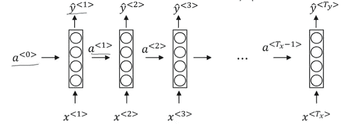
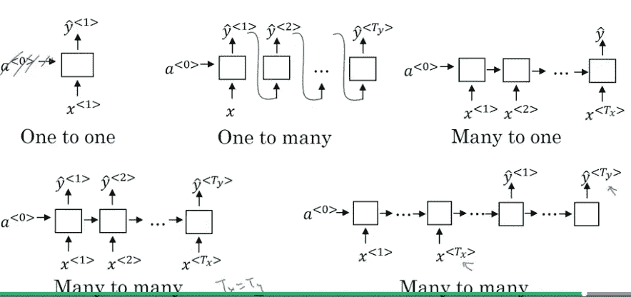
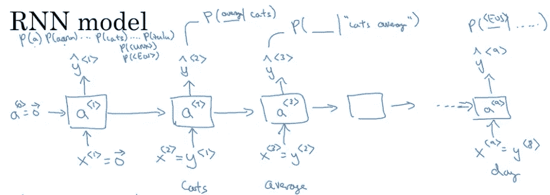
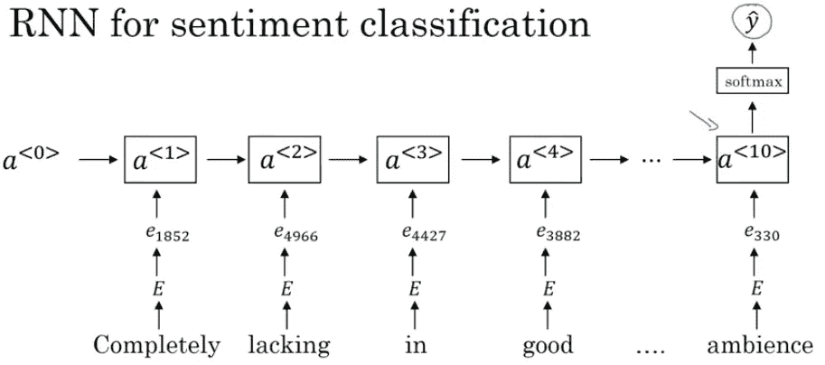
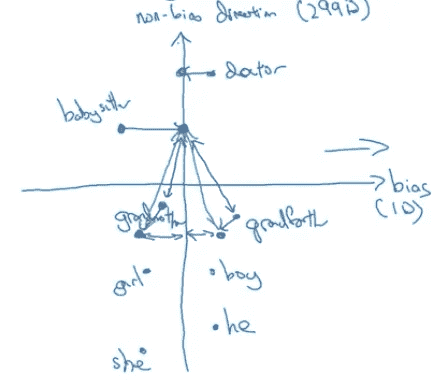

# 吴恩达的序列模型——11 个经验教训

> 原文：<https://towardsdatascience.com/sequence-models-by-andrew-ng-11-lessons-learned-c62fb1d3485b?source=collection_archive---------8----------------------->

我最近在 Coursera 上完成了吴恩达深度学习专业化的第五门也是最后一门课程: ***序列模型*** 。Ng 很好地描述了创建你自己的递归神经网络所涉及的各种建模复杂性。这门课程中我最喜欢的部分是编程练习。特别是，最后的编程练习让您实现一个触发词检测系统。这些系统可以用来预测一个人何时说“Alexa”，或者预测金融触发事件的时间。

在监督学习中，序列模型可以用于解决各种应用，包括金融时间序列预测、语音识别、音乐生成、情感分类、机器翻译和视频活动识别。唯一的约束是输入或输出是一个序列。换句话说，您可以使用序列模型来解决任何类型的监督学习问题，该问题在输入层或输出层包含时间序列。

在这篇文章中，我将讨论我在课程中学到的 11 个关键经验。我还写了一些文章，详细介绍了我从专业领域的前 4 门课程中学到的其他重要经验。对于我的计算机视觉文章，点击[这里](/computer-vision-by-andrew-ng-11-lessons-learned-7d05c18a6999)。其他深度学习课程，点击[这里](/deep-learning-specialization-by-andrew-ng-21-lessons-learned-15ffaaef627c)。

**第 1 课:为什么不是标准网络？**

传统的前馈神经网络不在网络的不同位置共享特征。换句话说，这些模型假设所有的输入(和输出)都是相互独立的。该模型在序列预测中不起作用，因为先前的输入在预测下一个输出中固有地重要。例如，如果您要预测文本流中的下一个单词，您可能希望至少知道目标单词之前的几个单词。

传统的神经网络要求输入和输出序列长度在所有预测中保持不变。正如第 2 课所讨论的，序列模型网络可以直接解决这个问题。

第二课:RNN 建筑有哪些类型？

如引言中所讨论的，序列模型可以处理各种序列预测应用。在本课程中，讲师将讨论各种网络类型，包括一对一、一对多、多对一和多对多网络。

在音乐生成中，输入可以是空集，输出可以是歌曲(一对多)。在高频金融波动性预测中，输入可能是过去 3 分钟的报价和交易流，输出将是波动性预测(多对一)。最有趣的是，多对多架构可以处理输入和输出序列长度不相同的应用，使用上图右下角所示的编码器/解码器设置。在文献中，多对多模型通常被称为序列对序列模型。

第 3 课:语言模型和序列生成是如何工作的？

语言模型通过估计下一个单词出现的概率来做出预测。在你训练了一个语言模型之后，你所估计的条件分布可能被用来对新的序列进行采样。

在家庭作业练习中，你将根据莎士比亚文本训练一个语言模型，并生成新颖的莎士比亚句子。虽然本课程只讨论基于语言的序列生成，但在其他领域还有各种其他应用。例如，在金融领域，您可以使用这种类型的模型来生成样本股票路径。您可以针对单个名称以不同的 3 分钟时间间隔训练网络，然后使用网络生成样本路径。

**第四课:用 RNNs 消失渐变**

rnn 可能具有以指数速度快速消失的梯度，使得网络难以学习长期相关性。分解渐变问题不大，因为你可以很容易地应用一个简单的渐变裁剪算法。消失的渐变也很难发现，这使得在将系统部署到生产环境中时更加危险。

**第五课:捕捉长期依赖**

门控递归单元(gru)可用于通过添加两个门(更新和重置门)来解决消失梯度问题，这两个门跟踪与预测最相关的信息。更新门用于确定有多少过去的信息需要传递到下一个时间步。重置门用于确定有多少信息是不相关的，应该被遗忘。LSTM 细胞也可用于解决长期依赖。

第六课:GRU vs LSTM 细胞

LSTM 细胞有一个额外的门，因此更复杂，需要更长的时间来训练。理论上，LSTM 细胞应该能够记住更长的序列，代价是增加训练时间；然而，没有明确的经验证据表明任何一个网络在所有情况下都优于另一个。讲师建议从 gru 开始，因为它们比 LSTM 单元更简单，可扩展性更强。

**第 7 课:使用单词嵌入进行迁移学习**

单词嵌入可以被认为是给定单词的向量表示。可以使用 Word2Vec、负采样或 Glove 算法来训练它们。单词嵌入模型可以在非常大的文本语料库(比如 100 个单词)上被训练，然后可以在具有较少数量的训练示例(比如 10，000 个单词)的序列预测任务上被使用。例如，情感分类可以使用单词嵌入来大大减少生成准确模型所需的训练示例的数量。在下图中，E 代表单词嵌入矩阵。

**第 8 课:设计一个没有不良偏差的算法**

预测任务正被用于做出越来越重要的决策。那么，我们如何设计一个不受性别、种族和社会经济偏见影响的算法呢？一些研究人员同意，这个问题在计算机程序中比在人类中更容易解决。使用一种类似于主成分分析的方法，我们可以识别偏差和非偏差子空间。那么对于每一个非定义性的单词，我们可以将这个单词投影为零偏差。最后，我们可以均衡成对的单词来中和剩余的偏差。例如，我们希望祖母和保姆之间以及祖父和保姆之间的距离相等。

**第九课:使用搜索算法的机器翻译**

给定一个英语句子，搜索算法可以用来生成最可能的法语句子。波束搜索是一种常用于此任务的算法。该算法的贪婪性由波束宽度参数定义。如果你想不那么贪婪，你可以将波束宽度设置为一个更大的正整数。在诊断错误时，可以确定错误是由于波束搜索算法不准确还是您训练的 RNN 模型。

**第十课:序列对序列模型中的注意力模型**

不严格地说，注意力模型是基于人类的视觉注意力机制。该算法试图根据目前看到的输入序列来学习应该注意什么。注意力模型在诸如神经机器翻译的任务中非常有用。有一个家庭作业，让你自己实现这个模型。

**第 11 课:序列对序列模型的语音识别**

序列到序列模型允许从业者对语音识别应用采取更简单的端到端方法。从前，语音识别系统是用音素构建的。然而，随着大数据的兴起，我们可以使用端到端的深度学习，并完全去除人工音素和特征工程步骤。

触发词检测系统是本课程中描述的语音识别的最终应用。你会在自己的作业练习中实现这样的算法。我亲自训练了一个网络来开关我的灯。触发检测算法在其他领域也有各种应用，例如金融经济学；也许你可以训练一个算法来检测股票时间序列中的事件/峰值。

**结论**

总的来说，序列模型的大量应用使本课程非常值得你花时间。家庭作业也让你练习自己实现实际的系统。我上面解释的课程仅仅代表了本课程中材料的一个子集。通过学习这门课程，你将仅仅触及序列模型的表面，但它可能足以启动一个人工智能的机会或职业生涯。我写这篇文章没有得到 deeplearning.ai 的背书。

如果你对序列模型有任何有趣的应用想分享，请在下面的评论中告诉我。我很乐意讨论新项目的潜在合作。

这就是所有人——如果你已经做到了这一步，请在下面评论并在 [LinkedIn](https://www.linkedin.com/in/ryanshrott/) 上加我。

我的 Github 是这里的。

**其他深度学习课程博客**

[吴恩达的计算机视觉——11 个经验教训](/computer-vision-by-andrew-ng-11-lessons-learned-7d05c18a6999)

[吴恩达深度学习专业化— 21 条经验教训](/deep-learning-specialization-by-andrew-ng-21-lessons-learned-15ffaaef627c)

**其他有趣的文章**

[使用 HMM 的手语识别](https://machinelearnings.co/sign-language-recognition-with-hmms-504b86a2acde)

[组合优化的概率方法](https://becominghuman.ai/probabilistic-approaches-to-combinatorial-optimization-2aa0397a795f)