# Python 中的序列匹配器

> 原文：<https://towardsdatascience.com/sequencematcher-in-python-6b1e6f3915fc?source=collection_archive---------2----------------------->

## 一个人性化的 ***最长连续&无垃圾*** 序列比较器

SequenceMatcher 是 python 模块中可用的类，名为**“diff lib”。**可用于比较成对的输入序列。本文的目的是通过一个示例来解释 SequenceMatcher 算法。由于可用的文档有限，我想通过一步一步的例子来分享这个概念，这可以帮助读者以清晰的方式理解整个过程。

> 引用[原始文件](https://github.com/python/cpython/blob/master/Lib/difflib.py):
> 
> 基本思想是找到不包含 ***【垃圾】*** 元素的***最长连续匹配子序列******【LCS】**。这不会产生最小的编辑序列，但是会产生与人的 ***【向右看】*** 匹配的序列。*

*等一下。上一段描述了这么多专业术语。我们按顺序解码吧。我希望任何阅读这篇文章的人都知道算法 [**LCS**](https://www.geeksforgeeks.org/longest-common-subsequence-dp-4/) 。基本上，LCS 的目标是:给定两个序列，找出两个序列中最长的子序列的长度。在这里，我们也试图在一对序列之间找到类似于 LCS 的东西，但它们在数学上不是 100%优雅的。换句话说，结果应该让用户更满意，这就是为什么它被称为对人们来说“看起来合适”的匹配。为了避免任何早期的混淆，让我们观察一个我在 [*堆栈溢出*](https://stackoverflow.com/questions/35517353/how-does-pythons-sequencematcher-work) 上找到的例子来理解这两者之间的区别。*

***输入字符串:** `my stackoverflow mysteries` **和** `mystery`*

*对任何人来说，自然的搭配是`"myster"`如下:*

> *`*my stackoverflow* ***myster****ies
> .................****myster****y..*`*

*事实上，这就是 SequenceMatcher 算法在处理上述字符串时返回的输出。*

*然而，LCS 将输出`"mystery"`*

> *`***my******st****ackov****er****flow m****y****steries* ***my****.****st****.....****er****......****y****.......*`*

*因为对于人类专家来说，较长的公共子序列可能比较短的公共子序列显得不那么自然。因此，我们认为 SequenceMatcher 试图找出对人类更友好的输出。*

*继续向前，接下来是 ***【垃圾】*** 元素的概念。*【垃圾】*是你不希望算法匹配的东西:比如普通文本文件中的空行，或者可能是 HTML 文件中的“< P >”行等。*

> *SequenceMatcher 对象初始化为:*
> 
> *__init__(isjunk=None，a= ' '，b= ' ')*

****isjunk*** 参数为您提供了定义您希望算法视为垃圾的任何元素的选项。*

*>如果*是垃圾*没有定义:*

*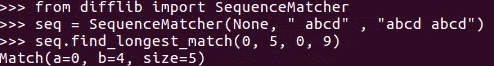*

*>如果*是垃圾*被定义为认为空白是垃圾:*

*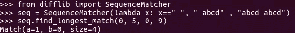*

*将空白视为垃圾，可以防止“abcd”与第二个序列末尾的“abcd”直接匹配。相反，只有“abcd”可以匹配，并且匹配第二个序列中最左边的“abcd”。*

## *序列匹配器流程图*

*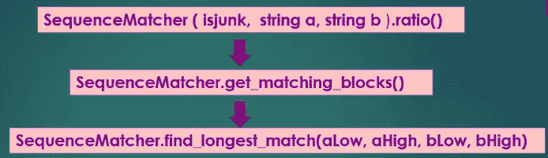*

*给定两个输入字符串 a 和 b，*

*   ***ratio( )** 返回输入字符串之间的相似性得分(float in [0，1])。它对函数 *get_matching_blocks* 返回的所有匹配序列的大小求和，并计算比率为:***ratio = 2.0 * M/T**，其中 M =匹配，T =两个序列中的元素总数**
*   ****get_matching_blocks( )** 返回描述匹配子序列的三元组列表。最后一个三元组是哑元，(len(a)，len(b)，0)。它通过重复应用 find_longest_match()来工作**
*   ****find_longest_match( )** 返回包含 a[aLow:aHigh]和 b[bLow:bHigh]中最长匹配块的三元组**

****

## **再解释一下**

**在深入这个例子之前，让我们多了解一下上面两个重要的函数，这肯定会帮助我们完美地理解这些概念。我试图以一种简单的方式只解释重要的部分。关于完整的 python 代码，建议读者访问 [*官方网站*](https://github.com/python/cpython/blob/master/Lib/difflib.py)**

> ****get_matching_blocks()解释****

**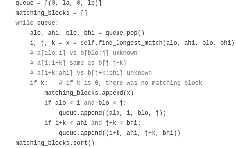**

**Code Snippet of function get_matching_blocks( )**

**基本上，维护一个队列，该队列用包含两个输入字符串的上限和下限的索引的四元组来初始化。直到队列中有一个四元组可用，它被弹出并传递给 *find_longest_match( )* 函数，该函数返回描述匹配子序列的三元组。三元组被添加到 matching_blocks 列表中。**

**每个三元组的形式为(I，j，n)，表示 a[i:i+n] == b[j:j+n]**

**匹配子序列左边和右边的序列片段被进一步添加到队列中。重复该过程，直到队列为空。**

**然后对 matching_blocks 列表进行排序，并作为输出返回。**

> ****find_longest_match()解释****

****

**Code Snippet of find_longest_match( )**

**这将包含字符串的上限和下限索引的三元组作为输入，并返回包含最长匹配块的三元组。**

**首先，定义一个字典**b2j****其中对于字符串 b 中的 x，b2j[x]是 x 出现的索引(到 b 中)的列表。****

****现在在外循环中逐字符扫描第一个字符串，我们使用 b2j 检查该字符在字符串 b 中的出现。如果有匹配，我们更新另一个字典 newj2len，它有助于记录到目前为止匹配的字符串的长度。并且相应地，变量 *besti、bestj* 和 *bestsize* 被更新，这考虑了迄今为止获得的最长匹配块数据。****

****在所有最大匹配块中，该算法返回在 a 中最早开始的块，在所有最大匹配块中，它返回在 b 中最早开始的块。****

****我想这些理论已经足够了，现在让我们深入一个例子，它将帮助我们详细地理解整个工作。****

## ****一个有插图的例子****

****让我们通过使用一对输入字符串实现算法来描述算法的一步一步的过程。****

****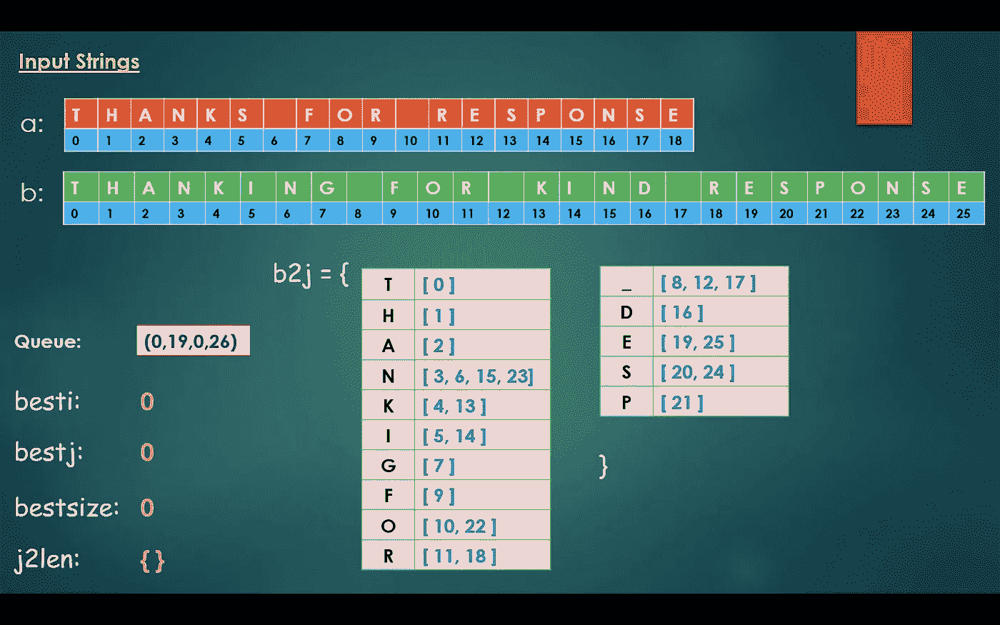********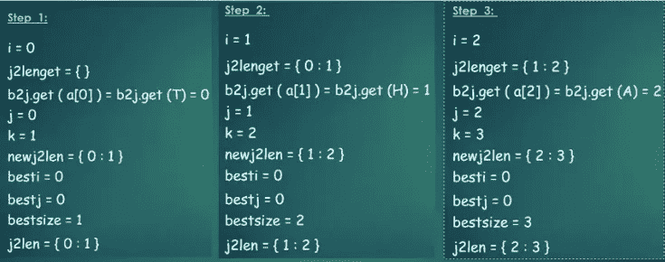********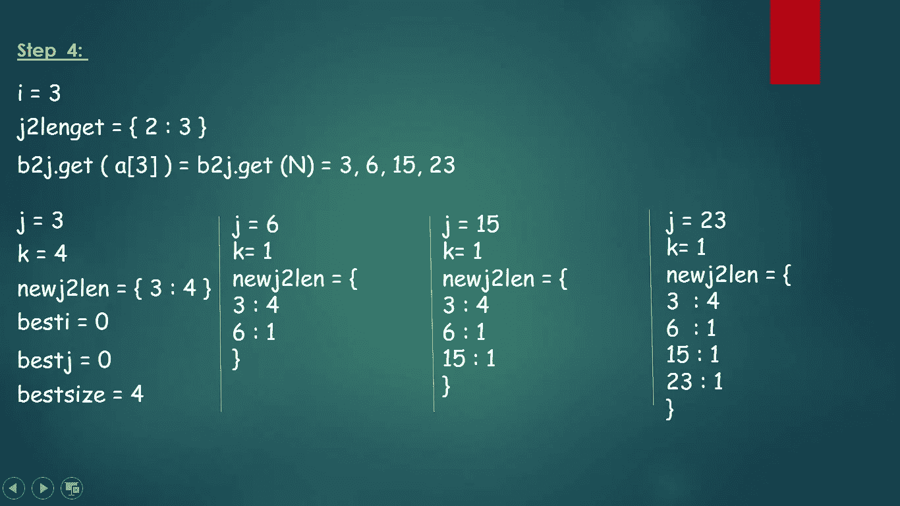********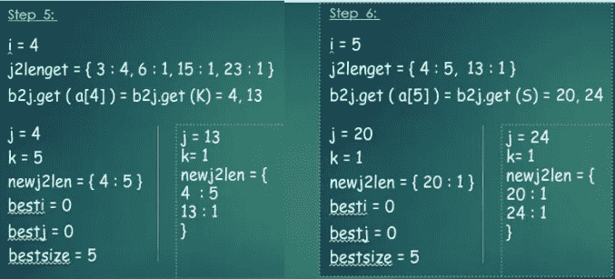********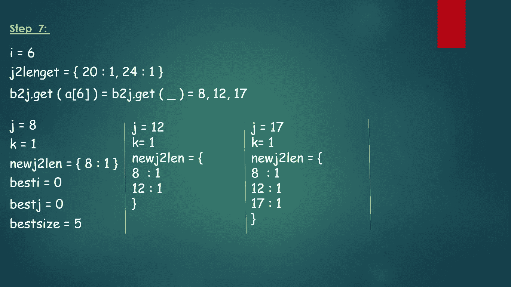********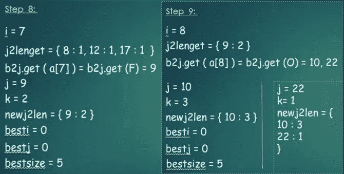********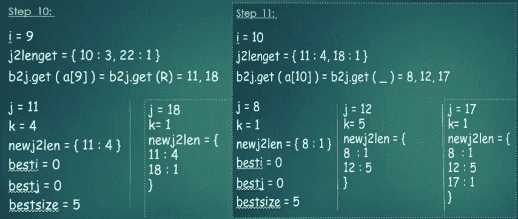********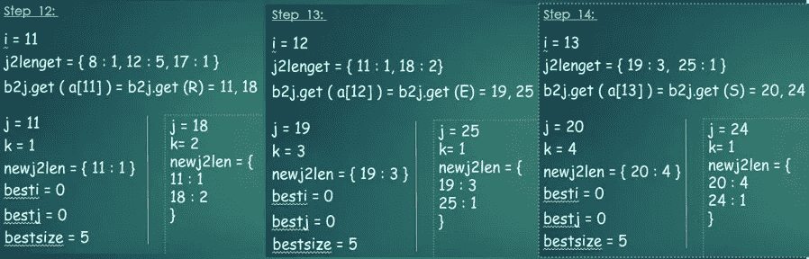********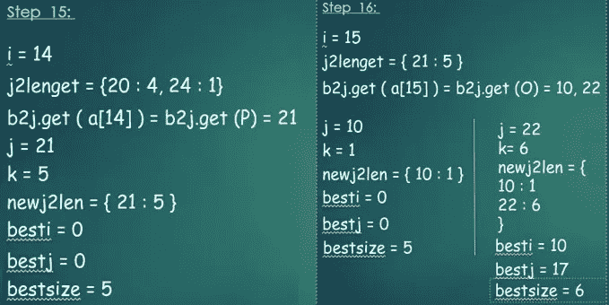********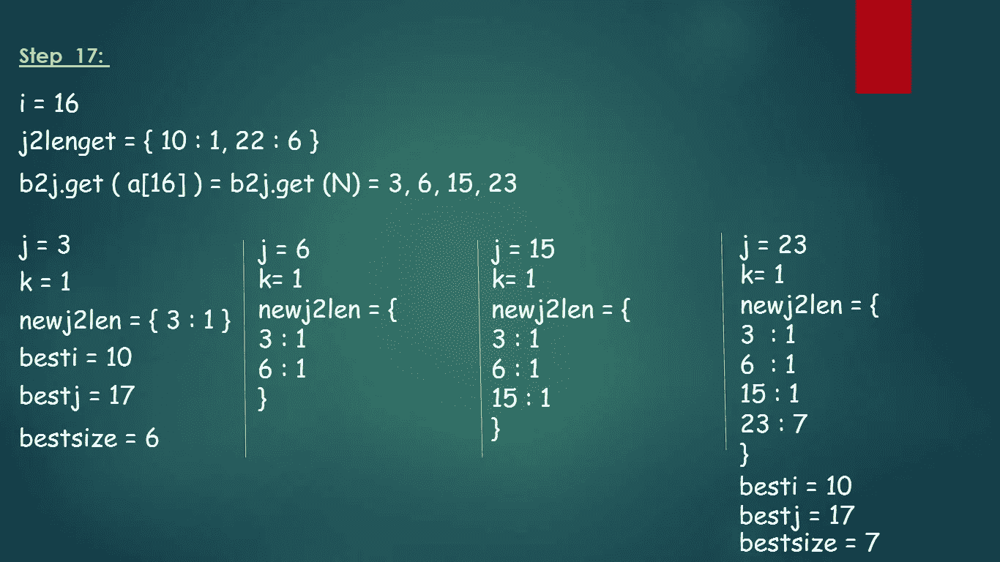********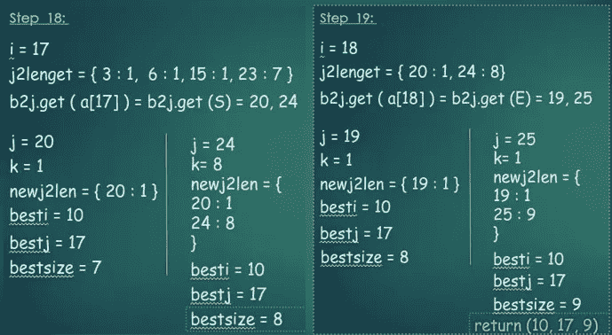********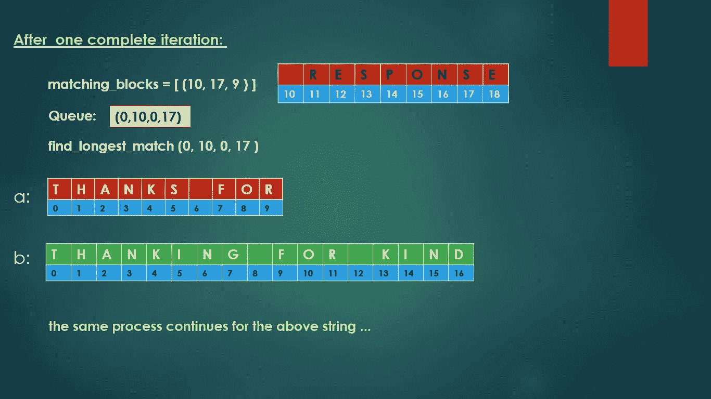********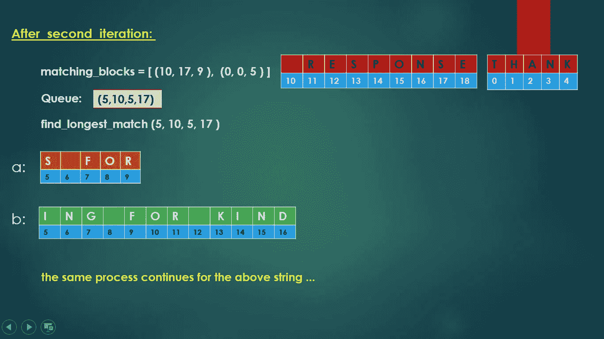********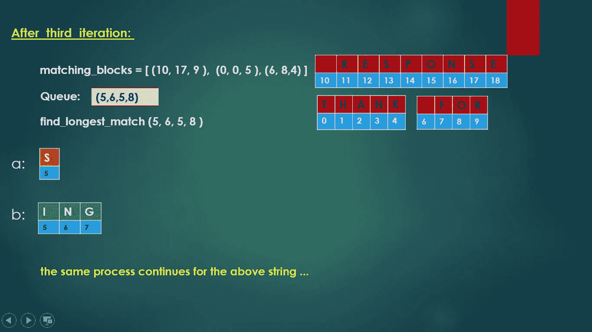********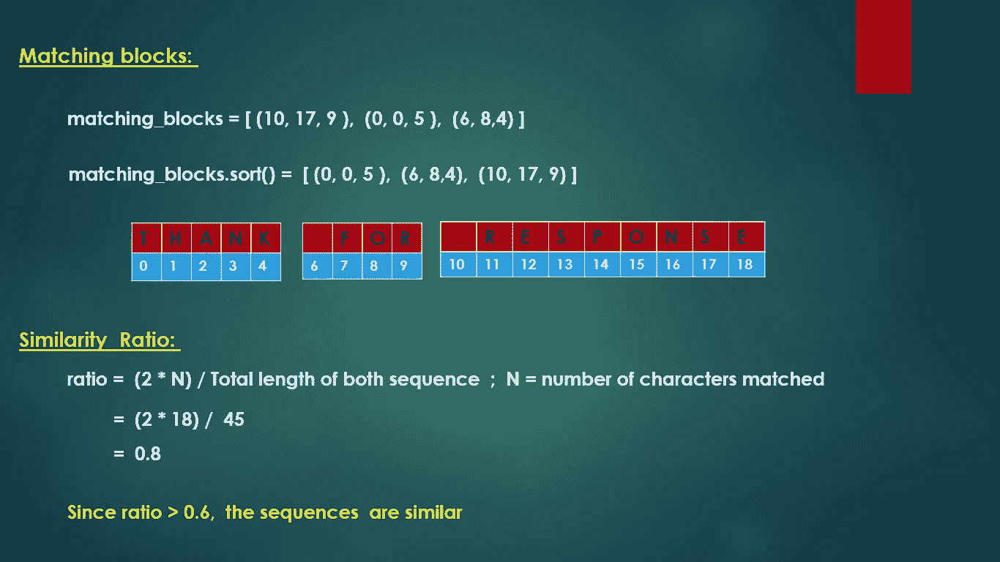****

****根据经验，ratio()值超过 0.6 意味着序列非常匹配。这里，通过计算，我们已经获得了 0.8 的相似性得分比率，因此输入的序列对被视为相似的。****

****为了交叉验证我们的计算结果，让我们用 python 运行 SequenceMatcher。****

****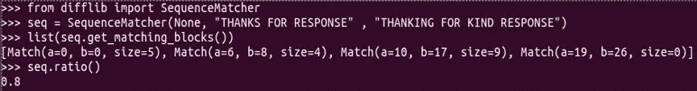****

****万岁！！！我们已经达到了预期的产量。****

****我希望浏览上面的例子能够帮助读者了解序列相似性算法的工作原理。除了相似性，SequenceMatcher 类中还有许多其他功能。建议读者访问 [*官方代号*](https://github.com/python/cpython/blob/master/Lib/difflib.py) 。****

****到那时，干杯！！****

# ******参考文献:******

****[https://github . com/python/cpython/blob/master/Lib/difflib . py](https://github.com/python/cpython/blob/master/Lib/difflib.py)****