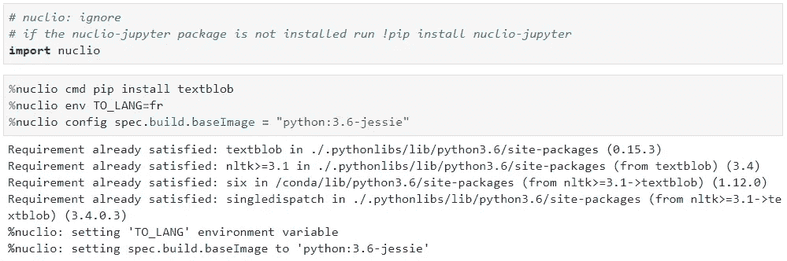
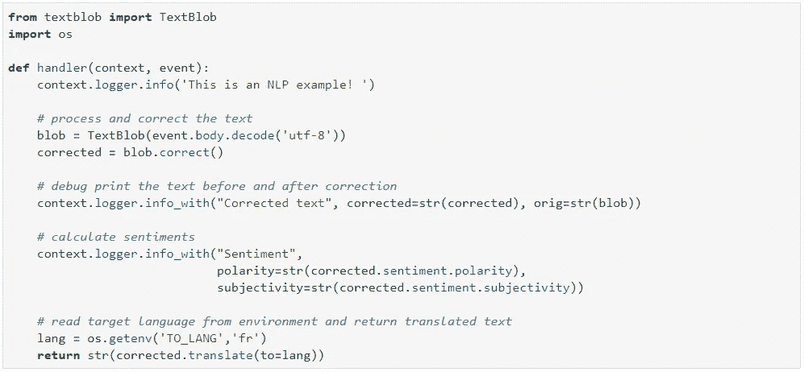
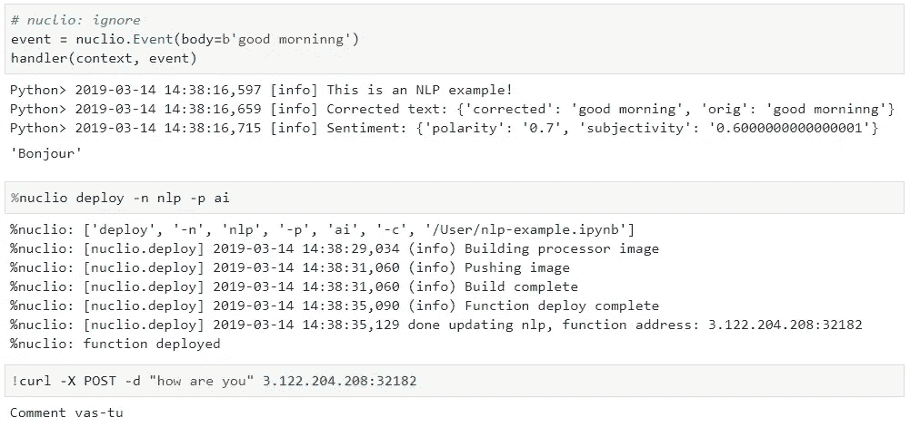

# 无服务器:它能简化数据科学项目吗？

> 原文：<https://towardsdatascience.com/serverless-can-it-simplify-data-science-projects-8821369bf3bd?source=collection_archive---------15----------------------->


你认为数据科学家在开发和测试模型上花了多少时间？根据谷歌的 Josh Cogan 的这篇文章，只有 10%。他们的大部分时间都花在数据收集、构建基础设施、开发运维以及集成上。当您最终构建一个模型时，将它交付到产品中的过程有多长、多复杂(假设您已经完成了这一步)？当您最终将模型整合到一些有用的商业应用程序中时，您如何再现或解释其结果？你监控它的准确性吗？而持续的应用和模型升级呢？

简化数据科学开发和加快生产时间的一种方法是采用无服务器架构进行数据收集、探索、模型培训和服务。

这篇文章将解释无服务器及其局限性，并提供一个使用无服务器解决数据科学挑战的实际例子。

# 无服务器概述

“无服务器”一词是几年前由亚马逊创造的，用来描述其[λ功能](https://aws.amazon.com/lambda/)，一种开发者编写一些代码和规范并点击“部署”的服务 Lambda 自动构建容器化的应用程序，将其部署在生产集群上，并提供自动监控、日志记录、扩展和滚动升级。无服务器的其他好处是更低成本的按使用付费模式及其与平台资源和事件的本机集成。

总体而言，无服务器解决了三个主要的数据科学挑战:

1.它减少了开发、部署和监控代码的开销和复杂性。无服务器带来了更快的生产时间，并允许数据科学家和开发人员专注于业务逻辑，而不是工具和基础设施相关的任务。

2.它提供了一个定义明确、版本化的运行时，其中包含了代码、软件包依赖、ML 模型、环境变量、数据源和运行时配置。这可以保证一致和可再现的结果。

3.Serverelss 允许将功能移动、扩展和复制到多个实施点。我们在 Iguazio 看到的一个很好的例子是在云中开发和测试功能，然后在边缘网关或多个区域运行它们，或者只是扩展它们以满足不断增长的流量。

无服务器已经在应用程序和前端开发人员中引起了广泛关注和广泛采用。我们看到它在一些数据科学口袋中被投机性地使用，但它尚未在数据科学家中得到广泛采用。

无服务器可以解决上面概述的许多数据科学挑战，所以我很惊讶“无服务器”的发明者亚马逊没有在亚马逊自己的数据科学平台 SageMaker 中使用 Lambda。你想过为什么吗？

原因很简单！第一波无服务器功能，如 Amazon Lambda，不太适合数据科学，因为:

1.  它们是无状态的，数据科学通常是关于大量数据(状态)的。
2.  它们速度慢且是单线程的，而数据处理需要并行性。
3.  它们限制了函数图像的大小，ML 模型往往很大(大于 Lambda 的最大图像大小限制)。
4.  它们不支持 GPU，而 GPU 在 AI/ML 应用中可能相当高效。
5.  数据科学工具/框架和无服务器之间没有本机集成。

但是上述所有限制都与云供应商特定的无服务器实现相关，而不是一般的无服务器实现。其他实施确实在满足数据科学需求的同时提供了无服务器优势。

# Nuclio，一个针对数据科学优化的无服务器框架

[Nuclio](https://nuclio.io/) 从一开始就被设计为一个开源项目，旨在解决数据科学应用并消除开发和运营的复杂性。Nuclio 提供了极致的性能，支持有状态和数据密集型工作负载，支持并最大限度地提高 GPU 的效率，并且没有任何阻碍它的“包袱”(参见: [Nuclio 与 Lambda 比较](https://medium.com/theburningmonk-com/comparing-nuclio-and-aws-lambda-66b76d2b631d)了解详细信息)。

Nuclio 运行在广泛采用的 [Kubernetes](https://kubernetes.io/) 编排层上，并与各种数据科学和分析框架相集成。

Nuclio 使用高性能并发执行引擎(每个进程支持多达 400，000 个事件)。它是目前唯一一个具有 GPU 支持和快速文件访问的无服务器框架，可以加速机器学习代码的性能，并最大限度地利用 CPU 和 GPU(使用资源池模型)，以便代码在 Nuclio 上运行更快。

Nuclio 最酷的特性之一是它与 Jupyter 的集成，Jupyter 是最广泛使用的数据科学工作台。这使得开发人员可以自动将数据科学代码和笔记本转变为可扩展的实时功能，这些功能提供数据集成、版本控制、日志记录、监控、安全性和开箱即用的可扩展性，而无需任何额外的编码。

Nuclio 广泛用于各种数据科学任务:

1.  数据收集器、ETL、流处理
2.  数据准备和分析
3.  超参数模型训练
4.  实时模型服务
5.  特征向量组合(实时数据准备)

以下示例演示了如何从笔记本开发、测试和部署功能。源代码、更详细的文档和各种示例可在 [Nuclio-Jupyter git](https://github.com/nuclio/nuclio-jupyter) 中找到。

# 示例:实现自然语言处理功能

完整笔记本见[本 Github 链接](https://github.com/nuclio/nuclio-jupyter/blob/master/docs/nlp-example.ipynb)。

第一步是在 Docker 或 Kubernetes 上部署 Nuclio。[参见说明](https://github.com/nuclio/nuclio)或者直接使用托管版本。

现在，使用以下命令在您的笔记本中安装 python 和 Jupyter SDK:

```
!pip install nuclio-jupyter
```

当使用 [Nuclio-Jupyter](https://github.com/nuclio/nuclio-jupyter) 时，我们在笔记本中编写和测试我们的代码，就像任何其他数据科学代码一样。我们添加了一些“神奇的”命令来描述额外的配置，例如要安装哪些包、代码将如何被触发(http、cron、stream)、环境变量、我们想要捆绑的额外文件(例如 ML 模型、库)、版本控制等。

我们使用 deploy 命令或 API 将笔记本自动转换为代码，然后以容器化的功能进行部署。我们希望从函数中排除的代码单元格标有“# nuclio: ignore”注释。

接下来的部分演示了 Nuclio 库的导入(在一个“被忽略”的单元中)，接着是要安装的包的规范、环境变量的设置和构建配置(例如，指示基本 Docker 映像)。



下一部分将实现我们的代码，该代码接受来自触发器的一些文本(例如 HTTP POST 请求)，并使用“TextBlob”库来更正、分析情感，并用翻译成另一种语言的文本进行响应(语言由环境变量指定)。



一旦我们实现了我们的代码，我们就使用模拟的上下文和事件对象在笔记本中测试它。请注意，我们的代码使用了日志，这些日志也会在调试时显示。

下一步是将该功能部署到我们的集群上，并服务于真实的用户请求——使用单个“deploy”命令。一旦部署过程完成，它还将为函数提供一个 URL 分配，然后我们可以用它来测试我们的新函数。



该示例演示了如何在熟悉的数据科学环境中创建代码。我们使用一些神奇的装饰来指定我们的生产需求(包依赖关系、环境和配置),并将其部署到生产集群中，而没有考虑底层基础设施。

这是一个简单的例子。更高级的功能示例可以在下面的存储库中找到[，包括 Twitter 和股票数据收集和分析、图像识别和预测基础设施监控的实现。](https://github.com/v3io/tutorials/tree/master/demos)

Nuclio 并不局限于 Python 代码。它支持 8 种编码语言，允许我们为工作选择正确和最熟悉的工具。[参见这个例子](https://github.com/nuclio/nuclio-jupyter/blob/master/docs/nuclio_bash.ipynb)，了解如何通过几个简单的步骤，在不了解 Docker 的情况下，将一个 bash 脚本变成一个交互式的无服务器函数。

# 摘要

无服务器让我们专注于数据科学逻辑！它使我们的代码生产准备就绪。函数使用结构化日志记录。它们针对安全性进行了强化，并提供自动横向扩展和纵向扩展，以最大限度地提高性能和资源效率。假设功能是容器化的工件，我们可以在一个地方开发和测试它们，然后将它们部署到一个或多个其他位置(例如，在边缘设备或区域集群上)。在另一篇文章中会有更多的介绍。

尝试一下，如果你遇到任何问题，可以去纽克利奥的[社区休闲频道](https://lit-oasis-83353.herokuapp.com/)。