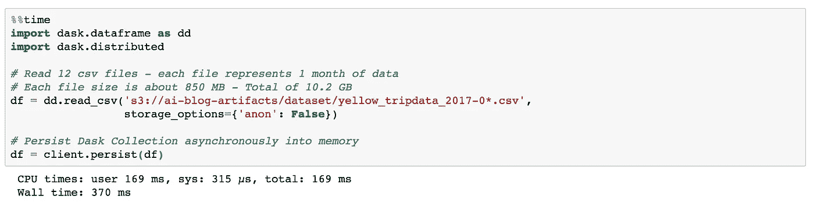
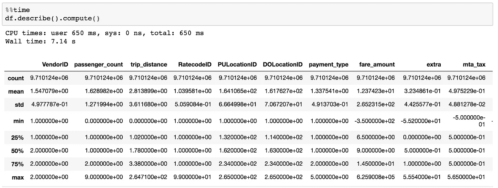
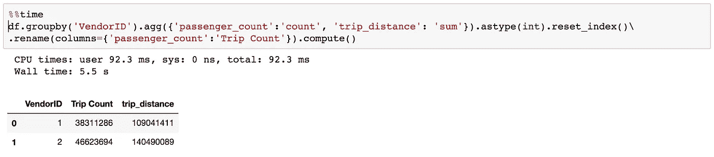
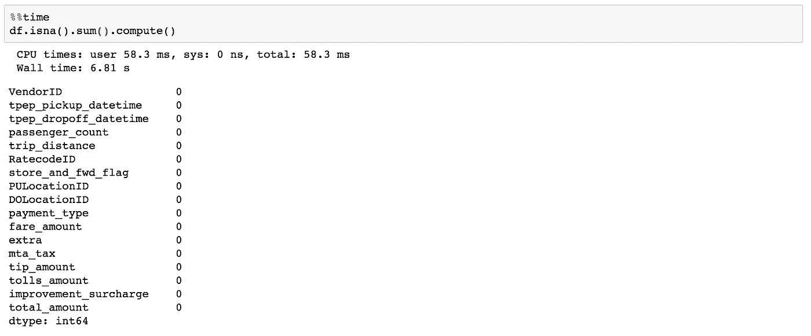
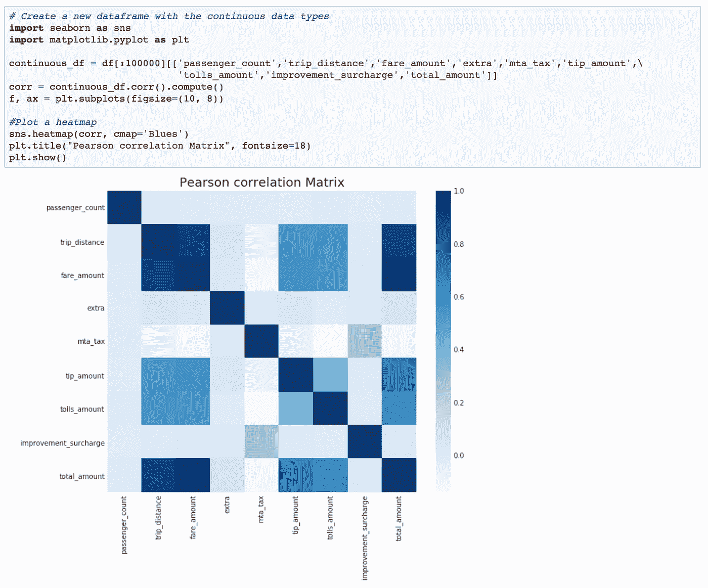
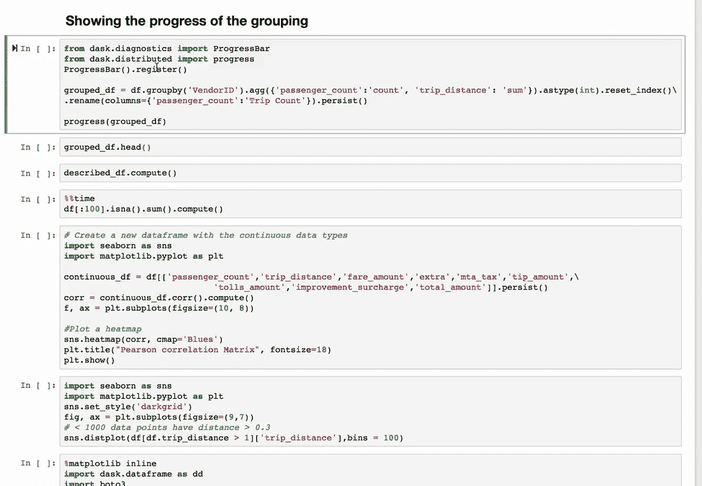
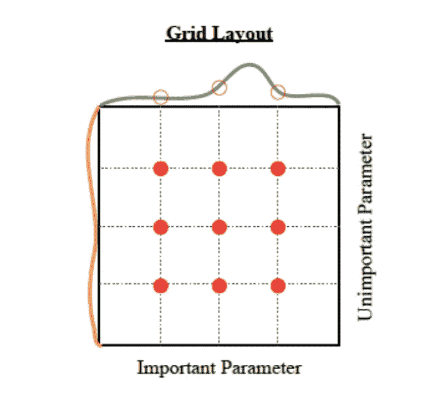
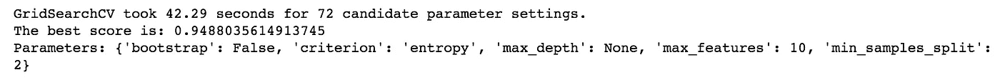

# 使用 Dask、Amazon ECS 和 Python 的分布式数据预处理(下)

> 原文：<https://towardsdatascience.com/serverless-distributed-data-pre-processing-using-dask-amazon-ecs-and-python-part-2-af14a1ac1b25?source=collection_archive---------18----------------------->


Source: [pixabay.com](https://pixabay.com/en/organ-pipes-church-music-cathedral-1550156/)

## 使用 Dask 进行 EDA 和超参数优化(HPO)

在本系列的第 1 部分中，我解释了如何在 [AWS Fargate](https://aws.amazon.com/fargate/) 上构建 Dask 调度器和工作器的无服务器集群。上下调整工人数量相当简单。您可以通过运行以下 AWS CLI 命令来实现这一点:

```
bash~# aws ecs update-service — service Dask-Workers — desired-count 10 — cluster Fargate-Dask-Cluster > /dev/nullbash~# aws ecs update-service — service Dask-Scheduler — desired-count 1 — cluster Fargate-Dask-Cluster > /dev/null
```

既然我已经扩展了无服务器 Fargate 集群，让我们尝试一些探索性数据分析(EDA)。我使用的是著名的 [NY Yellow Taxi 2017 数据集。](http://www.nyc.gov/html/tlc/html/about/trip_record_data.shtml)

首先，让我们将数据帧装入集群内存。为此，只需从 dask 库中导入 dataframe 类，然后使用 *read_csv()* 函数加载文件:



***client . persist()***函数的工作原理是将数据异步保存到内存中，然后立即返回。它将任务图提交给集群，并返回一个 *Future* 对象。然后，我们可以在输出数据帧上运行快速查询。让我们进行一些分析:

## 1.1 数据框架分析

让我们在数据框架上得到一些描述性的统计数据。代码看起来应该完全一样，只是对于 Dask dataframes，您需要添加一个 ***compute()*** 函数，以便在笔记本上立即获得结果。如您所见，在数据帧上进行一些复杂的计算需要大约 7 秒钟，例如:(计算分位数、平均值、计数、最小值、最大值和标准偏差)。



## 1.2 计算总行程距离，并为每个供应商计算:



完成这条 ***groupby()*** 语句大概花了 5.5 秒。如您所见，供应商 2 的行程比供应商 1 多得多，行驶的距离也长得多。

## 1.3 计算每个特征的缺失值:

数据集中没有缺失值。



## 1.4 显示特征之间的相关性:

有一些明显的相关性，如票价金额和行程距离、小费金额和票价金额之间的高度正相关。我需要移除高度相关的要素(total_amount)以避免类似于[多重共线性](https://en.wikipedia.org/wiki/Multicollinearity)问题**的问题。**



让我们再试一次 **1.2** 但是这一次，我将把数据保存在内存中，并让它在后台工作，同时我做一些其他的任务。我还将打印出进度条，以查看任务何时完成。



Persist function progress bar

请注意，当使用集群工作线程在后台加载/计算数据时，提示符会立即返回。

当进度条完成后(全部为绿色)，可以快速查询数据的输出。请注意，当使用集群工作线程在后台加载/计算数据时，提示符会立即返回。

# 使用 Dask 进行机器学习:

机器学习中计算量最大的任务之一是超参数优化(HPO)。HPO 是一种用于调整在训练过程中没有学习到的 ML 参数*的技术，例如学习速率、优化器、正则化或神经网络中的隐藏层数。它的工作原理是为您要调优的每个超参数探索预定义范围的搜索空间。有许多库和技术可以实现 HPO 过程，但是在本文中，我将重点关注使用网格搜索技术和 Python 中的 Scikit-Learn 库来调优超参数。*

## HPO 使用网格搜索:

网格搜索技术是一种[穷举搜索](https://en.wikipedia.org/wiki/Brute-force_search)，通过手动指定学习算法的超参数空间的子集。然后，该算法将遍历每个超参数的组合，旨在(最大化/最小化)客观度量(准确性/损失)。它最终会给出最好的结果，但是优化的超参数越多，优化过程就越复杂。



2-dimensional Grid Search for HPO

## HPO 在 Dask 集群上使用网格搜索:

由于 HPO 过程计算量大，我们将在 Dask 集群上运行它，以便利用其规模和弹性。Scikit-learn 使用一个名为 [**joblib**](https://github.com/joblib/joblib) 的非常强大的库来跨多个 CPU 内核并行化进程。

**Joblib** 也为其他并行系统提供接口，成为执行引擎。我们可以通过使用`parallel_backend`上下文管理器在集群中运行数千个内核来实现这一点:

首先，我们需要从 **sklearn externals** 导入 **joblib** ，然后注册 Dask Distributed 作为 joblib 的并行后端引擎。

```
from sklearn.externals.joblib import _dask, parallel_backend
from sklearn.utils import register_parallel_backend
from sklearn.externals.joblib import parallel_backendregister_parallel_backend('distributed',_dask.DaskDistributedBackend)
```

然后，我们需要运行下面一行来开始使用集群作为执行引擎:

```
with parallel_backend('distributed', scheduler_host='dask-Scheduler.local-dask:8786'):
     <Normal sklearn Code>
```

然后你的 sklearn 代码逻辑保持完全一样，没有变化。

以下是使用 HPO 网格搜索为随机森林分类器查找最佳超参数的完整代码，该分类器将对 MNIST 数据集中的手写数字进行分类:

```
from sklearn import datasets
from sklearn.model_selection import train_test_split
from sklearn.model_selection import GridSearchCV
from sklearn.ensemble import RandomForestClassifierimport numpy as np
from time import timefrom sklearn.externals.joblib import _dask, parallel_backend
from sklearn.utils import register_parallel_backend
register_parallel_backend('distributed', _dask.DaskDistributedBackend)# Loading the Digits dataset
digits = datasets.load_digits()# To apply an classifier on this data, we need to flatten the image, to
# turn the data in a (samples, feature) matrix:
n_samples = len(digits.images)
X = digits.images.reshape((n_samples, -1))
y = digits.target# Split the dataset in two equal parts
X_train, X_test, y_train, y_test = train_test_split(X, y, test_size=0.3, random_state=0)clf = RandomForestClassifier(n_estimators=20)# use a full grid over all parameters
param_grid = {"max_depth": [3,4,5,6, None],
              "max_features": [1, 3, 10, None],
              "min_samples_split": [2, 3, 10],
              "bootstrap": [True, False],
              "criterion": ["gini", "entropy"]}# run grid search
grid_search = GridSearchCV(clf, param_grid=param_grid, cv=8, iid=True)start = time()
with parallel_backend('distributed', scheduler_host='dask-Scheduler.local-dask:8786'):
    grid_search.fit(X, y)
    clf.fit(X, y)print("GridSearchCV took %.2f seconds for %d candidate parameter settings."
      % (time() - start, len(grid_search.cv_results_['params'])))results = grid_search.cv_results_

# Return the index of the best validation score
idx = np.flatnonzero(results['rank_test_score'] == 1 )
print("The best score is: " + str(results['mean_test_score'][idx[0]]))

#print the parameters for the best job      
print("Parameters: {0}".format(results['params'][idx[0]]))
```



The output of the above code

在一个 10 节点集群上，找到分类器的最佳超参数组合需要大约 40 秒，而在一台机器上(即使有多个内核/多个 CPU)，如果没有并行化特性，将需要许多分钟。

# 总结:

根据我使用 Dask 的经验，它是一个很好的以分布式方式预处理大型数据集的库。如果你是熊猫和 Numpy 的粉丝，并且很难将你的数据存储到内存中，那么 Dask 绝对是一个不错的选择。对于时间和成本敏感的机器学习任务，如 HPO、数据插补、数据预处理和探索性分析，这绝对是一个很好的解决方案。