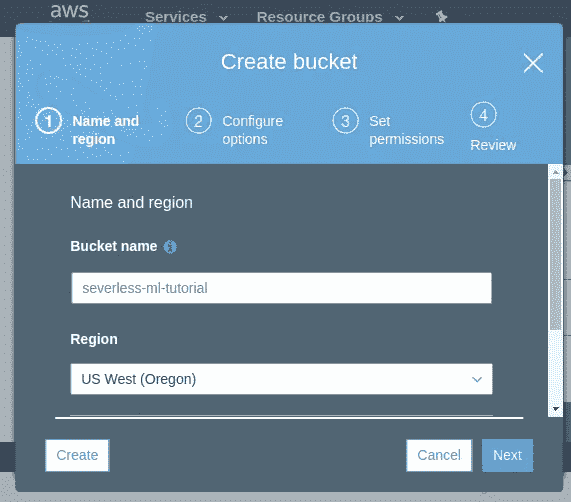
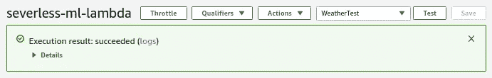
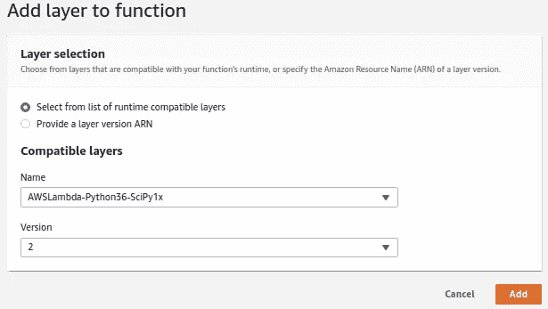

# 无服务器 ML

> 原文：<https://towardsdatascience.com/serverless-ml-3184c9c45f93?source=collection_archive---------18----------------------->

## AWS Lambdas 让您的模型栩栩如生。


*©Philip Massie 2019*

# 介绍

日复一日地处理争论不休的数据集，设计有趣的功能，测试和训练大量的模型，会让你感觉有点脱离现实世界的系统。嗯，至少对我来说是这样。最近，我花时间和软件工程师在一起，他们帮助我理解了如何通过利用无服务器架构，以很低的成本或零成本在云中部署 ML 模型。因此，模型或模型集合可以通过简单的 API 调用适应更大的系统。

使用 AWS Lambdas，我们不需要保持昂贵的 EC2 实例全天候运行。兰姆达斯按照要求旋转得非常快。(Google Cloud 也有类似的云功能，但这里我将重点介绍 AWS 产品。)当然，在后台，它们都运行在 EC2 服务器上，但是 Lambdas 是如此抽象，以至于你不需要担心 EC2。有很多很好的理由认为去无服务器，但我不想运行广告。[你可以在这里阅读更多内容](https://docs.aws.amazon.com/lambda/latest/dg/welcome.html)

Lambda 本质上是一个小型的快速容器，预先配置了许多不同的运行时之一。其中包括:

作为一名数据科学家，这些天我主要从事 Python 的工作，在本教程中，我将带您在 AWS Lambda 中部署一个简单的 ML 模型。这里有一个附带的 github repo [这里](https://github.com/philmassie/serverless_ml.git)包括你需要的所有代码以及模型、数据和训练数据。

***型号***

这不是在训练一个伟大的模特。作为一个用例，我使用开普敦的历史天气数据来训练一个模型，根据开普敦的历史来预测明天下雨的可能性。你可以在世界上任何一个城市喂它，它会根据开普敦的历史预测那里明天是否会下雨。没关系，这不是重点。

***点穴***

如果您不熟悉 Lambdas，或者对在 EC2 实例上存放 Docker 容器的成本不抱幻想，希望这将让您了解考虑更大更复杂的模型和代码系统是多么便宜和容易。幸运的话，你的创造力会被激发。

***要求***

这看起来有点乏味，但是值得一试。大部分你只需要做一次。我将在这里忽略一些东西，比如 AWS 执行角色和密钥管理。此外，本教程将使用 AWS web 控制台和 CLI。如果您不熟悉 CLI，希望这将是一个简单的介绍。

***Python 3.6***

我们将使用 Python 3.6 Lambda 运行时环境，因为这个运行时环境附带了一个包含 scipy/numpy 的预配置层。因为这些包具有默认情况下 Lambda 环境中不存在的操作系统依赖性，所以这一层对于我们使用任何低级数学函数(如 SKLearn 中的函数)都是至关重要的。我看到 Python 3.7 运行时现在也有了 scipy/numpy 层！

***码头工人***

为了构建层，我们需要在与 Lambda 的远程环境相匹配的环境中本地安装 Python 包。
解决方案:Docker ( [如何安装](https://www.google.com/search?q=install+docker))

如果你在使用 Ubuntu，这应该能让你开始:

```
sudo apt-get remove docker docker-engine docker.io
sudo apt install docker.iosudo 
systemctl start dockersudo 
systemctl enable docker
```

***Github 回购***

本教程有一个 [github repo](https://github.com/philmassie/serverless_ml.git) 可用。目录结构很重要，我假设您从项目根目录运行命令。

```
- project root/
  ├-layers/
  | ├-02_dependencies/
  | | └-requirements.txt
  | |-03_rain_model/
  | | ├-models/
  | | | └-rf_rain.pkl 
  | | └-keys.csv.template 
  | ├-zips/
  | └-model_training/
  ├-readme.md
  └-rain_forecast.py
```

你需要一个免费账户来查询天气数据。在[https://darksky.net/dev](https://darksky.net/dev)报名。注册和登录后，您的主页应该显示您的密钥。将此存储在`layers/03_rain_model/keys.csv`中。

**location IQ**

在 https://locationiq.com 的位置 IQ [注册一个免费的地理编码账户。创建一个**访问令牌**并将其存储在`layers/03_rain_model/keys.csv`中。](https://locationiq.com/)

# AWS 设置

## ***账号***

如果您还没有，请设置您的免费 AWS 帐户。

## ***安装 AWS CLI***

AWS CLI 提供对 AWS 的命令行访问。您需要安装它，通常使用 pip，并将其配置为使用您的 AWS 帐户。

TLDR Ubuntu 版本[检查其他系统的这些说明和故障排除](https://docs.aws.amazon.com/cli/latest/userguide/install-cliv1.html):

```
# install 
pip3 install awscli --upgrade --user 
# check (might need to log in to ubuntu again)
aws --version
```

***配置***

我们需要使用控制台来配置 AWS CLI。

登录到 AWS 控制台:

*   右上角，单击您的姓名>我的安全凭证下的下拉菜单
*   选择“访问密钥(访问密钥 ID 和秘密访问密钥)”
*   "单击创建新的访问密钥"
*   下载带有您的密钥和秘密密钥的 csv 文件，并保存在安全的地方

回到你的终端([详细说明](https://docs.aws.amazon.com/cli/latest/userguide/cli-chap-configure.html#cli-quick-configuration)):

```
aws configure 
> AWS Access Key ID [None]: ABABABABAEXAMPLE 
> AWS Secret Access Key [None]:CDCDCDCDCDCDCDCDCDCDCEXAMPLEKEY 
> Default region name [None]: us-west-2 
> Default output format [None]: json
```

## ***为项目*** 创建一个 S3 时段

回到 web 控制台的 S3 部分，为此项目创建一个空存储桶。在所有存储桶中，存储桶名称必须是唯一的，因此请记住这个名称。当然，您也可以使用 CLI 来完成这项工作。

我会把我在美国西俄勒冈的名字叫做`severless-ml-tutorial`(以匹配我们的配置)。您需要调整下面的代码来匹配这个名称。

> 我认为这是唯一一个可能会产生成本的地方。S3 存储不是免费的，尽管在这个规模上它是非常便宜的。构建图层后，删除此桶以节省潜在成本。我有几个里面有几兆字节的桶，我还没有发生费用。有点混乱。



还在吗？干得好！好，让我们建立第一个简单的 Lambda。我们稍后将对此进行详述。

## 创建一个λ

*   在 AWS 控制台中，单击“服务”>“Lambda”。
*   单击“创建函数”创建一个新的 Lambda 函数。
*   称之为`severless-ml-lambda`，选择 Python 3.6 运行时。将权限选项设置为默认值。
*   点击底部的“创建函数”。

您的 Lambda 将被创建，其属性屏幕将打开。

***添加 API 网关触发器***

现在我们将配置一个 http 网关，在这里我们可以与新的 Lambda 进行交互。

*   选择“API 网关”
*   API 下拉菜单>“创建新 API”
*   从“选择模板”中选择“Rest API”
*   安全性下拉菜单>打开
*   附加设置—默认
*   点击“添加”

***添加一个测试事件***

现在我们添加一个示例查询，这样我们就可以测试 Lambda 将如何响应 API 调用。我们将向 Lambda 发送一个城市的名称，因此让我们设置一个测试事件来完成这项工作。

*   在屏幕顶部的“选择测试事件”下拉列表中，选择配置测试事件
*   输入名称，例如“天气测试”
*   输入以下 json，模拟提交“城市”字符串“洛杉矶”的 https 事件。

```
{
    "httpMethod": "GET", 
    "queryStringParameters": { 
        "city": "Los Angeles" 
    } 
}
```

***添加一些代码***

现在我们终于可以添加一些代码了。这非常简单，它将传入的字符串赋给一个变量，打印出来并返回一个包含该字符串的格式化的 HTML 字符串。

设计师面板

*   突出显示您的 Lambda 名称

向下滚动到功能代码面板

*   将以下代码粘贴到代码块中(我们稍后将需要所有这些库):

*   再次靠近页面顶部，单击 Save，然后单击 Test。
*   幸运的话，你的 Lambda 刚刚执行了你用 WeatherTest json 发送的有效载荷。
*   结果应该显示在页面顶部附近的绿色面板中。
*   您也可以在那里看到 Python 打印函数的结果。



*   在设计器面板中，单击 API 网关块，向下滚动到 API 网关面板 url，然后单击 API 端点旁边的 url。
*   将`?city=Hong Kong`添加到 url 的末尾。点击 enter，您应该看到页面内容更新，以反映这个新的 querystring。

现在您已经有了一个简单的 Lambda，可以通过 URL 访问，您可以向它发送一个有效负载，它可以处理并返回有效负载，在这种情况下作为 HTTP 响应。

# 扩展 Lambda

## 层

在我们添加更多代码来做更有趣的事情之前，让我们让 Lambda 架构更强大一点。我们可以通过添加层来做到这一点。层只是你包含在 Lambda 容器中的额外资源——有大小限制要处理，所以不要太疯狂。

在这一节之后，我们可以回到代码并扩展 Lambda。如果你有 [github repo](https://github.com/philmassie/serverless_ml.git) ，你会看到我有构建嵌套在层目录中的每个层所需的文件。

通常，我们需要整理每一层的内容，将它们上传到 S3，将内容编译成 Lambda 层，然后将这些层附加到我们的 Lambda 上。

## 01 科学/数字层

这一层由 AWS 预编译，不仅包括 python 库，还包括我们需要使用的系统库。这对于你自己来说是一个非常困难的层次，但是感谢 AWS 为我们做了大量的工作。我们不需要建立这一层。



## 02 依赖层

这一层将包括默认安装的所有必需的 Python 库。我们将在本地机器上使用一个类似 Lambda 环境的 docker 容器(即 lambci)来整理这一层的内容。在 lambci 容器中，我们可以使用 pip 将库安装到容器外的本地目录中。然后，我们使用这个目录来构建我们的新层。

在终端中，从项目根目录:

```
docker run --rm -it -v ${ PWD }/layers/02_dependencies:/var/task lambci/lambda:build-python3.6 bash 
# From the docker container, install the python packages 
pip install -r requirements.txt --target python/lib/python3.6/site-packages/ --no-deps --ignore-installed exit
```

如果工作正常，你应该会在你的“02_dependencies”图层目录中看到一个“python”目录。

***压缩图层内容***

我们需要压缩图层内容，为上传到 S3 做准备。

```
# clear any old versions first 
rm layers/zips/02_dependencies.zip 
pushd 
layers/02_dependencies zip -r ../zips/02_dependencies.zip python popd
```

***上传图层到 S3***

使用 AWS CLI 而不是 web 控制台，将您的 zip 目录的内容与 S3 的一个位置同步。保持 web 控制台打开是一个好主意，这样可以看到您正在做的事情是否达到了预期的效果。

```
aws s3 sync layers/zips s3://severless-ml-tutorial/lambdas/layers --delete
```

现在我们可以使用上传的 zip 文件来更新或创建一个 Lambda 层，它可以在任何 Python 3.6 Lambda 中使用。记得在 S3Bucket=旁边更改您的存储桶的名称。

```
aws lambda publish-layer-version --layer-name weather_02_dependencies --description "dependencies layer" --content S3Bucket =severless-ml-tutorial,S3Key=lambdas/layers/02_dependencies.zip --compatible-runtimes python3.6
```

## 03 雨水模型层

该层的文件已经存在于`layers/03_rain_model/`目录中，所以这里不需要 Docker hijinks。你需要把你的 api 密匙放到名为`keys.csv.template`的文件中，并把它重命名为`keys.csv`。

> 不管这个层的名称和主要目的是什么，除了模型对象之外，我还将包括 API 键。注意，这不是管理云中密钥的正确/安全方式。
> 
> ***重要的钥匙不要这样！***

***压缩图层内容***

我们需要压缩图层内容，为上传到 S3 做准备。

```
# clear any old versions first 
rm layers/zips/03_rain_model.zip 
pushd layers/03_rain_model/ 
zip -r ../zips/03_rain_model.zip . 
popd
```

***上传图层到 S3***

像以前一样，上传图层内容到 S3…

```
aws s3 sync layers/zips s3://severless-ml-tutorial/lambdas/layers --delete
```

***构建/更新图层 03_rain_model***

…并构建图层。请记住在此处更改您的存储桶名称。

```
aws lambda publish-layer-version --layer-name weather_03_model --description "model layer" --content S3Bucket=severless-ml-tutorial,S3Key=lambdas/layers/03_rain_model.zip --compatible-runtimes python3.6
```

## 检查图层是否已成功创建

使用 AWS web 控制台确保图层存在。

S3 部分

*   确认图层 zip 文件存在于 S3。

兰姆达斯区

*   确认已创建新层。
*   服务> Lambda >层>…
*   每次你更新一个现有的层，它会得到一个新的版本。

## 将新层添加到您的 Lambda 中

我们将把所有需要的层添加到我们的 Lambda 中，然后我们就完成了设置。

在 web 控制台中，打开您的 Lambda

*   服务> Lambda >单击无服务器-ml-lambda

在设计器窗格中，单击“层”。

*   向下滚动到图层窗格，使用“添加图层”按钮，添加以下 3 个图层的最新版本:

1.  AWSLambda-Python36-SciPy1x 版本 2
    Python 3.6 numpy/scipy+OS deps 层)
2.  weather_02_dependencies
    我们的 Python 库依赖 weather_02_dependencies
3.  天气 _ 03 _ 模型
    我们的随机森林模型和密钥文件层天气 _ 02 _ 模型

别忘了点击保存！

这就是我们的计划。如果你已经做得很好了！把这个写出来，好像很长。现在剩下的就是构建代码了！

# 构建代码

下面的每一步都是对上一步代码的扩展。要跟进并查看功能如何增长，请将每个代码块添加到前一个代码块的底部，覆盖前一个代码的返回括号。在每一步更新和保存之后，重新加载 API 端点 URL 并提交一个不同的城市。

或者，在 severless-ml-lambda.py 中找到完整的代码。

## 添加地理位置

这个模块加载 API 密钥，并使用 LoationIQ 密钥对您提交的城市进行地理编码。这些结果被打印出来并通过 http 返回。

## 添加天气查询

该代码采用 DarkSky 键和 LocationIQ GPS 坐标，并返回您提交的城市的当前天气情况。

## 添加模型预测

添加此代码块以加载您在第 3 层中推送的模型，并预测明天是否会下雨。

注意，当你测试这个的时候，你会遇到内存错误。向下滚动到基本设置面板，将 Lambda 的内存增加到 1024 Mb。当你在那里时，把超时时间增加到 10 秒。

## 向 S3 添加文字

最后一步是将每个查询的结果写到 S3。这只是为了展示与 Python 和 Lambdas 的 AWS 基础设施进行交互是多么简单。

# 结论

诚然，这是一个相当长的教程。希望它已经阐明了如何通过使用无服务器函数将一个训练好的模型合并到一个更大的代码库中。享受吧。

*在*[](https://philmassie.github.io/post/20191220/serverless_ml/)*更容易读懂*