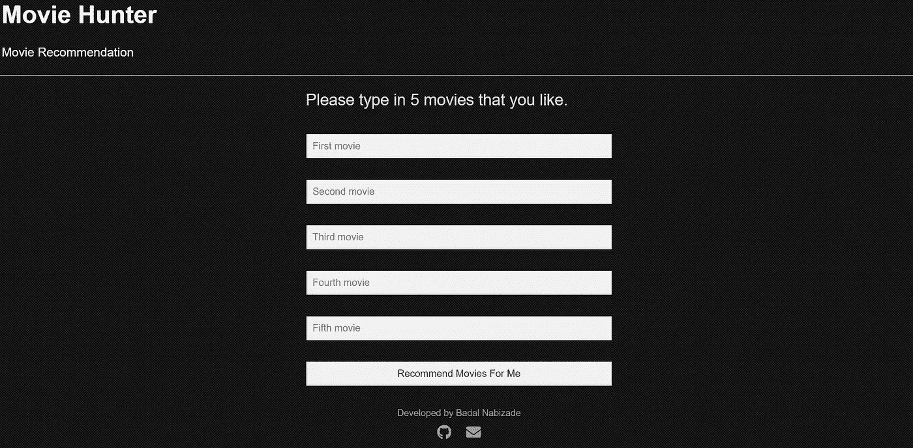
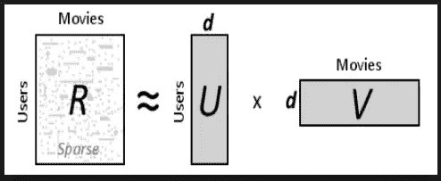
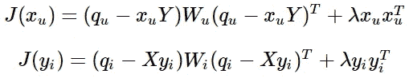
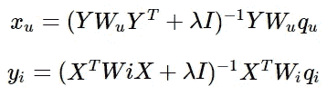
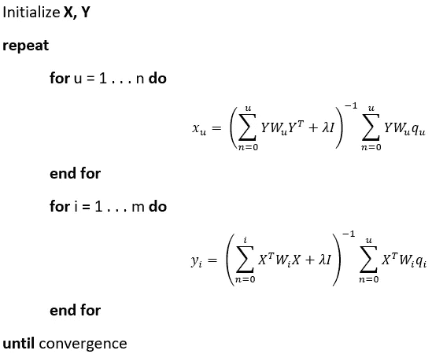
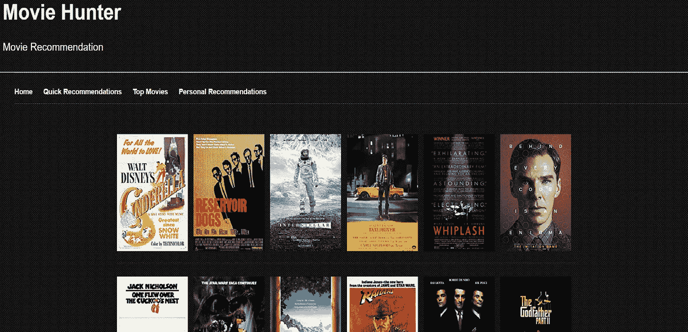

# 使用 PySpark 和 GCP 的无服务器推荐系统

> 原文：<https://towardsdatascience.com/serverless-recommendation-system-using-pyspark-and-gcp-4fb163131881?source=collection_archive---------27----------------------->

## 我的在线电影推荐系统的幕后以及如何与谷歌云平台交互。

Photo by [Noom Peerapong](https://unsplash.com/@imnoom?utm_source=medium&utm_medium=referral) on [Unsplash](https://unsplash.com?utm_source=medium&utm_medium=referral)

> “网飞如何预测我的品味？”这是我进入数据科学之前想到的问题。让我对这个领域产生了好奇。

最近我觉得是时候回答这个问题了。所以，我决定创建一个向注册用户推荐电影的 web 应用程序。

我的主要目标是让它在线并且完全没有服务器。在这段旅程中，我面临了几个挑战。

首先，我将简要提及这些挑战，然后我们可以深入了解该项目的细节。

# 挑战:

1.  由于我使用了 ALS 矩阵分解协同过滤算法，主要问题是冷启动问题。也就是说，如果没有之前关于用户的数据，算法根本无法向用户推荐产品(这里指的是电影)。因此，为了避免冷启动问题，我应该要求用户在我的应用程序中指定以前看过的电影。

Asking the user to specify 5 movies.

1.  由于这是一个有趣的项目，我决定使用谷歌云平台免费层。因此，Apache Spark 集群不允许我使用超过 24 个 vCPUs。我选择了 1 个主节点和 2 个工作节点，主节点有 8 个 vCPUs，内存为 30 GB，工作节点的属性与主节点相同。使用该集群生成建议大约需要 20 分钟。我必须在等待这些推荐的同时向用户提供快速推荐和最佳电影(我将在下面给出更多关于我如何确定最佳电影以及我如何生成快速推荐的信息，请耐心等待)。
2.  我选择用 App Engine 的标准环境，比灵活环境便宜。标准环境不允许使用用 Python 以外的编程语言实现的库。所以，当我需要它的功能时，我不能在我的应用程序中使用熊猫。我应该在 python 的标准 CSV 库中复制我的应用程序所需的一些功能。

# 深入细节。

> 首先，ALS 矩阵分解是如何工作的？让我们深入了解一下:

自[网飞价格挑战](https://www.netflixprize.com/)以来，这种算法广为人知。这是一种用于稀疏评级数据的最先进的协同过滤算法。简而言之，矩阵分解是将矩阵分解成具有较低维度的矩形因子矩阵的乘积(在这种情况下是用户和电影矩阵的乘积)。在用户矩阵中，列是潜在特征，行是用户。在项目(电影)矩阵中，行代表潜在特征，列是项目(电影)。

Factorization of user-movie sparse matrix. “d” is latent features.

*矩阵分解有其假设:*

1.  每个用户可以用 f 个潜在特征来描述(潜在特征的数量是我们应该确定的该算法的超参数)。例如，第一个潜在特征可能是表示每个用户喜欢恐怖电影多过喜欢惊险电影的比率，或者可能是表示每个用户喜欢浪漫电影多的数字。
2.  每部电影都可以用一组与用户矩阵中相似的潜在特征来描述。例如，第一个潜在特征可能是一个数字，表示特定电影的类型与恐怖电影有多接近。
3.  我们可以将用户的每个潜在特征乘以电影的相应特征，然后将所有特征加在一起，这应该会给我们一个用户对特定电影的评级的良好近似值(这就是我如何为我的应用程序生成快速推荐)。

我将用户的因子矩阵称为**“X”**，电影的因子矩阵称为**“Y”**。对了，我们不知道潜在特征代表什么，也不用知道。—我们只需要计算出潜在特征的值，然后确定每部电影的未知用户评级只是简单的矩阵乘法问题。

为了预测潜在特征的值，我们将使用交替最小二乘法。

> 最小平方法的基本形式是用某条线来拟合数据，测量所有点到这条线的平方距离的总和，并尝试得到缺失点的最佳拟合。

使用交替最小二乘法，想法是相同的，但是我们在优化 **Y** 和固定 **X** 和 v.v .之间交替迭代。使用这种迭代优化过程的主要目标是尝试更接近原始数据的分解表示。

通过这样做，我们首先使用 **X** 估计 **Y** (我们优化 Y 的值并保持 X 固定)并使用 **Y** 估计 **X** (我们优化 X 的值并保持 Y 固定)。经过足够次数的迭代(这是我们应该确定的模型的超参数)，我们的目标是达到一个收敛点，在这里 **X** 和 **Y** 矩阵足够接近我们原始数据的因式分解表示，并且这些矩阵的损失函数最小化。

然而，有一个关于数据的小问题。我们的数据很少，这意味着我们没有每部电影的完整用户评级对:)。这就是我们试图预测那些缺失的评分并建立推荐引擎的原因。所以，我们应该惩罚那些没有分级的电影。在我们这样做之后，我们不必处理没有来自用户的评级的电影，并且不围绕推荐中没有评级的电影做出任何假设。因此，为了惩罚未分级电影，我们需要一个权重矩阵，其中未分级电影的权重为 0，分级电影的权重为 1。我将这个权重矩阵称为“W”。

因为我们必须优化 **X** 和 **Y** 矩阵。将有两个对应于 **X** 和 **Y.** 的成本函数

J(Xu) is a cost function for the user factor matrix and J(Yi) is a cost function for the movie factor matrix.

请注意上述成本函数中的最后一项。这些是正则项，也是这个算法的最后一个超参数。它们在那里是为了避免[过度配合](https://en.wikipedia.org/wiki/Overfitting)。换句话说，他们在优化过程中不让权重有高值。顺便说一下，您应该通过使用交叉验证集(而不是测试集)来调整 lambda(正则项),使算法能够更好地对看不见的数据进行归纳。

X 和 Y 矩阵的优化解决方案如下所示。

Xu is a solution for the X matrix, Yi is a solution for the Y matrix. u is an u-th user in X matrix and i is an i-th movie in Y matrix.

在上述优化方案中， **W** *u* 表示用户潜在特征的权重， **W** *i* 表示电影潜在特征的权重。 **q** *u* 和 q *i* 将分别等于 **r** *u* 和 **r** *i* 当 *u* 个用户已经对 *i-* 个电影进行了评级时。 **r** *u* 和 **r** *i* 分别代表第 u 个用户对应的评分值和第 I 部电影对应的评分值。

我们可以用伪代码显示上述算法，如下所示:

我在[这个笔记本](https://github.com/badalnabizade/MovieHunter-Recommendation-Engine/blob/master/Notebook.ipynb)里用 Numpy 实现了这个算法的一个幼稚版本。

> movielens 数据集中用户认为哪些电影最好看？

为了确定这些电影，我使用 Keras 创建了简单的神经网络嵌入，如下面的片段所示。

这段代码主要做的是处理用于嵌入模型的收视率和电影数据帧，创建用户和电影嵌入向量，将它们彼此相乘，并将相应的偏差嵌入向量添加到获得的矩阵中。

通过这样做，我们得到了一个模型，试图通过使用电影和用户嵌入向量来预测每个用户和电影组合的评级。当用 SGD optimizer 训练该模型时，它通过调整嵌入矩阵的相应值来最小化预测和实际评级之间的均方误差。

在几个时代之后，我们将为每部电影训练电影偏见，我们需要它来确定最好的电影。完美！

我们可以得到最好的电影，如下面的片段所示。

在这里，这个片段中的“best_movies”代表了 movielens 数据集中用户认为最好的 48 部电影。我们用最好的电影向用户展示我们的应用程序，以使它不那么无聊。

> 我们能快速向用户展示一些推荐吗？

的确，我们可以。通过使用 movielens 小数据集。尽管这些推荐可能不如通过使用完整数据集生成的实际推荐准确。

在我项目的 Github 库中有 [quick_reco_engine.py](https://github.com/badalnabizade/MovieHunter-Recommendation-Engine/blob/master/utils/quick_reco_engine.py) 文件。哪个具有与 [engine.py](https://github.com/badalnabizade/MovieHunter-Recommendation-Engine/blob/master/utils/engine.py) 相同的“推荐者”对象

唯一的区别是，quick_reco_engine.py 不将任何东西写入数据库，它从 ALS 模型中提取“产品特征”(电影的潜在因素)，并将这些保存到 Google 云存储中。

在 [main.py](https://github.com/badalnabizade/MovieHunter-Recommendation-Engine/blob/master/app/main.py) 文件中，我们从 GCS 中获取那些产品特性，并将这些电影的潜在特性与新用户的评分相乘(未评分的电影将 0 作为评分值)。通过这样做，我们得到了用户对电影评价的一个很好的近似值。然后，我们将这些评级按降序排序，并向用户推荐排名前 12 位的高评级电影。**检查 main.py 中的** [**这几行**](https://github.com/badalnabizade/MovieHunter-Recommendation-Engine/blob/06b7e7092bc1a88460971844224494ac0c773136/app/main.py#L170-L247)

# 让我们看看这个在线推荐系统的幕后，以及它是如何与 GCP 互动的。

在 Google Dataproc 中运行的主要推荐引擎是 [engine.py](https://github.com/badalnabizade/MovieHunter-Recommendation-Engine/blob/master/utils/engine.py)

我的应用程序的数据集是 movielens 的完整数据集(显然)，其中包括 280，000 名用户对 58，000 部电影的 27，000，000 个评级。

首先，我在 Google CloudSQL 中创建了以下表格。

1.  等级
2.  电影
3.  链接
4.  用户
5.  推荐
6.  快速推荐

然后导入 ratigs.csv 到评分表，movies.csv 到 movies 表，links.csv 到 links 表。

[main.py](https://github.com/badalnabizade/MovieHunter-Recommendation-Engine/blob/master/app/main.py) 和 [engine.py](https://github.com/badalnabizade/MovieHunter-Recommendation-Engine/blob/master/utils/engine.py) 将向应用程序写入新注册用户的用户数据、推荐和 QUICK_RECOMMENDATIONS 表。

[这个降价文件](https://gist.github.com/badalnabizade/25a2157af9241eb4d6dc5f34e069bd96)详细描述了上述推荐系统如何工作，以及它如何与 GCP 交互。markdown 文件中每一个突出显示部分都表示到相应脚本中的一个或多个特定行的永久链接。**请查看！**

***申请在线*** [***这里***](http://sparkrecommendationengine.appspot.com/) ***。***

主要建议如下所示。

**注:App 为每个注册用户创建这些推荐，他们可以随时访问推荐的电影。**

There are 48 of those movies.

***你也可以查一下这个 J***[***upyter 笔记本***](https://github.com/badalnabizade/MovieHunter-Recommendation-Engine/blob/master/Notebook.ipynb) ***，我在这里实现了香草 ALS，做了一些 EDA 来回答那些让我无法入睡的问题，直到我回答完这些问题并确定了最佳电影。***

***这个项目的源代码可以在下面的 Github 库中找到。***

 [## badalnabizade/movie hunter-推荐-引擎

### 1 个用户注册 1.1。main.py 为注册用户分配一个新的 id。1.2.py 写用户的 id，名字，邮件和散列…

github.com](https://github.com/badalnabizade/MovieHunter-Recommendation-Engine) 

# 谢谢你的时间。希望你喜欢它！