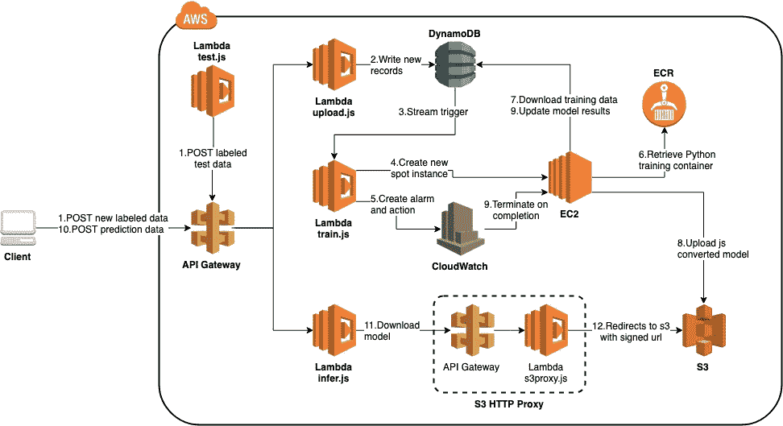
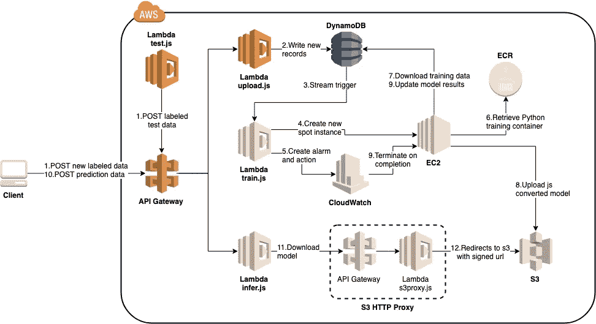
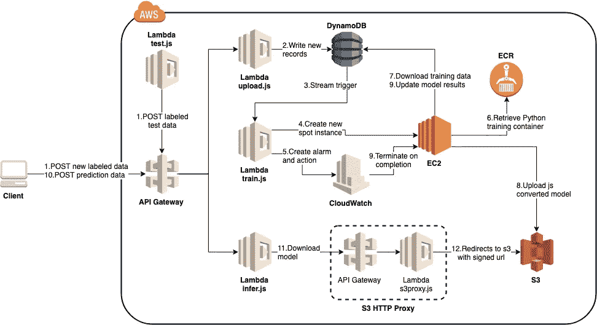
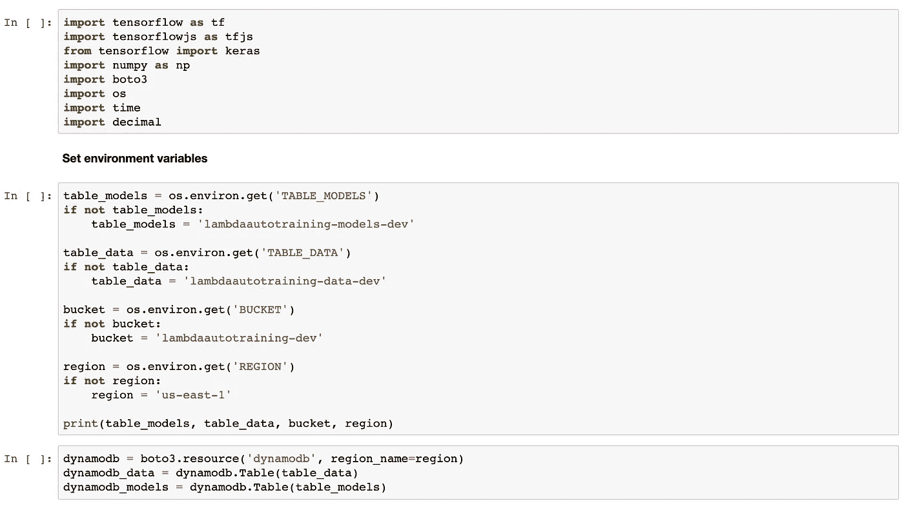
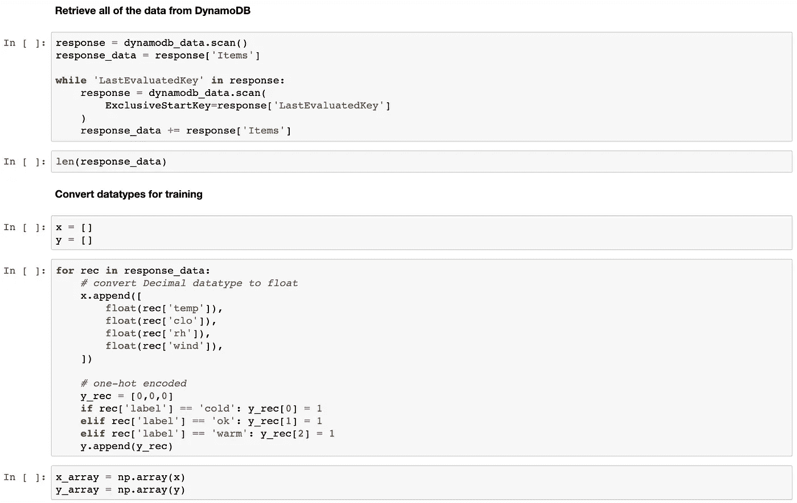
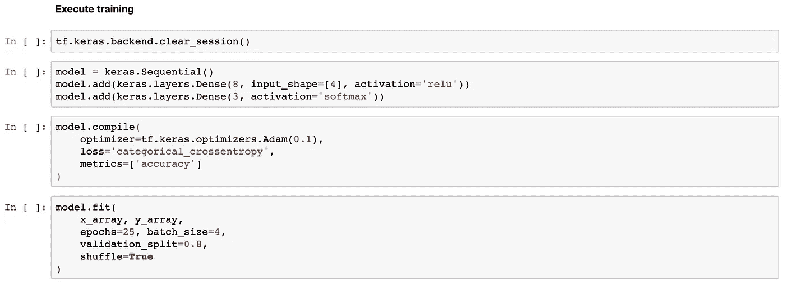
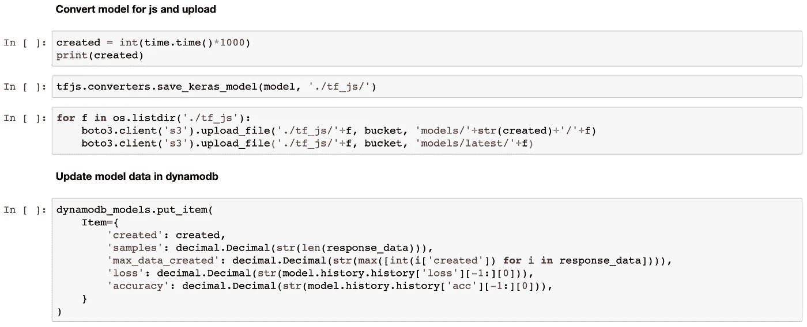
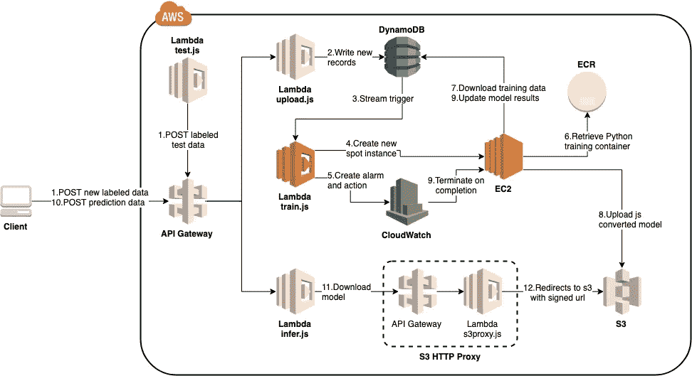
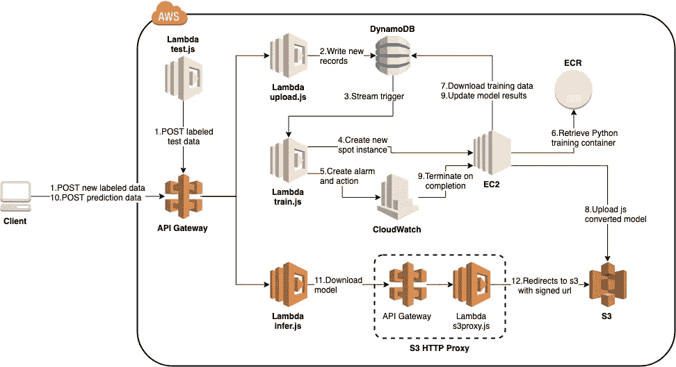

# 带 EC2 自动训练的无服务器 TensorFlow 工作流

> 原文：<https://towardsdatascience.com/serverless-tensorflow-workflow-with-ec2-auto-training-495f47bd892d?source=collection_archive---------22----------------------->


机器学习培训工作通常是时间和资源密集型的，因此将这一过程纳入实时自动化工作流可能是一项挑战。

在[之前的一篇文章](https://medium.com/@mike.p.moritz/running-tensorflow-on-aws-lambda-using-serverless-5acf20e00033)中，我展示了一个在 AWS Lambda 上运行无服务器 TensorFlow 训练作业的原型。这种情况的激励用例是当有有限的标记数据，并且新的输入条目需要非常快速地合并到模型中时。

虽然可以在 Lambda 上运行标准的 Python TensorFlow 库，但很可能许多应用程序很快就会遇到部署包大小和/或执行时间的限制，或者需要额外的计算选项。

本文将介绍如何保持数据管理和预测无服务器，但是将培训任务卸载到一个临时 EC2 实例。这种创建实例的模式将建立在为在云中运行[经济高效的超参数优化](/keras-hyperparameter-optimization-on-aws-cbd494a7ea15)而开发的模式之上。



在 Lambda 中保留预测功能意味着由于加载 TensorFlow，仍然可能存在大小约束。为了减轻这一点，所有的 Lambda 函数都将为 Node.js 编写，这也将允许我们使用 [TensorFlow.js](https://www.tensorflow.org/js) 而不是标准的 Python 库。

TensorFlow.js 有浏览器版本和节点版本，后者包含 C++绑定以提高性能。节点版本似乎是显而易见的选择，但是它解压缩到 690MB(！)这使得它立即不适用于 Lambda。考虑到我们不会在 Lambda 函数中进行训练，预测的性能损失是可以接受的，因此我们将使用解压缩到 55MB 的浏览器版本。

对于底层机器学习模型，我们将尝试基于以下输入参数来预测一个人的舒适度:

*   温度(°F)
*   相对湿度(%)
*   衣服隔热(以“克罗”为单位)
*   风速(米/秒)

实际模型将使用使用 TensorFlow 的 Keras API 构建的简单(非优化)神经网络。

对于数据存储，我们将在 DynamoDB 中创建两个表:

*   `data` —将为训练保留带标签的输入数据
*   `model` —存储培训作业的元数据和指标

# 环境设置

## 初始化

由于我们的项目将与 Node Lambda 文件和 Python EC2 文件混合在一起，我们将在如下所示的文件夹结构中将它们分开。我们还将利用无服务器框架，它将保留在顶层，而节点和 Python 部分将在各自的文件夹中初始化。

```
├── LambdaAutoTraining
│   ├── js
│   │   ├── ...
│   ├── py
│   │   ├── ...
```

首先，安装 Serverless 并使用节点模板初始化一个新项目。应该会出现一个样板处理程序(`handler.js`)和配置文件(`serverless.yml`)。

```
$ npm install -g serverless
$ mkdir -p LambdaAutoTraining/{js,py}
$ cd LambdaAutoTraining
$ serverless create --template aws-nodejs
```

## 节点设置

导航到`js`文件夹，初始化一个新的节点项目，安装 Tensorflow.js(仅限浏览器版本！).

```
$ cd js
$ npm init
...follow prompts
$ npm install @tensorflow/tfjs
```

接下来，使用架构图作为指南，创建必要的 JavaScript 文件，这些文件将映射到最终的 Lambda 函数。

```
$ touch test.js upload.js train.js infer.js s3proxy.js
```

最后，将`handler.js`中的样板代码复制到每个文件中，然后删除`handler.js`。

## Python 设置

导航到`py`文件夹并创建一个新的虚拟环境。为了创建培训方案，我们将使用 Jupyter 笔记本，我们还需要`tensorflowjs`模块，以便我们可以将保存的模型转换为 TensorFlow.js 可以理解的格式。

```
$ cd ../py
$ pyenv virtualenv 3.7.3 autotraining
$ pyenv activate autotraining
$ pip install tensorflow tensorflowjs jupyter
$ pip freeze > requirements.txt
```

在这一部分，我们只需要创建 Jupyter 笔记本文件和 Dockerfile。Python 文件将作为 Docker 构建过程的一部分创建。

```
$ touch train.ipynb Dockerfile
```

您的项目结构现在应该如下所示:

```
├── LambdaAutoTraining
│   ├── serverless.yml
│   ├── js
│   │   ├── test.js
│   │   ├── upload.js
│   │   ├── train.js
│   │   ├── infer.js
│   │   ├── s3proxy.js
│   │   ├── package.json
│   │   ├── package_lock.json
|   │   ├── node_modules
|   │   │   ├── ...
│   ├── py
│   │   ├── requirements.txt
│   │   ├── train.ipynb
│   │   ├── Dockerfile
```

# 无服务器设置

`serverless.yml`文件是项目的主要配置。首先删除文件中的所有样板文本(如果需要，您可以稍后参考[文档](https://serverless.com/framework/docs/providers/aws/guide/serverless.yml/)中的所有选项)，然后开始构建提供者部分。

与大多数 AWS 无服务器示例的一个关键区别是，我们将定义自己的 IAM 角色。通常情况下,`role`将替换为`iamRoleStatements`部分，该部分允许无服务器与其自身的整体 IAM 角色合并的定制策略。然而，我们需要将 EC2 作为可信实体，这在`iamRoleStatements`中是不可用的。稍后将在参考资料一节中进行构建。

环境部分让我们可以访问 Lambda 函数中的部署相关变量。创建 EC2 实例策略需要用到`IAM_ROLE`，而`test.js`和`infer.js`都将使用`API_URL`来调用我们的 API 网关端点。

接下来，使用图表和创建的文件作为指导来定义每个功能。为了简单起见，每个处理函数名和 API 端点将与文件名相同。

`upload`、`infer`和`s3proxy`将通过 API 网关调用，因此将有`http`事件。对于`s3proxy`,我们将使用路径参数来定义所请求的文件，其中`key`是 S3 桶中的文件夹。

对于`train`函数，我们将使用 DynamoDB 流触发器，它将包含在参考资料部分。当至少有一个新事件并且*满足以下任一限制*时，该事件将被触发:

*   `batchSize` —创建的最大项目数
*   `batchWindow` —创建第一个项目后的最长时间

由于`train`将主要负责启动 EC2 实例，我们还将定义一些额外的特定环境变量。在本例中，我们的 Docker 图像将存储在 AWS Docker 注册表(ECR)中，但是也可以使用其他图像。

*   `AMI_ID` —我们将在本例中使用 ami-0f812849f5bc97db5，因为它是为 Docker 预先构建的
*   `KEY_NAME` —这是 SSH 访问实例所需的 pem 文件的名称；请确保您可以访问私钥！
*   `INSTANCE_TYPE` —有效值是该图像可用的 EC2 风格
*   `SPOT_DURATION`—spot 实例被中断前的最短时间(分钟)
*   `VALID_HRS` —如果没有实现，现货请求将持续的最长时间
*   `ECR_ID` —应该与您的 AWS 帐户 id 相同
*   `ECR_REPO`—ECR 储存库和项目的名称

最后，`test`将仅用于手动触发，因此没有关联事件。

接下来，创建 S3 存储桶和两个 DynamoDB 表(在此阶段提供的吞吐量有限)。请注意，`data`表还包含用于触发`train`功能的`StreamSpecification`。

要创建的最后一个资源是我们的自定义 IAM 角色，它将被所有功能使用，无服务器的[文档](https://serverless.com/framework/docs/providers/aws/guide/iam#one-custom-iam-role-for-all-functions)提供了一个很好的起点模板。为了将角色从 Lambda 转移到 EC2，我们需要两件事情:

*   将`ec2.amazonaws.com`添加到`AssumeRolePolicyDocument`部分
*   在`Policies`部分为`iam:PassRole`添加一个允许动作

对于`Policies`部分，我们将首先复制默认的无服务器日志策略和 S3 部署桶(通常这些是自动创建的)。接下来，我们将为之前定义的 S3 桶和 DynamoDB 表添加自定义语句。请注意，在创建自定义策略时，不会自动创建 DynamoDB 流策略，因此我们需要显式地定义它。

此外，我们将添加创建 EC2 实例所需的策略:

*   EC2 —创建并运行实例。
*   CloudWatch —创建、描述和启用警报，以便我们可以在训练完成时自动终止实例。
*   ECR —允许提取 Docker 图像(这将仅由 EC2 使用，而不由 Lambda 函数使用)。
*   IAM 获取、创建角色并将其添加到实例配置文件中。当从控制台启动 EC2 实例并选择 IAM 角色时，会自动创建这个概要文件，但是我们需要在我们的函数中手动创建。

*安全注意事项:在部署到生产环境之前，这些策略应该仅限于所需的资源*

因为您已经向每个函数添加了样板代码，所以现在可以部署和测试所有的配置是否正确。

```
$ serverless deploy --stage dev
...
$ curl -X POST "https://<api_id>.execute-api.<region>.amazonaws.com/dev/upload"Go Serverless v1.0! Your function executed successfully!
```

现在我们已经准备好构建应用程序了！


Photo by [Susan Holt Simpson](https://unsplash.com/@shs521?utm_source=medium&utm_medium=referral) on [Unsplash](https://unsplash.com?utm_source=medium&utm_medium=referral)

# λ:upload . js



`upload`函数将接受一组新标记的数据作为输入，并将其存储在 DynamoDB 表中。该更新将启动一个流触发器来启动`train`功能。

在`upload.js`中，首先导入并设置 AWS SDK。由于这个函数是由一个 HTTP 事件触发的，我们将读取`body`字段，然后构造一个表示各个 DynamoDB 插入项的对象数组。注意，即使字段有不同的类型(例如“N”或“S”分别代表数字和字符串)，实际值也需要作为字符串传入。

如果有新的项目要写，我们将构造一个新的对象，然后使用来自 [DynamoDB AWS SDK](https://docs.aws.amazon.com/sdk-for-javascript/v2/developer-guide/dynamodb-example-table-read-write-batch.html) 的`batchWriteItem`来写新的项目。`batchWriteItem`比一系列`putItem`请求更高效，并且也是原子性的。

现在我们已经构建了`upload`函数，您还可以构建`test.js`来生成随机数据，以测试工作流并填充数据库。详见 [Github 文件](https://github.com/mikepm35/LambdaAutoTraining/blob/master/js/test.js)。

重新部署到`dev`阶段并测试端点。此时，开始用数据填充 DynamoDB 是有价值的，这可以通过手动调用`test.js`函数来完成。

```
$ severless deploy --stage dev
...
$ curl -X POST "https://<api_id>.execute-api.<region>.amazonaws.com/dev/upload" -d '[{"created": 1570323309012, "temp": 75, "rh": 60, "wind": 0.6, "clo": 1.0, "label": "ok", "score": -1}]'1 records created successfully
```

尽管`train.js`函数还没有构建出来，但是一旦达到批处理窗口或批处理大小，您仍然会看到它被调用。

# EC2: train.py



上传新数据的功能完成后，我们现在将重点转移到 Python 训练部分。这里转移焦点而不是完成 JavaScript Lambda 函数的动机是，如果 EC2/ECR 集成完成了，验证`train`函数会容易得多，否则我们将无法验证启动脚本是否工作。

要开始使用 TensorFlow 模型，请打开 Jupyter 笔记本(您的虚拟环境应该已经激活)。

```
$ cd py
$ jupyter notebook
```

打开之前创建为空文件的`train.ipynb`。我们希望将关键字段作为环境参数传递给 Docker 容器，但是为了便于测试，我们将提供这些值。接下来创建代表两个 DynamoDB 表的变量。



对于输入数据，我们将对 DynamoDB 数据表执行一次[扫描](https://boto3.amazonaws.com/v1/documentation/api/latest/reference/services/dynamodb.html#DynamoDB.Client.scan)。如果结果被分页，那么`LastEvaluatedKey`就会出现，这种情况发生在响应大于 1MB 的时候。

DynamoDB 返回一个 Decimal 数据类型，所以我们将遍历数据集，转换为 floats，并对标签数据进行一次性编码。最后，这个列表被转换成 numpy 数组，以便输入到 TensorFlow 模型中。



为了创建模型，我们将使用 TensorFlow 的 [Keras API](https://www.tensorflow.org/guide/keras) ，更具体地说，是允许我们构建神经网络层的顺序模型。本文的重点不是超参数优化，因此我们将使用一个非常简单的配置。请务必注意，必须定义输入形状，以便稍后导入 TensorFlow.js。



一旦模型完成，我们将使用来自`tfjs`模块的转换器直接将其保存为可由 TensorFlow.js 导入的格式。然后，这些文件被上传到 S3 的一个新文件夹中，并以当前纪元为关键字。我们还将维护一个“最新”文件夹，以定义客户应该使用哪个模型进行预测。最后，每个模型拟合的结果将存储在 DynamoDB 的`model`表中。

由于应该填充了`data`表，现在您可以在本地运行这个笔记本并验证其功能。



随着模型开发的完成，我们现在将开始准备 Docker 映像，从提供构建映像的指令的 Docker 文件开始。

打开 docker 文件进行编辑，并按如下所示进行更新，目的如下:

*   从标准 Python 3.7 基础映像开始
*   创建新用户`lambdaautotraining`
*   复制到 Jupyter 笔记本和需求文件中
*   从需求文件安装 Python 库
*   将 Jupyter 笔记本转换为标准 Python 文件，并在图像启动时运行

```
FROM python:3.7RUN echo $(python3 --version)RUN useradd -ms /bin/bash lambdaautotrainingWORKDIR /home/lambdaautotrainingRUN apt-get update -yCOPY train.ipynb requirements.txt ./RUN pip install -r requirements.txtRUN chown -R lambdaautotraining:lambdaautotraining ./USER lambdaautotrainingRUN jupyter nbconvert --to script train.ipynbCMD ["python3","-u","train.py"]
```

接下来，在本地构建 Docker 容器，用 ECR URI 标记，登录 ECR，然后推送到存储库。

```
$ docker build -t lambda-auto-training-dev .
...
$ docker tag \
  lambda-auto-training-dev:latest \
  <ecr_id>.dkr.ecr.<region>.amazonaws.com/lambda-auto-training/lambda-auto-training-dev:latest$ $(aws ecr get-login --no-include-email --region <region>)
...
$ docker push \
  <ecr_id>.dkr.ecr.<region>.amazonaws.com/lambda-auto-training/lambda-auto-training-dev:latest
```

您可以手动启动 EC2 实例并执行命令来运行这个映像，但是我们将创建触发 Lambda 函数并一起测试它。

# Lambda: train.js



`train` Lambda 函数的主要目的是对新的一批标记数据做出反应，然后启动一个新的 EC2 实例来完全执行训练工作流。与使用回调样式处理程序的`upload`函数不同，这里我们将使用 async/await 模式。

该函数中定义的第一个变量是初始化脚本，它将被传递给 EC2 实例进行启动。这值得作为一个单独的 shell 脚本进行测试，但是为了简单起见，这里仅以字符串形式显示。该脚本的主要职责如下:

*   下载并安装 AWS CLI
*   登录到 ECR
*   下拉所需的 Docker 图像
*   运行 Docker 映像

注意,`run`命令有一系列我们通过 replace 语句定义的环境属性。这些将在我们的训练 Python 脚本中使用，以与 DynamoDB 和 S3 进行交互。

最后，该字符串需要按照 EC2 要求进行 base64 编码。

接下来，检索实例配置文件，它定义了 EC2 实例将使用的 IAM 角色。需要阻塞的每个调用都使用带有 await 关键字的 promise 形式。

有了实例概要文件，我们将为 spot 实例定义完整的 EC2 参数集。另一种选择是单独创建一个模板并直接启动它。我们还将在关闭时终止实例，这里的一个额外优化是根据需要停止/启动一个持久性实例。

我们现在准备开始创建 EC2。成功后，我们将创建并启用一个警报，当 CPU 下降到某个阈值以下时，该警报将自动终止实例，我们将该阈值用作训练完成的代理。

我们现在可以用新功能更新开发环境。

```
$ cd ../js
$ serverless deploy --stage dev
```

已经验证了`train.js`的触发工作，我们将使用控制台测试培训工作流程。在 AWS 中，打开 Lambda、DynamoDB、S3 和 EC2 的服务页面，并执行以下操作:

*   λ:用空输入触发训练函数
*   EC2:验证实例是使用正确的警报创建的
*   DynamoDB:验证模型信息是否更新
*   S3:确认模型文件已经上传
*   EC2:大约 10 分钟后，验证实例是否已终止

# Lambda: infer.js



完整的培训工作流完成后，我们现在准备构建预测/推理部分。`infer`的主要目的是下载模型，加载到 TensorFlow.js 中，然后根据 HTTP 触发器提供给它的一组输入进行预测。该函数期望输入是一个对象数组，其中的键表示所需的模型输入字段。

TensorFlow.js 的浏览器版本使用的`fetch`在 Node.js 中不是标准的。为了解决这个问题，我们将安装`node-fetch`，并在全局范围内使用它来代替`fetch`。

```
$ npm install node-fetch
```

接下来，必须下载模型。我们将再次需要解决这样一个事实，即我们使用的是浏览器版本，它不期望访问标准的本地文件系统。我们可以将必要的模块从`tfjs-node`提取到我们的项目中，但是在这个例子中，我们将利用`loadLayersModel`中的直接 HTTP 下载选项。

然而，由于我们的 S3 存储桶没有对世界开放，我们需要确定如何允许这种访问。对于对 S3 的 HTTP 访问，使用[签名的 url](https://docs.aws.amazon.com/AWSJavaScriptSDK/latest/AWS/S3.html#getSignedUrl-property) 是一个合理的选择，但是在下载步骤[中，TensorFlow 实际上做了两件事](https://js.tensorflow.org/api/latest/#loadLayersModel):

1.  下载 model . JSON——我们可以在这里传入签名的 url
2.  使用 url 根目录下载模型拓扑—步骤 1 中签名的 url 将不再有效！

为了解决这个问题，我们将使用一个单独的代理来接收每个请求，并将其重定向到一个适当的签名 url。更新`s3proxy`以支持此功能，如下所示:

回到`infer`函数，加载模型后，我们将输入转换为 2D 张量并运行预测。`arraySync`会将结果转换为标准浮点数，每组输入被转换为跨输出维度的一组预测。通过寻找最大值，这个预测被转换成一个简单的标签映射，然后在一个新的 JSON 对象中返回。

# 测试整个工作流程

如果您创建了`test`函数，那么您可以设置一个 cron 作业，在一个定义的时间间隔执行，这将模拟真实的流量。为此，我们需要在我们的`serverless.yml`配置中添加一个 CloudWatch 事件触发器(默认禁用):

```
test:
    handler: js/test.test  
    events:
      - schedule:
          rate: rate(2 minutes)
          enabled: false
```

手动启用触发器可能[有点令人困惑](https://github.com/serverless/serverless/issues/5111)，因为 Lambda UI 会显示为“enabled ”,但实际上您需要转到 CloudWatch 来启用底层事件:

> 问题是在 Lambda UI 中既有`AWS::Events::Rule`(可以启用/禁用)也有触发器(可以启用/禁用)。Lambda UI 显示*触发器*状态，该状态已启用。然而，我们实际上不能用云的形成来触摸它。`AWS::Events::Rule`设置为 disabled，这是我们用 CloudFormation 设置的。如果触发器或规则被禁用，它将不会触发您的 Lambda。

对于预测方面，我们可以像以前一样手动测试，或者扩展我们的测试功能策略，以包括推理。


Photo by [SpaceX](https://unsplash.com/@spacex?utm_source=medium&utm_medium=referral) on [Unsplash](https://unsplash.com?utm_source=medium&utm_medium=referral)

准备就绪后，您现在可以部署到“生产”阶段。对于 Docker 映像，我们只需向现有映像添加一个新标签，并将其推入生产存储库。

```
$ serverless deploy --stage prod
...
$ docker tag \
  lambda-auto-training-dev:latest \
  <ecr_id>.dkr.ecr.<region>.amazonaws.com/lambda-auto-training/lambda-auto-training-prod:latest
...
$ docker push \
  <ecr_id>.dkr.ecr.<region>.amazonaws.com/lambda-auto-training/lambda-auto-training-prod:latest
```

# 最后的想法

鉴于这是一个原型，在部署到真实的生产环境之前，应该考虑许多方面:

*   持久 API 端点的域集成(见`serverless-domain-manager`插件)。
*   HTTP 事件输入应该经过验证并包含错误处理。
*   可以向面向客户端的端点添加预热功能，以限制冷启动时的长调用时间。
*   应该加强 IAM 资源权限。将这个环境封装在 VPC 中是一个不错的选择，它还提供了允许 HTTP 访问 S3 的代理的替代方案。
*   DynamoDB 流触发器相对简单，在高容量环境中可能会过于激进。一个更健壮的解决方案可能是将新事件附加到一个文件中，并单独对新事件进行计数，这也可以减少每次训练运行时扫描整个表的工作量。
*   如果 EC2 实例在每次运行后被终止，最终未使用的警报将需要被清除。如果使用停止/启动一个实例的替代模式，警报也可以重复使用。
*   对于生产中的保护，应在培训工作中应用阈值，以便不引入表现不佳的模型进行预测。

感谢阅读！

你可以在 GitHub 上查看所有代码:[https://github.com/mikepm35/LambdaAutoTraining](https://github.com/mikepm35/LambdaAutoTraining)