# 羽毛球比赛中的发球、得分领先和连续得分

> 原文：<https://towardsdatascience.com/service-point-lead-and-consecutive-points-in-badminton-games-d6abb86ea5ab?source=collection_archive---------26----------------------->

羽毛球分为 5 类:男子单打、女子单打、男子双打、女子双打和混合双打。众所周知，羽毛球运动员的战术、战略和强度在这些类别中有很大的不同。一般来说，双打比赛节奏更快，更注重进攻而不是防守，而单打比赛更注重多功能性，更具活力。考虑到游戏风格的差异，本文着眼于 ***在*** 的每个类别中，发球、连续得分和得分领先如何不同地影响玩家的心态/表现。这些发现将从统计学以及游戏性的角度进行解释。

总结观察结果，产生了两个问题来引导本文的范围:

*   发球给玩家的优势是多还是少？单打和双打有什么不同？
*   球员的表现会受到连续得分或大比分领先的影响吗？

本文考察的数据是 3 月 6 日至 3 月 11 日在伯明翰举行的 2019 年全英公开赛的结果。许多羽毛球爱好者飞到英国去看顶尖选手，如、史、等男单排名前三的选手。

bwf 网站上的原始数据记录了比赛在单个分数方面的进步(第一分后的分数，第二分，一直到比赛结束)。有了这些信息，我们就能够将每场比赛的分数处理成单点的实例。每个实例将包括以下信息:

*   玩家 _ 领先:玩家在一个点开始时的领先。可以是正的也可以是负的。(负表示分数落后于对手)
*   Player_score:玩家在一个点开始时的得分。
*   玩家 _ 发球:如果玩家赢了最后一分，那么玩家发球。
*   Point_won:如果当前玩的点是玩家赢的。
*   玩家在一个点开始时所拥有的连续点数。

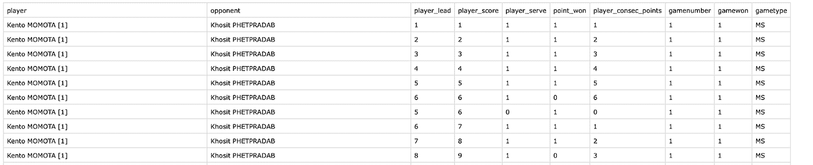

Diagram 0: A snippet of processed data

这些处理的实例包括我们将检查的关键因素，即玩家领先、玩家连续得分和玩家服务。

# **描述性数据**

为了让领先、连续得分、发球的影响更容易被形象化，我创造了三组情节。

Diagram 1: service descriptive data

第一组图显示了发球和得分结果之间的关系，得分可以是得分，也可以是失分。纵轴是事件发生的频率，横轴是事件发生的分数。绿色/红色线条显示球员发球得分/失分的频率。

在除“ms”之外的所有类别中，发球和失球的发生率似乎比发球和赢球的发生率**高**(也就是说红线似乎比绿线高)。**从发球的描述数据来看，发球似乎有劣势。**

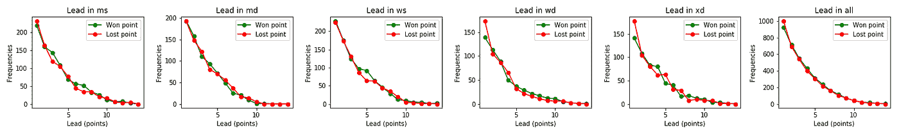

Diagram 2: lead descriptive data

第二组图显示了积分领先和积分结果之间的关系。纵轴是事件发生的频率，横轴是事件发生的分数。绿/红线显示了玩家赢得/失去具有不同点数领先的点数的频率。

在类别“ms”、“ws”和“xd”中，有一小部分获胜的频率高于失败。但总的来说，图表的视觉效果**似乎无法确定因积分领先而赢得和失去积分之间的任何差异。**需要更多的分析才能有进一步的发言权。

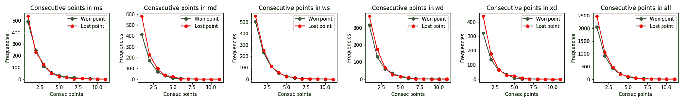

Diagram 3: consecutive points descriptive data

第三组图显示了连续点(条纹)和一个点的结果之间的关系。绿/红线显示了玩家赢得/失去具有不同连续点数的点数的频率。

在类别“md”、“wd”、“xd”和“总体”中，连续点数达到 5 似乎会导致玩家输多于赢。从观察连续点的描述性数据来看，拥有连续点似乎有一个**弱劣势。**

直观地绘制这些因素当然有助于我们发现任何相关性。综上所述，发球似乎是一个劣势，连续得分似乎是一个弱劣势，领先似乎没有提供任何优势/劣势。要做出合理的结论，需要对数据进行进一步的分析。

# **逻辑回归**

Point_won 在处理的数据集中表示为二进制列。1 指点赢，0 指点输。这使得逻辑回归成为一个很好的模型，可以用来可视化发球、领先、连续得分与赢得一分之间的相关性。

不同类别的逻辑回归绘制在同一图上，以便更容易看出差异。

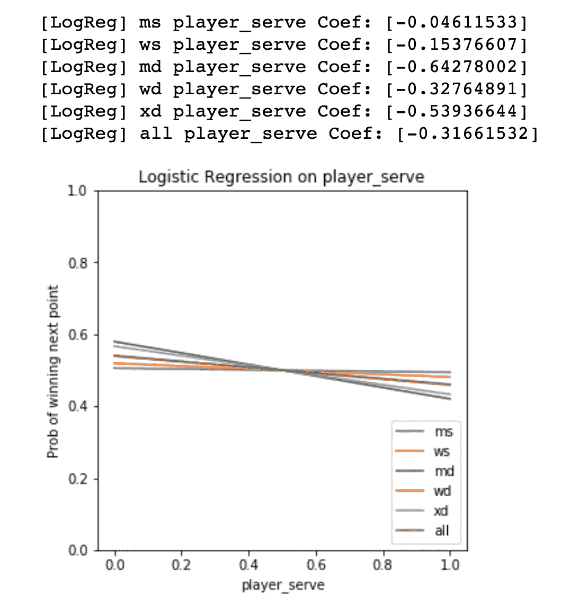

Plot 4: Logistic regressions and coefficients on player serve for multiple categories

根据上面的图表和系数，发球对得分结果的影响在所有游戏类别中都是负面的。从最负到最小负排列系数，我们得到 *md，xd，wd，ws，ms* 。双打和单打比赛有非常明显的模式和区别。这个服务用最快的反弹伤害了游戏。 *md* 以快速驱动和强力扣杀闻名，因此在 *md* 比赛中发球绝对是个坏主意。 *xd* 排在 wd 之前是因为 *xd* 里有个男玩家，使得进攻还是很厉害的。ws 和 ms 受到的影响较小，因为每边只有一名球员击球，所以击球组合通常较慢。因此发球不会有太大的负面影响。

为了看看相关性是否真的很重要，我进行了一个排列测试来推断每个类别的 p 值。测试结果如下所示。

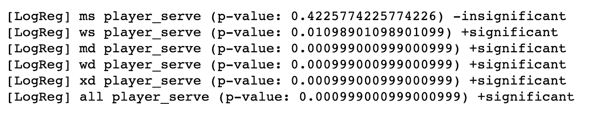

由 *ms* 反映的相关性不显著，而所有其他类别的相关性显著，p 值非常小。尽管男子单打与发球的相关性并不显著，但其余的相关性仍然强化了关于拉力赛速度与发球的相同概念。更新后的回归图如下所示，仅包括显著相关性(移除 *ms* )。

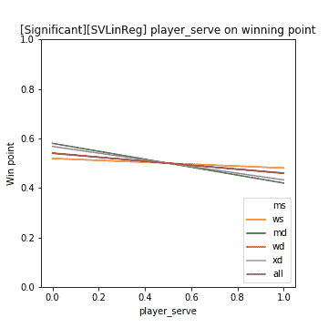

Plot 5: Significant Logistic regressions on player serve for multiple categories

同样的方法也适用于连续得分对赢得一分机会的影响。

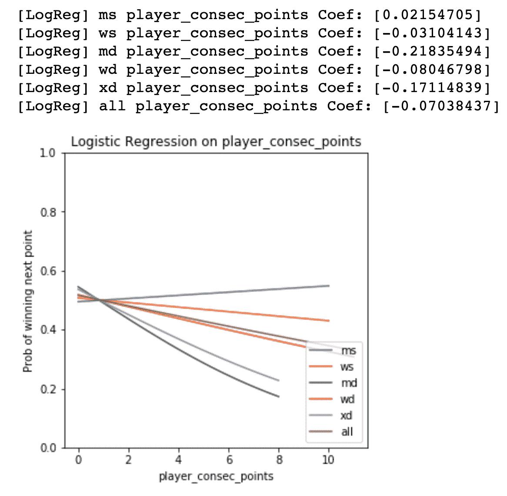

Plot 6: Logistic regressions on consecutive points’ impact on scoring for multiple categories

我们从系数中看到，只有对于 *ms* ，连续点数与中奖概率之间存在正相关关系。所有其他类别都具有负相关性，按照从最敏感到最不敏感的顺序排列为“md、xd、wd、ws”。从游戏性的角度来解释这一点，在更高的连续点数上更高的失败几率意味着游戏更具竞争力，更少“滑坡”。同样，双打比赛也受到连续得分的负面影响。发生这种情况的原因很可能是由于球员的水平差异和比赛的接近程度之间的事实，在单打比赛中，即使一名球员比另一名球员好一点点，也可能反映出很大的分数差异，但在双打比赛中，即使两个队的水平非常不同，他们仍然可能有一场接近的比赛。因此，在双打比赛中，与单打比赛相比，这场比赛似乎总是“势均力敌”。

再次进行排列测试，结果如下:

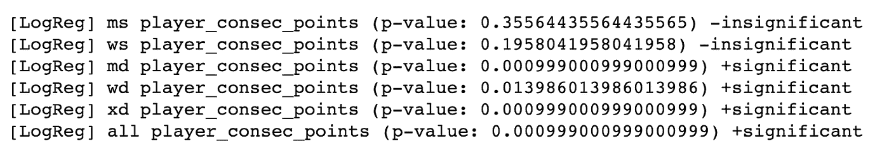

有趣的是，排列测试的结果表明，对于 ms 和 ws，相关性是不显著的。只有在双打比赛中才能得出有意义的结论。这验证了单打比赛和双打比赛之间的实际差异，进一步巩固了双打比赛更“激烈”、“快速”和“接近”的结论。

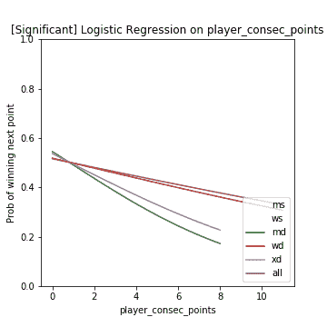

*Plot 7: Significant correlations from player consecutive points’ impact on chances of winning*

要考虑的最后一个因素是球员的领先优势及其对赢得一分的机会的影响

从描述性数据来看，这并没有产生任何明确的相关性，希望逻辑回归能给我们更多的具体信息。

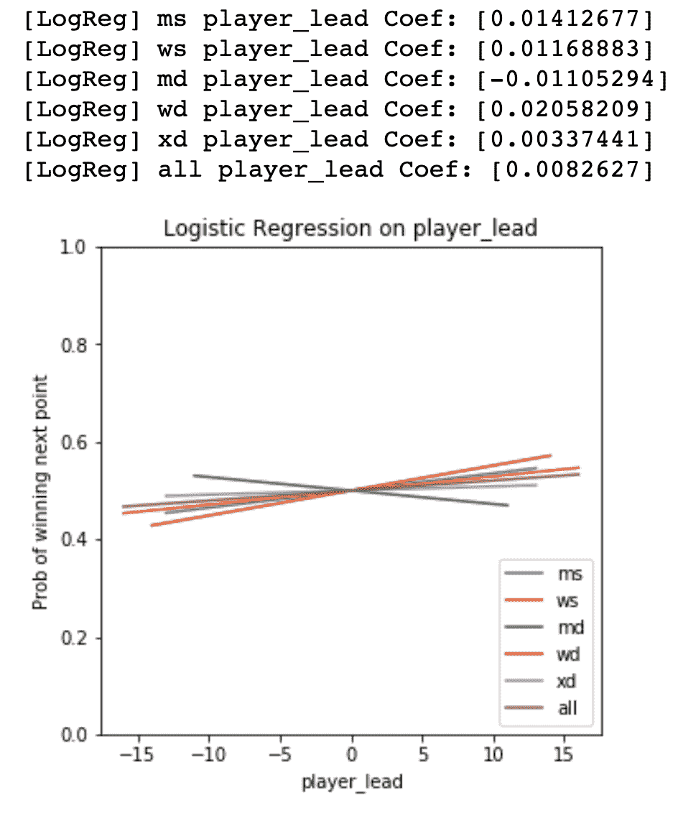

Plot 8: Logistic regressions and coefficients on player lead for multiple categories

从系数和情节来看，领先有利于赢得除男子双打以外的所有类别的比赛。Md 脱颖而出，可能再次是同样的“竞争”和“密切”的游戏性质。这可以解释为 md 的比赛如此接近，以至于很难取得大的领先优势，因此当领先优势变大时，就更容易输掉比赛。Wd、ms、ws、xd 的顺序是通过点导致租赁最受益。没有非常明确的迹象和见解来解释这一点，让我们在推测可能的解释之前，先看看这些相关性的显著性检验结果。

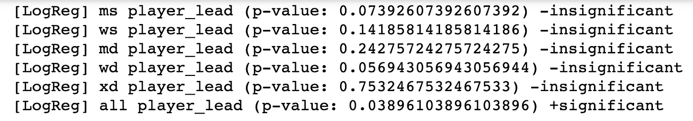

在对关于玩家领先的逻辑回归进行排列测试后，我们发现除了将所有类别作为一个整体来看，它们都是不重要的，这不会给类别之间的差异增加太多洞察力。这很重要，因为它否定了我们从玩家领先的影响中推断出的潜在关系。这个测试的结论是**玩家的领先和获胜的几率没有关系。**

# **结论**

本文利用逻辑回归和线性回归来评估发球、球员领先和球员连续得分的影响，总体上的重要发现是发球降低了赢得一分的机会，连续得分可能是风向转变的迹象。积分领先和赢得积分之间没有显著的相关性。

本文仅绘制了 300 多场羽毛球比赛的非常小的数据集，包含更多比赛统计数据的更大的数据集可以帮助巩固当前的相关性，并进一步探索积分领先的潜在影响。

感谢您的阅读！

如果你有任何意见或者你只是喜欢羽毛球，请联系我们！

> [领英](https://www.linkedin.com/in/xiaoxiang-ma/)
> 
> [xm53@cornell.edu](http://xm53@cornell.edu)