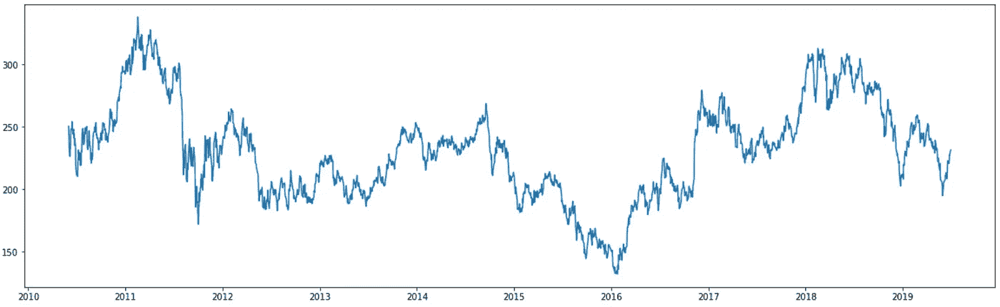
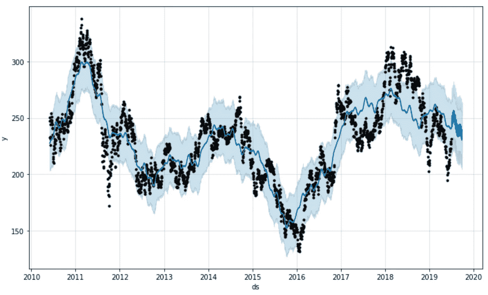
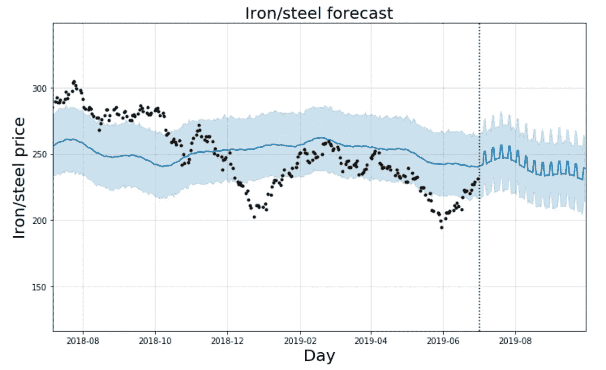
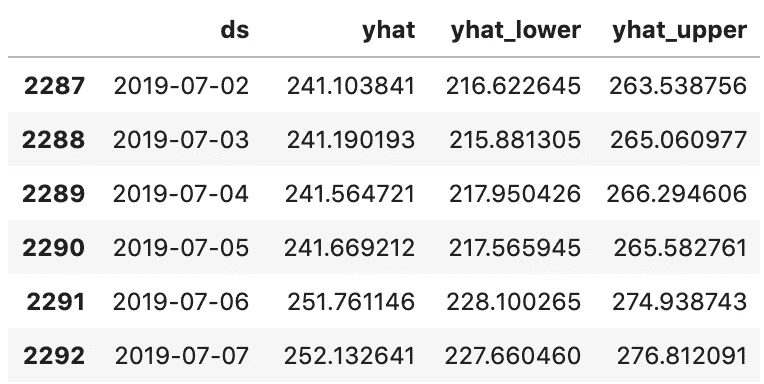
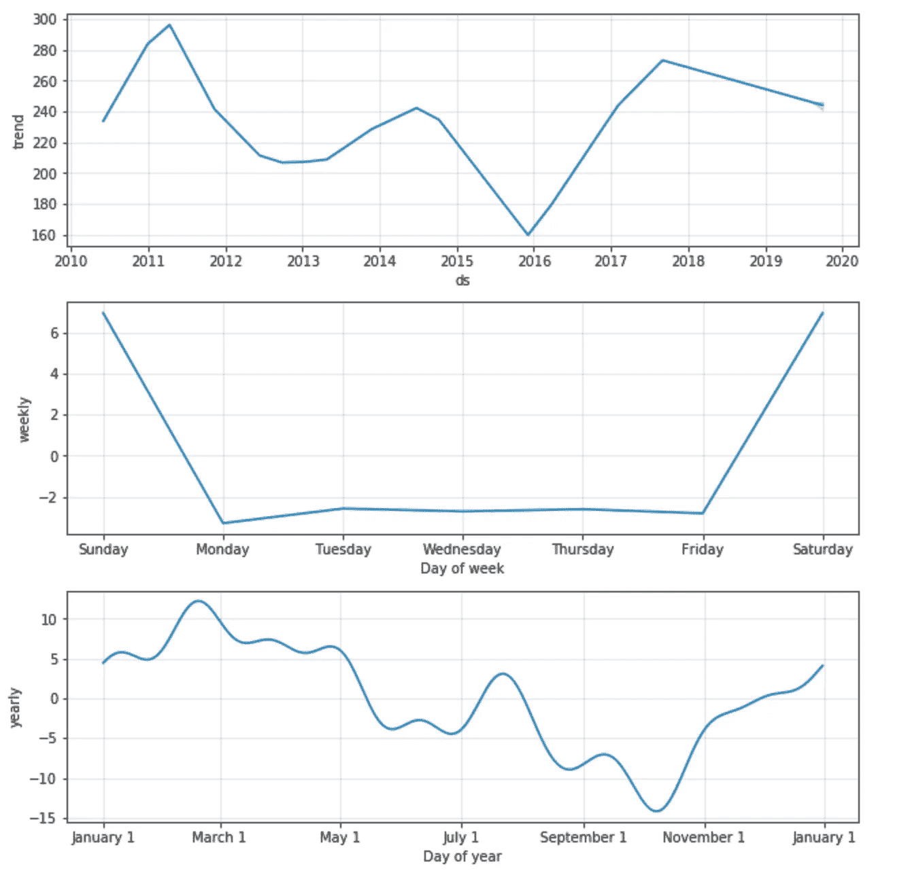
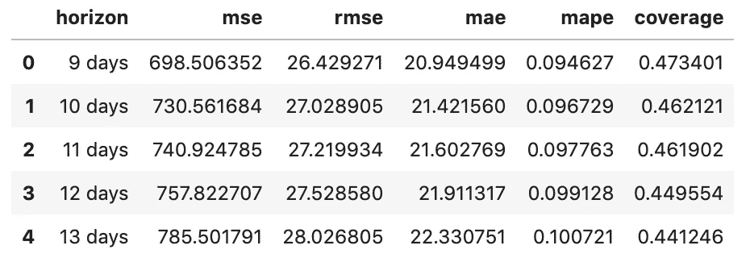
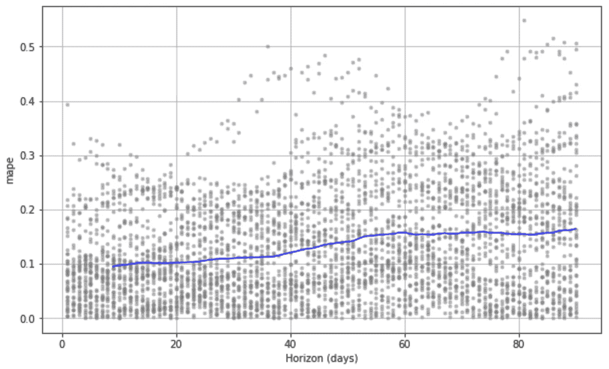
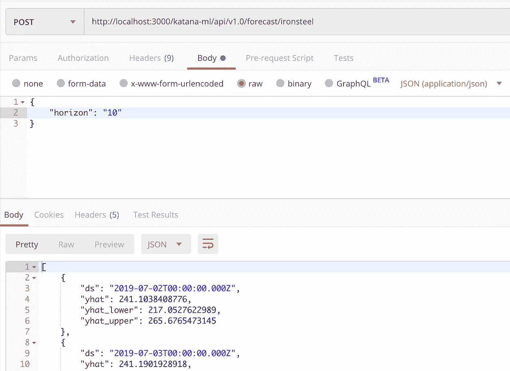

# 用烧瓶服务先知模型——预测未来

> 原文：<https://towardsdatascience.com/serving-prophet-model-with-flask-predicting-future-1896986da05f?source=collection_archive---------12----------------------->

## 演示如何使用 Flask 在 Web 上提供 Prophet 模型 API 的解决方案。prophet——由脸书开发的用于预测时间序列数据的开源 Python 库。


Source: Pixabay

几乎对任何企业来说，准确的预测和未来的预测都是至关重要的。这是显而易见的事情，不需要解释。有一个时间序列数据的概念，这个数据是按日期排序的，通常每个日期都被赋予一个或多个特定于该日期的值。机器学习驱动的模型可以基于时间序列数据生成预测。这种预测可能是商业决策的重要信息来源。

我在研究时间序列[预测](https://machinelearningmastery.com/how-to-develop-lstm-models-for-time-series-forecasting/)的 LSTM 模型。LSTM 神经网络擅长预测序列数据，时间序列也是序列数据，这就是为什么 LSTM 网络被用来预测时间序列的原因。LSTM 的实施很复杂，很难为 LSTM 的培训准备输入数据。可能所有 LSTM 的例子都是基于当前数据集的数据进行预测，而不是真实的未来数据-这使得在实践中很难应用 LSTM。

当我在 GitHub 上找到并评估了 [Prophet](https://github.com/facebook/prophet) Python 库用于未来预测时，我对它的简单性和实用性印象深刻。prophet——由脸书开发的开源预测库。

我将与 Prophet forecast 实现共享一个示例 Python 笔记本，并展示如何通过 Flask API 保存/加载 Prophet 模型并提供服务。

源代码和数据可在我的 GitHub [repo](https://github.com/abaranovskis-redsamurai/automation-repo/tree/master/forecast) 中获得。

首先，您需要导入 Prophet 库:

```
import pandas as pd
import matplotlib.pyplot as plt
from fbprophet import Prophet
%matplotlib inline
```

如果您的环境中没有安装 Prophet，您需要安装它。我把它安装在 Docker 容器中运行的 Ubuntu 中。用 *pip* 安装没有效果。但是我可以用康达安装:

```
conda install gcc
conda install -c conda-forge fbprophet
```

通常下一步是加载数据。对于这个例子，我使用铁/钢价格数据集(从[这里](https://www.investing.com/indices/dj-iron---steel-historical-data)下载)。数据被加载到带有熊猫库的框架中。熊猫数据框架允许操纵和争论数据。我们正在删除未使用的列，设置索引并重新排序时间序列数据:

```
df = pd.read_csv('Dow Jones Iron & Steel Historical Data.csv')
df = df[['Date', 'Price']].dropna()df['Date'] = pd.to_datetime(df['Date'])
df = df.set_index('Date')daily_df = df.resample('D').mean()
d_df = daily_df.reset_index().dropna()
```

Prophet 操作 ds/y 列，我们应该重命名数据框中的列:

```
d_df.columns = ['ds', 'y']fig = plt.figure(facecolor='w', figsize=(20, 6))
plt.plot(d_df.ds, d_df.y)
```

我们将用于 Prophet 模型培训的钢铁价格数据:



Iron/steel price data

关键部分来了——先知模型训练:

```
m = Prophet()
m.fit(d_df)future = m.make_future_dataframe(periods=90)
forecast = m.predict(future)
forecast[['ds', 'yhat', 'yhat_lower', 'yhat_upper']].tail()
```

通过调用 *fit* 函数并传递 Pandas 数据帧来执行模型训练。未来预测由 *predict* 函数执行，并传递描述未来多少天要预测的参数(上例中为 90 天)。Prophet 返回一个包含各种参数的数据框来描述预测。其中最重要的是:

1.  ds —预测日期
2.  yhat —给定日期的预测值
3.  yhat _ lower 给定日期的预测下限
4.  yhat _ uppet 给定日期的预测上限

调用 Prophet 模型的 *plot* 函数，显示模型是如何根据训练数据(黑点—训练数据，蓝线—预测值，浅蓝色区域—预测边界)进行训练的:



Prophet model

此图表显示未来 90 天的模型预测。但是很难看出来，图表显示了所有的数据。我们可以放大数据，并使用从训练数据中分离预测的垂直线来绘制图表:

```
from datetime import datetime, timedeltafig1 = m.plot(forecast)#datenow = datetime.now()
datenow = datetime(2019, 7, 2)
dateend = datenow + timedelta(days=90)
datestart = dateend - timedelta(days=450)plt.xlim([datestart, dateend])
plt.title("Iron/steel forecast", fontsize=20)
plt.xlabel("Day", fontsize=20)
plt.ylabel("Iron/steel price", fontsize=20)
plt.axvline(datenow, color="k", linestyle=":")
plt.show()
```

这有助于更清楚地看到 90 天的预测。我们可以看到价格预测的下降趋势:



Forecast trend

打印预测值有一种简单的方法，即从预测数据框中访问最近 90 天的预测值:

```
forecast[['ds', 'yhat', 'yhat_lower', 'yhat_upper']][-90:]
```



First 6 entries from 90 days forecast

为了评估模型，显示学习到的趋势是有用的:

```
fig2 = m.plot_components(forecast)
```



Trends

Prophet 了解到从三月到十月价格通常会下降。

当预测一定天数时，您应该检查预期误差是多少。这被称为模型交叉验证:

```
from fbprophet.diagnostics import cross_validation, performance_metrics
df_cv = cross_validation(m, horizon='90 days')
df_p = performance_metrics(df_cv)
df_p.head(5)
```

结果:



Cross-validation results

我们可以绘制这些指标来直观地观察模型的表现。百分比误差(MAPE)更容易理解，我们可以这样绘制:

```
from fbprophet.plot import plot_cross_validation_metric
fig3 = plot_cross_validation_metric(df_cv, metric='mape')
```

它表明 10 天的预测导致大约 10%的误差，然后误差增长到大约 18%:



Forecast percentage error

当新数据可用时，应该重新训练该模型。如果数据没有改变，就没有必要重新训练模型。当用户想要调用*预测*功能时，保存模型并再次使用。将 pickle 功能用于:

```
import pickle
with open('forecast_model.pckl', 'wb') as fout:
    pickle.dump(m, fout)with open('forecast_model.pckl', 'rb') as fin:
    m2 = pickle.load(fin)
```

这将把模型保存到磁盘上的一个物理文件中。在本例中，我展示了如何保存和加载模型，为您提供方便。在实际实施中，load 函数将在不同的位置调用(在负责处理用户预测请求的函数中)。

Flask 完美地通过 REST API 将 Prophet 模型暴露给外部世界。导入烧瓶库:

```
from flask import Flask, jsonify, request
from flask_cors import CORS, cross_origin
```

在带有 Flask 注释的函数内调用*预测*:

```
app = Flask(__name__)
CORS(app)[@app](http://twitter.com/app).route("/katana-ml/api/v1.0/forecast/ironsteel", methods=['POST'])
def predict():
    horizon = int(request.json['horizon'])

    future2 = m2.make_future_dataframe(periods=horizon)
    forecast2 = m2.predict(future2)

    data = forecast2[['ds', 'yhat', 'yhat_lower', 'yhat_upper']][-horizon:]

    ret = data.to_json(orient='records', date_format='iso')

    return ret# running REST interface, port=3000 for direct test
if __name__ == "__main__":
    app.run(debug=False, host='0.0.0.0', port=3000)
```

通过 Postman 调用 REST API 的例子。预测范围参数被传递给 API，我们得到带有预测数据的 JSON 响应:



Prophet forecast REST API response example

源代码和示例数据可以在我的 [GitHub](https://github.com/abaranovskis-redsamurai/automation-repo/tree/master/forecast) repo 中获得。