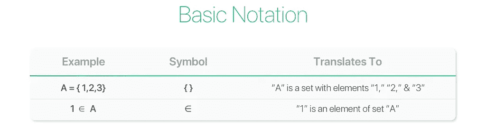
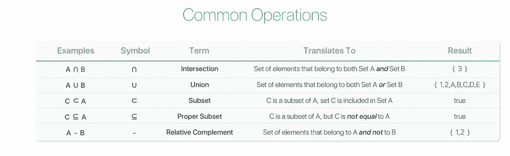
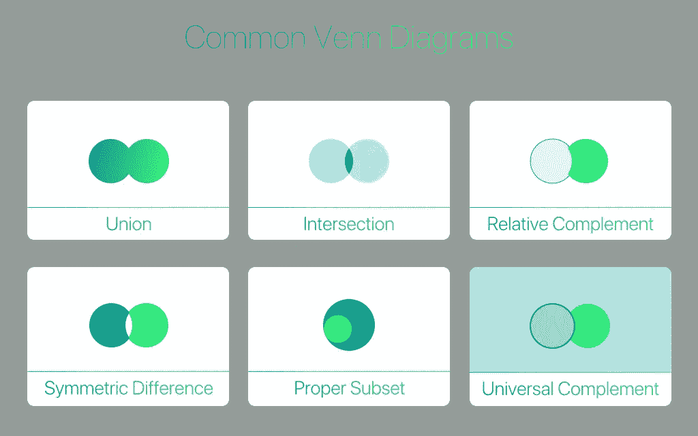

# 集合论——基本符号

> 原文：<https://towardsdatascience.com/set-theory-basic-notation-da93c3d48090?source=collection_archive---------10----------------------->

## 第二部分——简单看一下操作、符号和文氏图

Originally Published: [https://www.setzeus.com/](https://www.setzeus.com/)

[如前一篇文章](https://medium.com/@jesus_notchrist/set-theory-history-overview-c98bac98f99c)所述，学习集合论的一个核心好处不是源于任何特定的理论，而是建立的*语言*。这就是为什么这篇后续文章的大部分内容广泛涵盖了集合论符号、运算&可视化表示的基础知识。让我们从介绍表示集合&的两个最基本的符号开始。下表包含一个示例集， *A* ，包含三个元素:

Originally Published: [https://www.setzeus.com/](https://www.setzeus.com/)

第一行显示了具有三个不同元素的集合*A*(**A = { 1，2，3 }**)；第二行展示了正确的方式来表示某个元素 *1、*属于集合 *A* 。到目前为止相当直接——但是一旦我们通过普通操作开始第二次集合&之旅，集合理论就变得有趣多了。

对于下表，我们来介绍两个次级集合 *B* & *C* ，它们分别包含以下元素: **B = {3，A，B，C，D，E}** ， **C = {1，2}** 。尽管我们总共介绍了三个集合(A、B、& C)，但下面的示例操作一次只涉及两个集合，因此请密切注意最左侧列中标注的集合。下表包含五个最常用的集合操作数:

Originally Published: [https://www.setzeus.com/](https://www.setzeus.com/)

这就是集合论中最常见的五种运算。它们在纯数学之外的领域也很受欢迎。事实上，您很可能在过去见过或处理过这些类型的操作，只是没有确切的术语。举个例子，让任何一个小学生描述两个相交组的维恩图&他们会直观地得出正确的结果。

再看看最后一行，*相对*补语——这不是很奇怪的措辞吗？相对于什么？如果 A — B 的相对补码定义为 *A 而不是 B，*那么我们如何 ***表示不是 B 的一切*** ？

# 万能集和空集

事实证明，如果我们想要得到一个有意义的答案，我们首先必须提供一些背景知识。通常在问题开始时明确说明，当一个集合的可容许元素被限制在*一些*固定的对象类时，存在一个 ***泛集*** 即包含该特定问题的所有*元素的大集合。例如，如果我们想要处理严格的英文字母集合，那么我们的通用集合*由字母表中的 26 个字母组成。**

*对于 *U* 的任意子集 *A* ，将 *A* 的[补集](https://www.britannica.com/science/complement-set-theory)(用 *A* 或*U*—*A*表示)定义为 *A* 中*非*的 *U* 的所有元素的集合。参考上面提出的问题，B 的*补是指泛集内不是 *B* 的一切，包括 *A* 。**

*在我们继续之前，还有一个概念集合对基本理解非常重要:**[*空*或*空*](https://en.wikipedia.org/wiki/Null_set) 集合。注意这里选择的语法是经过深思熟虑的。这是一次旅行，但只有*一个*单个的空集，因此它是"*空集，"永远不是"空集。"虽然等价性超出了本文的范围，但这里的基本理论是，如果两个集合有相同的元素，它们就是相等的；因此，只能有一个没有元素的集合。因此只有一个空集。****

# ****维恩图&超越****

****维恩图，在 1880 年由一个叫约翰·维恩的人正式发明，正是你所想象的，尽管学术定义是这样的:****

> ****维恩图是显示不同数学集合之间所有可能的逻辑关系的示意图。****

****下面是六种最常见的维恩图，几乎都显示了我们最近讨论过的操作数:****

********

****Originally Published: [https://www.setzeus.com/](https://www.setzeus.com/)****

****从集合的最基本的符号&它的元素开始，我们现在已经讨论了基本的操作数，以便产生上面的可视化指南。除了左下方的[对称差](https://en.wikipedia.org/wiki/Symmetric_difference)之外，其他操作都涵盖了。为了不留下任何知识上的空白，对称差，也称为*析取并*，仅仅是*在任一集合&中不相交的元素的集合。*****

****我们将通过引入*基数的概念来总结这一点。由绝对值符号表示，集合的基数就是包含在指定集合中的唯一元素的数量。在上面的例子中，我们三个集合的基数是:|A| = 3，|B| =6，& |C| = 2。[在进入下一部分之前，需要思考一些问题——基数&可能子集的数量之间有什么关系？](https://medium.com/@jesus_notchrist/set-theory-cardinality-power-sets-bced69d8f248)*****