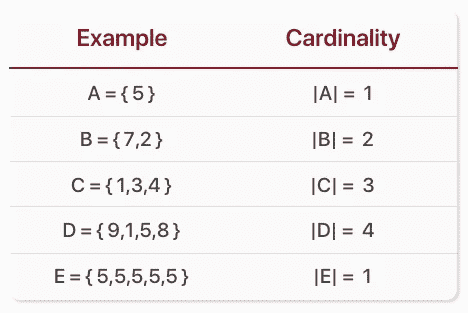
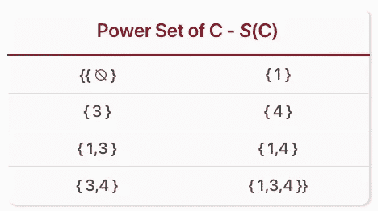

# 集合论——基数和幂集

> 原文：<https://towardsdatascience.com/set-theory-cardinality-power-sets-bced69d8f248?source=collection_archive---------11----------------------->

## 第三部分——负责分配决策的直觉

Originally Published On [https://www.setzeus.com/](https://www.setzeus.com/)

在本系列文章[第一篇](/set-theory-history-overview-c98bac98f99c) & [第二篇](/set-theory-basic-notation-da93c3d48090)中，基本的符号和运算已经清楚，我们现在已经建立了对集合论的基本理解。第三篇文章通过对任何给定集合中最重要的属性进行分区，进一步丰富了这一知识:*它包含的独特元素的总数。*

也称为 ***基数*** ，集合中不同元素的数量为给定集合的进一步、更丰富的分析提供了基础出发点。首先，基数是我们看到的第一个独特的属性，它允许我们客观地比较不同类型的集合——检查从一个集合到另一个集合是否存在[双射](https://en.wikipedia.org/wiki/Bijection)(带有轻微限定符 *)* 的*函数的花哨术语。另一种形式的应用，也是本文剩余部分的主题，基数提供了一个窗口，可以查看给定集合中存在的所有可能的子集。*从字面上理解就是日常的决策分配问题，比如预算一次购物旅行或者平衡一个投资组合。

Originally Published On [https://www.setzeus.com/](https://www.setzeus.com/)

左边的例子(上面的 mobile)描述了五个独立的集合，它们各自的基数在右边。正如所见，集合的基数符号类似于绝对值符号——夹在两条垂直线之间的变量。这些例子很清楚，除了最后一行，它强调了这样一个事实:只有集合中的*惟一元素对基数有贡献。*

还记得上一篇文章中的[子集吗？原来，某个集合的基数*A*A&A*A*的可能子集的数量有一种令人着迷的关系。如下所述，可以从某个子集构建的子集的数量随着基数的增加而增加，增加量是可预测的:](/set-theory-basic-notation-da93c3d48090)

> **# C 中的可能子集= |C|**

我们将在下面演示一个例子。然而，让我们先花点时间反思一下上面公式的直觉。把基数想象成一个集合所代表的“槽”的总数。当构建某个子集时，对每个可能的“槽”做出一个*布尔(是/否)*决策这意味着添加到集合中的每个唯一元素(也就是基数增加 1)都会使可能的子集数量增加两倍。作为一名程序员或计算机科学家，一旦你意识到一个给定集合的所有子集都可以用一个纯二进制数的表来计算，你可能会更加欣赏这个逻辑。

# 发电机组

在我们为上面的示例集 *C* 导出所有子集之前，我想介绍最后一个术语——幂集 [***。***](https://en.wikipedia.org/wiki/Power_set) 用大写字母 ***S*** 表示，后跟一个包含原集合 ***S* (C)** 的括号，幂集是 C 的所有子集的集合，包括空/空集&集合 C 本身。下表展示了幂集 ***S(C)*** ，集合 *C* 的所有可能子集的不同排列都包含在一个大集合中。

*For formatting reasons I excluded commas between sets****

动力装置有什么用处？好吧，你可能已经在不知不觉中多次使用了力量集合背后的直觉。任何时候你从一个更大的集合中选择一个物品子集，你都是在选择一个能力集合中的一个物品。例如，一个小孩拿着 5 美元逛糖果店——她会选择所有糖果中的哪个元素？或者对于更技术性的问题，作为软件工程师，您可能希望查询所有可能的数据库用户*，这些用户也具有属性 X & Y —* 另一个例子是从所有可能的子集中选择一个子集。

# 论等价和双射函数

我们现在理解了集合的基数，为什么它很重要，以及它与幂集的关系。所以让我们暂时回顾一下我们在这篇文章开始时忽略的东西:*在集合论中*到底是如何定义等价的？

可以说，具有相同基数的两个集合共享一些共同的属性，但是相似之处仅限于此——如果其中一个集合的某个元素重复多次会怎么样？如果两个集合共享相同的基数 *&* 个元素会怎么样？不可否认，它们在某种程度上是“相等”的，但即使在这种情况下，仍然有*和*区分的空间，因为每个集合可能有不同的元素重复相同的次数。这里的要点是集合论中等价的概念相对于数学的其他分支来说有点陌生。在这个世界中建立等价关系需要它自己的介绍语言。本系列的最后一篇文章介绍了等价的概念，以及它的基本性质，如单射、双射、&满射函数。

***原载于***

[https://www.setzeus.com/](https://www.setzeus.com/)