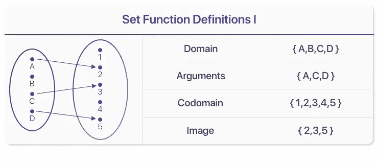
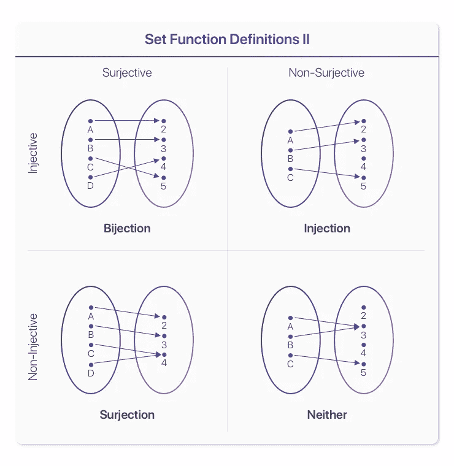

# 集合论—函数

> 原文：<https://towardsdatascience.com/set-theory-functions-4548c1b106f9?source=collection_archive---------11----------------------->

## 用双射、满射和内射描述行为

Originally Published On [https://www.setzeus.com/](https://www.setzeus.com/)

今天我们将在集合论的世界里展开 ***函数*** 。与前面介绍的概念相似，集合内标准函数的命名法与其他数学分支略有不同，&因此需要复习。有相当多的术语要介绍，所以让我们直接开始吧！下面的第一个函数术语表反映了标准函数的域、范围、&输出的概念:

Originally Published On [https://www.setzeus.com/](https://www.setzeus.com/)

集合论世界中的一个*函数*简单来说就是集合 A 中的一些(或全部)元素到集合 b 中的一些(或全部)元素的映射，在上面的例子中，A 中所有可能元素的集合被称为 ***域****；*而 A 中作为输入的元素被专门命名为 ***arguments*** 。在右边，所有可能输出的集合(在其他分支中也称为“范围”)，称为*；而从 A 映射到 B 中的实际输出元素的集合被称为 ***图像。****

*到目前为止没什么太复杂的，只是用一种新的方式定义函数的参数。接下来，我们将介绍如何用常见的函数类型来描述这些映射函数的行为。*

# *注射、满射和双射*

*在集合论中，常用三个术语对集合映射进行分类:**内射**、**满射&双射。**不幸的是，这些术语有几个不同的名称，这加剧了混淆——因此，我们将首先回顾每个定义，然后，浏览一些直观的示例。这三个术语都描述了参数&图像的映射方式:*

*   *一个函数是 [**内射的**](https://en.wikipedia.org/wiki/Injective_function) ( **又名“一对一”**)，如果共域的每个元素至多被*映射到*域的一个元素。*
*   *一个功能是[一个**一个**一个](https://en.wikipedia.org/wiki/Surjective_function) ( **一个**)。 **k.a "到"**)如果共域的每个元素被*映射到域的至少*一个元素。(即函数的像和共域相等。)*
*   *如果密码子的每个元素被结构域的一个元素*精确地映射到*上，则函数是 [**双射**](https://en.wikipedia.org/wiki/Bijective_function) ( **又名“一对一的&到”、“一对一的对应关系”**)。*

*在这里，复杂命名法之上的众所周知的“樱桃”延伸到了“注射的”、“满射的”和“双射的”这些词的可能含义用于*描述*一个函数(映射)时，前者的含义是正确的；然而，纯粹通过这些特征来*识别*函数(映射)也是正确的。所以有注射行为的函数叫做*注射*，有注射行为的函数叫做*注射*，&最后，有双注射行为的函数叫做*双注射*。*

*重新阅读上面的要点。双射只是一个满足*和*先前要求的函数——也就是说，该函数是*和*双射&射。&射函数不一定是射的。接下来是一个直观的例子，这三个分类导致了以下四种可能的注射&射特征组合的集合函数，总结如下:*

**

*Originally Published On [https://www.setzeus.com/](https://www.setzeus.com/)*

*我们走吧！我们现在对集合世界中常见的映射类型有了初步的了解。然而，这绝不是旅程的结束，因为我们一直在回顾高级别介绍——与此相反，这只是开始。*

*集合论的基础是解开数学高等分支中的理解的关键。为了继续我们在许多分支中的提升，我们接下来将利用我们的集合论知识来消化所有数学史上绝对最具开创性的理论之一:策梅洛-弗兰克尔集合论。*

****原为发表于****

*[https://www.setzeus.com/](https://www.setzeus.com/)*