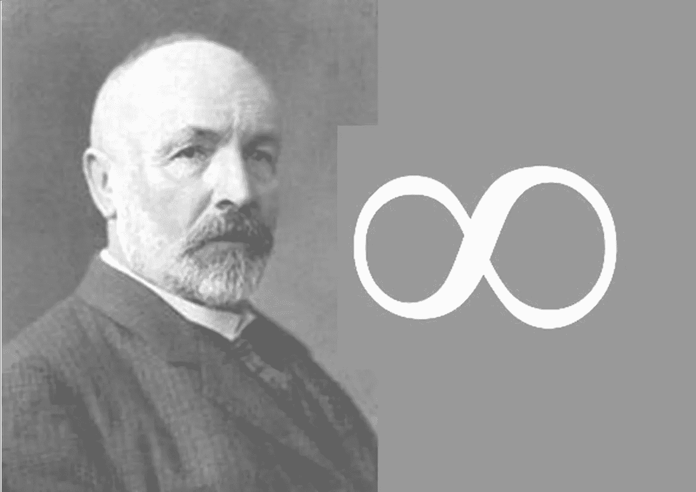
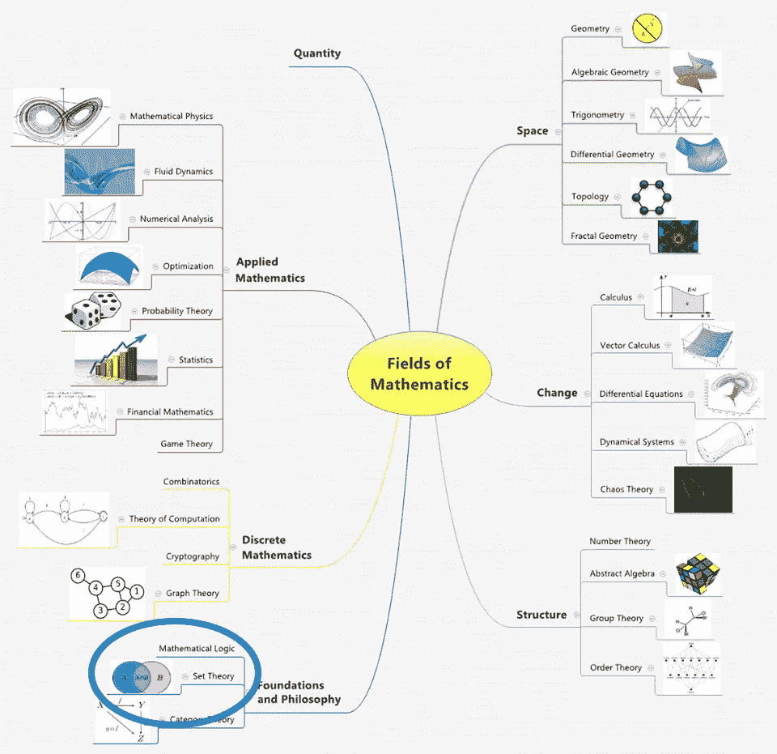

# 集合论——历史与概述

> 原文：<https://towardsdatascience.com/set-theory-history-overview-c98bac98f99c?source=collection_archive---------5----------------------->

## 第一部分——什么是集合论&为什么它与今天相关？

Originally Published: [https://www.setzeus.com/](https://www.setzeus.com/)

无穷大的概念在意识形态上与普通的数学术语相去甚远——在数学圈之外，没有任何其他主题可以从实用的分析工具转化为神话般的现象。与宗教和哲学等文化话题相结合，*无限*的概念拥有一种特殊的神性光环。

曾几何时，在所有的学科中，*存在一个单一的***无限，这是一个基本假设。**

*然后，在 1874 年，一位相对默默无闻的数学家发布了一组突破性的观察&针对这一世俗的、根深蒂固的信仰的革命性问题。一个叫乔治·康托(Georg Cantor)的人，在他现在已成为传奇的出版物 [*中，关于所有实代数数*](https://srjcstaff.santarosa.edu/~jomartin/IrratFiles/Cantors1874Paper.pdf) 的集合的一个性质，证明了实数[的集合](https://en.wikipedia.org/wiki/Real_number)比实代数数的集合“更多”。这第一次表明，存在不同大小的无限集合(不要担心，我们将很快详细回顾他的论文以澄清)。*

**

*A Set Is Many That Allows Itself To Be Though Of As One — Georg Cantor*

*在 1874 年和 1897 年之间，康托尔不顾一切地出版了一份又一份出版物——把他的抽象集合理论扩展成一门欣欣向荣的学科。然而，他遇到了持续的抵制和批评；事实上，许多训导者认为他的理论侵犯了哲学家的领域&违反了宗教原则。*

*然而，一旦分析的应用开始被发现，人们的态度就改变了。他的想法和结果逐渐被接受。到了 1900 年代，他的观察、理论出版物最终导致了对现代集合论(T21)的认可，这是一个全新的、完全不同的数学分支:*

****集合论*** *是关于称为集合的明确集合的数学理论，这些集合由称为集合的成员或元素的不同对象组成。**

# *0 和 1 之间有多少个数字？*

*在简洁的四页半，康托尔的原始出版物设置为紧凑的辉煌展示酒吧。它被分成两种不同的证明，它们一起得出结论，承认至少两种独特类型的无限。*

*理论的第一部分考察了[实数、**代数**数](https://en.wikipedia.org/wiki/Algebraic_number) &的集合，确定它是一个*可数无穷集合*。这里不要迷路，“可数”不一定是严格按整数计数；在集合论的上下文中，可数意味着一个集合，甚至是无限元素中的一个，可以用一个可重复的序列来描述*，比如一个有序的多项式函数*。康托尔把这个可以与一个序列一一对应的无穷多个数的集合的性质称为 ***一一对应。****

*简而言之，所有实数、代数数的集合或集合可以使用*一些*具有不同次数系数的多项式的理论序列&来导出；因此，所有实数、代数数的集合是一个*可数无穷*集合。*

*康托尔论文的第二部分分析了实数的作用，*复数*数字，又称 [*先验数字*](https://en.wikipedia.org/wiki/Transcendental_number) *。超越数，最好的例子是 pi & e，有一个奇特的性质，在数学上不可能用多项式函数来推导它们——它们是*而不是*代数的。无论高度、部分数量、次数或系数如何，没有一个序列*会*在它的可数无穷集合中计算圆周率。**

*康托尔接着指出，在任何实数的*闭区间[ *a* ， *b* ]中，至少存在一个*超越数，它永远不会被计数到一个可数无穷集合中。因为存在一个这样的数，所以假设在实数家族中存在无限个超越数。***

*因此，第一次证明了一组连续的、流动的不可数数字之间的非常明显的区别&一组可数的、可排序的数字，例如所有的实代数数。*

# *论符号与运算*

*康托尔的第一份出版物就停留在对至少两种不同的无限的惊人确认上。从这个原始出版物开始，出现了一系列附录，缓慢但稳定地为现代集合论铺平了道路。*

**

*Originally Published: [https://www.setzeus.com/](https://www.setzeus.com/)*

*这里值得注意的一个有趣的观察是，大多数在实践中使用集合论的人并不看重某个特定的定理，而是更看重它所建立的的*广义语言。由于它的抽象性质，集合论的影响存在于许多其他数学分支的幕后。在需要微分&积分的分析中，对极限&函数连续性的理解最终基于集合论。在[布尔代数](http://science.jrank.org/pages/993/Boolean-Algebra.html)中，“与”、“或”、“非”的逻辑运算与交集、并集、 *&* 差的集合论运算相对应。最后但同样重要的是，集合论提供了*拓扑学*的基础，研究几何性质&的空间关系**

*现在对集合的历史有了基本的了解&快速预览它的影响深度，是时候熟悉基本的集合论符号了。在下一篇文章中，我们将介绍集合维恩图的常见符号、操作以及许多配置。*

****来源****

*[集合论:第一门课程](https://amzn.to/2Ds4bPV)
[集合论的一本书](https://amzn.to/2XeoEyU)*