# 在谷歌云平台上设置深度学习服务器

> 原文：<https://towardsdatascience.com/set-up-a-deep-learning-server-on-google-cloud-platform-b4d6823d6cd8?source=collection_archive---------22----------------------->

使用 TensorFlow、Keras、Python 和 Jupyter Notebook 配置和设置深度学习服务器的非常简单的方法

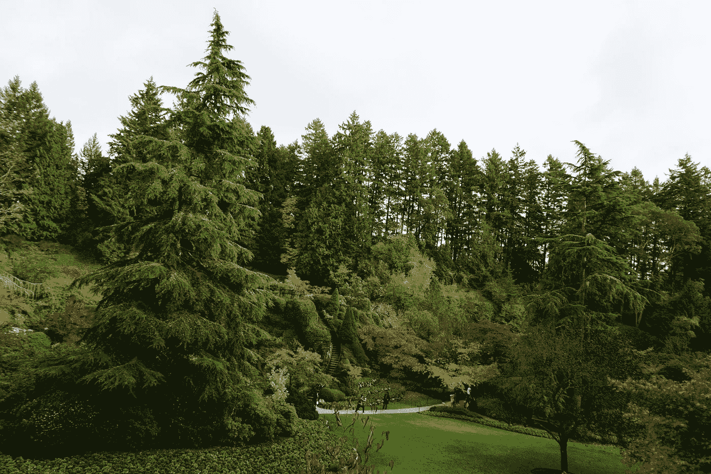

Photo by [Thuan Nguyen](https://unsplash.com/@tlnguyen?utm_source=unsplash&utm_medium=referral&utm_content=creditCopyText) (The Butchart Gardens, Victoria, British Columbia, 10/2019)

诸如机器学习和深度学习的人工智能(AI)领域正在快速发展，并且由于深度学习在试图训练大量数据(即，大数据)的准确性方面的优势，深度学习最近变得更加流行。近年来，人工智能深度学习在包括工程、医学和制造业在内的不同领域取得了令人惊叹的成就。为了促进和加快建立、训练和测试神经网络的任务，研究人员和从业人员可以使用各种人工智能框架，其中由谷歌开发的开源库 TensorFlow 是目前最受欢迎的一个。手动安装包括工具在内的所有必需的软件应用程序，并使它们在深度学习服务器中平稳可靠地工作，并不是一件容易的事情。使用深度学习映像在谷歌云平台(GCP)上建立远程服务器会容易得多，这些映像可以与所有必要的软件应用程序和开发工具一起使用。它甚至更好的信用$300.00，可用于服务器。

# 1.在 GCP 创建项目

## 1.1 创建一个 Google 帐户或 Google Gmail 帐户

使用谷歌云平台需要谷歌账号或 Gmail 账号。如果用户没有，他/她需要创建一个

## 1.2 获得 GCP 价值 300 美元的 12 个月免费试用

访问链接:

[https://cloud.google.com/free/](https://cloud.google.com/free/)

使用上述 Google 帐户/Gmail 获得此信用点数。

# 2.访问 GCP 控制台

—)打开 Chrome 浏览器

—)输入:谷歌云控制台进入网址搜索框

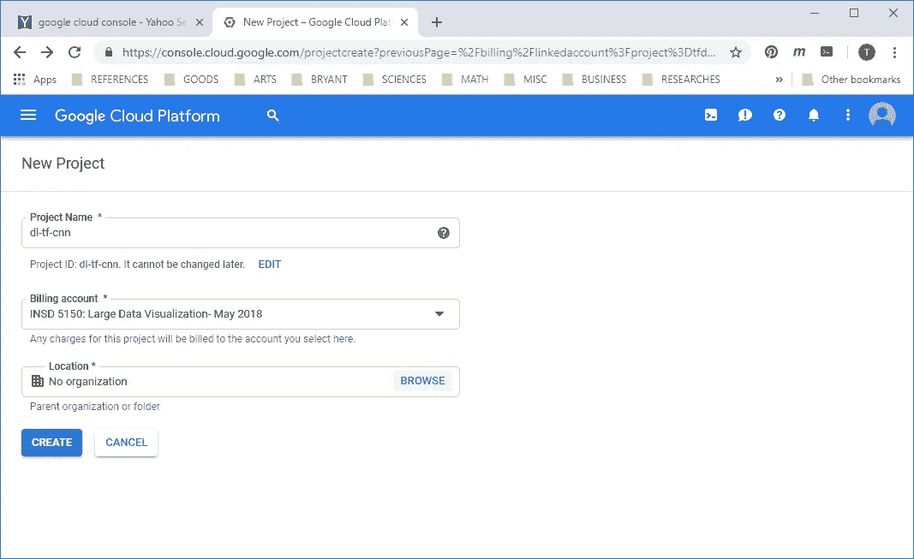

# 3.使用 GCP 深度学习图像创建深度学习服务器

在 https://cloud.google.com/deep-learning-vm/访问云深度学习虚拟机镜像链接

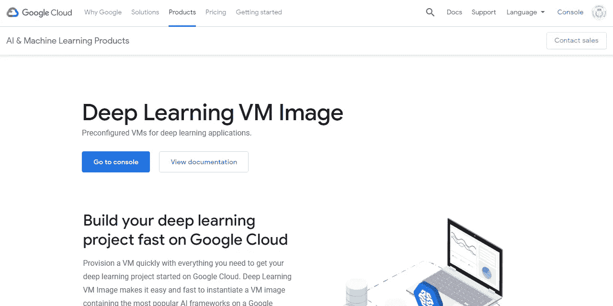

点击转到控制台

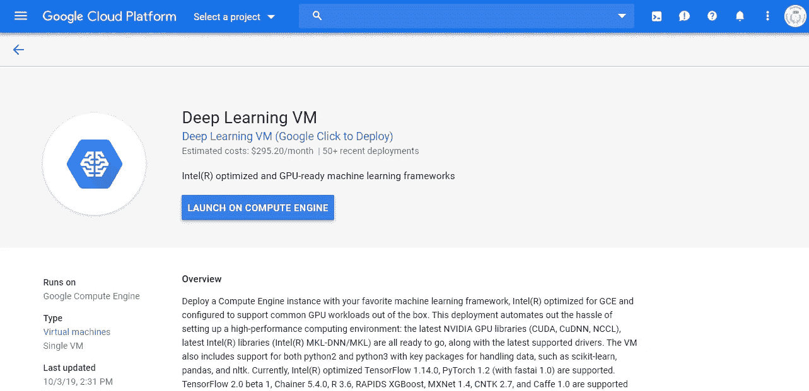

单击顶部菜单栏上的箭头选择项目，例如，选择名为“EXAMPLE_PROJECT”的项目(**备注** : *新的深度学习服务器将在这个项目下创建为 GCP 计算引擎实例。*)

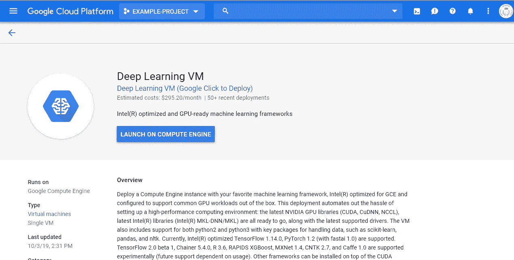

单击计算机引擎上的启动

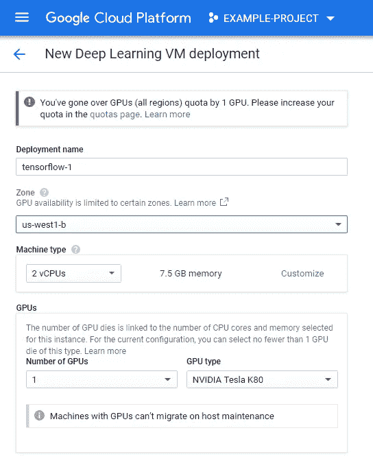

输入实例的名称，例如“tf1-keras-ann”(**注释** : *用户可以根据自己的需要命名实例。*)

选择区域:“us-east1-c”或此链接上可用的任何其他区域:[https://cloud.google.com/compute/docs/regions-zones/](https://cloud.google.com/compute/docs/regions-zones/)

选择机器类型:点击箭头打开下拉菜单并选择机器类型:n1-standard-8 对于一个正常的深度学习项目来说是一个不错的选择。

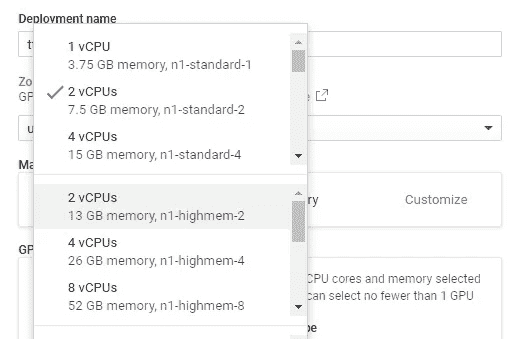

选择 GPU 的数量

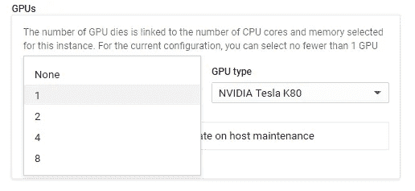

若要降低使用服务的费用，请选择“无”但是，如果用户需要，请选择要部署的 GPU 数量。

选择 AI 框架的版本:选择 TensorFlow 1.xx 或 TensorFlow 2.0。

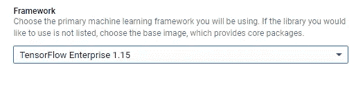

选择启动盘类型和大小

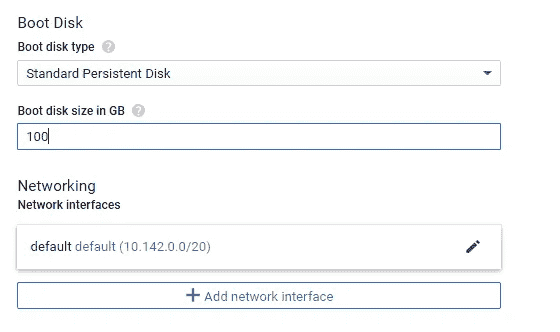

选择标准永久磁盘或 SSD 永久磁盘
,输入以 GB 为单位的引导磁盘大小:64 GB 或更大

单击部署

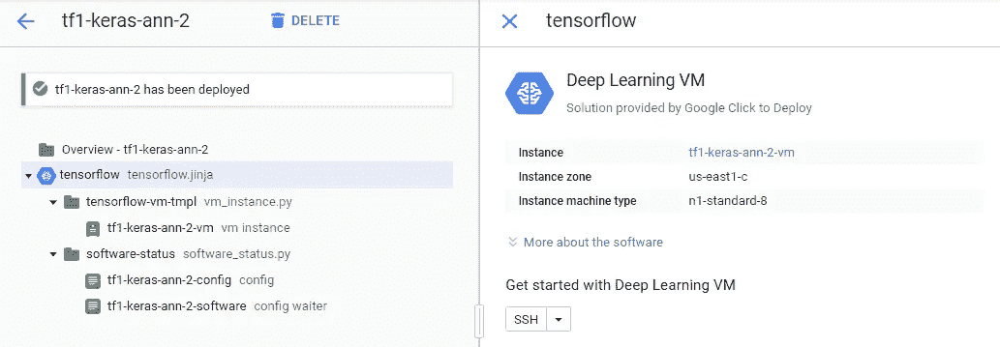

…等待深度学习服务器的部署被部署……..

**点击产品和服务图标**(左上角的三个水平条)打开菜单

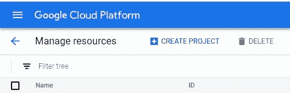

选择计算引擎

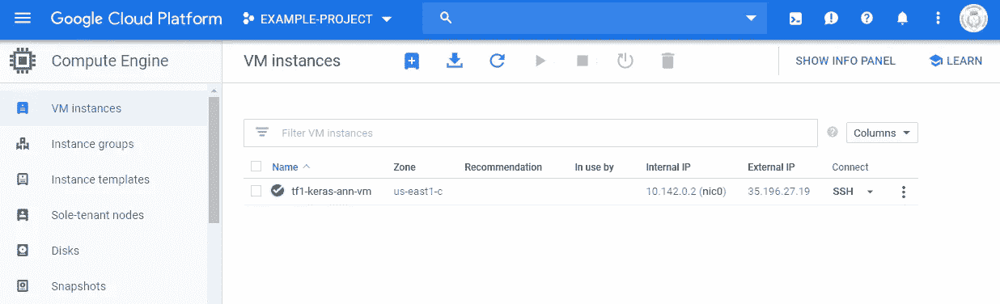

**完成了！**

深度学习服务器已经成功搭建在谷歌云平台(GCP)上。

**重要提示**:

—)用户**在不使用虚拟机**时必须将其停止，以避免不必要的费用。