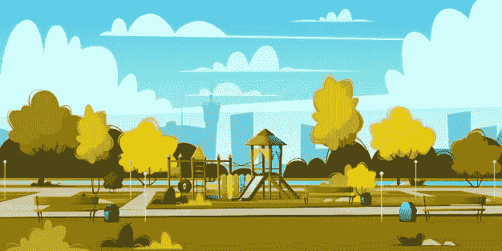

# 用 Playground.jl 在 Julia 中设置虚拟环境

> 原文：<https://towardsdatascience.com/set-up-virtual-environment-in-julia-with-playground-jl-7ab02a0df751?source=collection_archive---------36----------------------->



在任何语言的项目中，有超过十亿个理由让你想要使用虚拟环境，这种情绪在 Julia 中也不例外。当与一个没有虚拟环境的团队一起工作时，开发 web 应用可能是灾难性的。幸运的是，Julia 有一个相当于 virtual/pipenv 的包虚拟化工具，叫做 **Playground.jl** 。

# 搭建游乐场

在我们可以使用操场之前，我们当然需要设置它。如果您还没有添加软件包，您可以使用:

```
julia> using Pkg
julia> Pkg.add("Playground")
```

有趣的是，这对我不起作用，所以我最终切换到 Pkg REPL，只需按下]，然后通过 URL 添加它，就像这样:

```
julia> ]
pkg> add [https://github.com/rofinn/Playground.jl](https://github.com/rofinn/Playground.jl)
   Cloning git-repo `[https://github.com/rofinn/Playground.jl`](https://github.com/rofinn/Playground.jl`)
  Updating git-repo `[https://github.com/rofinn/Playground.jl`](https://github.com/rofinn/Playground.jl`)
[ Info: Assigning UUID f8d4ef19-13c9-5673-8ace-5f74ae9cf246 to Playground
 Resolving package versions...
 Installed Syslogs ─ v0.3.0
 Installed Memento ─ v0.12.1
  Updating `~/.julia/environments/v1.0/Project.toml`
  [f8d4ef19] + Playground v0.0.0 #master ([https://github.com/rofinn/Playground.jl](https://github.com/rofinn/Playground.jl))
  Updating `~/.julia/environments/v1.0/Manifest.toml`
  [f28f55f0] + Memento v0.12.1
  [f8d4ef19] + Playground v0.0.0 #master ([https://github.com/rofinn/Playground.jl](https://github.com/rofinn/Playground.jl))
  [cea106d9] + Syslogs v0.3.0
  Building Playground → `~/.julia/packages/Playground/AhsNg/deps/build.log`
```

> 酷！

为我建造操场也通过一个错误，一个 Stacktrace: Pkg 未定义的错误。为了解决这个问题，我必须首先运行:

```
ENV["PLAYGROUND_INSTALL"] = true
```

然后我不得不用朱莉娅·REPL 的 Pkg 来建造它…我不确定这是为什么，但我想这与操场依赖有关。

虽然这不是必需的，但我也在我的。bashrc 文件，因为有时需要它:

```
echo "PATH=~/.playground/bin/:$PATH" >> ~/.bashrc
```

# 使用

用法相对简单，但是需要注意的是，您可能需要关闭并重新打开终端，以便 bashrc 文件回显新命令。为了创造我们的环境，我们使用操场创建:

```
playground create --name example
```

您还可以根据需求创建环境:

```
playground create --requirements /path
```

如果使用声明文件，你应该确保已经安装了`DeclarativePackages.jl`。我们可以像这样激活我们的操场环境:

```
playground activate /path/to/your/playground
```

另外，playground 保存了我们环境的名称，所以我们可以在终端中使用名称 bash 标签。

```
playground activate --name example
```

为了移除我们的环境，我们将使用 rm。

```
playground rm [playground-name|julia-version] --dir /path
```

此外，我们有操场名单和操场清洁。

```
playground list
playground clean
```

# 就是这样！

这就是概要！这就是全部内容，playground 很容易使用，也不太深入。因此，希望在缺乏操场文档资源的情况下，这是相对有价值的，并且您现在知道如何在 Julia 中创建和管理虚拟环境了！