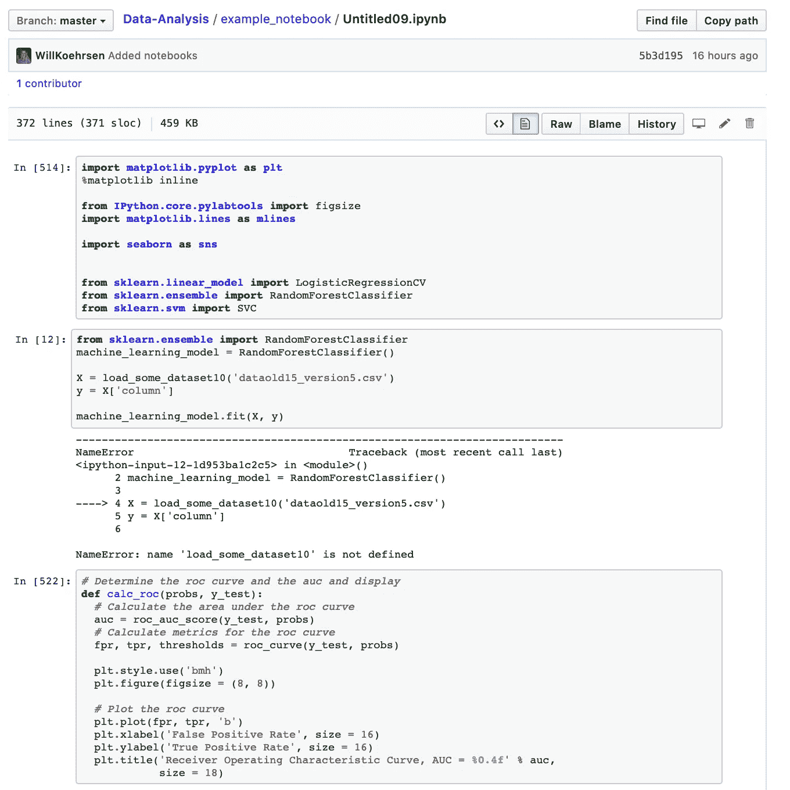
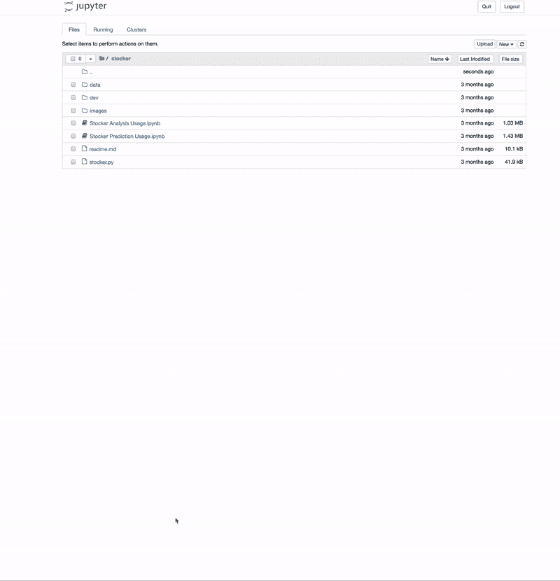
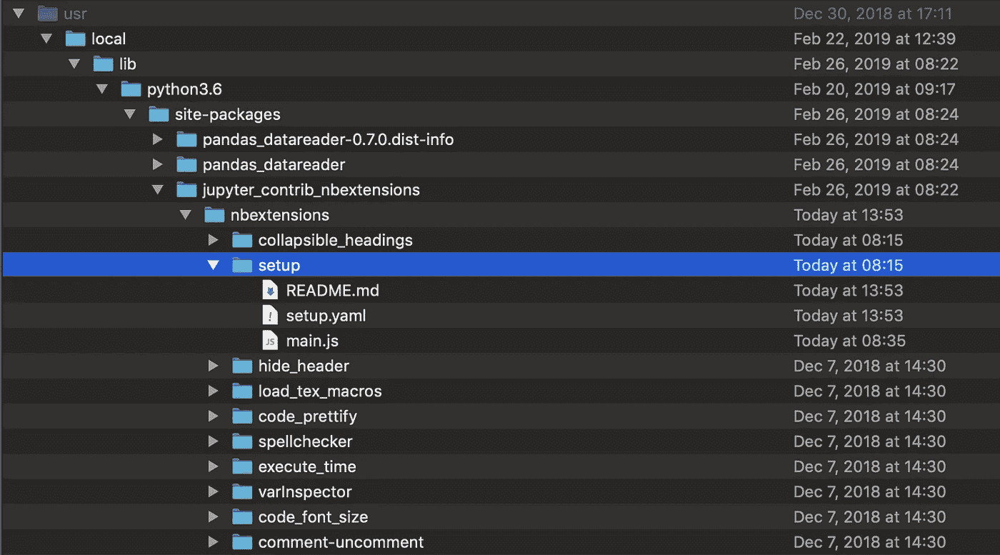
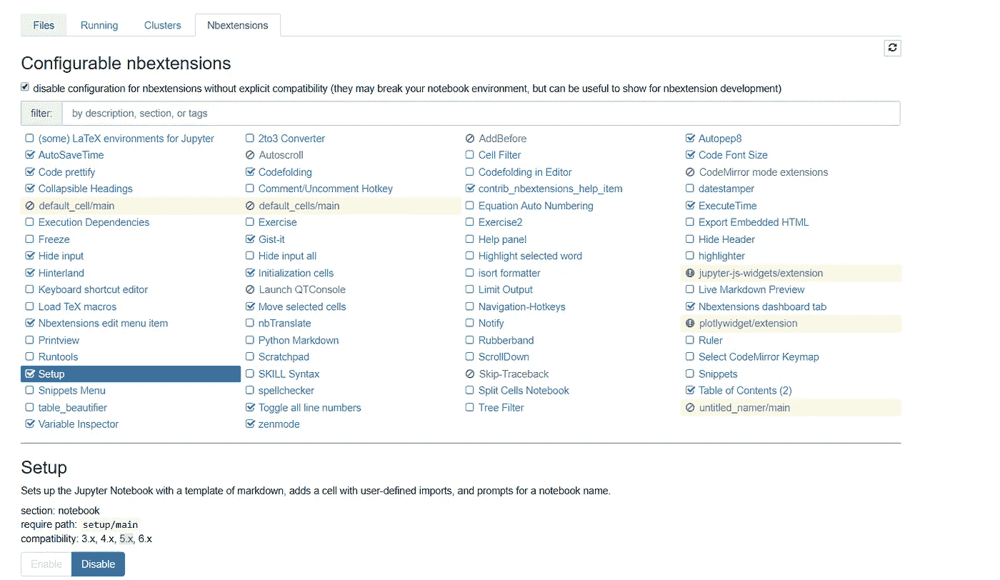
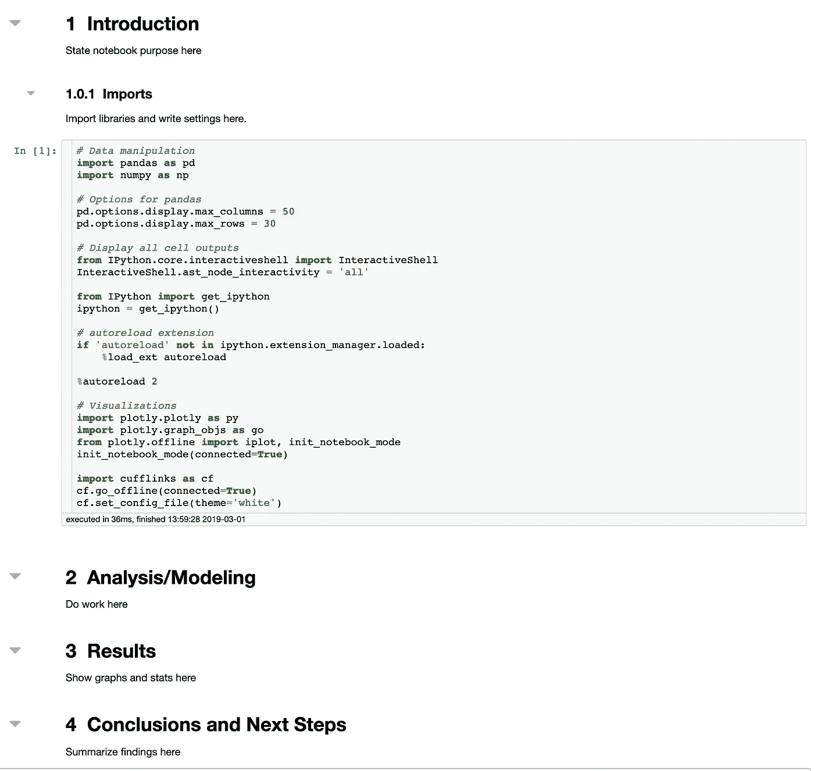
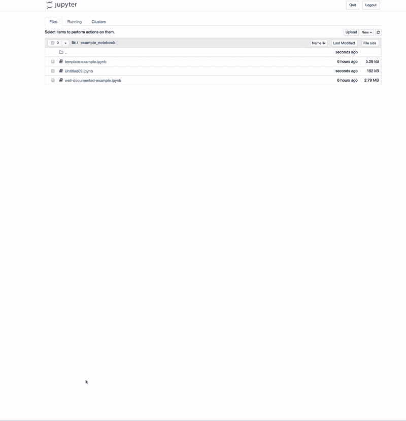

# 使用此扩展设置您的 Jupyter 笔记本

> 原文：<https://towardsdatascience.com/set-your-jupyter-notebook-up-right-with-this-extension-24921838a332?source=collection_archive---------2----------------------->

[(Source)](https://www.pexels.com/photo/aerial-photography-of-sea-1902647/)

## 一个方便的 Jupyter 笔记本扩展，帮助您创建更有效的笔记本

在精彩的演讲“我不喜欢笔记本”([视频](https://www.youtube.com/watch?v=7jiPeIFXb6U)和[幻灯片](https://docs.google.com/presentation/d/1n2RlMdmv1p25Xy5thJUhkKGvjtV-dkAIsUXP-AL4ffI/edit#slide=id.g362da58057_0_1))中，Joel Grus 对 Jupyter 笔记本提出了无数批评，这可能是最受欢迎的数据科学环境。我发现这个演讲很有教育意义——当每个人都认为某件事很棒时，你需要那些愿意批评它的人，这样我们才不会变得自满。然而，我认为问题不在于笔记本本身，而在于它是如何被使用的:像任何其他工具一样，Jupyter 笔记本可能(也确实)经常被滥用。

因此，我想修改 Grus 的标题并声明“我不喜欢*凌乱的、没有标题的、没有解释或评论的无序笔记本*Jupyter 笔记本是为[文字编程](https://en.wikipedia.org/wiki/Literate_programming)而设计的——将代码、文本、结果、图表和**解释**混合在一个无缝文档中。据我所见，这种观念经常被完全忽视，导致 GitHub 上可怕的笔记本充斥着资源库:

Don’t let notebooks like this get onto GitHub.

问题很明显:

*   **没有标题**
*   **没有解释代码应该做什么或如何工作**
*   **电池运行不正常**
*   **单元输出错误**

Jupyter 笔记本可以成为学习、教学、探索和交流的非常有用的工具([这里是一个很好的例子](https://github.com/WillKoehrsen/Data-Analysis/blob/master/bayesian_log_reg/Bayesian-Logistic-Regression.ipynb))。然而，如上所述的笔记本在所有这些方面都失败了，当这些问题出现时，几乎不可能调试其他人的工作，甚至不可能弄清楚他们在试图做什么。至少，任何人都应该能够为笔记本命名一些有帮助的东西，写一个简短的介绍，解释和结论，按顺序运行单元格，并确保在将笔记本发布到 GitHub 之前没有错误。

## 解决方案:安装 Jupyter 笔记本扩展

我决定看看 Jupyter 笔记本扩展能做些什么，而不是仅仅抱怨这个问题。结果是在自动打开新笔记本时的扩展:

*   创建一个模板来鼓励文档
*   插入常用的库导入和设置
*   反复提示您将笔记本名称从“无标题”更改为

The extension running when a new notebook is opened

这个扩展的好处是它改变了默认值。默认情况下，Jupyter 笔记本没有降价单元格，没有命名，也没有导入。我们知道[人类是出了名的不擅长改变默认设置](https://en.wikipedia.org/wiki/Nudge_(book))，那么为什么不让默认设置鼓励更好的实践呢？把安装扩展[想象成一个轻推](https://en.wikipedia.org/wiki/Nudge_theory)——一个轻轻地推动你写更好的笔记本的东西。

要使用此扩展:

1.  安装 [Jupyter 笔记本扩展](/jupyter-notebook-extensions-517fa69d2231)(无论如何你都应该使用)
2.  G [o 到 GitHub，下载](https://github.com/WillKoehrsen/Data-Analysis/tree/master/setup) `[setup](https://github.com/WillKoehrsen/Data-Analysis/tree/master/setup)` [文件夹](https://github.com/WillKoehrsen/Data-Analysis/tree/master/setup)(有 3 个文件)
3.  运行`pip show jupyter_contrib_nbextensions`找到笔记本扩展的安装位置。在我的 Windows 机器上(带有 anaconda ),它们位于

`C:\users\willk\anaconda3\lib\site-packages\jupyter_contrib_nbextensions`

在我的 mac 上(没有 anaconda ),它们位于:

`/usr/local/lib/python3.6/site-packages/jupyter_contrib_nbextensions`

4.将`setup`文件夹放在上述路径下的`nbextensions/`中:

5.运行`jupyter contrib nbextensions install`安装新的扩展

6.运行 Jupyter 笔记本并启用`nbextensions`选项卡上的`Setup`(如果您没有看到此选项卡，请打开笔记本并转到`edit > nbextensions config)`

Enable the Setup extension on the nbextensions tab

现在打开一个新的笔记本，你就可以开始了！你可以在`main.js`中改变默认模板(参见我的[关于编写 Jupyter 笔记本扩展的文章](https://medium.com/@williamkoehrsen/how-to-write-a-jupyter-notebook-extension-a63f9578a38c)，了解更多关于如何编写你自己的模板的细节)。默认模板和导入相对简单，但是您可以根据需要定制它们。

Default template and imports

如果你打开一个旧的笔记本，你不会得到默认的模板，但每次运行一个单元格，你会被提示从`Untitled`开始更改名称:

The Setup extension will continue prompting until the notebook name is changed from Untitled.

有时候，你需要一点点坚持来改变你的方式。

## 离别的思绪

从现在开始，让我们努力创造更好的笔记本。这不需要太多额外的努力，而且回报很大，因为其他人(和你未来的自己)将能够从你的笔记本上学习，或者使用结果来做出更好的决定。这里有一些简单的规则来写有效的笔记本:

*   给你的笔记本命名。当你有几十个文件时，简单但有用。
*   添加清晰而简明的解释，说明您的代码做了什么，如何工作，最重要的结果是什么，以及得出了什么结论。我使用笔记本的标准模板来鼓励这个习惯。
*   在共享笔记本之前，请按顺序运行所有单元格，并确保没有错误。

安装扩展不会解决所有与笔记本相关的问题，但希望这些小小的推动会鼓励你养成更好的习惯。建立最佳实践需要一段时间，但是，一旦你把它们记下来，它们往往会坚持下来。通过一点点额外的努力，我们可以确保下一次有人谈论笔记本时会说:“我喜欢高效的 Jupyter 笔记本。”

一如既往，我欢迎反馈和建设性的批评。可以通过 Twitter [@koehrsen_will 联系到我。](http://twitter.com/@koehrsen_will)