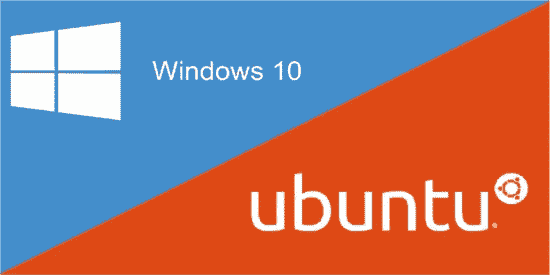
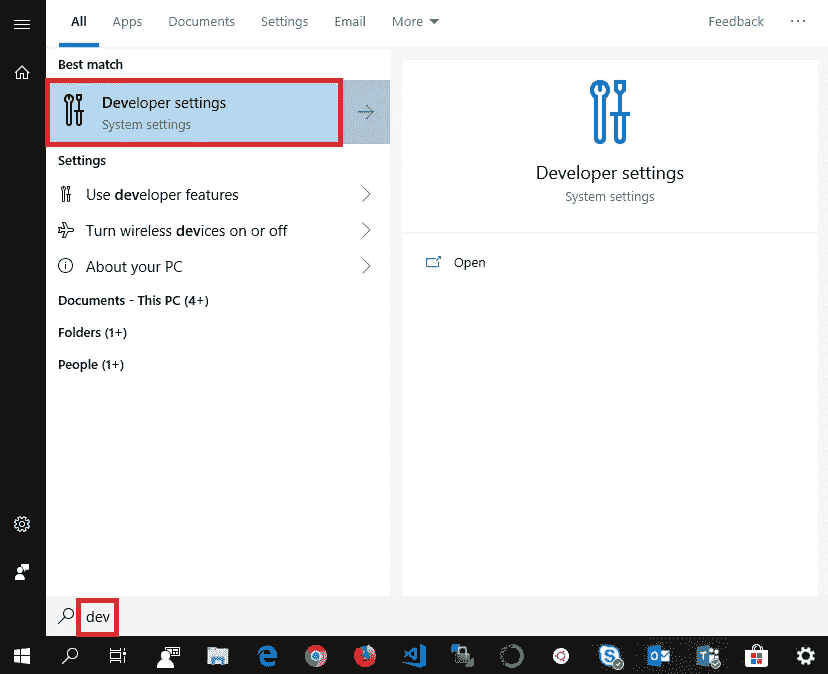
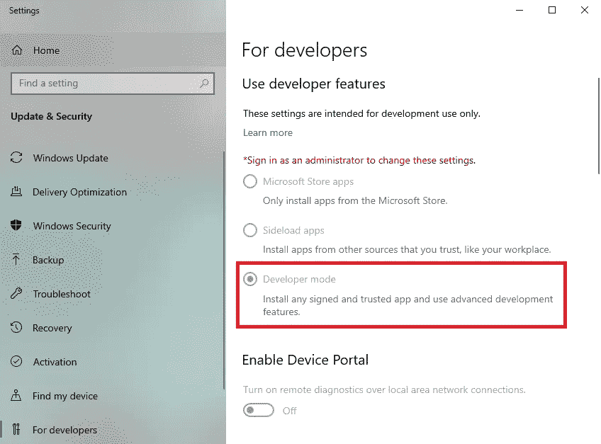
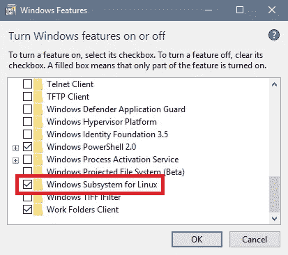
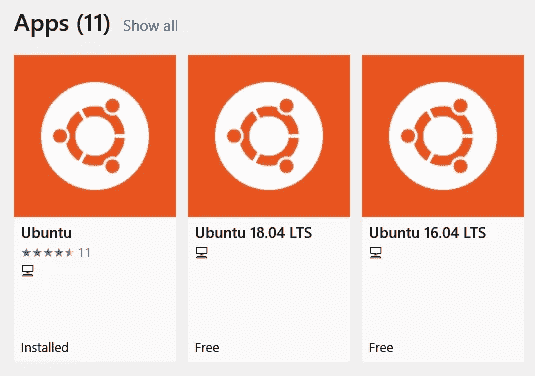
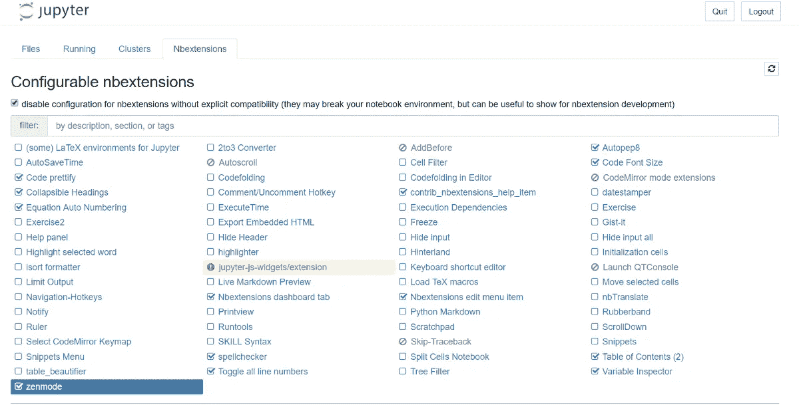
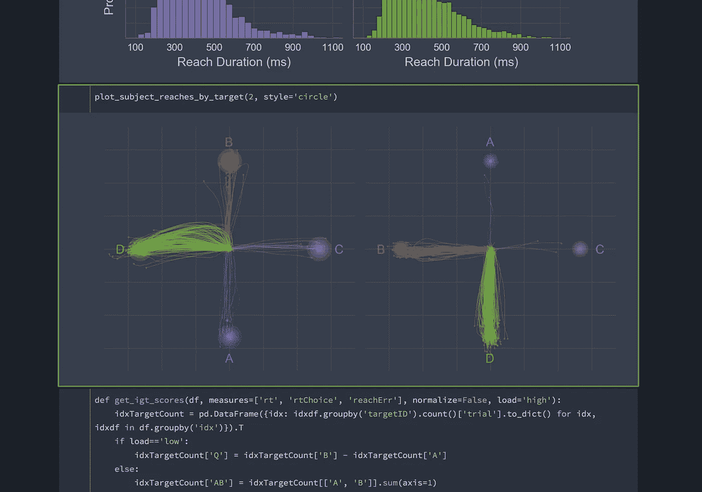

# 使用 Windows Subsystem for Linux (WSL)和 Jupyter 建立数据科学环境

> 原文：<https://towardsdatascience.com/setting-up-a-data-science-environment-using-windows-subsystem-for-linux-wsl-c4b390803dd?source=collection_archive---------4----------------------->

您将从本文中学到什么:在 Linux 系统中使用 WSL 在 Windows 中使用完全可定制的 Jupyter 笔记本建立一个完整的 Python 环境！


## 我们要做的是:

*   设置 **WSL** (可选 **ZSH** 和**哎呀呀**
*   设置**蟒蛇**。
*   设置可定制的 **Jupyter 笔记本**环境。

如果你喜欢这篇文章并想看更多，请务必关注我的简介。

# 设置 **WSL**



**Windows Subsystem for Linux** (**WSL**) is a compatibility layer for running **Linux** binary executables **natively** on **Windows 10**! It also has the added benefit of you getting **full admin rights** to the subsystem once installed.

首先，我们必须做一些初步的设置来让 WSL 工作:

## 1 —打开开发者模式

首先进入 Windows 10 设置菜单中的开发者设置:

*设置➡更新&安全➡开发者➡开发者模式*

或者简单地搜索“**开发人员**，然后点击“**开发人员设置**



在这里，您可能需要登录管理员帐户或获得临时访问权限来打开开发人员模式:



一旦启用，我们需要打开 Linux 的 Windows 子系统功能。

## 2 —为 Linux 打开 Windows 子系统

该菜单可通过以下方式访问:

*控制面板➡程序➡打开和关闭 Windows 功能*

或者通过搜索“ **windows 功能**并选择“**打开或关闭 windows 功能**


接下来，确保勾选了特性“**Windows Subsystem for Linux**”:



## **3 —重启电脑**

我认为这不需要任何解释。

## 4 —安装 Ubuntu

前往**微软商店**，搜索 *Ubuntu* ，选择**应用**(唉..)您喜欢并安装它:



I’m personally using the default “**Ubuntu**” version.

当第一次启动时，你会被提示输入一个 **UNIX 用户名**和**密码**，选择你认为合适的。

> *祝贺您，您现在拥有了一个全功能的 Linux 子系统，并拥有完全的管理员权限！*

## 5 —设置 ZSH 和 Oh-my-zsh(可选)

就我个人而言，我不太喜欢默认终端的外观，所以我建议按照这个安装 **ZSH** 和**我的天啊**，如果你喜欢的话:

[](https://blog.joaograssi.com/windows-subsystem-for-linux-with-oh-my-zsh-conemu/) [## 用 zsh + oh-my-zsh + ConEmu 为 Linux 设置 Windows 子系统

### 的时代。NET 开发者被限制只能使用 Windows 作为平台的时代已经一去不复返了。(至少对于 ASP 来说是这样。网)。那个…

blog.joaograssi.com](https://blog.joaograssi.com/windows-subsystem-for-linux-with-oh-my-zsh-conemu/) 

# 设置 Anaconda


**Anaconda** is one of the most widely used solutions for package management for **R** and **Python**, it comes with **1.500+ popular packages** out of the box which is more than enough for **99%** of all Data Science related tasks!

**1 —下载 Anaconda** 启动新配置的 WSL 并下载 Anaconda:

```
wget [https://repo.anaconda.com/archive/Anaconda3-2019.03-Linux-x86_64.sh](https://repo.anaconda.com/archive/Anaconda3-2019.03-Linux-x86_64.sh)
```

**2 —安装 Anaconda** 接下来，执行下载的文件来安装 Anaconda:

```
Anaconda3-2019.03-Linux-x86_64.sh
```

**NB** :如果使用 **ZSH** 遇到问题，使用“bash anaconda 3–2019.03-Linux-x86 _ 64 . sh”。

按照屏幕上的说明安装 Anaconda 之后，只需删除安装文件:

```
rm Anaconda3-2019.03-Linux-x86_64.sh
```

**3 —更新 Anaconda** 现在您应该能够启动您的 Anaconda 环境了:

```
source ~anaconda3/bin/activate
```

*" ~ anaconda 3/bin/activate "*是 Anaconda 将自己安装的默认位置，但是如果您选择了其他位置，只需指向该目录。

激活后，启动完全更新:

```
conda update --all
```

**4 —完成** 一旦更新，向后靠，凝视你的创作，看到它是好的…

> **您已经成功地用 Anaconda 3 为 Linux 设置了一个 Windows 子系统！**

# 设置 Jupyter 笔记本电脑环境


**Jupyter** is one of the go-to **IDE** for interactive cell-based code execution with **Python** and **R**. Really well suited for **data exploration** and **analysis**!

这非常简单，因为 Jupyter 是 Anaconda 自带的，所以如果您对默认的 Jupyter 笔记本界面/环境满意，那么您已经完成了！激活 Anaconda 环境后，只需使用以下命令启动笔记本:

```
jupyter notebook
```

WSL 实例应该自动启动一个连接到笔记本的窗口，但如果不是这样，只需在 WSL 终端中找到主机地址，如下所示:**" http://localhost:8888/tree？token = somepletylongtokenhere "**并将其复制到您选择的浏览器中。

# 定制 Jupyter 笔记本电脑

我将介绍两种定制 Jupyter 笔记本体验的主要方式，分别是 **Nbextensions** 和 **Themes** ，跳转到任何与您相关的部分。

## 1-设置扩展

值得庆幸的是，这也很简单，只需运行以下命令来设置 nbextensions 包并重启您的笔记本:

```
pip install jupyter_contrib_nbextensions && jupyter contrib nbextension install
```

接下来，当您启动名为“Nbextensions”的笔记本时，会出现一个新的选项卡



现在你可以简单地挑选你想要/需要的插件，并根据你的心意定制。该界面还为您提供了每个扩展的截图和描述，因此您可以判断是否要启用它。

## 我特别推荐以下几点:

*   **腹地** —便于自动校正。
*   **目录(2)** —用于根据您的减价标题和副标题自动生成目录。
*   **切换所有行号**——便于调试。
*   **变量检查器** —对于一个类似 R 的变量概览，真的很有用！
*   **ExecuteTime** —用于为单元执行计时。
*   **Autopep8** —用于自动将您的代码格式化为 pep8 标准。
*   **可折叠标题** —便于隐藏笔记本的各个部分。

就是这样！如果您觉得这还不足以打消您对扩展的兴趣，我可以强烈推荐以下关于同一主题的文章:

[](/jupyter-notebook-extensions-517fa69d2231) [## Jupyter 笔记本扩展

### 如何充分利用笔记本电脑环境

towardsdatascience.com](/jupyter-notebook-extensions-517fa69d2231) 

## 2 —设置主题

我个人使用的是 GitHub 上 dunovank 的这个包:[](https://github.com/dunovank/jupyter-themes)

**要安装此软件包，只需运行以下命令:**

```
pip install jupyterthemes
```

**接下来开始你选择的主题；**暗**或**亮** *(请参考****GitHub****链接了解更多定制选项)*只需在您的 WSL 终端中运行以下命令之一:**

```
# DARK
**jt -t onedork -fs 95 -altp -tfs 11 -nfs 115 -cellw 88% -T**# LIGHT
**jt -t grade3 -fs 95 -altp -tfs 11 -nfs 115 -cellw 88% -T**
```

**我更喜欢深色主题，它让你的笔记本看起来像这样:**

****

> **就是这样！你完了。享受你的新环境！**

## **感谢阅读**

**我希望它对你有用。如果你觉得我遗漏了一些重要的东西，或者你只是想给我留下一些反馈，请留下你的评论！**

**如果你想看和了解更多，一定要关注我的 [**媒体**](https://medium.com/@peter.nistrup) 🔍和 [**碎碎念**](https://twitter.com/peternistrup) 🐦**

**[](https://medium.com/@peter.nistrup) [## 彼得·尼斯特鲁普-中等

### 阅读彼得·尼斯特拉普在媒介上的作品。数据科学、统计和人工智能...推特:@PeterNistrup，LinkedIn…

medium.com](https://medium.com/@peter.nistrup)**