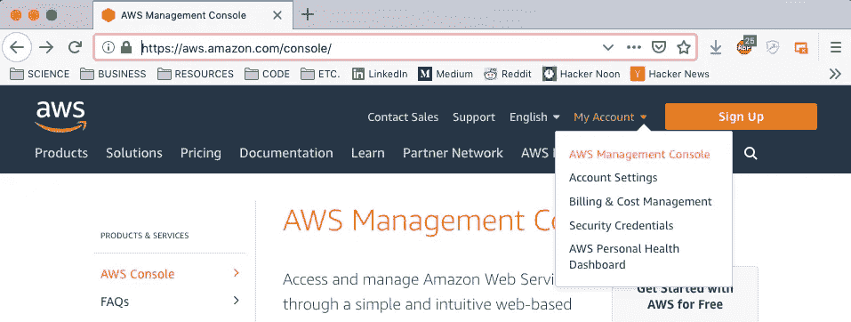
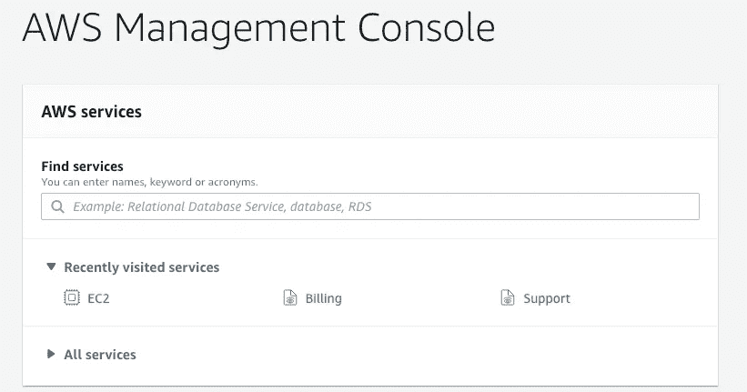
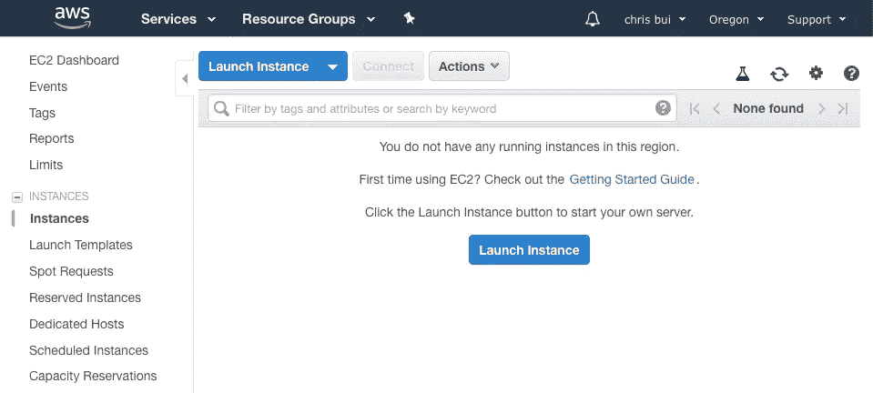
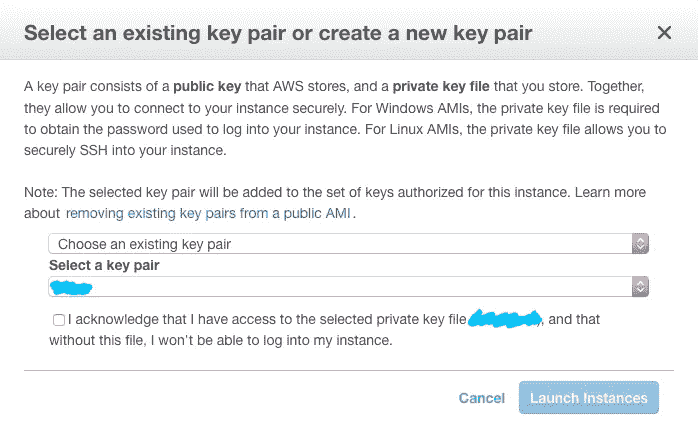
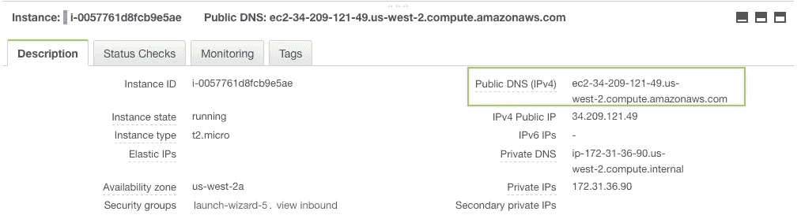
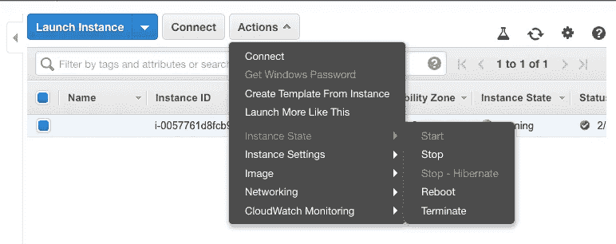

# 为初学者设置 AWS EC2 实例

> 原文：<https://towardsdatascience.com/setting-up-aws-ec2-instance-for-beginners-e34fa71a4758?source=collection_archive---------19----------------------->

如果你正在从事一个大数据机器学习项目，你很可能需要亚马逊网络服务(AWS)、谷歌云服务或微软 Azure 的服务。我第一次接触云计算是在 AWS，所以这是我最熟悉的平台。我希望使用正确的操作系统和软件包设置虚拟环境的过程像单击一个选项一样简单，但是出于安全原因和提供广泛的选项，情况并非如此。

以下是步骤:

1.  选择 EC2 AMI 和实例
2.  改变你的。pem 密钥权限
3.  通过 SSH 访问您的 EC2 实例
4.  通过 SCP 或 Git 管理您的数据

**T3 选择一个 EC2 AMI &实例 **

点击这个 [*链接*](https://signin.aws.amazon.com/signin?redirect_uri=https%3A%2F%2Fus-west-2.console.aws.amazon.com%2Fconsole%2Fhome%3Fregion%3Dus-west-2%26state%3DhashArgs%2523%26isauthcode%3Dtrue&client_id=arn%3Aaws%3Aiam%3A%3A015428540659%3Auser%2Fhomepage&forceMobileApp=0) 。登录您的 AWS 帐户，如果您还没有，请创建一个。您将花费大部分时间管理 AWS 实例的地方是 *AWS 管理控制台*。



选择 EC2 服务。



点击*启动实例*



现在，您需要选择您喜欢的 AMI (Amazon 机器映像)。AMI 因其操作系统和预安装的软件包而异。根据我的经验，大多数 AMI 都提供 Linux 或 Ubuntu 的变体。我给初学者推荐这个 [*Ubuntu 深度学习 AMI*](https://aws.amazon.com/blogs/machine-learning/get-started-with-deep-learning-using-the-aws-deep-learning-ami/) 。

接下来，选择您的首选实例。实例因存储容量以及 CPU 和 GPU 能力而异。亚马逊在这里详细介绍了他们的选项[](https://aws.amazon.com/ec2/instance-types/)**。**

*注意:如果你选择了一个相对强大的实例，那么 AWS 会要求你提交一份使用意图的说明。他们通常会在几天内回复。*

****改变自己。pem 密钥权限****

*选择实例后，会要求您创建一个新的或选择一个现有的密钥对，如下所示。*

**

*您的密钥将作为*下载到您的计算机上。pem* 文件。最佳做法是仔细存放和整理您的钥匙。如果您失去了它们，那么您就完全没有希望再次访问您的 EC2 实例。请把前面的句子读 10 遍。启动您的实例。*

*我通常将我的密钥存储在标有*的隐藏文件夹中。MacOS 上的 ssh* 。假设您的密钥已下载到“下载”文件夹，请打开一个终端窗口，并使用您合适的密钥名称键入以下命令:*

```
*cd downloadsmv ~/downloads/yourkey.pem ~/.ssh*
```

*默认情况下，您的密钥带有权限限制，这将阻止您访问实例或在实例上使用其他命令。为避免这一问题，假设您位于密钥所在的目录中，请键入以下内容:*

```
*chmod 700 yourkey.pem*
```

****通过 SSH*** 访问您的 EC2 实例*

*EC2 实例，检查；。pem 键，检查。在继续之前，您需要找到以绿色突出显示的公共 DNS。单击您新创建的实例，应该会出现如下所示的描述框。*

**

*您使用 *ssh(安全 shell)命令*来访问您的实例。打开一个终端窗口，键入以下内容，显然是替换您自己的密钥名和公共 DNS。*

```
*ssh -i ~/.ssh/yourkey.pem [ubuntu@ec2-xx-xx-xxx-xxx.us-west-2.compute.amazonaws.com](mailto:ubuntu@ec2-xx-xx-xxx-xxx.us-west-2.compute.amazonaws.com)*
```

*终端窗口应该显示一个提示，欢迎您进入实例的虚拟环境。从这个窗口，你可以传输你的文件和工作，你真棒项目！*

**注意:根据您的 AMI 的操作系统，您将在上面的 ssh 命令中的“@your_public_DNS”之前键入“ec2-user”(通常用于基本 Linux)、“ubuntu”或您合适的操作系统名称。**

**重要提示:您的公共 DNS 可能会因您的位置而异。因此，如果您在访问您的实例时遇到问题，那么很可能您的公共 DNS 已经更改，在这种情况下，请再次确认您的公共 DNS 是否正确。**

****通过 SCP 或 Git 管理您的数据****

*要在您的计算机和实例之间传输文件，您可以使用 *scp(安全协议)命令*。打开一个 *n* ew 终端窗口，其当前目录位于您的计算机上，而不在实例环境中，并键入以下内容，显然是替换您自己的键名和公共 DNS。*

**从计算机上传文件到实例**

```
*scp ~/.ssh/yourkey.pem ~/path/to/file [ec2-user@ec2-xx-xx-xxx-xxx.compute-1.amazonaws.com](mailto:ec2-user@ec2-xx-xx-xxx-xxx.compute-1.amazonaws.com):path/to/file*
```

**将文件从实例下载到计算机**

```
*scp ~/.ssh/yourkey.pem [ec2-user@ec2-xx-xx-xxx-xxx.compute-1.amazonaws.com](mailto:ec2-user@ec2-xx-xx-xxx-xxx.compute-1.amazonaws.com):path/to/file ~/path/on/local/machine*
```

*令人惊讶的是，在访问 EC2 实例的终端窗口中，您可以使用 Git 命令在实例环境和 Github 之间拉和推文件，就像在本地机器上一样。显然，实例上的所有数据都存储在 AWS 的服务器上。*

***真正重要的注意:***

*AWS 根据您选择的实例规范向您收取及时费用。无论你做的是轻活还是重活，如果你的实例开启，AWS 都会向你收费。*

*我和我的几个同事，由于不理解上述协议的无知和疏忽，犯了这个菜鸟错误，导致我们累积了几百美元的账单。幸运的是，亚马逊感同身受，取消了收费。但是，您不应该让这种情况发生。*

*因此，每当你完成一个工作会话，1 分钟或 1 小时，总是*停止*你的实例。然后当你恢复工作时，简单地*启动*它。*终止*会删除你的整个实例，所以你必须从头创建一个新的。*

**

*就这样结束了！当我开始建立 AWS 的时候，我有一个痛苦的经历，但是希望这个指南可以成为你的小抄。*

*有时，我们学习的材料并不困难，但我们的学习方法和资源有助于应对挑战。*