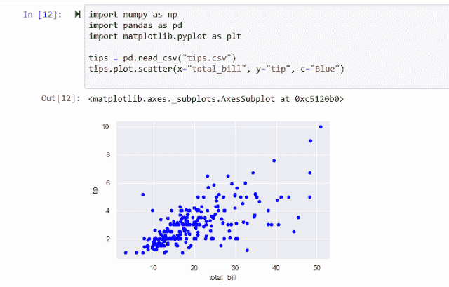
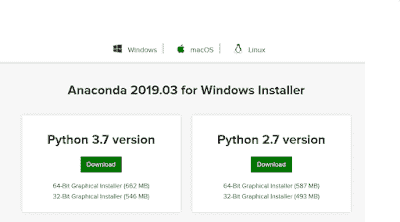
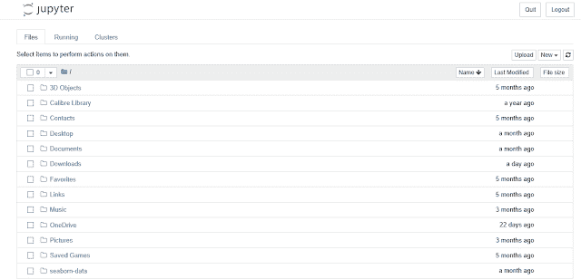
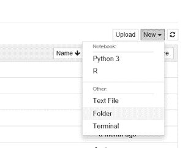
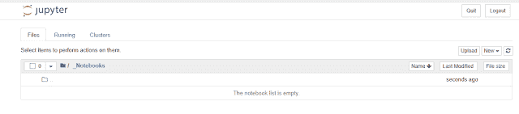
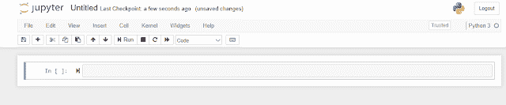
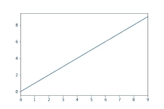

# 为 Python 中的数据可视化设置 Jupyter 笔记本

> 原文：<https://towardsdatascience.com/setting-up-jupyter-notebooks-for-data-visualisation-e287e2688af6?source=collection_archive---------16----------------------->

## Jupyter 笔记本是在交互式环境中探索数据和创建可视化效果的一种非常好且相当简单的方式。



Here’s a simple example plot from Pandas in a notebook:

## Jupyter，Python 和 Anaconda

我们将看到如何使用 Anaconda 设置 Jupyter 笔记本环境，如何创建笔记本，然后绘制第一个图形。

虽然用于创建情节的语言是 Python，但您并不需要真正了解编程，因为只需要非常有限的一套语言。你将需要学习 Pandas 和/或 Seaborn 中绘图命令的特定语法，而不是其他。在上面的例子中，大部分代码都是样板文件，这是完成工作的最后一行。

通过在程序员编辑器中编写 Python 程序并运行该程序，可以使用 Pandas 或 Seaborn。但我认为，在互动环境中制作精美图表的最简单方法是使用 Jupyter 笔记本。

因此，首先我们要设置 Jupyter 笔记本环境。

本指南不是针对经验丰富的程序员的，所以我将假设你的计算机上没有安装 Python，而是敦促你在你的计算机上安装 **Anaconda** 。

## 蟒蛇

Anaconda 是一个包，其中包含 Python 的实现以及一整套数据科学库。

下载和安装非常简单，一旦安装，你将从一个图形界面获得大量的数据科学和人工智能工具。这些工具包括 Python、Pandas 和 Jupyter，以及支持它们所需的所有库。

Anaconda 非常大——几千兆字节——但是由于大多数计算机都有几百千兆字节的存储空间，所以这对大多数人来说可能不是什么大事。对于那些空间不足的人(比如当我在 Windows 平板电脑上安装它时)，有一个更小的替代方案，Miniconda，但这需要更多的工作——我将单独介绍这一点，但现在我们将考虑完整版本。

Anaconda 可用于 Windows、MacOS 和 Linux，有 32 或 64 位版本。它还有包含 Python 2.7 Python 3.x 的版本，我建议您选择适合您机器的最新 Python 3 版本。

首先，进入 Anaconda 下载[页面](https://www.anaconda.com/distribution/)，大约在中间你会看到你的操作系统，Windows，MacOS 或者 Linux 的链接。点击正确的选项，下载安装程序。



下载安装程序后，您可以在相应的安装页面上找到如何安装的详细说明。为了方便起见，我在这里列出了它们。

*   [在 Windows 上安装 Anaconda](https://docs.anaconda.com/anaconda/install/windows/)
*   在 MacOS 上安装 Anaconda
*   [在 Linux 上安装 Anaconda](https://docs.anaconda.com/anaconda/install/linux/)

然而，安装很简单。对于 Windows 和 Mac 用户，只需从网站下载合适的版本，然后像安装其他程序一样安装即可；不需要管理员权限。

对于 Linux 用户来说，正如你所料，你需要*而不是*使用 apt-get 来安装。下载安装程序，打开一个终端窗口，导航到下载位置，然后运行命令:

```
bash ./whatever-your-file-is-called.sh
```

在安装过程中，如果有选择的话，最好接受默认选项。一旦它开始运行，安装就可以留给它自己的设备了——这可能需要一段时间，取决于你的互联网连接和你的电脑的速度。

安装快结束时，会询问你是否要安装微软的 **Visual Studio 代码**。这是一个非常好的程序员编辑器，但是如果你决定不在这个阶段安装它，你可以在以后安装它。

一旦安装在 Windows 电脑或 Mac 电脑上，你应该会在开始菜单中发现各种新项目。其中一个将是 Anaconda Navigator(如上所示)。您还可以找到 Jupyter 笔记本和 Anaconda 提示符的条目。

在 Linux 上，您可能没有将这些条目添加到您的菜单中。如果是这种情况，只需打开一个终端窗口并键入命令:

```
anaconda-navigator
```

通过这种方式，您将获得 Anaconda GUI，从中可以启动 Jupyter 笔记本。

仅此而已。安装了 Anaconda 之后，您就可以开始使用 Jupyter 来制作出色的数据可视化了。

下一篇文章将是关于实际使用一个笔记本，并用熊猫制作第一个可视化。当它准备好了，我会在这里放一个链接。

## 巨蟒领航员

我将从 Anaconda Navigator GUI 开始，因为无论您使用的是 Windows、MacOS 还是 Linux，从这里启动笔记本都是一样的。

这是导航器屏幕:


如你所见，主窗口左上角的面板是为 Jupyter 笔记本设计的，只需点击*启动*按钮即可。(您的布局可能与我的不同，但 Jupyter 笔记本面板会在某个地方，如果安装了的话。)

但是在你这么做之前，你应该知道 Jupyter 运行在你的浏览器中。启动 Jupyter 将在您的默认浏览器中创建一个新的选项卡，其页面如下所示:



当然，由于这是我的 Windows 平板电脑上的主文件夹，你的屏幕看起来不会完全一样。但它可能会包含一些文件夹，你不希望与笔记本散落在一起。因此，您可能要做的第一件事就是为您的工作创建一个新目录。

所以，点击*新建*下拉菜单，选择*文件夹*。



你现在将有一个名为*的新文件夹，无标题文件夹*。向下滚动找到它，点击它旁边的复选框使它被选中，然后从屏幕顶部选择*重命名*并给它一个新名字。

这里有一个窍门。每次打开 Jupyter 时，您可能都想使用这个目录。如果像我一样，你有一大堆文件夹要向下滚动，你可能想选择一个名字，把它放在最上面。我把我的文件夹命名为“_ 笔记本”。下划线将它带到列表中的第二项，这样很容易看到和点击。

现在双击你的新文件夹，你会看到如下内容:



现在我们准备创建我们的第一个笔记本。再次点击*新建*，但这次选择 Python3。这将在您的浏览器中打开一个新选项卡，这是您的新笔记本，看起来像这样:



需要注意的导入点是左边有彩色条的字段。这是一个*单元格*。在单元格中，您可以编写文本或代码。默认值是 code，我们将在单元格中编写以下代码(我建议您从下面的文本中剪切并粘贴它):

```
import numpy as np, pandas as pd, matplotlib.pyplot as plt 
```

这一行代码导入了必要的库，这些库将允许我们对数据进行基本的可视化。我们正在导入三个库， *numpy* ，它为大型多维数组提供数值支持， *pandas* ，它提供更多的数据结构和数据分析工具， *matplotlib* ，它提供一个 2D 绘图库，pandas 使用它来生成各种格式的图表。

现在，单击+图标创建另一个单元格，并将以下内容写入其中(同样，我建议您剪切并粘贴该文本):

```
data = pd.Series([0,1,2,3,4,5,6,7,8,9])
data.plot() 
```

您应该会得到这样的结果:


现在，如果你是一名程序员，你会知道什么是变量，并且会识别出*数据*是变量。如果你不是程序员，那么你只需要明白一个变量基本上是一个可以容纳一个值的东西。例如，我们可以有一个名为 *x* 的变量，并赋予它值 5；然后，我们可以在各种操作中使用名称 *x* ，它将表示值 5。您可以将其视为使用该值的捷径。

在我称之为*数据*的变量的例子中，它的值比一个单一的数字要复杂得多；它实际上是一系列数字(我们使用 pandas 库来创建包含该系列的数据结构)。使用 pandas，我们可以创建各种数据结构，本质上是各种形式的数据表，在这种情况下，我们的一系列数字就像表中的一行数字。

因此，我们第二个单元格的第一行将值 *0，1，2，3，4，5，6，7，8，9* 赋予变量*数据*。

现在我们可以调用熊猫图书馆的魔力了。

该单元格的第二行基于*数据*中的一系列数字生成一个图。

让我们试一试。

首先选择第一个单元格，然后单击看起来像“播放”按钮的图标。这将执行该单元格中的代码。不会发生什么事情，尽管您应该注意到星号已经变成了一个数字。(星号表示尚未执行的单元格)。然而，执行这个单元已经导入了我们需要的库。

现在选择第二个单元格，并单击播放图标。这一次，更令人兴奋的事情发生了。

您将在单元格中看到此图像。



当然，这是一个简单的数据折线图，正如我们所料，结果是一个直线图。

我们已经看到了如何安装 Anaconda 和 Jupyter 笔记本，以及如何创建第一个数据可视化。当然，还有更多的东西有待发现:如何导入数据集，以及如何创建不同类型的可视化，不仅仅是折线图，还有散点图、条形图和饼状图等。

你可以在这里看到一篇关于用 Python 和 Pandas 绘制各种图形的文章:

[](/plotting-with-pandas-an-introduction-to-data-visualization-8bd7c0831650) [## 用熊猫绘图:数据可视化导论

### 如果您是一名初露头角的数据科学家或数据记者，能够可视化您的数据会让您有能力…

towardsdatascience.com](/plotting-with-pandas-an-introduction-to-data-visualization-8bd7c0831650) 

和其他文章:

[](http://alanjones.pythonanywhere.com/) [## 阿兰·琼斯

### 如今，Python 无疑是一门值得学习的语言。如果你是编程新手，想要一个快速指南…

alanjones.pythonanywhere.com](http://alanjones.pythonanywhere.com/)