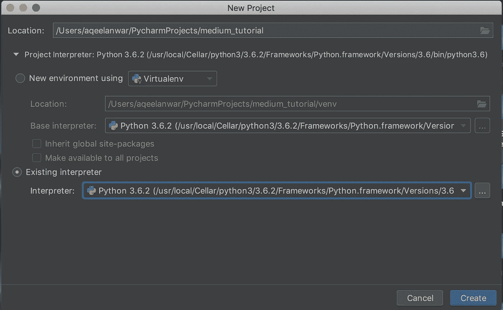

# 为机器学习项目设置 Python 平台

> 原文：<https://towardsdatascience.com/setting-up-python-platform-for-machine-learning-projects-cfd85682c54b?source=collection_archive---------8----------------------->

关于如何开始使用 python 进行机器学习，有很多深入的教程。这些教程主要关注深度学习框架的使用(比如 TensorFlow，PyTorch，Keras 等。)比如如何设置基本的监督学习问题，或者如何创建一个简单的神经网络并训练它等等。但是，即使在开始尝试这些教程之前，主机上也必须有一个可以进行实践的 python 平台。

几年前，当我开始使用 ML 时，我找不到一个关于如何在我的机器上建立一个工作平台的好教程。有很多选项/配置可供选择，我无法决定选择哪一个。在我决定一个配置之前，我必须浏览很多网页，花了我大约 2 周的时间，最终有了一个工作平台。几个月前，我的一位同事面临着同样的问题，所以我帮助她搭建了平台，为她节省了不少时间。因此我决定写一篇关于它的详细文章。

我将这篇文章分为两部分，将分别关注它们

*   **第 1 部分:**选择并安装 python 发行版和 IDE
*   **第 2 部分:**创建新项目所需的步骤

# 第 1 部分— Python 发行版和 IDE

在本文中，我将使用下面的 Python 发行版和 IDE。

*   **蟒蛇分布:**蟒蛇
*   **Python IDE:** PyCharm

W 什么是**蟒蛇**？Anaconda 是 Python 和 R 语言发行版，具有简化的包管理和部署。使用 anaconda，可以更容易地拥有不同配置的多个 python 环境，并在它们之间切换。anaconda 包管理器使得解决不同包所需的包的多个版本之间的冲突变得更加容易。关于使用 Anaconda 的利弊的详细解释可以在[这里](https://www.quora.com/What-are-the-pros-and-cons-of-using-default-Python-and-using-Python-in-Anaconda)找到

**下载&安装:** Anaconda 发行版可以从[这里](https://www.anaconda.com/distribution/)下载。安装说明非常简单。

W 帽子是**皮查姆**？PyCharm 是 python 可用的众多 ide 之一。我更喜欢 PyCharm，因为与其他 ide 相比，它更加用户友好、功能强大且可配置。它提供了与 git 的集成，拥有自己的终端和 python 控制台，提供了对各种便利插件的支持，以及大量有用的键盘快捷键。

**下载&安装:**要下载 PyCharm，请点击此[链接](https://www.jetbrains.com/pycharm/download)并下载最新的社区(免费)版本，然后按照安装说明进行操作

# 第 2 部分—创建新项目所需的步骤

您将要处理的不同项目将需要不同的资源和具有不同版本需求的包。因此，总是建议您为每个项目使用单独的虚拟 python 环境。这也确保了您不会意外地用其他版本覆盖某些包的任何现有工作版本，从而使它对您当前的项目无用。

以下是创建新项目时应该采取的步骤。

## 步骤 1:创建一个新的 Anaconda 虚拟环境:

打开 Anaconda 提示符命令并键入

```
conda create -n myenv python==3.5
```

这将创建一个名为 *myenv* 的新虚拟环境，它将随 python 版本 3.5 一起安装和加载

创建环境后，您可以通过使用以下命令激活环境来验证它

```
conda activate myenv     #For Windows
source activate myenv    #For MAC OS
```

您可以通过键入以下命令找到创建的 env myenv 的位置

```
which python
# The output will look something like this
# /Users/aqeelanwar/anaconda/envs/myenv/bin/python
```

在步骤 2 中，我们将使用它来定位我们的环境

## 步骤 2:安装必要的软件包:

激活环境后，您可以使用

```
*#General Format:*
conda install package_name*#Example:*
conda install numpy    #To install numpy
```

## 步骤 3:有用的 Conda 命令:

以下是有用的 conda 命令，在管理 conda 环境时会很方便

```
# Activate an environment
conda activate env_name# Deactivate an environment
deactivate           #Windows
source deactivate    #Linux and macOS# Listing all the created environments
conda env list# Listing packages install in an environment
conda list# Installing a package
conda install package_name# Cloning a conda environment
conda create --clone name_env_to_be_cloned --name name_cloned_env
```

## 步骤 4:在 PyCharm 上创建一个新项目

*   打开 PyCharm 并选择 Create New Project。


*   选择项目的位置和名称(在本例中为 medium_tutorial)。
*   展开项目解释器选项并选择现有的解释器
*   通过单击现有解释器下最右边的三个点来定位您的环境



*   此时，我们将使用步骤 1 中的 which python 命令显示的位置来定位我们的环境 myenv(如果它还没有出现在项目解释器列表中:稍后将详细介绍)。此外，我们希望这个环境可以用于我们将来创建的其他项目，因此我们将选择“*对所有项目可用”*复选框


*   点击确定，然后创建。


*   该项目现在将使用环境 myenv。您可以使用 PyCharm 的内置终端将软件包安装到这个环境中。
*   创建新的。py 文件(比如 main.py)并使用

```
run >> run main.py
```


## 步骤 5:在 conda 环境之间切换(可选)

如果将来你想在同一个项目的不同 conda 环境之间切换，你可以按照下面的步骤来做

*   PyCharm 只能选择已经包含在其项目解释器列表中的环境
*   向项目解释器列表中添加一个新创建的(比如命名为 PyCaffe)环境

```
settings >> Project:project_name >> Project Interpreter
```


*   点击右上方的齿轮图标，并选择添加


*   挑选

```
Conda Environment > Existing environment > <three dots>
```

找到新创建的环境并点击 OK


*   现在环境已经被添加到项目解释器列表中，并且可以在下拉菜单中看到


*   此列表显示了现有的环境以及您选择的将用于项目的任何环境
*   **注意:** PyCharm 终端不会自动激活当前选择的环境。如果您已经从项目解释器列表中选择了 PyCaffe，env，现在想要在其中安装一个新的包，您必须首先在终端中激活环境，然后您可以使用 conda install package_name。否则，该软件包将安装在先前激活的 conda 环境中


现在您已经设置好了平台。此时，您可以安装所需的 ML 框架(TensorFlow、Keras、PyTorch)并开始尝试 ML 教程。

# 摘要

在本教程中，我们讨论了从事 ML 项目(或任何 python 项目)的先决条件。我们看到了如何使用 Anaconda 和 PyCharm 创建多个 python 环境并在它们之间切换。

如果你在学习本教程的过程中有任何问题，请在下面评论，我会给出解决方案。

**如果这篇文章对你有帮助，欢迎鼓掌、分享和回复。如果想了解更多关于机器学习和数据科学的知识，请关注我@**[**Aqeel an war**](https://medium.com/u/a7cc4f201fb5?source=post_page-----cfd85682c54b--------------------------------)**或者在**[***LinkedIn***](https://www.linkedin.com/in/aqeelanwarmalik/)***上与我联系。***