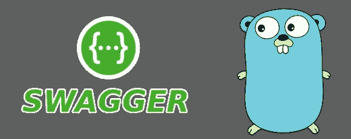
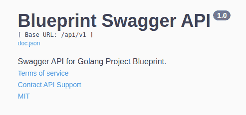
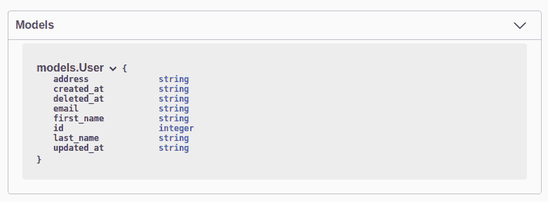
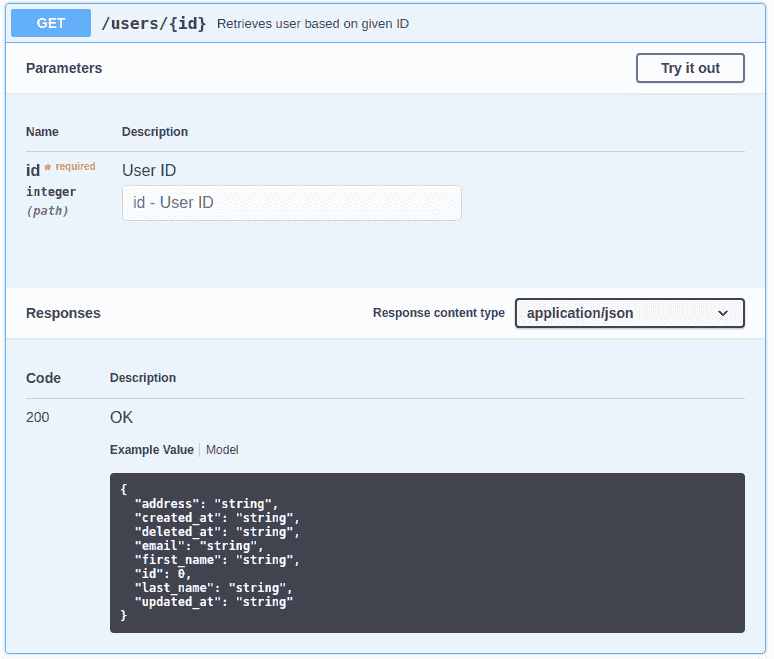
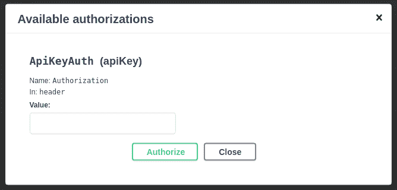
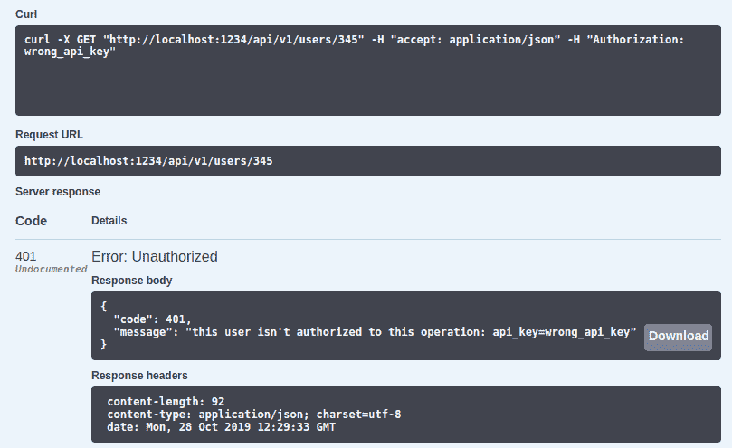
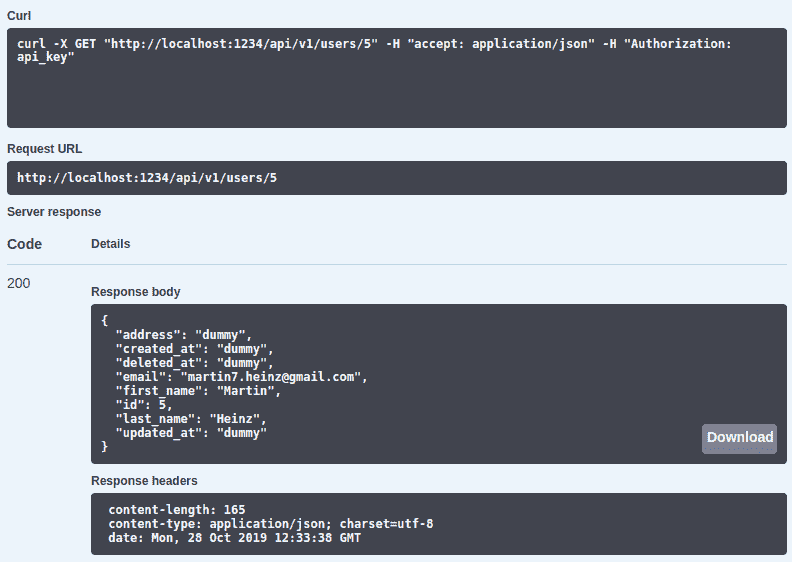

# 为 Golang API 设置 Swagger 文档

> 原文：<https://towardsdatascience.com/setting-up-swagger-docs-for-golang-api-8d0442263641?source=collection_archive---------3----------------------->

*注:此文最初发布于*[*martinheinz . dev*](https://martinheinz.dev/blog/9)

在之前的文章中——在 Golang 中构建 RESTful API——我们在 Golang 中创建了 RESTful API。现在，我们已经准备好使用我们的项目，我们应该向我们的用户展示如何这样做，否则——如果他们不能测试它和查看它的特性——他们甚至不会碰它。

如果没有我们的 API 的有意义的文档以及测试其端点的能力，用户甚至不会尝试使用它。解决方法是写文档。然而，编写它可能要花很多时间，而这些时间本来可以用来为我们的应用程序开发更酷的功能…那么，我们该怎么办呢？—我们生成*大摇大摆的*单据！

# 图书馆

让我们从创建 *Swagger* 文档所需的库开始。我说的是库，但实际上只需要一个— [swag](https://github.com/swaggo/swag) —它是将代码注释(注释)转换为*Swagger*Documentation 2.0 的 *Golang* 库。除了 swag 之外，你还需要一个中间件/包装器库用于你的 web 框架。在 *swag* 文档中有[到支持框架](https://github.com/swaggo/swag#supported-web-frameworks)的库的链接，其中既包括很多人喜欢使用的最简单的选项`net/http`，也包括我使用的 *GIN* ，我将在这里展示它。即使您可能使用不同的 web 框架，注释也是一样的，所以无论如何您都可以在这里学到一些东西。

还值得一提的是，还有一个替代的 *Golang Swagger* 库— `go-swagger`似乎更受欢迎，也更强大一些。然而，我个人更喜欢`swaggo/swag`，因为它简单。如果您需要对生成的内容有更多的控制，您可能希望切换到`go-swagger`。

# 文档字符串

现在，对于注释/注释/文档字符串或任何你想叫它的东西。它实际上只是特定 API 函数之前的一堆注释，用于生成 *Swagger* 文档。

在我们开始描述单个 API 端点之前，我们需要首先为整个项目写一个总体描述。这部分注释位于您的`main`包中，就在`main`函数之前:

*注意:下面所有的例子都来自我的仓库* [*这里*](https://github.com/MartinHeinz/go-project-blueprint/tree/rest-api) *，在这里你可以找到包含 Swagger UI/Docs 的 runnable 应用。*

上面你可以看到通用 API 信息的例子，包括名称、版本、许可证、基本 URL 等。您可以包括的字段很少，它们在这里列出[和一些示例](https://github.com/swaggo/swag#general-api-info)。

除了注释之外，我们还需要导入必要的库，包括我们必须生成的`docs`包的空白导入(稍后会详细介绍)。我们需要做的另一件事是在某个端点实际安装 *Swagger UI* ，这里我们使用`"/swagger/*any`。

这是 UI 的一部分，上面的注释会产生:

现在是重要的部分 API 函数的注释。这些注释在`main`中连接的每个函数之前，以服务于某个端点，所以当我们服务于像`v1.GET("/users/:id", apis.GetUser)`这样的端点时，我们需要这样注释它:

大多数注释都是不言自明的，这是您应该包含的最小注释集。我想强调的一点是成功时返回的`models.User`——这是一个存在于`models`包中的数据库表模型。通过这样引用它，我们使它出现在*模型*部分的 *Swagger UI* 中:

这是我们为我们的终点得到的部分:

# 生成！

最后，是生成文档的时候了！你所需要的只是一个命令— `swag init`，这个命令需要从`main`所在的目录运行，所以对于我做的[蓝图库](https://github.com/MartinHeinz/go-project-blueprint/tree/rest-api/cmd/blueprint)，应该是`.../cmd/blueprint/`。这个命令将创建名为`docs`的包，其中包含了我们文档的 *JSON* 和 *YAML* 版本。

尽管这个包已经生成，但我更喜欢将它存储在 *GitHub* 中，因为它是在`main`包中导入的，因此它是应用程序运行所必需的。如果您想避免将生成的代码推送到 *GitHub* 中，您可以编写一个 *Makefile* 目标，在应用程序构建和运行之前，动态地重新生成 *Swagger* 文档。然而，如果你决定推它 *GitHub* ，你可能想要通过`go fmt`运行文档，因为它不一定被格式化*“正如它应该的那样”*。

# 证明

在这一点上，我们可以运行应用程序，看看我们漂亮的新 *Swagger UI* ，然后就到此为止。但是，缺少的一点是 API 的认证。如果您让 *Swagger UI* 未经认证，那么任何人都可以访问他们想要的任何端点，这可能是非常不可取的，例如，如果您的数据可能被用户损坏。更糟糕的是，您可能会将数据库中的敏感信息暴露给整个互联网。我认为这些是为我们的 API 设置一些简单认证的足够的理由，因此，也是 *Swagger UI* ，那么我们如何做呢？

首先，我们需要实际实现身份验证。这里是 *GIN* 的情况，我们创建了一个非常简单的认证中间件，我们将它附加到路由器组:

通过将中间件附加到特定的组，我们可以控制什么是认证的，什么是不认证的，这很重要，因为我们不希望 *Swagger UI* 本身被认证。

*注意:我省略了一些代码，以使例子可读性更好，更容易理解。完整代码，请参见资源库中的* `*rest-api*` *分支* [*此处*](https://github.com/MartinHeinz/go-project-blueprint/tree/rest-api) *。*

在`main`模块中，我们需要改变的另一件事是注释——更具体地说，我们需要添加`securityDefinitions`注释:

这个注释——您已经猜到了——通过`Authorization`头向 *Swagger UI* 添加了 API 密钥认证。除了 API 密钥认证之外，您还可以选择使用用户名和密码的*基本*认证(`securitydefinitions.basic`)或某个版本的 *OAuth2* ( `securitydefinitions.oauth2`)，所有选项都显示在文档[这里](https://github.com/swaggo/swag#security)。我个人喜欢使用 API 密匙，因为在我看来这是简单和最方便的选择。

为了让 *Swagger* 识别某个端点已经过身份验证，我们还需要向所述 API 函数添加安全注释:

这是最后一步，现在(在重新生成 *Swagger* docs 之后)我们终于可以运行我们的应用程序了:

您应该在 *GIN* 日志中看到类似这样的内容:

我们现在可以在[http://localhost:1234/Swagger/index . html](http://localhost:1234/swagger/index.html)打开 *Swagger UI* 并测试我们的文档！

*注意:如果上面的命令对你来说没有多大意义，请考虑在这里* *通读之前的* [*。*](/building-restful-apis-in-golang-e3fe6e3f8f95?source=friends_link&sk=8069b4cf34194bdbe73c0e58f37ac334)

因此，简单重述一下——`main`包中的安全定义为我们提供了以下模型:

然后，如果我们输入不正确的 API 密钥(`"wrong_api_key"`)，我们会得到 *401* 响应代码:

如果我们使用正确的 API 密钥，我们将返回 *200* 所请求的数据:

同样重要的是要提到，像我们在这里所做的那样以明文形式发送授权头是不安全的，并且违背了认证 API 的全部目的，所以在实际应用中，你应该明确地使用 HTTPS。

# 结论

读完这篇文章后，我希望你现在知道，如何着手为你的 API 建立 *Swagger* 文档，我也希望你能为你的下一个项目写一些文档，因为它非常简单，而且好的 API 文档对你(手动测试)和应用程序的用户都有很大的价值。您可以在我的存储库的`rest-api`分支[这里](https://github.com/MartinHeinz/go-project-blueprint/tree/rest-api)检查全部代码，如果您有任何问题或改进，请随时联系我或在存储库中创建问题/请求。🙂