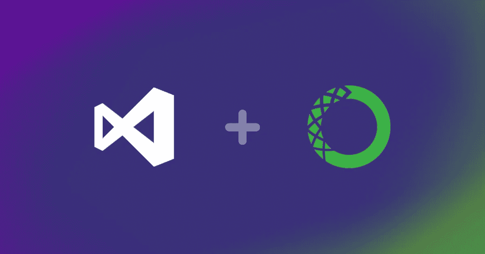
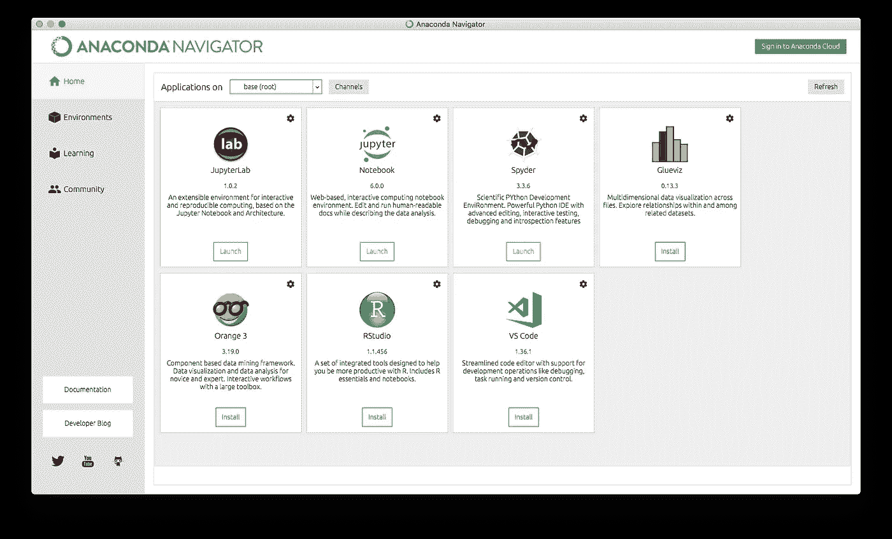
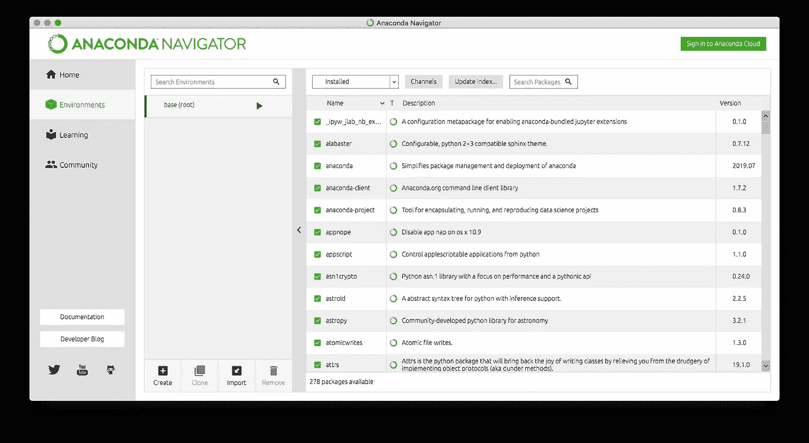
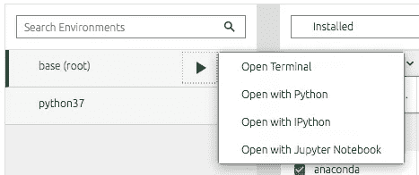
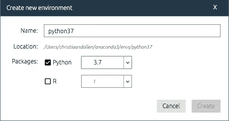
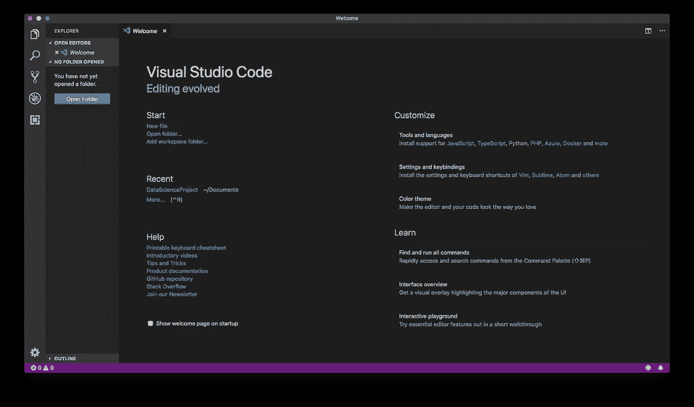
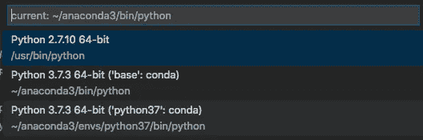

# 使用 Visual Studio 代码和 Anaconda (Python)建立自己的数据科学工作空间

> 原文：<https://towardsdatascience.com/setting-up-your-own-data-science-workspace-with-visual-studio-code-and-anaconda-python-22237590b4ed?source=collection_archive---------7----------------------->



如果你刚开始涉足数据科学领域，创建一个个人工作空间将有助于你组织好你的项目。有很多不同的工具可以使用，如果你和我一样，刚开始在这个领域工作，你可能会发现一头扎进去会让人畏缩。在这篇文章中，我将向你展示如何用业内最常用的工具在 macOS 上建立自己的工作空间。虽然我在本指南中使用的是 macOS，但对于 Windows 平台，步骤几乎是相同的，我希望您在 Windows 上使用本指南应该没有问题。完成本指南后，您将能够:

*   使用 Anaconda 设置 Python 环境。
*   创建 Visual Studio 代码工作空间并运行 Python 脚本。
*   安装包和管理不同的 Anaconda 环境。

让我们开始吧！

# 使用 Anaconda 设置 Python 环境

Anaconda 是 Python 和 R 的免费发行版，主要用于数据科学、机器学习、数据处理、分析等应用。它允许您管理您自己的环境和包，您将在您的项目中使用它们。我们将使用 Anaconda 进行包管理和部署。为了构建我们的工作空间，我们需要安装和配置 Anaconda。我们将遵循以下步骤:

1.  安装 Anaconda。
2.  使用最新版本的 python 创建一个新环境。
3.  将软件包安装到您的环境中。

## 下载并安装 Anaconda

访问 Anaconda 网站，并为您的平台下载 Anaconda 的最新版本。您将能够下载 Python 3.7 和 Python 2.7 版本的 Anaconda。尽管我个人更喜欢获得最新版本的 Python，但有时 Python 包需要特定版本的 Python——因此我将向您展示如何设置多个 Python 环境。为了保险起见，我们现在将使用 Python 3.7。安装 Anaconda 后，启动 Anaconda Navigator。

## 在 Anaconda Navigator 中管理不同的环境

打开 Anaconda Navigator 后，您会看到 Anaconda 已经设置了一些工具和包，如 Jupyter、Spyder。注意这里有一个安装 VS 代码的选项。

点击**安装。**



The Anaconda Navigator installation comes with default packages preinstalled.

同时，导航到左侧菜单中的**环境**。在这里，您将看到 Anaconda 已经为您配置了一个现成的基本(根)环境。



The Anaconda Navigator interface showing you the packages installed on the base (root) environment.

在这里，您可以选择想要运行的环境。您也可以从终端直接运行 bash 命令。



Directly open Terminal with our without Python via Anaconda Navigator.

已经为你安装了很多包，但是如果你想安装新的包呢？或者你想为不同版本的 Python 安装不同的包？这就是为什么你想和环境打交道。注意，在上面的截图中，我已经建立了一个像这样的环境，名为 python37。

1.  点击**创建**并配置一个新的 Python 环境。
2.  选择 Python 的最新版本，并再次点击**创建**进行确认。



Anaconda serves R purposes too, but we’ll use Python in this case.

配置环境需要几秒钟的时间。几分钟后，您会注意到一个新的环境已经安装了一些默认的包。一旦设置好 Python 环境，您将主要使用终端在运行中安装软件包(稍后我将向您展示这一点),并且您可能很少使用 Anaconda Navigator。

太好了！从本质上讲，这是在您的机器上开始使用 Python 和 Anaconda 所需要的。现在我们只需要一个工作空间来实际使用我们的 Python 环境，这样我们就可以用我们的包运行我们的脚本了。你可以使用 Anaconda 附带的 Jupyter Notebook，但是我喜欢使用 VS 代码，我会很快解释为什么。

# 用 VS 代码创建您的数据科学工作空间

Visual Studio Code 是一个免费的代码编辑器，您可以根据自己的需要进行定制。使用像 VS 代码的 Python 扩展、GitHub 和其他有用的包，它是一个轻量级的 IDE，为在您自己的定制工作空间中运行 Python 提供了极好的支持。在前一章中，我们已经设置了 Anaconda 并安装了 VS 代码。

打开VS 代码。



The welcome screen on your first start of Visual Studio Code.

Visual Studio 代码是一个强大的轻量级代码编辑器，允许您为每个项目配置自己的工作区。出于测试目的，我创建了一个名为 *DataScienceProject* 的虚拟文件夹。

1.  点击**打开文件夹**并选择文件夹。
2.  进入菜单，选择*文件>将工作空间另存为*
3.  将您的工作区文件保存在文件夹中

现在，您已经在 VS 代码中设置了一个定制工作区。工作区的伟大之处在于，您可以为每个单独的工作区定制设置。

1.  现在，在您的工作区中创建一个名为 helloworld.py 的新文件。
2.  打开 helloworld.py。
3.  将下面的代码复制到您的文件中并保存。

```
#%%
# This is the first cell of our Python code
print('Hello world!')#%%
# This is another cell
print('Another cell for the world to see!')
```

在这个时候，当你打开你的文件时，你可能会得到各种各样的消息，比如“*Pylint package not installed*”。这是因为 VS 代码会自动识别你正在编辑一个 Python 文件。我们一会儿将进入包，但是首先让我们看看我们是否能运行我们的 Python 文件。您可以直接在终端或交互式 Python 窗口中运行它。交互式 Python 窗口非常有用，因为它为您调试代码提供了更多的反馈，而且还允许您在 Python 脚本中运行称为*单元*的不同代码。

要运行您的脚本，请按下 **shift-enter。**您也可以右键单击该文件，然后选择“在终端中运行 Python 文件”或“在交互式 Python 窗口中运行 Python 文件”。

运行第一个脚本后，您应该会在代码右侧看到交互式 Python 窗口，并返回如下内容。

```
[1] # This is the first cell of our Python code...Hello world![2] # This is another cell...Another cell for the world to see!
```

恭喜你！您刚刚在 Visual Studio 代码中设置了一个工作区来运行 Python 项目！现在让我们再深入一点，看看我们能否在我们的环境中安装新的软件包。

## 从您的终端管理包

现在我们已经运行了第一个脚本，您可能想要添加一个新的包。假设您的项目要求您连接到一个 Google API。Google 为我们提供了一个包来完成这项工作，但是这些并没有安装在您的默认环境中。幸运的是，我们有很多选择。Anaconda 有自己的[包存储库](https://anaconda.org/anaconda/repo)，还有更多的存储库供我们查找我们的包。我们在示例中寻找的包是 [Google API Python 客户端](https://anaconda.org/conda-forge/google-api-python-client)。继续并遵循这些步骤。

打开终端。确保您在基本环境中工作。终端应该通过显示如下内容来告诉我们这一点:

```
(base) myMac:DataScienceProject myUser$
```

通过在终端中输入以下命令，检查软件包是否已经安装:

```
conda list
```

这将返回当前安装在您的基本(根)环境中的软件包列表。现在，通过在终端中运行以下命令来安装软件包:

```
conda install -c conda-forge google-api-python-client 
```

该软件包现在将安装在您的基础环境中。如果一切顺利，您应该在终端中看到以下消息。我没有复制所有的信息，但这应该给你一个想法。

```
Collecting package metadata (current_repodata.json): done
Solving environment: done## Package Plan ##environment location: /Users/myUser/anaconda3added / updated specs:
    - google-api-python-clientThe following packages will be downloaded...
...
...Proceed ([y]/n)? y...Preparing transaction: done
Verifying transaction: done
Executing transaction: done
```

厉害！我们已经成功地在我们的环境中安装了一个新的软件包。这将允许您导入包库，并从脚本中使用 Google API Python 客户端。

但是，如果您已经有一个包在基本环境中运行，并且您不想冒险弄乱您当前的环境设置，该怎么办呢？您可以使用新的环境，并为该环境安装不同的软件包。我们现在知道了如何安装一个包，但是让我向您展示如何从 VS 代码中改变您的 Python 环境。

## 在工作空间中管理 Python 环境

除了在您自己的定制工作区中工作之外，您还可以在编辑器中管理您的 Anaconda 环境。这样，您就不必一遍又一遍地运行 Anaconda Navigator，而只需直接在编辑器外运行 Python 环境，这样您就可以继续编码了。

你注意到编辑器底部的蓝色条了吗？这个条给你关于你正在工作的代码的信息。在工具栏的最左边，您可以看到您当前正在使用的*解释器*。在我的例子中，它使用:

```
Python 3.7.3 64-bit ('base':conda)
```

正如您所看到的，我正在 Anaconda 的基本(根)环境中运行 Python 3.7.3。它还显示您的代码中是否有任何问题，有多少行、列、空格，您当前选择了哪种编码，以及您是用哪种语言编程的。

通过点击口译员，您可以选择其他口译员。例如，我们之前在 Anaconda 中创建的 Python 环境。

点击你的解释器，然后**选择我们之前创建的解释器**。



How to select a different Python interpreter.

现在，当你从你的基本解释器切换到一个新的解释器时，有时 Jupyter 服务器启动有困难。Jupyter-server 运行在一个内核上，这个内核在某种程度上是 Python 环境的引擎。Jupyter-kernel 对于在 VS 代码中运行代码至关重要，尤其是在交互式 Python 窗口中运行代码。如果您碰巧遇到这些错误，请在终端中尝试以下操作:

对于 macOS:

```
source activate <environmentnamehere>
pip install ipykernel
python -m ipykernel install --user
```

对于 Windows:

```
activate <environmentnamehere>
pip install ipykernel
python -m ipykernel install --user
```

这将在您的环境中专门安装一个内核。重启 VS 代码编辑器，尝试在新选择的解释器(python37:conda)中运行代码。

如果一切顺利，那么恭喜你！您已经成功地在 Visual Studio 代码中设置了自己的工作空间，现在您可以将它用于您的 Python 项目了！

# 结束语

管理您的 Python 环境可能是一件痛苦的事情。了解如何管理您的环境和软件包会给您带来很大的灵活性，并在您的一个环境突然停止工作时避免很多压力。这就是为什么我想向您展示如何切换环境和安装包，因为这些是您容易出现的错误类型。

当然，我还没有向您展示使用 Visual Studio 代码或 Anaconda 可以做的所有事情，这就是为什么我建议您也阅读以下文章:

*   [用 Python 编写的数据科学最佳包](https://medium.com/analytics-vidhya/dont-miss-out-on-these-24-amazing-python-libraries-for-data-science-44aa66469a60)
*   [Visual Studio 代码扩展的详细列表](https://medium.com/@spp020/vs-code-extensions-for-complete-ide-experience-bca5bb2f0f90)
*   [对 Visual Studio 代码使用 GitHub 版本控制](https://medium.com/@brygrill/version-control-basics-with-github-and-vs-code-1c1906cadd33)

我希望这本指南对你有所帮助。编码快乐！