# 在家里设置自己的小服务器

> 原文：<https://towardsdatascience.com/setting-up-your-own-little-server-at-your-home-5331a9e04ead?source=collection_archive---------10----------------------->

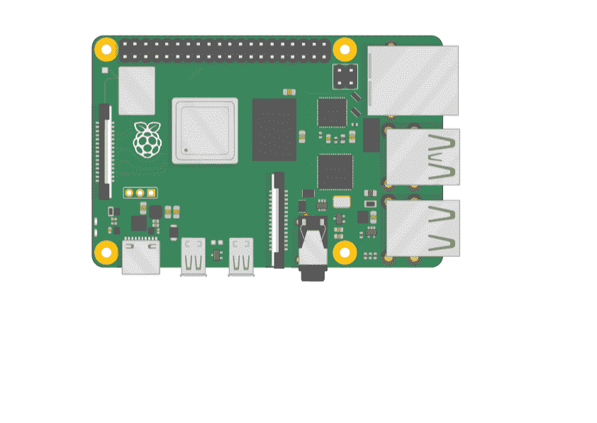

## 从树莓派开始

就在两年前，我的公司送给我们一个树莓派 3。

那时，我不明白那是什么。 ***感觉就像一个小板子里有很多复杂的电路和芯片。***

所以它在我的橱柜里放了一年。

然后我面临一个特殊的问题。问题是我必须每两个小时运行一次 python 脚本。

一个解决办法是让我自己的 MAC 24 小时开着。 看起来不太合适的事情。

另一个方法是使用 AWS 服务器，但我很吝啬。这个特别的项目是一个家庭项目，所以我不想要任何昂贵的东西。

这时，我想起了橱柜里积满灰尘的覆盆子酱。人们以前说过它是一台小型电脑。

所以我想尝试一下。

这篇文章是关于建立你自己的小型个人服务器，只要 50 美元。

# 什么是树莓派？

我很晚才发现它，但我的树莓 Pi 3 是一台 1.2GHz 四核迷你电脑，内存为 1GB。

人们可以把它看作是一个基本而廉价的计算机主板，旨在为每个人提供计算能力。

根据 Pi 网站:

> 我们的使命是将计算和数字制作的力量传递到世界各地的人们手中。我们这样做是为了让更多的人能够利用计算和数字技术的力量来工作，解决他们关心的问题，并创造性地表达自己。

# 你需要什么配件？

现在，在开始用 Raspberry Pi 创建一个小型服务器之前，我们需要一些东西。你可以选择借用其中的大部分，因为安装时只需要一次。

*   ***显示器*** —任何支持 HDMI 的显示器。这是 ***第一次只需要*** 你就要设置你的 Pi 了。我现在正在用我的普通 4K 显示器来做这个，但是它在这里可能有点过头了。
*   外设如 ***键盘和鼠标*** :同样只在第一次你要设置 Pi 的时候。如果你身边没有，你可以向朋友借。
*   ***一个电源适配器:*** 一个简单的微型 USB 手机充电器就可以了。为此，我使用了以前的手机充电器。
*   ***micro SD 卡:*** 你的 Pi 没有自带存储。你必须得到一个微型 SD 卡作为额外的附件，这是我们最终成本的一部分。[这里](https://amzn.to/2SUhuz7)是我得到的一个，它也带了一个卡适配器。
*   当然还有一份[树莓酱](https://amzn.to/2MnntLi)。

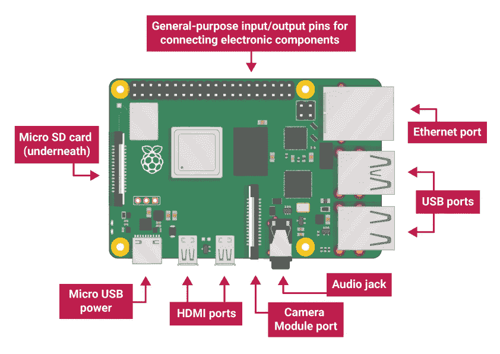

Anatomy of a raspberry Pi: [Source](https://www.raspberrypi.org)

# 和拉斯比安一起准备

现在我们有了第一次设置所需的所有附件。

下一步是安装操作系统。Pi 最流行的操作系统是 Raspbian。所以我们需要把它安装在我们的 SD 卡上。

这只是您可以遵循的一系列步骤:

*   参观 www.raspberrypi.org/downloads/

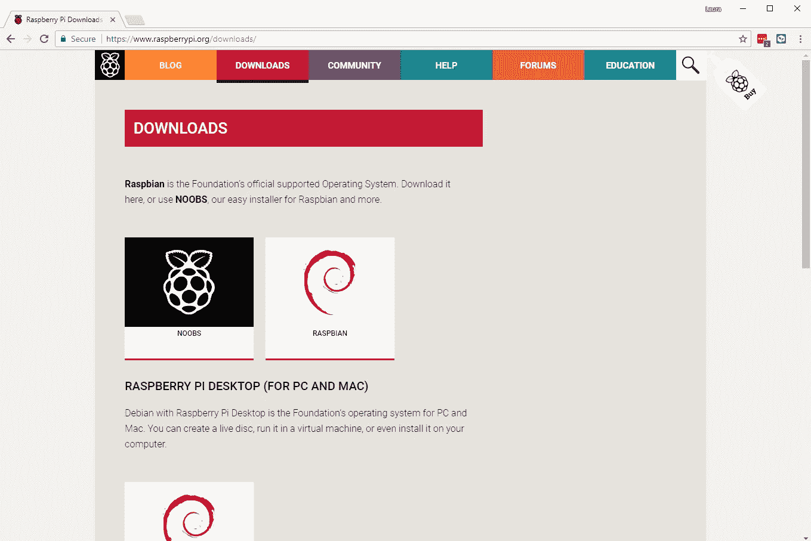

[Source](https://www.raspberrypi.org)

*   点击 NOOBS。NOOBS 只是一种在 SD 卡上安装 Raspbian Pi 的方法。
*   你会被带到一个下载选项。只需下载压缩文件。
*   解压缩 zip 文件
*   将 SD 卡插入您的 MAC/Windows 笔记本电脑。我的 Mac 已经有一个 SD 卡插槽。
*   将解压后的 zip 文件的内容复制到 micro SD 卡上。记住的不是文件夹，而是内容。

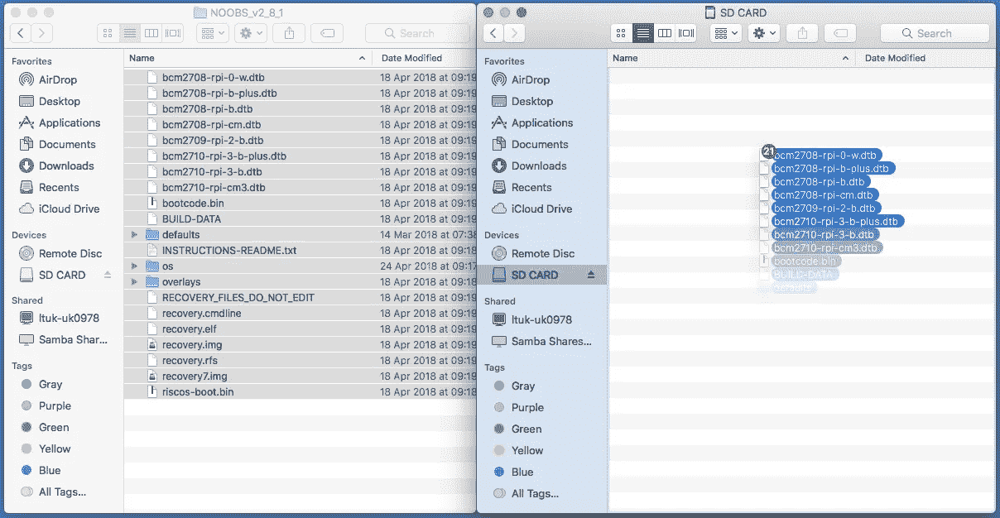

[Source](https://www.raspberrypi.org)

我们结束了。

现在我们终于可以用我们的树莓派了。

# 乐高小游戏

现在有趣的部分来了。只是把这一切联系起来。

这是连接所有东西并打开电源后的样子。

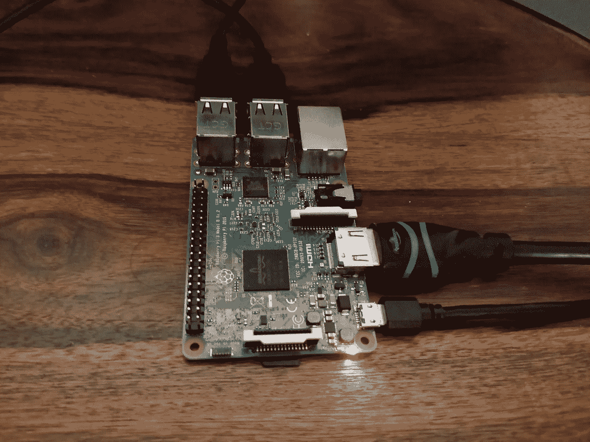

All the lego blocks in place

在这里，我已经将 HDMI 电缆连接到显示器、微型 SD 卡、键盘、鼠标，最后是电源适配器。

一旦你启动了你的树莓派。您需要完成一些提示。您将从安装 Raspbian 开始，如下所示，安装将需要几分钟时间。

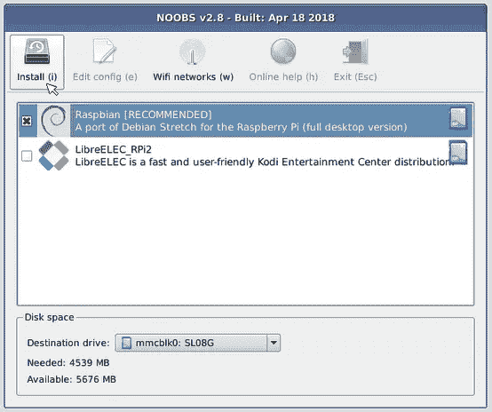

[Source](https://www.raspberrypi.org)

***您可以设置 wifi，也可以为您的 Pi 设置密码。***

下面是一个更大的设置视图，你可以最终看到 Rapbian 的行动。它看起来有点像 Linux。

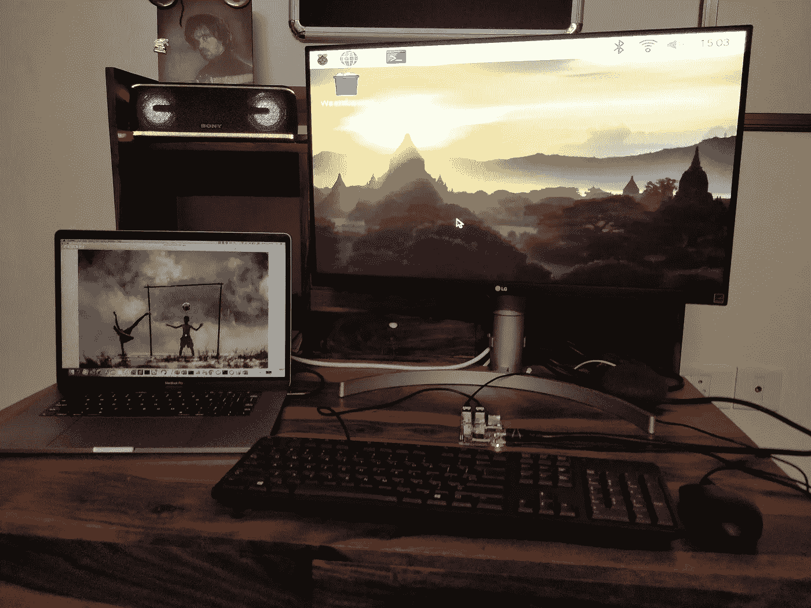

My Home Setup

所以我们手里终于有了一台新电脑。

但是我们仍然想归还我们借来的键盘和额外的外设。对吗？

我们想要一台小型计算机，在后台运行我们的预定任务，占用最小的空间。

最后，我们希望能够移除显示器和外围设备。唯一保持连接的将是 Rasberry Pi、SD 卡和电源适配器。我们称之为无头模式。

我们需要设置 SSH 来实现这一点。一旦我们完成了 SSH 设置，我们将能够使用我们的 Mac SSH 到 Pi。

# 设置 SSH

为了实现这一点，我们只需要在树莓 GUI 上做几个步骤。

*   打开首选项>树莓 Pi 配置

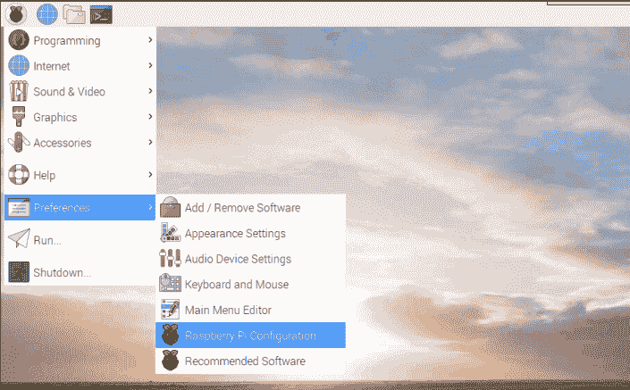

*   选择接口并启用 SSH。

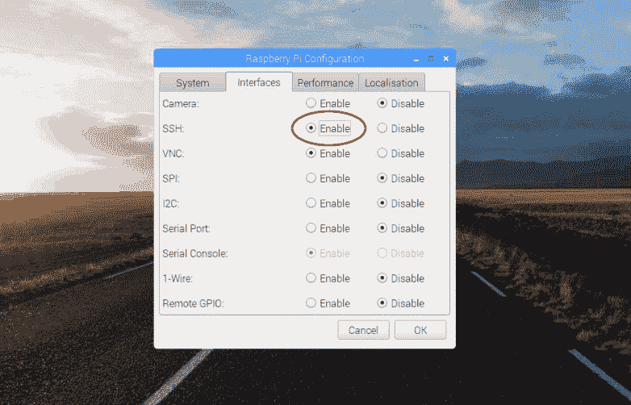

*   我们还需要找出 Raspberry Pi 的 IP 地址，稍后我们将使用它来 SSH 到它。我们只需使用 Pi Start > Accesories > Terminal 打开终端，并键入命令`ifconfig`。我们将在`wlan0`中看到 IP 地址。我 pi 的 IP 地址是 192.168.0.115。

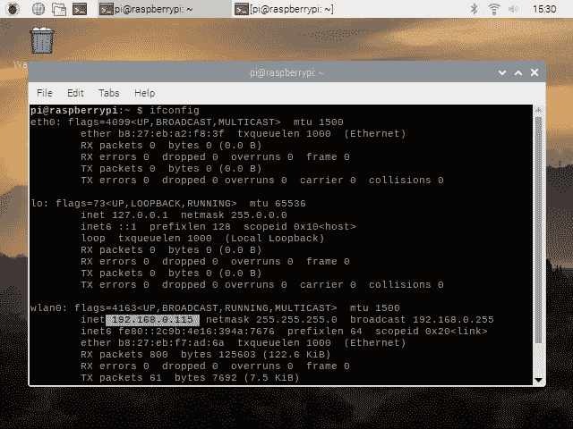

我们准备好了。

# 安装后你需要什么？

一旦我们设置好 SSH，您只需在关闭电源后移除显示器、键盘和鼠标，然后再次打开电源即可。

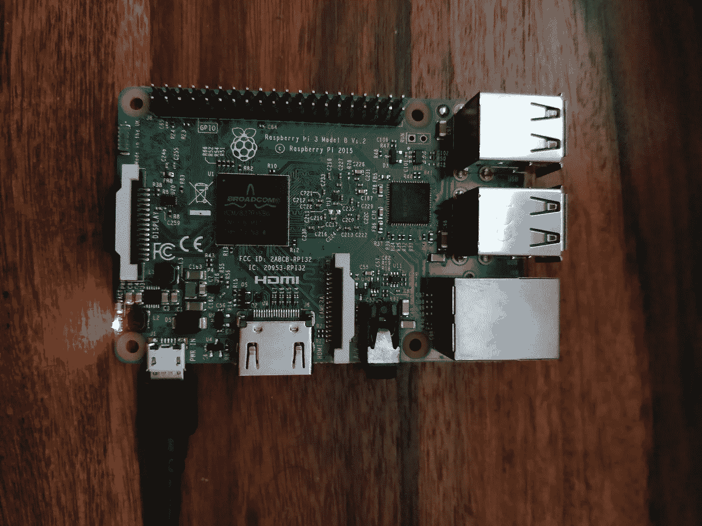

My Headless Pi

我们的 Pi 开始运行了。

要从家庭网络上的 Mac SSH 到 Pi，您只需使用:

```
ssh pi@192.168.0.115
```

当它要求时，只需输入您的 Pi 密码。

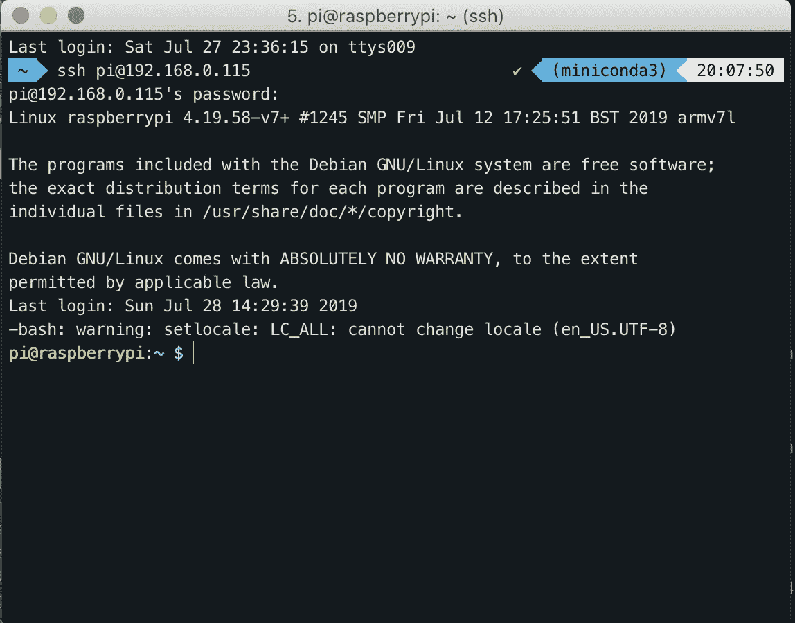

Pi 预装了很多东西。例如，我们有 Python2 和 Python3。

我们可以使用 pip3 来安装所需的 Python 包。我们也可以使用`sudo apt-get`来安装依赖项和程序。

# 结论


恭喜你。

你有自己的服务器。只要 50 美元。

在电源中断的情况下，它会自动重启。我自己的已经连续跑了两天了，一点热度都没有。

你想用它做什么真的取决于你。您可以使用`crontab -e`命令使用它来运行计划的 cronjobs。您可以定期浏览网站，可以使用 selenium 来自动完成一些日常任务。您可以定期向某人发送电子邮件/消息。

***当你想到*** 的时候，可能性真的是无穷无尽。

在我的下一篇文章中，我将谈论在我的 Pi 上设置一个小应用程序。敬请关注。

如果你想了解更多关于命令行的知识，我想你在使用 Pi 时会经常用到，Coursera 上有一个 UNIX 工作台课程，你可以试试。

将来我也会写更多初学者友好的帖子。在 [**媒体**](https://medium.com/@rahul_agarwal?source=post_page---------------------------) 关注我或者订阅我的 [**博客**](https://mlwhiz.com/?source=post_page---------------------------) 了解他们。一如既往，我欢迎反馈和建设性的批评，可以通过 Twitter [@mlwhiz](https://twitter.com/MLWhiz?source=post_page---------------------------) 联系