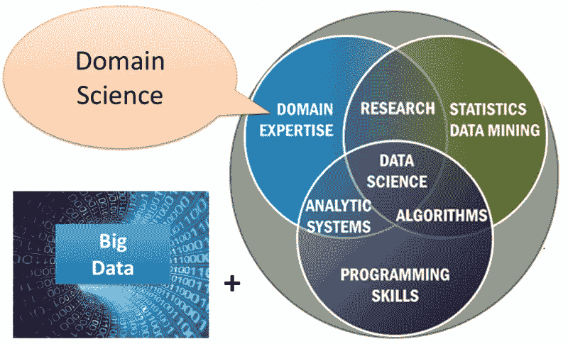
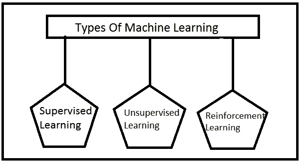

# 构建数据科学模型的七个主要步骤

> 原文：<https://towardsdatascience.com/seven-major-steps-for-building-a-data-science-model-c1761408dd17?source=collection_archive---------7----------------------->

## 如何构建有效的数据科学模型

数据无处不在，但从这些数据中获取价值是最大的挑战。但是，随着数据科学的引入，情况有了好转。每个人都在谈论它，每个人都想融入这项更新的技术，但并不是每个人都知道如何去做。因此，这里有一个全面的指南，列出了构建成功的数据科学模型的重要步骤。让我们开始吧。

**什么是数据科学？**

数据科学是一门从数据中分析和提取知识信息的艺术。这种提取得到了领域专业知识、编程和一些数学和统计学的支持，它们共同工作以得出有意义的结论。数据科学是一个奇妙的发现，它引导企业获得难以置信的利润。你不相信吗？

下面的例子说明了同样的情况:

*   [西南航空公司通过减少飞机在停机坪上的闲置时间节省了近 1 亿美元](https://www.ge.com/reports/big-data-industrial-internet-can-help-southwest-save-100-million-fuel/)
*   [UPS 通过路线优化节省了近 3900 万加仑的燃料](https://sustainability.ups.com/media/UPS-Big-Data-Infographic.pdf)

你不为数据科学传播的魔力而惊叹吗？是的，西南航空和联合包裹在这方面做了大量的工作。但是，这不是一日之功。有些事情他们做得不同，你也可以这样做。

改变的主要步骤是建立一个数据科学模型。如果你对如何进行这个过程感到幼稚，这里有一些必要的步骤。

**1。数据提取**

首先，你需要对手头的问题有一个概念，然后是收集数据。不是任何数据，而是收集的非结构化数据块应该与您将要解决的业务问题相关。你会惊讶地知道万维网是如何被证明是数据发现的福音。

你可以参考流行的在线数据仓库:

*   [Kaggle](https://www.kaggle.com/) —数据科学项目的地方
*   [UCI ML 资源库](https://archive.ics.uci.edu/ml/index.php) -机器学习档案库
*   [数据集搜索引擎](https://toolbox.google.com/datasetsearch) -基于谷歌的数据集搜索
*   [NCBI](https://www.ncbi.nlm.nih.gov/)——生物技术学术研究平台

**注:**并非所有数据都是相关和更新的。为了从收集的数据中找到意义，使用网络搜集。这是一个从网站提取相关数据的简化和自动化过程。

**2。继续进行数据清理**

你听说过不应该把事情留到明天吗？当您需要在收集数据时清理数据时，这一点非常重要。你越早裁员越好！

*以下是一些常见的数据错误来源:*

*   从许多数据库中收集的重复条目
*   输入数据在准确性方面的误差
*   数据条目被更改/更新/删除
*   跨数据库的变量中缺少值

*消除常见错误来源的技巧:*

*   通过参考公共 id 过滤掉重复的
*   根据数据的更新日期对数据进行分类，即优先选择最近的数据条目
*   用平均值填写缺失的数据条目

**3。深入研究数据**

现在每个数据源都准备好了，您可以开始分析所涉及的基本模式。部署有趣的工具，如 [Tableau](https://www.tableau.com/) 或[微策略](https://www.microstrategy.com/us)可以帮助很多。您所要做的就是构建一个交互式仪表板，并查看您的数据如何成为重要见解的一面镜子。

画面会很清晰，现在你会知道是什么在驱动你的业务的变化特征。例如，如果是定价属性，您将知道价格波动的时间和原因。

**5。识别关键特征**

当试图掌握商业中的关键模式时，可以部署[特征工程](https://www.datascience.com/blog/feature-engineering-for-churn-modeling)。这一步不能被忽略，因为它是最终确定合适的机器学习算法的先决条件。简而言之，如果特征很强，机器学习算法将产生令人敬畏的结果。

有两类功能需要注意:

*   不太可能改变的恒定特征
*   值随时间波动的可变特征

**6。探索机器学习的世界**

这是最重要的步骤之一，因为机器学习算法有助于建立一个可行的数据模型。有许多算法可供选择，但不要担心，因为数据科学家会让你轻而易举。

用数据科学家的[话来说，机器学习就是部署机器来理解一个系统或底层流程，并为其改进做出改变的过程。并且，算法可以被称为计算机系统驱动特定任务的一组指令。](https://www.thinkful.com/blog/what-is-data-science/)

以下是你需要了解的三种机器学习方法:

Types Of Machine Learning

*   **监督学习**:基于过去类似过程的结果。监督学习有助于根据历史模式预测结果。

**举例:**通过回顾过去点击量最高的在线广告，你可以预测是什么特别的特点让用户立即点击。

用于监督学习的屡试不爽的算法:

线性回归

-随机森林

-支持向量机

*   **无监督学习:**这种学习方法仍然缺乏现有的结果或模式。相反，它侧重于分析数据元素之间的连接和关系。

**举例:**当你看到脸书上的“*建议好友*”专题时。社交媒体平台计算两个用户共有的朋友数量。共同的朋友越多，关系越密切。

无监督学习的试验和测试算法:

-k 均值

-Apriori 算法

*   **强化学习**:这是一种有趣的机器学习方法，依赖于与现实世界交互的动态数据集。简单来说，就是系统从错误中学习，一天比一天好的方法。

**举例:** [深蓝](https://en.wikipedia.org/wiki/Deep_Blue_%28chess_computer%29)是 IBM 作为下棋专家创造的系统。随着每一场比赛的进行，这个系统从初级水平发展到了专业水平。

强化学习的屡试不爽的算法:

Q-学习

-国家-行动-奖励-国家-行动

-深度 Q 网

7。评估&部署模型

一旦你选择了正确的机器学习算法，接下来就是对它的评估。您需要验证该算法，以检查它是否为您的业务产生了预期的结果。

交叉验证甚至 ROC(受试者操作特征)曲线等技术可以很好地概括新数据的模型输出。如果模型产生了令人满意的结果，那么就可以开始了！实施该模型，并看到您的企业以前所未有的方式发挥作用。

*   工程师有权将模型部署到相应的生产阶段。在这里，专家将模型翻译成生产栈语言，以促进良好的实现。
*   第二，建立基础设施，进一步使数据科学家足够独立，可以独立部署数据模型。随着 API 的快速发展，这是可能的。这些 API 致力于消除数据科学和项目团队之间的滞后。

**关键外卖:**

无论你的企业在哪个领域运营，数据科学都应该是你的下一个大实验。构建数据科学模型是一个收集各种数据集并赋予其意义的美丽旅程。

如果你真的希望在竞争中领先，这是开始数据科学项目的最佳时机。按照列出的步骤，马上开始吧！毕竟，我们的目标是将数据转化为信息，将信息转化为见解。

**作者简介:**

> Paige Griffin 在洛杉矶 Net Solutions 工作了 7 年，是一名经验丰富的内容作家，擅长撰写博客，为直接回应市场撰写创意和技术文案，并为 B2B 和 B2C 行业制作促销广告。Paige 在纽约出生和长大，拥有英国文学学士学位。她曾在 IT、产品工程、生活方式等行业工作过，并撰写了一些关于 python web 开发、php web 开发、 [iOS 应用程序开发](https://www.netsolutions.com/ios-development)等技术的深刻见解。除了技术背景之外，她内心还是一个诗人，喜欢通过一定量的创造力和想象力与人们联系在一起。