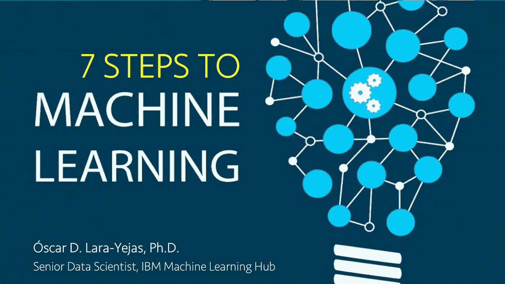

# 机器学习的七个步骤

> 原文：<https://towardsdatascience.com/seven-steps-to-machine-learning-afb9f71f2a97?source=collection_archive---------27----------------------->

这是机器学习入门系列的第二个视频。如果你是 ML 新手，我鼓励你先看一下[之前的视频](https://medium.com/@olarayej/machine-learning-explained-in-12-minutes-db34860383c4)。

在[之前的视频](https://medium.com/@olarayej/machine-learning-explained-in-12-minutes-db34860383c4)中，您学习了什么是 ML，为什么它很重要，以及如何从数据集训练机器学习模型。然而，ML 不仅仅是训练模型。在这个视频中，我涵盖了构建机器学习系统所需的七个步骤。

我还透露了我在 ***面试*** 有抱负的*数据科学家时问的**第一个问题** 是什么，并提供了一些我之前与客户接触时的*行业实例。**

**以下是视频中的步骤和内容:**

****1。**资料收集:《数据湖妄想》。**

****2。数据管理**:数据模式、语义类型、缺失值处理、数据聚合。**

****3。数据探索:**趋势/分散的测量，可视化。**

****4。特征工程:**特征选择，降维，主题专家 vs .数据科学家协同。**

****5。建模:**如何选择一个机器学习算法？监督与非监督学习，推荐系统，开源工具。**

****6。测评:**如何挑选最好的型号？**

****7。部署:**从模型到运行在云上的服务。**

****关于作者****

> **scar D. Lara Yejas 是高级数据科学家，也是 IBM 机器学习中心的创始成员之一。他与世界上一些最大的企业密切合作，将 ML 应用于他们的特定用例，包括医疗保健、金融、制造、政府和零售。他还为 IBM 大数据产品组合做出了贡献，特别是在大规模机器学习领域，是 Apache Spark 和 Apache SystemML 的贡献者。**
> 
> **scar 拥有南佛罗里达大学的计算机科学和工程博士学位。他是《人类活动识别:使用可穿戴传感器和智能手机》一书的作者，并发表了大量关于大数据、机器学习、以人为中心的传感和组合优化的研究/技术论文。**