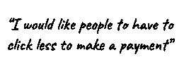
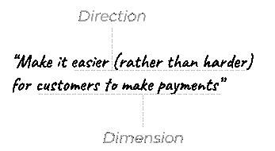
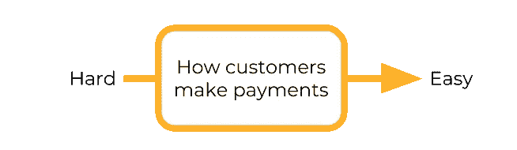
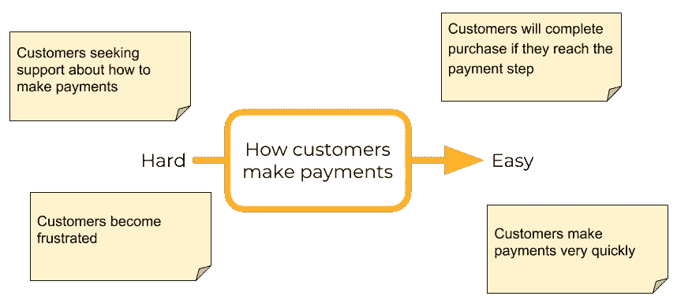
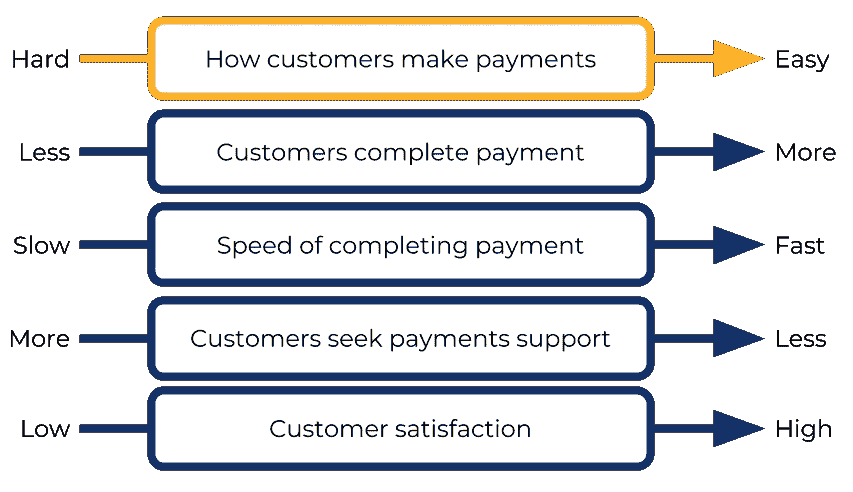
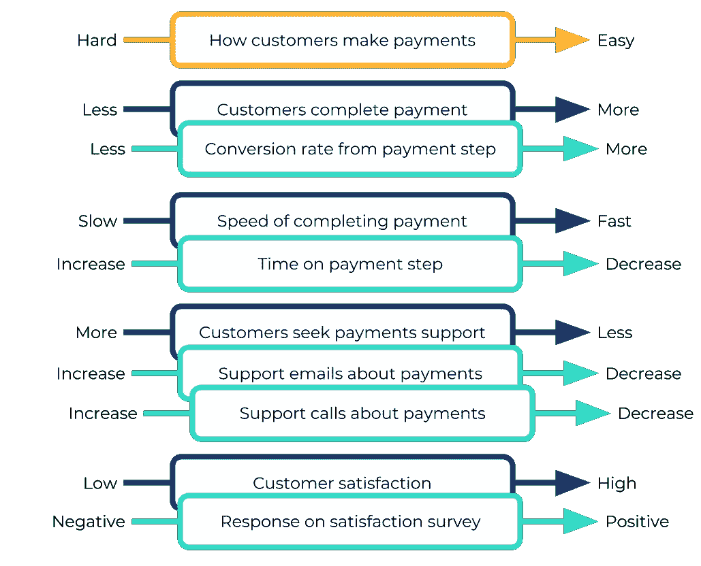
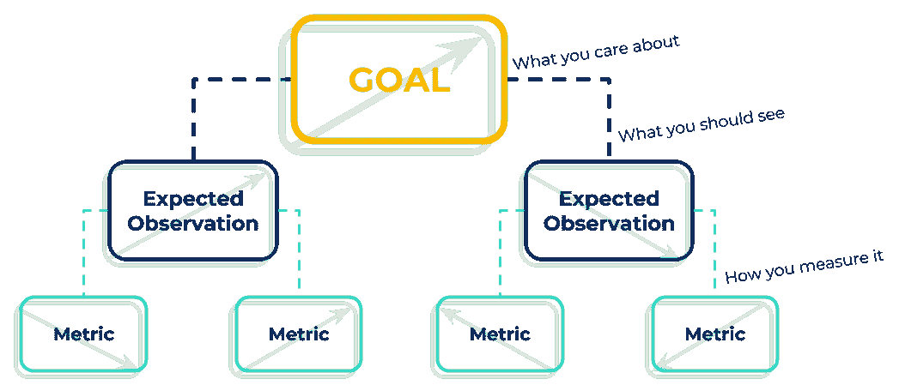
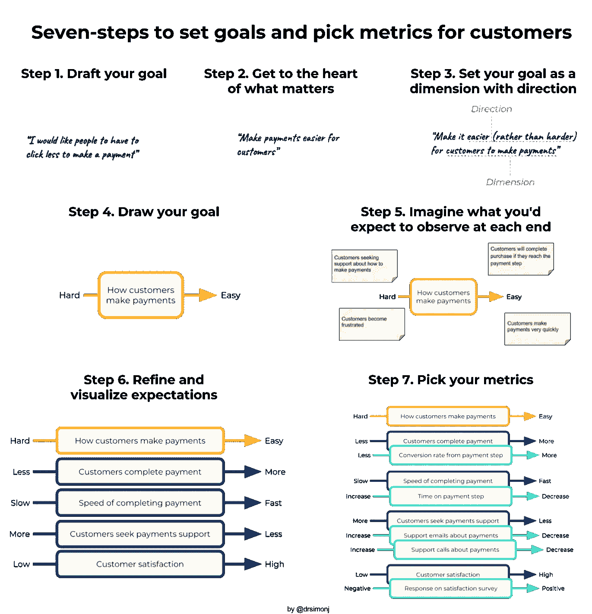

# 为客户设定目标和选择衡量标准的七个步骤

> 原文：<https://towardsdatascience.com/seven-steps-to-set-goals-and-pick-metrics-for-customers-613283570521?source=collection_archive---------12----------------------->

当你想为你的客户提高价值时，规划清晰的目标和一个[数据驱动的](https://medium.com/@drsimonj/five-flavours-of-decision-making-with-data-ae4d544f0d81)方法来实现它们是值得的。问题是，这是一个棘手的过程，隐藏着陷阱，即使你正在经营你的业务，这些陷阱也会让你感觉良好。在这篇文章中，我分享了我带领团队和决策者将想法转化为清晰可衡量的客户目标的七个步骤。

Seven-steps to set goals and pick metrics for customers. Photo by [Samuel Chenard](https://unsplash.com/photos/Bdc8uzY9EPw?utm_source=unsplash&utm_medium=referral&utm_content=creditCopyText) on [Unsplash](https://unsplash.com/search/photos/compass?utm_source=unsplash&utm_medium=referral&utm_content=creditCopyText)

## 动机

我们都希望我们的企业为客户提供价值，但我们如何知道我们正在实现它？嗯，有一些与利润和损失相关的财务指标，您可以通过监控这些指标来维持运营。然而，这些很少给你可操作的客户洞察力。

要发展，你的目标不能仅仅是增加利润。你需要考虑如何改善用户体验，增加满意度，减少困惑，或者增加忠诚度。如果做得正确，设定这些目标，并选择衡量其成就的标准，将有助于您更快地向客户交付更多价值。

# 大错误:将目标定义为度量标准

一个容易犯的错误是将目标定义为度量标准。一些例子:

*   提高转化率
*   减少客户服务查询量
*   提高客户回头率

这些有直观意义。你为什么不想提高转化率或客户回头率？但是你对这些目标有什么看法:

*   让支付变得更容易，转化率的增加就是证明
*   减少混乱，客户询问的减少就是证明
*   通过更高的退货率来提高满意度

相同的指标，巨大的差异。这些目标确切地表达了你想如何让顾客满意。这里的要点是，度量永远不应该定义目标。衡量标准只提供你正在实现目标的证据。

如果这还不行，下面是我不使用度量标准作为目标的主要原因。

## 不可弯曲的

将一个目标定义为一个度量标准会将你的成就限制在你可以衡量这个度量标准的范围内。好的目标是度量不可知的，并且足够灵活，可以在任何场景下获取成就。

## 不可宽恕的

当你选择一个不可靠的、无效的、不可移动的或者通常不好的度量标准时，度量标准定义的目标是不可原谅的，你几乎肯定会这样。好的目标会原谅不好的指标选择，并让你在需要时使用其他指标。

## 无常的

有了像“增加转化率”这样的目标，当事情不按你的方式进行时，你最终将不得不面对不确定性的浪潮。好的目标阐明了无论事情朝哪个方向发展，如何解释证据。

## 危险的

从任何单一指标得出强有力的结论都是不安全的，因为指标的变化有很多原因。好的目标可以让你用多个指标来衡量你的进步，并让你对自己的决定充满信心。

> “指标永远不应该定义目标。衡量标准只提供你正在实现目标的证据。”

# 设定目标和选择衡量标准的七个步骤

面对这些隐藏的挑战很多次了，我把设定目标和选择标准的过程分成了七个步骤。起初这需要一些额外的时间，但很快就会成为习惯，并让你获得比其他方式更多的成功。

## 第一步。起草你的目标

你想达到什么目的？不要想多了。把想法写在纸上。为了证明这一点，想象一下想要改进一个电子商务网站的支付流程。我的第一个想法是:

## 第二步。抓住问题的核心

“为什么？为什么？为什么？”一遍又一遍地问自己。为什么这是我的目标？我真正想解决的问题是什么？我如何为我的客户提高价值？戳和探索，直到你到达重要的美味中心。

为什么我要减少点击？真的吗？也许越多越好。不断询问和挑战，你可能会得出结论，我真的想:

不要低估这一步的难度或价值。如果这里还有一个度量标准，那么你还没有完成。每次我带人们走过这一步，我都必须不断追问“为什么”，直到我们找到具体而有意义的东西。它几乎总是从我们出现偏见和不确定或冲突的目标开始，但以更深刻的见解和更清晰的目标结束。

## **第三步。将你的目标设定为一个有方向的维度**

下一步涉及一些前瞻性的思考。在一天结束时，您将查看您的指标在一个方向或另一个方向上是上升还是下降。

要计划与指标的联系，将你的目标重新表述为一个维度(你有兴趣改变的东西)和方向(你希望它如何改变)。我会这样重新表述我们的支付目标:

一定要用两个明确的极点来定义自己的方向:更好/更差，满意/不满意，更多/更少，等等。“容易”的反义词是“难”。但是“优化”的反义词是什么呢？如果你不能定义两极，如果你的度量与你期望的方向相反，你就不能解释发生了什么。

## 第四步。画出你的目标

最简单的步骤:在一个指向你想要的方向的箭头上画出你的尺寸。

这有助于为后续步骤保持一切有序。

## 第五步。想象一下你期望在两端观察到什么

对于你箭头的每一端，问问你自己，“在一个[维度]就是[方向]的世界里，我期望观察到什么？”

在一个顾客很容易付款的世界里，你会观察到什么？难的地方怎么样？发挥创造力，我建议手边要有便利贴。以下是我想到的一些事情:

试着把你的注意力放在客户的想法、感受或行为上，暂时不要包括指标。

## 第六步。提炼和可视化期望

对于每个预期的观察，完成步骤 2 到 4，将它们转化为与你的目标一致的维度和方向。

事情在这里真正开始成形，对我来说，这是视觉帮助很大的地方。

## 第七步。选择您的衡量标准

最后，为每个预期的观察(蓝框)列出一个或多个指标(你可以测量的事物)以及它们发生的方向。像这样把它们覆盖在你的视觉上:

你有它！你的目标的视觉表现，如果你正在实现(或没有实现)你期望看到的事情，以及你可以实际测量并记录它们的结果模式。

# 总结和实用技巧

在流程结束时，您可以将您的目标与如下指标联系起来:

如果你的所有指标都朝着你期望的方向发展，那么你就找到了实现目标的证据。

如果你尝试这样做的话，一个建议是把你自己限制在 3 到 5 个最相关的指标上。这应该给你足够的信息来衡量你的成就，而不会让你的仪表盘上充斥着可能有问题的表盘。

最后，这里有一张小抄，供你下次尝试时参考:

# 停止广播

感谢阅读，请在下面分享你的想法和评论，我希望这对你有用。

想多读点？你可以在 Medium、 [Twitter](https://twitter.com/drsimonj) 或 [LinkedIn](https://www.linkedin.com/in/drsimonj/) 上以@drsimonj 的身份关注我的最新帖子。