# 二手车门户网站抓取和探索性数据分析项目

> 原文：<https://towardsdatascience.com/sgcarmart-web-scraping-and-exploratory-data-analysis-project-de8d5d63e671?source=collection_archive---------5----------------------->

*编辑:文章已修改，保持汽车门户网站的身份匿名。*

# **简介**

本项目的目的是开展一个小型项目，涵盖大部分数据科学流程，从数据收集、数据清理到探索性数据分析阶段。

数据来源是东南亚的二手车门户。为了保护公司的身份，省略了门户网站的名称。

考虑到拥有汽车的高昂成本，二手车市场的数据分析可能会为汽车门户网站、消费者和汽车经销商带来节约和收益。汽车门户网站拥有超过 10 万辆汽车的数据库，似乎没有分析或数据科学团队来分析这些数据。因此，这个项目的目的是进行探索性的数据分析，以获得对汽车门户、消费者和经销商有意义的见解。

使用的 Python 版本是 3.7.0。

# **第 1 部分:数据收集**

数据是用 BeautifulSoup 4 v0.01 从汽车门户网站上刮下来的。

首先，我们导入模块:

二手车被列在单独的网页上，它们的 URL 包含唯一的 id，格式便于迭代。此外，所有有用的数据都包含在 html 的`main_left`部分中。

**定义 process_new()函数**

接下来，我们定义一个函数`process_new()`,该函数首次提取单个车辆的数据:

**定义 update()函数**

然后我们定义一个函数`update()`,该函数为之前使用`process_new()`函数抓取的列表重新抓取数据。该函数的目的是捕捉售出的车辆，以及捕捉价格等列表信息的变化。

`update()`功能与`process_new()`功能相似，但有一些不同之处，这些不同之处将在下面进行解释:

定义了`process_new()`和`update()`函数后，就可以通过现有的清单 id 运行这些函数了。我将每次迭代的休眠时间设置为 0.1 到 0.2 秒之间的随机浮动，以防止服务器过载。

**第一次运行 process_new()时**

接下来，我们通过运行下面的代码开始构建本地数据库(DB ),第一次一个一个地抓取清单:

SQLite3 用于与数据库接口，而 DB Browser for SQLite 用作 DBMS。一旦列表被抓取，我们就可以开始用`update()`函数每天更新它们。

**更新步骤 1:生成要更新的 id 列表**

在运行`update()`函数之前，我们生成一个应该更新的列表，即状态仍然为“可用”而不是“已售出”或“过期”的列表:

**更新步骤 2:批量运行 update()**

现在已经创建了 id 列表，我们可以开始在 DB 中更新它们对应的行。

一般来说，对数据库中现有的条目运行`update()`的日常过程需要大约 2.5 小时，总共大约 12，000 个行/ID，每个行/ID 花费大约 0.7 秒。

**每天为新列出的车辆运行 process_new()**

`process_new()`功能也每天运行，以捕捉新列出的车辆。要抓取的 id 范围(从`range_start`开始，到`range_end`结束，但不包括 T5)必须每天重新定义。由于数据收集过程是在 Jupyter 笔记本上完成的，特定一天的`process_new()`执行的`range_start`就是前一天保存在笔记本上的`range_end`。通过在汽车门户网站上进行快速手动搜索，找到了`range_end`。

# 第 2 部分:数据清理

经过一段时间的数据收集，数据库拥有 23，645 行数据。需要很大程度的清洁。

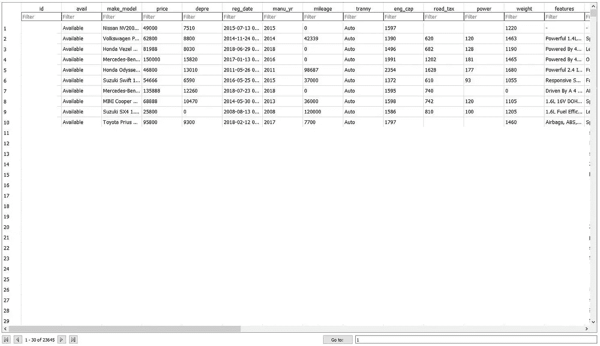

Snapshot of the Database in DB Browser for SQLite (id and other rows censored)

出于这种探索性数据分析的目的，我们只查看那些成功销售的列表。仍可出售的列表从数据库中删除。我们也不包括非私人机动车辆。因此，货车/卡车、公共汽车和货车等商用车辆不在分析范围内:

汽车门户网站上的一些列表没有年度折旧数字。因此，我们必须根据以下公式手动计算年折旧:

*年折旧=(价格—退税)/剩余天数* 365*

EC 是权利证书，一种给予一个人拥有和操作一辆汽车的权利的许可证。

**退税**是指车主只有在第一个 EC 的 10 年期满后注销车辆时才能获得的退税。这些车辆可能被报废或出口。对于该数据库中的车辆，退税为注册费(RF)的 50%。幸运的是，RF 数字包含在数据收集步骤中。

数据库中的`depre`列没有被修改，以防需要原始值。创建了一个新列`final_depre`来存储最终的折旧数字。然后运行以下查询来填充`final_depre`列:

`cat`栏在筛选符合退税条件的车辆时非常有用。符合退税条件的车辆在卡特彼勒一栏下有一个特定的标签。

随后，删除了不需要的列，包括`avail`和`depre`，并且为了更加清晰起见，重新排列了这些列。

移除了`price`为 0 的车辆。此外，非高峰时段的车辆被删除，因为它们运行在不同的经济(较低的折旧，由于其独特的，有限的使用计划)。

接下来，我们计算每辆车售出的天数:

**挑战:细分车辆**

从基本的奇瑞 QQ 到豪华的宾利欧陆 GT，汽车的声望各不相同。从这个维度上分割车辆可以得到进一步的见解。浏览数据，我们可以通过几种潜在的方法对车辆进行细分:

1.  **车型** ( `veh_type`):车型分为 12 类，分别是中型轿车、豪华轿车、掀背车、MPV、SUV、跑车、旅行车、全商用车、厢式车、货车、客车/小型客车、其他。每辆车只能分配一种车型。这种分类是模糊的，因为高档和大众市场品牌在所有这些细分市场生产汽车。此外，根据汽车门户网站的定义，丰田凯美瑞、宝马 520i 和劳斯莱斯 Ghost 都属于豪华轿车。车辆类型不是分割车辆的好方法。
2.  **类别** ( `cat`):类别有 13 类，包括车主直接出售、拍卖车辆、稀有&异国车等。除了仅适用于一小部分汽车的“稀有外国汽车”之外，其他类别并不能告诉我们汽车的声望水平。这在分割车辆时也没有用。
3.  品牌和型号:一辆车的品牌和型号很能说明它的声望。仅仅是品牌本身就能告诉我们很多关于对一辆车的期望——例如，当我们得知有人开宝马时，外行人的第一个想法可能是“这是一个有声望的品牌”。让我们根据汽车的品牌来分类。

需要在(1)使分析有意义和(2)避免过度分割车辆之间取得平衡。根据我对我国汽车品牌的了解，并通过谷歌搜索，6 个拟议的细分市场是*异国情调、超豪华、豪华、中级、经济*和*预算*。

提议的分段及其各自的构成如下:

1.  **异域** (4):阿斯顿马丁、法拉利、兰博基尼、迈凯轮、
2.  **超豪华** (5):宾利、路虎、玛莎拉蒂、保时捷、劳斯莱斯
3.  **豪华型** (9):奥迪、宝马、捷豹、吉普、雷克萨斯、莲花、奔驰、三雄、沃尔沃
4.  **中级** (7):阿尔法罗密欧、克莱斯勒、英菲尼迪、迷你、欧宝、萨博、大众
5.  **经济** (17):雪佛兰、雪铁龙、菲亚特、福特、本田、现代、起亚、马自达、三菱、日产、标致、雷诺、斯柯达、双龙、斯巴鲁、铃木、丰田
6.  **预算** (5):奇瑞、大发、吉利、Perodua、宝腾

在 DB 中创建了一个新列`make`。运行以下查询从`make_model`列提取品牌，并填充`make` 列:

然而，我们遇到了有空格的品牌的问题，如“阿尔法罗密欧”结果是“阿尔法”。然后，我们收集了一系列独特的品牌:

输出包含 47 行，其中 3 个品牌(Alfa Romeo、Aston Martin 和 Land Rover)需要使用以下查询进行修复:

接下来，我们在表格中创建一个新列`segment`，并将其应用于品牌各自的细分市场:

**标签溢价和直接所有者销售广告**

接下来，在表格中添加一个`premium_ad`列，将广告标记为高级(1)或非高级(0)。对于由直接所有者而非经销商出售或寄售/拍卖的车辆也是如此:

**清理带有描述性文本的列**

此外，`features`(特性)、`acc`(配件)和`description`(描述)栏似乎有几行是空的。当运行 **tf-idf 分析**时，这将**成问题**。因此，我们用“Nil”替换空行或包含“-”的行:

瞧啊。数据库现在可以运行了。然后将其导出为. csv 文件。开始分析。

# 第 3 部分:探索性数据分析

项目的分析部分是在 Spyder IDE v3.3.2 上完成的。数据的可视化是在 Matplotlib v3.0.0 和 Seaborn v0.9.0 的帮助下完成的。

首先，我们导入模块:

接下来。csv 文件被作为 Pandas 数据帧读取，列标题被更新:

**去除异常值**

现在我们用散点图快速看一下数据，用`Segment`给数据点着色，绘制`Days to Sell`对`Depreciation`:

输出如下所示:

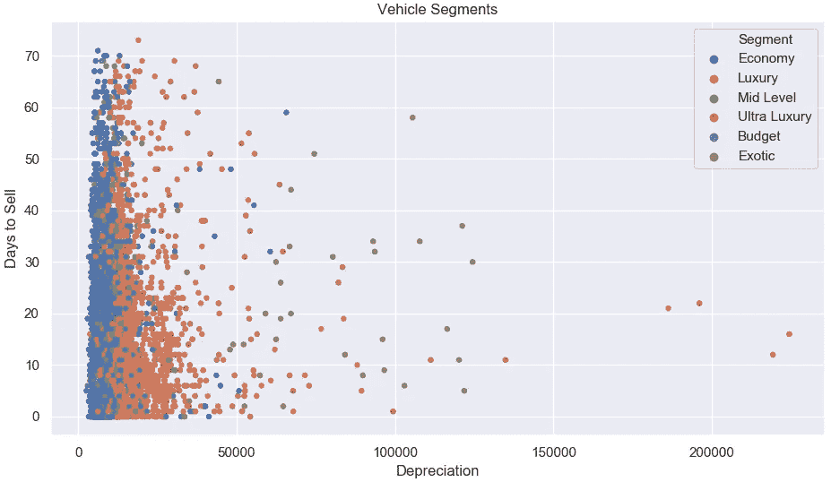

Scatterplot of Days to Sell against Depreciation; Coloured by Vehicle Segment (Incl. Outliers)

快速浏览散点图可以发现几个异常值。为简单起见，我们排除了年折旧超过 75，000 新元的车辆数据。我们使用折旧而不是价格，因为在我的国家，车辆的使用寿命是有限的，这是由剩余的 EC 期限决定的，因此摊销费用的相关性更大。此外，我们将主数据帧`df`分解成多个数据帧，代表不同的段:

接下来，为了直观检查分段的准确性，按顺序绘制各个分段:

输出图表已被处理成. gif 格式，如下所示:

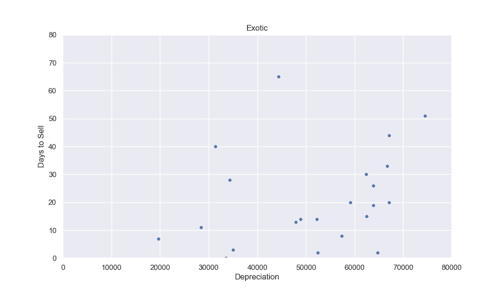

Scatterplot of Days to Sell against Depreciation; Coloured by Vehicle Segment (Excl. Outliers)

分割看起来不错。各段大致占据`Depreciation`轴上的正确区域。

**问题 1:向直接所有者购买还是向经销商购买？**

购车者通常会在经销商和直接车主之间进退两难。每一种都有其优点和缺点。经销商通常提供内部融资选项并提供短期保修，但众所周知，一些经销商隐瞒缺陷和磨损迹象，例如篡改车辆里程表以显示较低的里程读数。直接所有者不太可能篡改车辆，更愿意接受价格谈判，但时间表更紧，不提供私人融资选项等辅助服务。

汽车门户网站将直接所有者销售的广告标记为“直接所有者销售”。我们将“非直接车主”群体概括为汽车经销商，因为其他非直接车主广告，如寄售和拍卖广告相对不常见。让我们将数据集分成两种不同类型的卖家，并查看一下描述性统计数据:

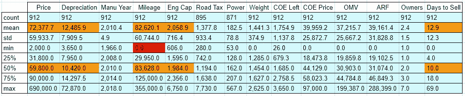

Table 1: Direct Owner Sales Descriptive Statistics (Incl. 0 Mileage)

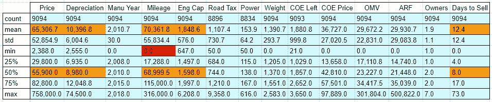

Table 2: Dealer Sales Descriptive Statistics (Incl. 0 Mileage)

从上面两张表中可以看出，经销商销售的平均和中间**价格和折旧**比**低**。对于经销商来说，平均和中间里程数也比平均里程数低。这与里程数少的车价格高的想法不一致！或许经销商销售的里程数据被大量里程数字为“0”的列表扭曲了？让我们通过更新`directowner_df`和`dealer_df`来过滤这些列表，重新运行描述性统计，并绘制里程直方图:

Table 3: Direct Owner Sales Descriptive Statistics (Excl. 0 Mileage)

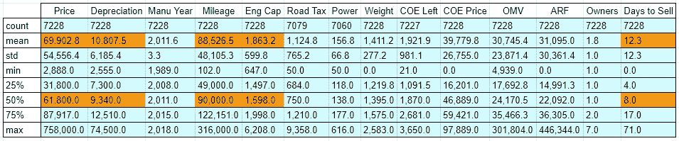

Table 4: Dealer Sales Descriptive Statistics (Excl. 0 Mileage)

直接和非直接所有者销售的中间价格和平均价格以及折旧的差距**已经缩小**。平均里程和中值里程也是如此。然而，平均/中值折旧与里程数之间的正相关关系告诉我们，一些经销商可能在进行一些不正当的活动，即[篡改待售车辆的里程表](https://www.straitstimes.com/singapore/transport/customer-sues-over-tampered-mileage)。让我们看看里程直方图:

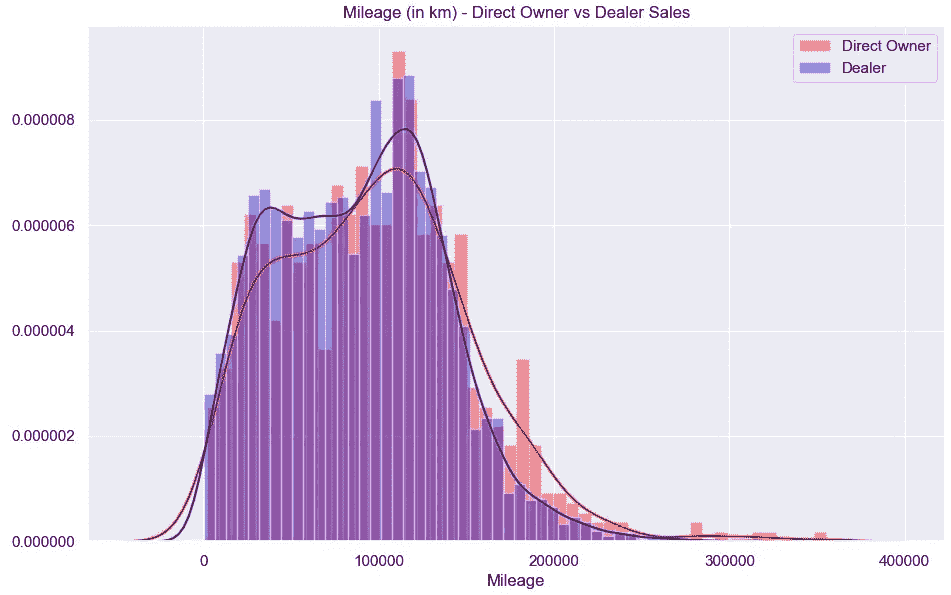

Mileage Histograms for Direct Owner Sales vs Dealer Sales

查看内核密度估计(KDE)线图，经销商销售的车辆具有较平的右尾部，并且更偏向具有较高峰值的左侧。经销商的 KDE 曲线接近双峰，第二个峰值在 35，000 公里大关附近。经销商销售的**折旧**分布和 KDE 图会是什么样子？(*注意两个 KDE 图中对于里程范围< 0 的微小误差。KDE 图是拟合分布的估计值，并不代表实际分布。*)

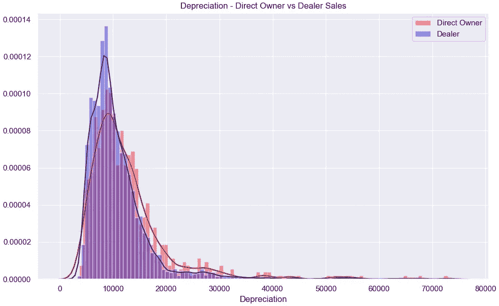

`Depreciation` Histograms for Direct Owner Sales vs Dealer Sales

经销商销售的 KDE 折旧图在峰值左侧有一个拐点。然而，里程和折旧有一个相反的关系——我们本以为在最高峰的右边会有第二个更低的峰，但 KDE 图显示的却不是这样。因此，我们可以合理地假设经销商更倾向于篡改车辆的里程数。

现在回到是从直接车主还是经销商处购买的问题上来:与其做出明确的选择，对于买家来说，更实际的做法是**格外小心**一辆里程数**低但折旧**也低的经销商车辆。类似地，买方应始终**与经销商协商**更低的折旧**给某车型，该车型也可从类似情况下的直接所有者处获得。**

**问题 2:汽车门户网站是否放弃了来自低端市场的收入？**

从表 3 和表 4 中观察到的另一个有趣现象是，直接所有者销售的车辆通常具有更高的发动机容量，平均值为 2,066.5cc，中位数为 1,984.0cc，而经销商销售的车辆的平均值为 1,863.2cc，中位数为 1,598.0cc。发动机容量与折旧有**正相关**，原因有两个——(1)高档车折旧高，通常配备大型发动机。(2)与发动机容量较低的相同型号相比，车辆的折旧较高，例如，2500 cc 的丰田凯美瑞与 2,000cc 的丰田凯美瑞。

这表明经销商销售较低细分市场车辆的比例较高，而直接所有者销售较高细分市场车辆的比例较高。为了调查这一说法，我们对各个细分市场的直接所有者与经销商销售进行了统计:

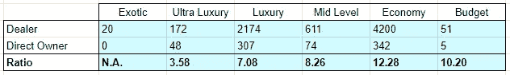

Table 5: Count of Vehicle Sales by Direct Owner vs Dealers, for the Various Segments

如表 5 所示，从超豪华到经济型，经销商直接向车主销售的比例大幅上升。之前的说法确实没错。高档车的车主更有可能以自己的身份进行销售。这可能是因为经销商向这些车主提供了很低的价格，以保护他们自己(经销商)免受高额维修费用的影响，这是高端大陆品牌普遍存在的问题。高档车的车主也可能更加精明，因此能够通过在汽车门户网站上进行销售。

另一方面，经济型轿车中较低级别车型的车主更倾向于向经销商交易或出售车辆，而不是自行销售。

从汽车门户网站的角度来看，如果车主决定在汽车门户网站上出售汽车或直接向经销商出售汽车，这很重要。交易有三种可能的方式:

1.  车主直接销售给经销商而不在汽车门户上挂牌->经销商在汽车门户上挂牌->汽车销售给私人买家(**汽车挂牌一次**)
2.  车主在汽车门户网站上列出汽车->经销商购买汽车->经销商在汽车门户网站上列出汽车->汽车出售给私人买家(**汽车列出两次**)
3.  车主在汽车门户网站上列出汽车->卖给私人买家的汽车(**汽车列出一次**)

根据表 5，有太多的经济舱车主按照上述选项 1 进行交易。经销商销售的经济型轿车数量也超过了所有其他车型的总和。如果更多的经济型轿车车主选择自己上市，汽车门户网站的收入会显著增加，因为如果同一辆车被卖给经销商，它可能会第二次上市。截至目前，它对标准广告收取统一费用，直到汽车售出。

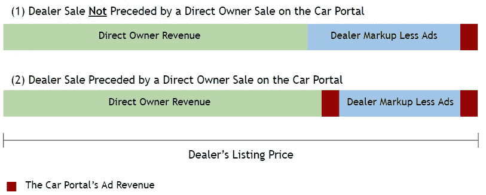

Comparison of Direct Owner Revenue and Dealer Markup for 2 Sales Sequences (estimated, not to scale)

上图显示了直接所有者销售之前和之前的经销商销售的估计收入和加价明细。通过鼓励车主自己挂牌，这些汽车中的一部分将不可避免地出售给私人买家。然而，经销商也很有可能是买家，因为他们积极寻找并达成汽车交易，这些汽车可以转手获利。如果第二类经销商销售增加，第一类经销商销售减少，汽车门户网站将获得更高的广告收入，同时减少经销商获得的加价。直接所有者也可能收到更高的价格，因为他将收到更多经销商的报价。

在没有车主信息的情况下，我们只能假设车主直接向经销商销售而不是自己销售的三个原因:

1.  快速销售，急需现金——由于快速销售车辆的压力而难以捕捉
2.  方便，不需要与挑剔的买家打交道——也很难捕获，因为这需要汽车门户网站提供托运服务
3.  不精通技术，即无法自己列出汽车或之前从未听说过汽车门户网站— **目标群体**

汽车门户网站可以通过提供**帮助这些车主创建他们的列表**的服务来捕获第三类车主。一旦车辆被张贴出来，车主只需要管理潜在买家的电话和短信。截至目前，汽车门户网站似乎没有这样的服务，所有的上市过程都是由车主在线完成的。

汽车门户网站已经提供了一项服务，帮助买家和卖家解决与交易相关的文书工作。通过帮助面临技术挑战的车主发布他们的清单，汽车门户网站可以提供真正的**端到端服务**，从而吸引更广泛的客户。

问题 3:优质广告——有用吗？

据一位在汽车门户网站工作的朋友说，优质广告会有更多的图片和更高的搜索优先级。**只有经销商**可以选择使用高级广告，并且经销商可以使用的高级广告数量有限。汽车门户网站上的优质广告在许多方面都很突出，例如，当它出现在搜索结果中时会有一个绿色标签。

现在，让我们创建一个新的数据框架，不包括`Mileage` = 0 的车辆，然后将其分为两个数据框架，分别用于高级和非高级广告。然后我们运行描述性统计:

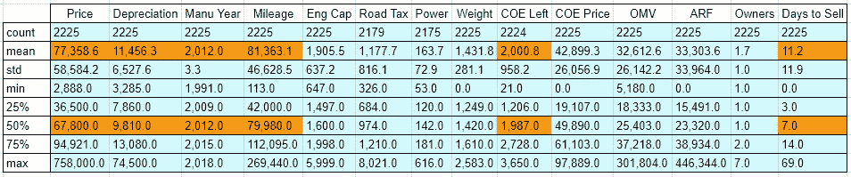

Table 6: Premium Ad Descriptive Statistics (Excl. 0 Mileage)

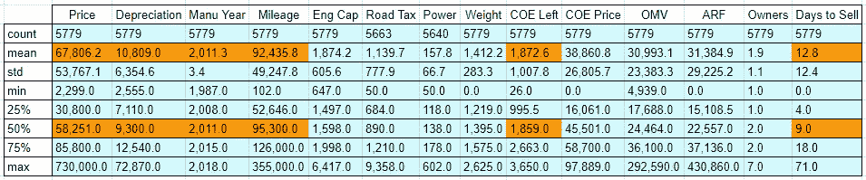

Table 7: Non-Premium Ad Descriptive Statistics (Excl. 0 Mileage)

根据上面的表 6 和表 7，溢价广告通常会导致更快的销售，平均需要 11.2 天才能销售，中位数为 7.0 天，而非溢价广告平均需要 12.8 天才能销售，中位数为 9.0 天。溢价广告的平均销售时间比非溢价广告少 12.5%。

人们可能会认为高价广告会以较低的价格快速销售，但描述性统计数据却表明并非如此。**溢价广告的平均价格更高，折旧也更高。**此外，平均而言，处于中值的优质广告里程数较低，剩余 EC 期较长，且制作时间较晚。换句话说，高价商品清单中包含的是**更新、状况更好的**车。

简而言之，溢价广告是有效的，因为它们导致更快的平均销售。

当分成不同的部分时，优质广告会显示出有趣的模式吗？

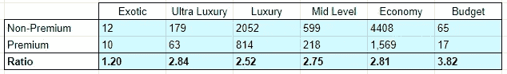

Table 8: Count of Vehicle Sales by Premium vs Non-Premium Ads, for the Various Segments

在细分市场和广告是否优质之间没有有意义的关系。在 6 个细分市场中，有 4 个市场的非溢价广告与溢价广告的比率在 2%以上。

**问题 4:我应该使用什么关键词来描述车辆？**

汽车门户网站上的每个列表都有 3 个描述性文本字段，即功能、附件和描述。目标是通过拟合几种类型的回归模型，即支持向量回归(SVR)、决策树回归、XGBoost 回归和线性回归，找出文本是否与销售速度(销售车辆所需的天数)有任何关系。我们做的第一件事是在主数据框`df`中创建一个新列，合并所有三个字段的内容:

然后我们导入相关的模块并清理文本:

接下来，单词袋模型被创建。`TfidfVectorizer()`的`ngram_range`被设置为`(1,2)`以捕获可能在语义上重要的单个单词以及单词对:

我们将探索一个回归模型，自变量为 tf-idf 矩阵，因变量为售出一辆车所需的天数。然后，我们将数据集分为训练集(85%)和测试集(15%):

然后，我们开始在 SVR 上执行网格搜索以获得最佳参数，以均方误差(MSE)作为评分标准:

多边形内核被排除，因为它无法收敛到一个解决方案。出于同样的原因，对于误差罚项 C = 10、100 和 1000 的线性核，也进行了同样的处理。接下来，生成结果:

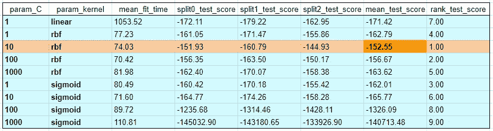

Table 9: Grid Search Results on the SVR Model

SVR 的最佳参数是`kernel = ‘rbf’`和`C = 10`，最小均方误差为 152.55。这意味着 RMSE 为 12.35，考虑到`Days to Sell`的平均值为 12.48，中位数为 8.00，这是一个非常差的拟合。接下来，我们将 SVR、决策树、XGBoost 和线性回归模型拟合到 tf-idf 矢量器，计算 10 次迭代的平均 RMSE:

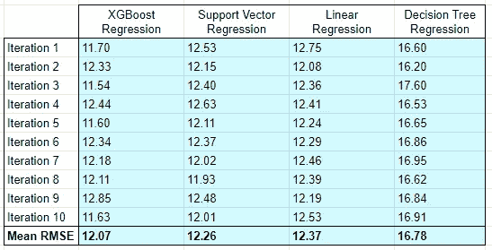

Table 10: Mean RMSE for the 4 Regression Models

所有 4 个模型都有大量的 RMSE 数据，在预测汽车售出的天数时没有用。考虑到高 RMSE 数字，进一步调整参数没有什么好处，特别是对于 XGBoost。(在最近了解到 XGBoost 出色的性能和速度后，我很乐意为它这么做)。就我个人而言，我只会调整模型的参数，如果它的 RMSE 数低于 4 的话。因此，我们就到此为止。让我们研究单词/单词对的线性回归系数，以获得任何见解。

线性回归模型重新运行 10 次，以生成特征及其相应的系数:

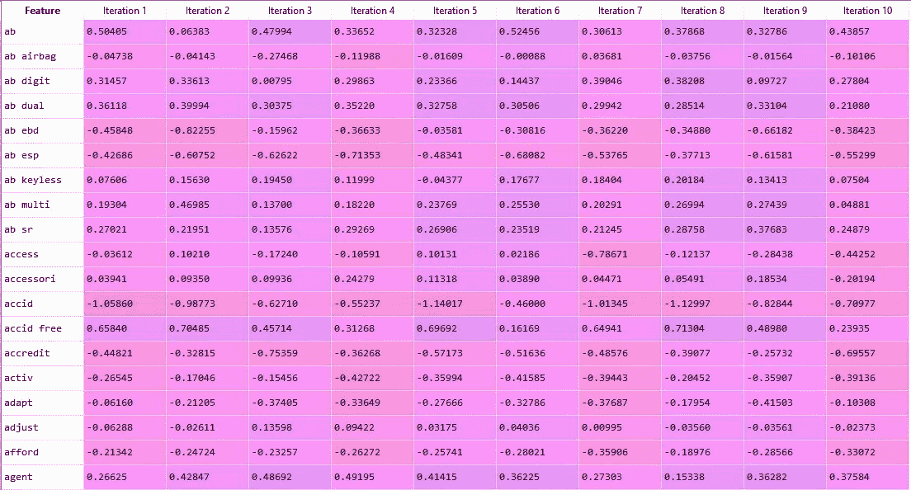

Tf-idf Features and Their Coefficients for 10 Linear Regression Iterations

接下来，我们对系数进行快速粗略平均，并对平均值进行排序，以查看哪些系数可能是重要的:

系数值范围从-2.33 到 3.61。让我们看看系数最低的 10 个特征和系数最高的 10 个特征:

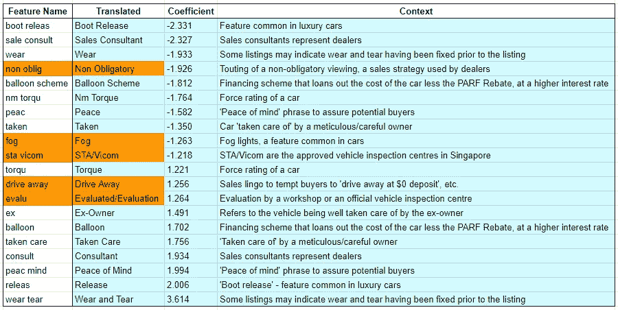

Table 11: Top Linear Regression Features Based on Coefficient Magnitude

一些特征名看起来很奇怪，因为在数据库中的`Text`列被矢量化之前，它们被`PorterStemmer`简化为词干。表 11 包括它们的翻译和它们适用的上下文。具有高绝对系数的特征表示在系数的正端和负端**处。这些功能被忽略。让我们看看 5 个不重复的特征(上面橙色的)是否会影响卖出一辆车的天数。**

我们在主数据框`df`中为 5 个特征创建 5 个新列，在`Text`列中搜索匹配项，如果特征出现则插入`1`，如果没有出现则插入`0`。幸运的是，汽车门户网站在其文本字段中将所有单词的首字母大写。因此，必须进行的单词置换的数量保持较低。

接下来，我们绘制直方图，以便快速直观地检查`Days to Sell`的分布是否受到 5 个特征的影响:

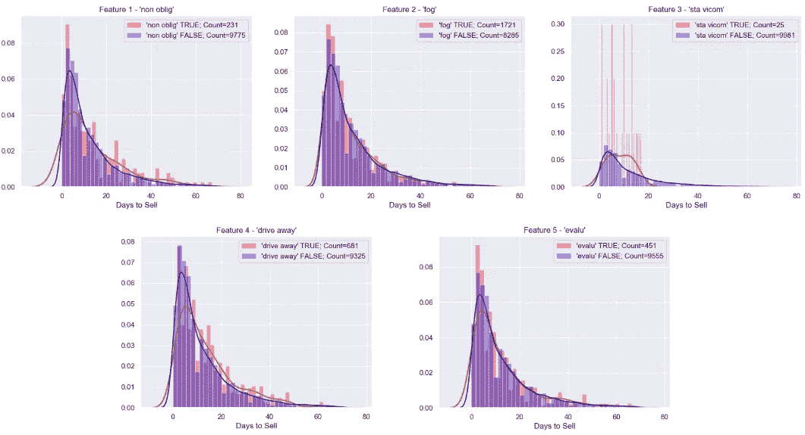

Key Tf-idf Features and Their Impact on the Number of Days Taken to Sell a Vehicle

每个特征的两个直方图看起来非常相似。请注意,“sta vicom”功能提供的比较很差，因为包含该功能的样本数量很少。直方图没有提供任何信息。让我们看看熊猫综合数据框架中的描述性统计数据:

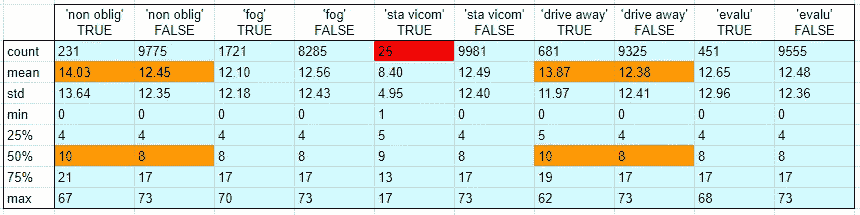

Table 12: Descriptive Statistics on 5 Key Tf-idf Features

对于“雾”和“评估”特性，销售天数的平均值和一般分布几乎没有区别。包含“非强制性”特征的样本具有更高的平均值和**，但是该特征在线性回归模型中具有负系数**。这可能是由于 1000 个文本特征的**多重共线性**，因为多个特征可以频繁地一起使用。单看一个单词或一对单词不太可能产生任何有意义的见解。

最后，包含“驱离”特征的样本比不包含“驱离”特征的样本具有更高的均值和中值。这与其正系数一致，但考虑到多重共线性问题，**可能只是巧合**。

简而言之，多重共线性问题导致 td-idf +回归分析产生有限的洞察力。我们无法判断哪些词会导致更快的销售。文本和卖出一辆车的天数之间可能没有关系。

tf-idf 分析在分类问题中可能比在回归问题中更有用。

**探索性数据分析的结论**

让我们总结一下各方的要点:

1.  汽车门户网站:帮助不了解汽车的车主创建他们的列表，以便从没有在汽车门户网站上列表的大量经济型车主中获取一部分
2.  车主销售:鉴于模糊的 tf-idf 分析结果，没有真正的外卖
3.  购车者:当心经销商的廉价低里程汽车；始终与经销商协商低于所列的价格
4.  经销商:明智地选择优质广告，因为它们的销售速度比非优质广告平均快 12.5%；如果你在篡改里程表，请三思！

# 第 4 部分:结束语

这个项目产生了比我最初预期的更多的见解。虽然我很想有机会与该公司合作，并获得更多的功能，我对这个项目的结果感到满意，因为它的时间表相当紧张，只有 3 个月。也许更长的数据收集期会有助于更好的探索性分析。

然而，我期待着任何关于改进领域的讨论或反馈。

欢迎在 LinkedIn[上给我发消息或者在下面留言。](https://www.linkedin.com/in/yeanpokleong/)