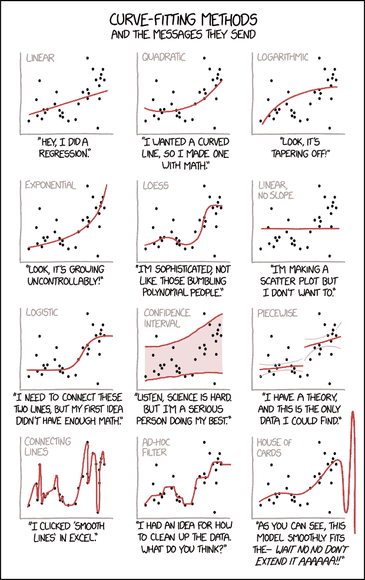
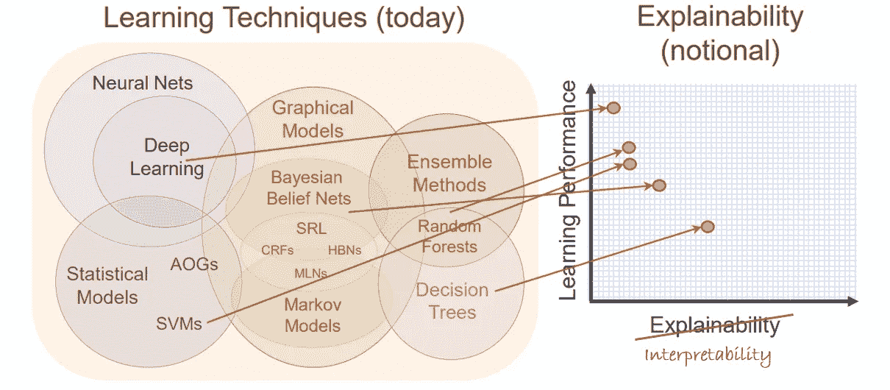
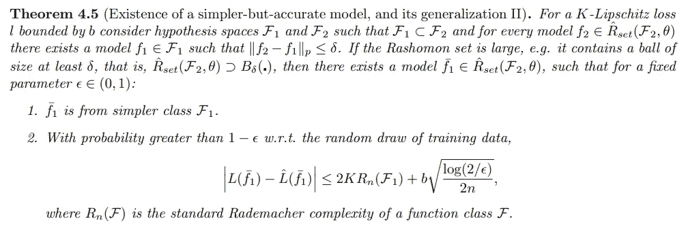
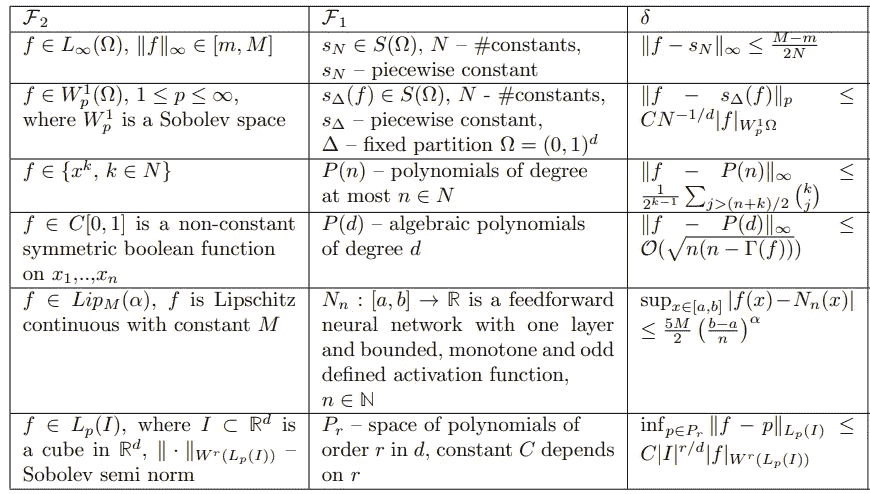

# 我们要马上建立透明模型吗？

> 原文：<https://towardsdatascience.com/shall-we-build-transparent-models-right-away-196db0eeba6c?source=collection_archive---------22----------------------->

可解释的人工智能(xAI)是新的酷小子，xAI 方法(建立一个黑盒，然后解释它)现在是机器学习从业者最珍视的工作方式。这真的是最好的路线吗？为什么我们不马上建立一个可解释的模型呢？

***Rashomon*** (羅生門 *Rashōmon*) is a 1950 [Jidaigeki](https://en.wikipedia.org/wiki/Jidaigeki) film directed by [Akira Kurosawa](https://en.wikipedia.org/wiki/Akira_Kurosawa). The film is known for a plot device that involves various characters providing subjective, alternative, self-serving, and contradictory versions of the same incident. ([wikipedia](https://en.wikipedia.org/wiki/Rashomon))

# 可解释与可解释的人工智能

可解释性和可解释性是两个不同的概念，尽管在不同的来源中，这两个概念似乎被错误地互换使用。在这篇博文中，我将根据以下定义[7]进行推理，至少从我的角度来看，这些定义似乎被最广泛地采用:

*   可解释的 ML:使用黑盒并在事后解释它
*   可解释的 ML:使用透明的模型，即不是黑盒

换句话说，基于这些定义，可解释性是一个模型属性，而可解释的 ML 指的是旨在解释黑盒模型的工具和方法论。

xkcd: curve fitting [0]

# 我们应该首先建立一个黑盒子吗？

辛西娅·鲁丁[1]的采访很好听，让人耳目一新，她的文章也是[2]。在众多观点中，辛西娅提出了两个有趣的观点:

## 1.可解释的 ML 方法提供了不可靠的解释

当前主流的可解释 AI / Ml 的解释没有多大意义:可解释 Ml 方法提供的解释并不忠实于原始模型计算的内容。根据定义，这是正确的，即使对于本地代理人也是如此；最重要的是，目前可用的局部替代方法是不稳定的，即不健壮[3]

## 2.准确性和可解释性之间没有权衡

福布斯写道"*更复杂，但也可能更强大的算法，如神经网络，包括随机森林在内的集成方法，以及其他类似的算法牺牲了透明性和可解释性*【可解释性，根据以上定义】*以获得功率、性能和准确性*【4】。按照同样的思路，DARPA [6]。真的吗？

Learning Performance vs Explainability (Interpretability according to the definitions above) [6]

不。准确性和可解释性之间没有权衡。罗生门集提供了一个证明:*认为数据允许一个相当准确的预测模型的大集合存在。因为这组精确的模型很大，所以它通常包含至少一个可解释的模型。这个模型既可解释又准确。*【2】

为什么我们不马上建立一个可解释的模型呢？

# 回到我们对可解释性的定义

在这篇博文的开始，我们介绍了可解释 ML 的概念。根据我们的定义，*可解释的*是那些不是黑箱的算法。这到底是什么意思？

如果我们看看罗生门集[2，10]:

Rashomon sets: existence of a simple but accurate model [10]

Rashomon sets: classes of functions F2 that can be approximated with functions from classes F1 within δ using a specified norm [10]

换句话说，可解释性是数学家标记为*透明*(黑盒的反义词)[9]的函数类的一个属性。

例如，线性模型类比深度神经网络更容易解释的事实似乎完全没有争议。然而，从实践的角度来看，*线性模型并不比深度神经网络*、*更具可解释性，特别是对于高维度模型或存在大量工程特征的情况*。*线性模型的权重可能看起来很直观，但它们在特征选择和预处理方面可能很脆弱*【9】。

换句话说，从业者对*可解释性*的定义中没有任何内容表明，属于可解释模型类别的模型将被关键决策者(例如:法官)或关键利益相关者(例如:申请假释的囚犯)理解。在我们对*可解释性*的定义中，没有任何东西暗示一个模型在可解释性方面最终会满足它的需求。

> “但是在地下的某个地方，将会有各种各样的计算不可约性，我们永远也不能真正把它们带入人类理解的领域”——史蒂夫·沃尔夫勒姆[8]

# 可解释性的许多方面

从利益相关者的角度来看，使用一个可解释的模型类别，其中可解释的意思是透明的(与黑箱相反),并没有带来太多的东西。那么可解释性的定义应该是什么呢？不幸的是，可解释性有很多方面。

不同的任务可能需要不同的解释需求。[12]提供了一个非详尽的假设列表，说明是什么使任务在解释需求上相似:

*   全局与局部:*全局可解释性意味着知道总体上存在什么模式(比如控制星系形成的关键特征)，而局部可解释性意味着知道特定决策的原因(比如为什么某个贷款申请被拒绝)。前者在以科学理解或偏见检测为目标时可能很重要；后者是当一个人需要一个具体决定的理由时。*
*   面积，不完整的严重程度:*问题公式化的哪一部分不完整，有多不完整？一方面，人们可能会对自动驾驶汽车如何做出决策感到好奇。另一方面，可能希望检查特定的场景列表(例如，导致汽车偏离道路 10 厘米的传感器输入集)。在这两者之间，人们可能想要检查一个一般属性—安全的城市驾驶—而不需要场景和安全标准的详尽列表。不完整的严重程度也可能影响解释需求。*
*   时间限制。*用户能花多长时间来理解解释？*
*   用户专业知识的性质。*用户在任务中的经验如何？*

简而言之，我看不到我们有任何机会在短期内就可解释性的一个独特的、银弹定义达成一致。

另一方面，我们有奥卡姆剃刀和泛化理论方法，旨在将算法的泛化属性表达为模型复杂性定义的函数[13]。一般化理论有一个严格的、公认的问题定义；是的，复杂性很可能与可解释性负相关(不管定义是什么)。为什么我们不把奥卡姆剃刀作为我们的指导原则呢？

# 结果

*   当前对*可解释性*(可解释的模型不是黑盒)的定义并没有给模型的涉众带来任何价值
*   奥卡姆剃刀原则应该仍然是指导原则
*   可解释的 ML 方法论(例如:LIME [11])提供了不可靠的解释。然而，在数据科学家手中，它们仍然是模型理解和调试的有价值的工具

# 参考

[0] xkcd，曲线拟合，【https://xkcd.com/2048/ 

[1][https://twimlai . com/twiml-talk-290-the-problem-with-black-box-with-Cynthia-rudin/](https://twimlai.com/twiml-talk-290-the-problem-with-black-boxes-with-cynthia-rudin/)

[2]辛西娅·鲁丁。"请停止解释高风险决策的黑箱模型." *arXiv 预印本 arXiv:1811.10154* (2018)。

[3] Alvarez-Melis、David 和 Tommi S. Jaakkola。"论可解释性方法的稳健性." *arXiv 预印本 arXiv:1806.08049* (2018)。

[4]理解可解释的 AI，福布斯，2019 ( [此处](https://www.forbes.com/sites/cognitiveworld/2019/07/23/understanding-explainable-ai/#630f69af7c9e))

[5]奥卡姆的威廉

[6] XAI 计划更新，DARPA，([链接](https://www.darpa.mil/attachments/XAIProgramUpdate.pdf))

[7] Keith O'Rourke，可解释的 ML 与可解释的 ML

[8]史蒂夫·沃尔夫勒姆，逻辑，可解释性和理解的未来，([链接](https://blog.stephenwolfram.com/2018/11/logic-explainability-and-the-future-of-understanding/))

[9]利普顿，扎卡里·c .〈模型可解释性的神话〉。arXiv 预印本 arXiv:1606.03490 (2016)。([此处](https://arxiv.org/pdf/1606.03490.pdf))

[10] Semenova、Lesia 和 Cynthia Rudin。"罗生门曲线和体积的研究:机器学习中一般化和模型简单性的新视角." *arXiv 预印本 arXiv:1908.01755* (2019)。

[11]里贝罗、马尔科·图利奥、萨梅尔·辛格和卡洛斯·盖斯特林。“我为什么要相信你？:解释任何分类器的预测。*第 22 届 ACM SIGKDD 知识发现和数据挖掘国际会议论文集*。ACM，2016。([此处](https://arxiv.org/pdf/1602.04938.pdf))

[12]多希-维勒兹，大结局，和被金。"迈向可解释机器学习的严谨科学." *arXiv 预印本 arXiv:1702.08608* (2017)。([此处](https://arxiv.org/pdf/1702.08608.pdf))

[13] Mattia Ferrini，一般化界限:依靠你的深度学习模型([此处](/generalization-bounds-rely-on-your-deep-learning-models-4842ed4bcb2a?source=friends_link&sk=eaa4cbccb0662f018b84c8080b7f2596))