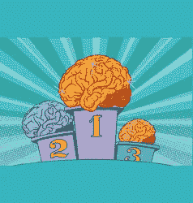

# 浅层人类和深层人工智能

> 原文：<https://towardsdatascience.com/shallow-humankind-and-deep-ai-193810e15569?source=collection_archive---------41----------------------->

## 抱怨或对人工智能征税不会有任何帮助。放下你的智能手机，努力工作。

“How can I prevent AI to take my job”… not by spending your day on Instagram.

这是波士顿四月的一个寒冷多雨的星期二晚上，这里的春天通常比日历晚一周，更典型的是几个月。波士顿通常在六月之前不会收到天气应该变暖的通知。

除了作为我的许多教授朋友的客座讲师，在波士顿庞大的学术圈里给许多学生授课，还能做什么？

因此，我今年第 n 次讲述这个故事，我和我的两个联合创始人，如何从我们在波士顿大学艰苦而漫长的计算神经科学研究中开创了我们的人工智能公司。NSF，DARPA，NASA，然后是商业斗争，直到我们找到了在 3000 多万台设备上部署我们的人工智能的天堂。

虽然通常我的观众都是非常投入的学生，但这次他们中有一小部分人比平时更茫然地盯着我(雨？)，特别是有一个人，在一个小时的课上，花了 59 分钟盯着她的 iPhone 翻东西(Instagram？谁知道)偶尔的微笑和咯咯的笑声。

“*还好*…”，我想..“……*。人工智能和计算神经科学并不适合所有人。*

但是一个醒着的学生问了我一个问题，我脑海中渗透的智力拼图开始在我没有意识控制的情况下拼凑起来。

Max，谢谢你的演讲，我有一个关于人工智能和工作的问题:随着人工智能变得越来越聪明，我们如何确保人类仍然有工作可做

我的大脑自动合成了答案，幸运的是在出来之前被堵在了嘴里:

> *“不是靠在 Instagram 上玩 1 小时课 59 分钟”。*

# 我们深刻的思想变得有多肤浅？

我经常被问到这个问题。随着人工智能变得越来越聪明，我们如何才能生存下来并仍然获得工作？

是的。你猜对了。不是通过做我们正在做的事情。

我们都知道社会在变化。甚至从我父亲那一代到我这一代，我们在学校的学习方式也发生了巨大的变化。我父亲曾经告诉我，在意大利南部的学校里，他是如何学习但丁的《神曲》的——全部都是记忆中的！——并要求背诵其中任意一段来证明。(我不能……)

虽然现代自称的教育专家可能会说“背诵不是学习”，但我认为这是至高无上的废话。也不是标准化考试，我们的孩子在美国学校被洗脑。

> 问题是:用你的大脑做一些困难的事情是目标。

无论是记忆还是求解量子场方程系统，找出亚原子粒子的最终位置，都无关紧要。用脑努力才是关键。

这与今天的学生(以及其他非学生)的想法完全相反。

书是给=_$^=#+的！，随便看了一条推文。心态是在一堆话题上花最少的时间，然后继续前进。浅 vs 深。

有趣的是，将从浅薄的人类手中夺走工作的人工智能被称为深度学习。

# **失败者做什么？提出税收。**

《NYT》最近的一篇文章题为“[不要和机器人战斗。向他们征税](https://www.nytimes.com/2019/02/23/sunday-review/tax-artificial-intelligence.html)“有天才般的洞察力，提出我们应该向他们征税，而不是与人工智能和机器人作战。

> *诺奖就在这里，现场*。

Great idea: let’s tax the crap out of (robots) humans!

我的办公室在波士顿港口前，当新生的美国向其他想对他们征税的英国诺贝尔奖获得者伸出手指时，茶被扔进了水里。众所周知，英国的结局很好。

这种态度将最终导致我们在人工智能方面的灭亡。相反，努力工作来提高自己，一个人只是向另一个更好的人征税，希望像寄生虫一样生活在那些每天流汗创新并将人类推向下一个前沿的人的工作中。从基因组学到材料科学等不同领域的成千上万的创新者也是如此……对他们的想法征税吗？

> 不，NYT 作家，去工作吧，拿出点有价值的东西来，我不会为你的食物和假期买单。

# **解决方法:好好学习，更加努力**

那么，我们该何去何从呢？随着人类越来越肤浅，而 AI 越来越深入，人们害怕自己的工作被 AI 抢走。

我的问题是:是什么让我们值得继续登上领奖台的第一步？我们是否在尽最大努力利用大自然赋予我们的思考和推理的奇妙天赋？

如果答案是肯定的，你(和我们作为一个物种)就在正确的轨道上。

> *答案很可能是否定的*

在对艾指指点点之前，我鼓励每个人做一些反省，并仔细检查我们的生活和思考是否充分发挥了我们的潜力。这绝不是要引起像“我们只使用了 2%的脑力”这样愚蠢观念的共鸣(你试过用 100%的肌肉走路吗？试试看，你会看起来像一只癫痫醉酒章鱼)。

它告诉我们:我们变得如此懒惰，以至于我们不应该指责人工智能，而是应该把我们的屁股从椅子上拿开，把我们的大脑从我们正在使用的任何令人麻木的社交媒体应用上拿开，并打开大脑。

最终，我(也没有人……)无法告诉你*该做什么*、该学什么*、该把你的全部创造潜力奉献给什么*。**

Winning is possible when one works hard.

但肯定有正确的方法去做:带着激情、创造力和信念去做。人工智能没有，人类有。

把该死的社交媒体电话放下，这样你就有时间做了。

那么，AI 将会有一个强硬的，也许是不可战胜的对手。