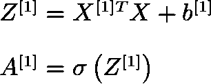
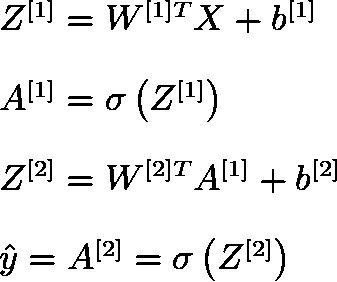
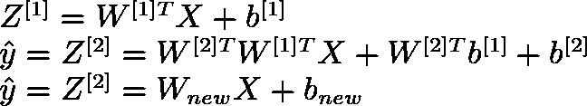

# 浅层神经网络

> 原文：<https://towardsdatascience.com/shallow-neural-networks-23594aa97a5?source=collection_archive---------2----------------------->

当我们听到神经网络这个名字时，我们觉得它由许多许多隐藏层组成，但有一种神经网络只有少数几个隐藏层。浅层神经网络仅由 1 或 2 个隐藏层组成。理解一个浅层神经网络能让我们深入了解深层神经网络内部到底发生了什么。在这篇文章中，让我们看看什么是浅层神经网络及其在数学环境中的工作。下图显示了一个具有 1 个隐藏层、1 个输入层和 1 个输出层的浅层神经网络。

# 神经元

神经元是神经网络的原子单位。给定一个输入，它提供输出并将该输出作为输入传递给后续层。一个神经元可以被认为是两部分的组合:

1.  第一部分使用输入和权重计算输出 ***、Z*** 。
2.  第二部分对 **Z** 进行激活，给出神经元的最终输出 **A** 。

# 隐藏层

隐藏层由各种神经元组成，每个神经元执行上述两种计算。存在于我们的浅层神经网络的隐藏层中的 4 个神经元计算如下:

在上面的等式中，

1.  上标数字***【I】***表示层数，下标数字 ***j*** 表示特定层中的神经元数。
2.  ***X*** 是由 3 个特征组成的输入向量。
3.  ***W[i]j*** 是与层 ***i*** 中存在的神经元 ***j*** 相关联的权重。
4.  ***b【I】j***是与层 ***i*** 中存在的神经元 ***j*** 相关联的偏置。
5.  ***Z【I】j***是与层 ***i*** 中存在的神经元 ***j*** 相关联的中间输出。
6.  ***A【I】j***是与层 ***i*** 中存在的神经元 ***j*** 相关联的最终输出。
7.  ***适马*** 是乙状结肠的激活功能。数学上它被定义为:

我们可以看到，上面的 4 个方程似乎是多余的。因此，我们将它们矢量化为:

1.  第一个等式在单个矩阵乘法中计算所有中间输出 ***Z*** 。
2.  第二个等式计算单个矩阵乘法中的所有激活 **A** 。

# 浅层神经网络

使用各种隐藏层来构建神经网络。现在我们知道了在特定层中发生的计算，让我们理解对于给定的输入 ***X*** ，整个神经网络如何计算输出。这些也可以称为 ***正向传播*** 方程。

1.  第一个等式计算第一个隐藏层的中间输出***Z【1】***。
2.  第二个等式计算第一个隐藏层的最终输出***A【1】***。
3.  第三个等式计算输出层的中间输出***Z【2】***。
4.  第四个等式计算输出层的最终输出***A【2】***，这也是整个神经网络的最终输出。

# 激活功能

我们知道神经网络基本上是一组数学方程和权重。为了使网络健壮，以便它在不同的场景中表现良好，我们利用激活功能。这些激活函数在神经网络中引入了非线性特性。让我们借助我们的浅层神经网络来尝试理解为什么激活函数对于任何神经网络都是至关重要的。

如果没有激活函数，我们的浅层神经网络可以表示为:

如果我们将等式 1 中 Z[1]的值代入等式 2，则我们得到以下等式:

如您所见，输出将变成新的权重矩阵 ***W*** 、输入 ***X*** 和新的偏差 ***b*** 的线性组合，这意味着隐藏层中存在的神经元和隐藏层中存在的权重没有任何意义。因此，为了在网络中引入非线性，我们使用激活函数。

有许多激活功能可以使用。其中包括****Tanh******ReLU******漏液 ReLU*** 等等很多。对所有层使用特定的激活功能不是强制性的。您可以为特定层选择激活功能，并为另一层选择不同的激活，依此类推。你可以在[这篇文章](/activation-functions-neural-networks-1cbd9f8d91d6)中读到更多关于这些激活功能的内容。*

# *重量初始化*

*我们知道一个神经网络的权重矩阵 ***W*** 是随机初始化的。有人可能想知道，为什么不能用 0 或任何特定的值初始化 ***W*** 。让我们借助我们浅薄的神经网络来理解这一点。*

*设第一层的权重矩阵 ***W1*** 和第二层的权重矩阵 ***W2*** 初始化为 0 或其他值。现在，如果权重矩阵是相同的，隐藏层中神经元的激活将是相同的。此外，激活的导数将是相同的。因此，该隐藏层中的神经元将以类似的方式修改权重，即在特定隐藏层中具有多于 1 个神经元没有意义。但是，我们不想这样。相反，我们希望隐藏层中的每个神经元都是唯一的，具有不同的权重，并作为唯一的功能工作。因此，我们随机初始化权重。*

*最好的初始化方法是 ***Xavier 的初始化*** 。数学上它被定义为:*

**

*它陈述了特定层***【l】***的权重矩阵***W***从*正态分布*中随机选取，其中 ***均值μ= 0******方差σ=层 L1***中神经元数量的乘积倒数。所有层的偏置 ***b*** 初始化为 0。*

# *梯度下降*

*我们知道神经网络的权重是随机初始化的。为了使用神经网络进行正确的预测，我们需要更新这些权重。我们更新这些权重的方法被称为梯度下降。让我们用一个计算图来理解这一点。*

**

*在上图中，正向传播(用黑线表示)用于计算给定输入 ***X*** 的输出。反向传播(用红线表示)用于更新权重矩阵***【W[1】】、W[2]*** 和偏差***【b[1】、b[2】***。这个是通过计算图中每一步输入的导数来完成的。我们知道损耗 ***L*** 在数学上定义为 *:**

**

*使用上述损耗等式 ***L*** 并使用 sigmoid 函数作为隐藏和输出层的激活函数，借助导数的链式法则，我们计算如下:*

**

*上面的等式可能会令人困惑，但是它们非常适合梯度下降。在 ***的等式中，dZ【1】***， ***** 表示乘积明智乘法，***【σ’****表示σ的导数。**

> **我强烈建议读者，如果他们懂微积分的话，自己算出上面的方程，以便更好地理解梯度下降是如何工作的。**

**因此，在这个故事中，我们研究了浅层神经网络如何在数学环境中工作。尽管如此，我已经尽可能详细地解释了一切，如果你觉得缺少了什么，请查看我以前的帖子，或者在下面的评论区提出你的疑问。**

# **参考**

1.  **[Coursera —深度学习课程 1](https://www.coursera.org/learn/neural-networks-deep-learning?specialization=deep-learning)**
2.  **[深度学习笔记—初始化](http://www.deeplearning.ai/ai-notes/initialization/)**

**感谢读者阅读了这个故事。如果你有任何问题或疑问，请在下面的评论区提问。我将非常乐意回答这些问题并帮助你。如果你喜欢这个故事，请关注我，以便在我发布新故事时获得定期更新。我欢迎任何能改进我的故事的建议。**