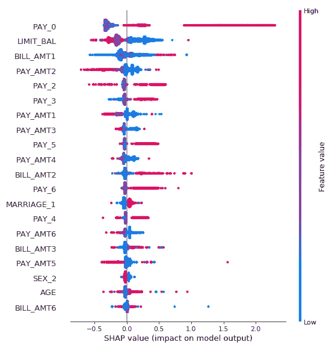
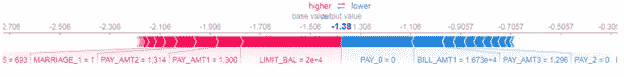

# SHAP:分析模型可解释性的可靠方法

> 原文：<https://towardsdatascience.com/shap-a-reliable-way-to-analyze-your-model-interpretability-874294d30af6?source=collection_archive---------9----------------------->


by [Steven Wright](https://unsplash.com/@stevenwright?utm_source=unsplash&utm_medium=referral&utm_content=creditCopyText) on [Unsplash](https://unsplash.com/search/photos/magnifying-glass?utm_source=unsplash&utm_medium=referral&utm_content=creditCopyText)

我开始了这个关于可解释人工智能的系列博客，首先理解了准确性与可解释性之间的平衡，然后继续解释了一些基本的模型不可知技术，以理解模型预测背后的原因，最后解释了石灰的诀窍。以下是这些博客的链接，供您快速参考:

1.[平衡:准确性与可解释性](http://datascienceninja.com/2019/07/01/the-balance-accuracy-vs-interpretability/)

2.[如何解读机器学习模型？](http://datascienceninja.com/2019/07/10/how-to-interpret-machine-learning-models/)

3.[莱姆:解释机器学习模型的预测](http://datascienceninja.com/2019/07/10/lime-explaining-predictions-of-machine-learning-models-1-2/)

在这篇博客中，我将谈论一种最流行的模型不可知论技术，它被用来解释预测。 **SHAP** 代表**SH**apley**A**additive ex**P**lanations。

通过结合来自 ***合作博弈论*** 和 ***局部解释*** 的概念获得匀称的值。给定一组玩家，*合作博弈理论*定义了如何在所有合作的支付者之间公平合理地分配收益。这里的类比是:玩家相当于独立的特征，收益是实例的平均预测减去所有实例的平均预测之间的差。

每个特征的 SHAP 值表示在调节该特征时预期模型预测的变化。对于每个特征，SHAP 值解释了解释平均模型预测和实例的实际预测之间的差异的贡献。从以前的[帖子](http://datascienceninja.com/2019/07/10/lime-explaining-predictions-of-machine-learning-models-1-2/)中选取相同的示例，我们想要预测实例拖欠信用卡付款的概率，给定*年龄*、*性别*和*限额余额*作为独立特征。

## 计算独立特征 SHAP 值的步骤:年龄。

1.  对于每个实例，*性别*和*极限平衡*保持不变
2.  *年龄*的值被从分布中随机选择的值替换
3.  该模型预测了这一特定模拟实例的违约概率
4.  所有实例的平均预测与该特定实例之间的差异归因于随机采样的*年龄*独立特征
5.  对*性别*和*极限平衡*的所有组合重复步骤 1 至 4
6.  *年龄*的 SHAP 值是所有可能组合的所有边际贡献的加权平均值

请参考我之前在 LIME 上发表的[帖子](http://datascienceninja.com/2019/07/10/lime-explaining-predictions-of-machine-learning-models-1-2/)，了解我挑选来解释的用例的细节。让我们探索 Python 中的 SHAP 包提供的一些基本视图。每个特征的 SHAP 值的全局视图:

## 1.每个特征的 SHAP 值的全局视图:



这是一个非常有用的视图，它在全局级别上显示了与平均模型预测相比，每个特征的贡献方向。右侧的 y 轴表示相应的特征值是低还是高。每个点代表数据中的一个实例，这就是为什么您可以看到一簇点，表明数据中有许多具有该特定 SHAP 值的实例。

*   *PAY_0* 表示上月的账单还款情况。这告诉我们, *PAY_0* 特性的值越高(由*红色*表示),该实例拖欠信用卡付款的可能性就越大。
*   *LIMIT_BAL* 表示信用余额。这告诉我们降低 *LIMIT_BAL* 特性的值(用*蓝色*表示)

## 2.单个实例视图

再次，我个人发现分析正确预测的实例和错误预测的实例。这只是给出了导致错误预测的特征的感觉。这里提到了基本(平均)值，并显示了每个特征对预测的贡献。指示红色的特征有助于预测高于基数，即趋向违约，而指示蓝色的特征有助于预测低于基数，即趋向非违约

从我之前的[帖子](http://datascienceninja.com/2019/07/10/lime-explaining-predictions-of-machine-learning-models-1-2/)中拿起同样的例子。不正确预测为非默认(实际:默认)



此实例被归类为非违约的主要原因似乎是 *PAY_0 = 0。*这表明，上个月的付款及时完成无疑增加了这种情况被预测为非违约的可能性。您可以进一步分析导致预测非默认的其他连续要素的行为。您可以首先检查他们的总体分布统计数据和每个默认和非默认标签的分布统计数据。

## 为什么 SHAP 是更受欢迎和可靠的技术？

```
**1\. Local Accuracy:**
```

解释模型应该与原始模型相匹配

```
**2\. Missingness:**
```

如果简化输入表示要素存在，则缺失要求原始输入中缺失的要素没有影响

```
**3\. Consistency:**
```

一致性表明，如果一个模型发生变化，使得一些简化输入的贡献增加或保持不变，而不管其他输入，该输入的属性不应减少

```
**4\. Efficiency:**
```

由于 SHAP 值的基础是基于计算博弈论，这是唯一的方法，可以分配功能的增益失败。

```
**5\. Global comparison:**
```

SHAP 值提供了一种在全局级别比较要素重要性的方法。您还可以将数据集从全局数据集更改为感兴趣的子集数据集。

## 缺点:

```
**1\. Computation time:**
```

随着特征数量的增加，特征的可能组合的数量呈指数增加。这反过来增加了计算 SHAP 值的周转时间，近似是唯一的解决办法。

```
**2\. Order of feature selection in all possible combinations:**
```

典型地，在解决真实世界的问题时，目标与独立特征非线性相关，并且在独立特征之间也存在一些相关性。在这种情况下，在组合中选择特征的顺序很重要，并且会影响 SHAP 值。

```
**3\. Simulation of scenarios:**
```

SHAP 不返回模型，像石灰。因此，如果你想模拟某个特定功能的增加会对输出产生多大影响，那么用 SHAP 是不可能的。

```
**4\. Correlation amongst independent features:**
```

同样，在大多数现实世界的问题中，独立的特征是相互关联的。在这种情况下，当我们从特征的边缘分布中取样时，可能会产生在现实世界中不可能产生的实例。

## 朱庇特笔记本的副本

如果您想要一份上面有使用案例的 Jupyter 笔记本，请在下面的评论部分或通过**“联系我们”**部分告诉我们您的电子邮件 ID。

## 下一步是什么？

在下一篇博客中，我计划解释 Python 中的 SHAP 包必须提供的一些其他可视化功能。

这个可解释的人工智能领域正在迅速发展，在工具和框架方面有很多新的发展。请在评论区写下你对博客的反馈，以及你在这个领域使用的最新工具。此外，如果你想让我写任何特定的主题，请发表评论。

这些内容最初发表在我的个人博客网站:[http://datascienceninja.com/](http://datascienceninja.com/?source=post_page---------------------------)。点击[此处](http://datascienceninja.com/2019/07/28/shap-a-reliable-way-to-analyze-your-model-interpretability/)查看并订阅即时接收最新博客更新。