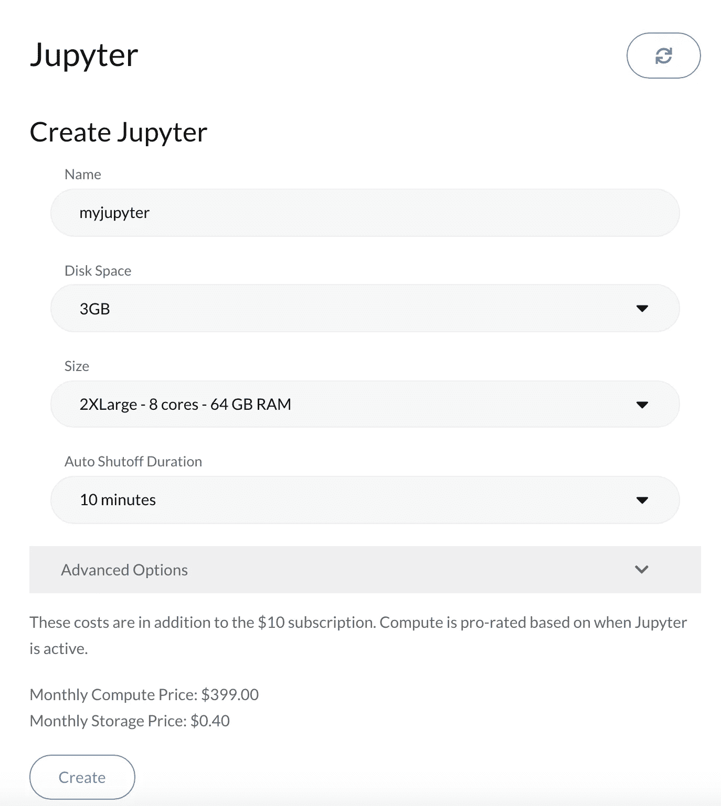
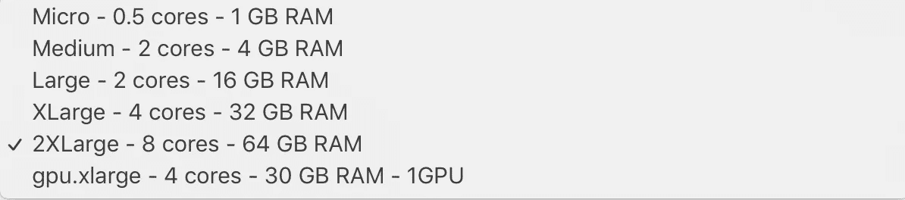
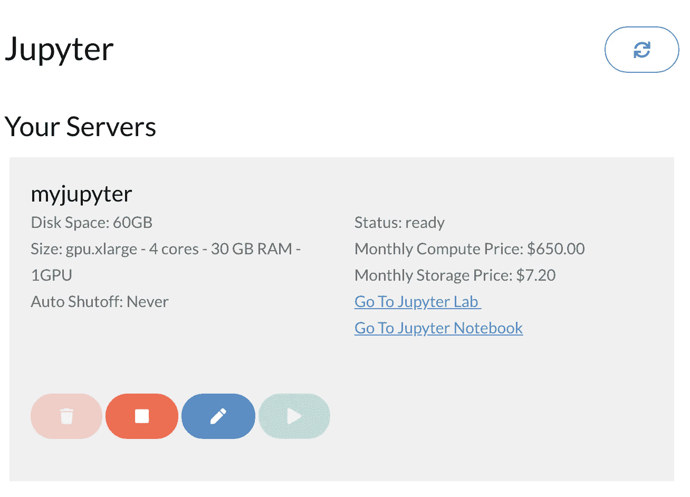
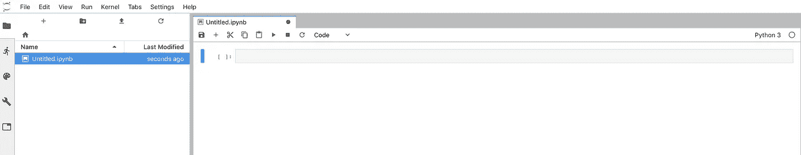
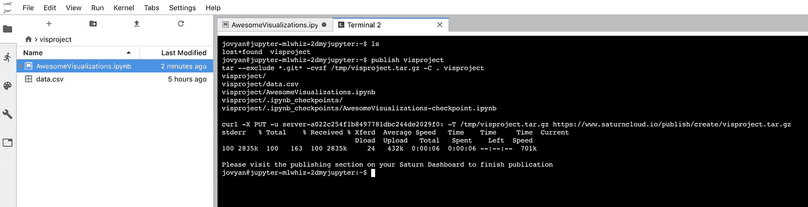
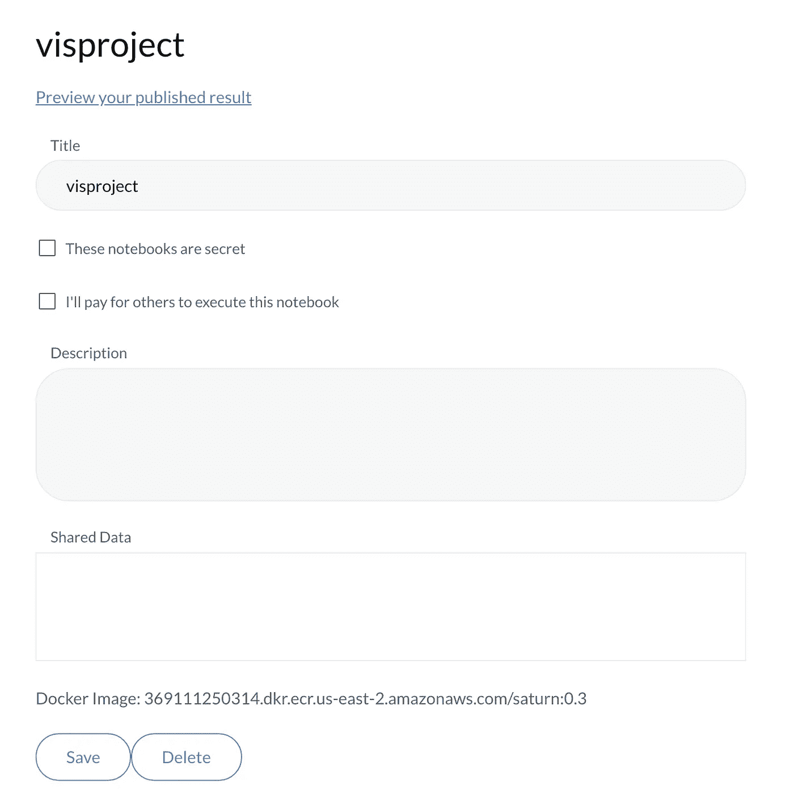
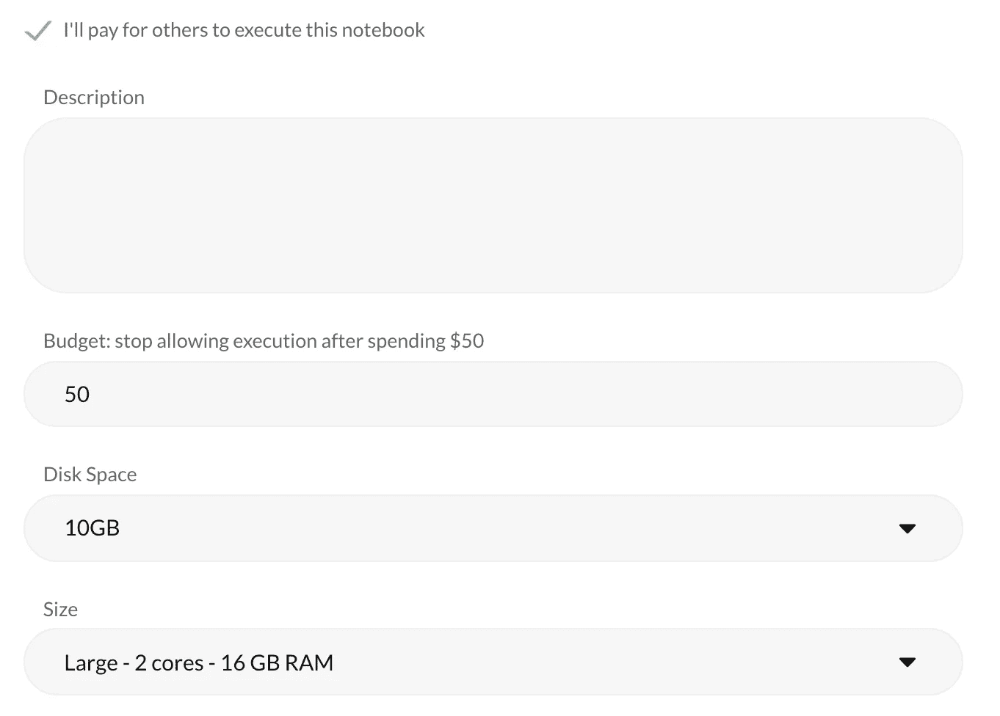
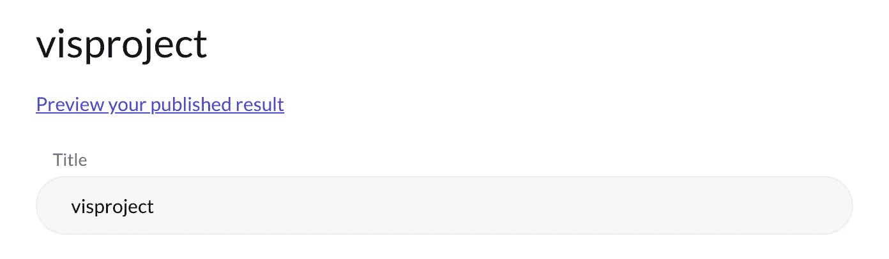
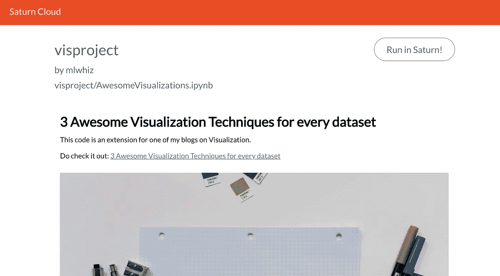
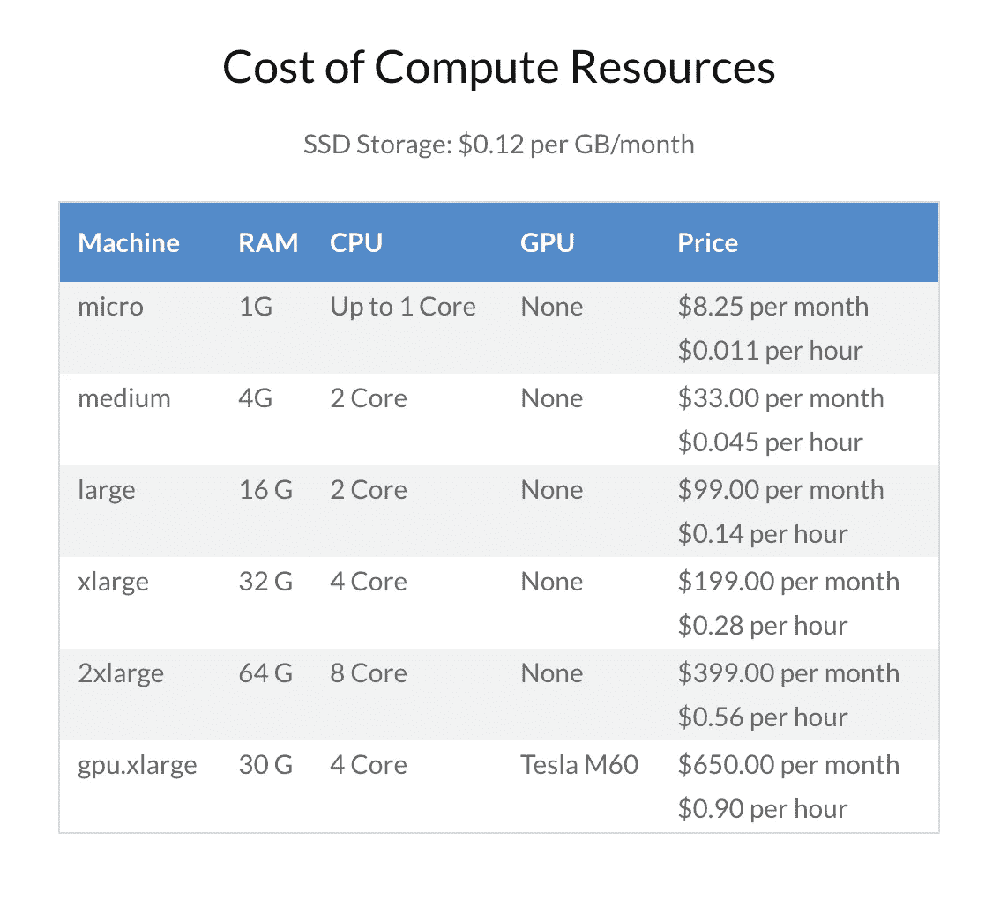

# 借助土星云，您可以在任何地方共享、协作和运行

> 原文：<https://towardsdatascience.com/share-collaborate-and-be-up-and-running-anywhere-with-saturn-cloud-c7927d57d49d?source=collection_archive---------17----------------------->


## 现在创建自己的服务器很容易

分享见解是每个数据科学家工作的一部分。

昨天，我发布了我的一个 Google Colab 笔记本。这是一个很棒的免费平台，但它不能解决我的主要用例。

我希望我的受众(主要是业务用户)看到我的分析被正确地呈现出来。

如果他们喜欢，可以自己运行它(在 Google Colab 上，任何新用户都必须使用他/她自己的 Google API 密钥，这对一些人来说是一个障碍)

另外，我真的不想像大多数免费软件那样，把自己局限在有限的计算上。

这就是我了解土星云的地方。现在它是由 Anaconda 的联合创始人之一，的 Hugo Shi 制作的产品。

是的，就是您用来在系统中创建数据科学环境的那条蟒蛇。

所以我必须调查一下。

Anaconda 自己解决了一个特殊的用例。下载和管理 Python 环境。

***土星云解决在云端管理 Python 环境*** 。

怎么会？

请继续关注，因为这正是本文的内容。

# 什么是土星云？

所以让我首先说明一下土星云是什么。

我敢打赌，我们大多数人都尝试过在我们的机器上安装 Python。在安装 Jupyter 笔记本/实验室时遇到了麻烦。

只是在做了大量的摆弄之后，我们才开始真正的工作，即数据科学。

或者，当你需要大型计算时，你可能会遇到困难，于是你去找 AWS(亚马逊网络服务)/GCP(谷歌云平台)。这些系统的创建方式对我们很多人来说似乎很神秘。

是的，你并不孤单。 ***我自己也尝试过用 GCP*** 。实际上，我没能做到。

现在我们数据科学家热爱自动化。 ***我们为什么不摆脱这种设置数据科学工具的卑微过程？***

这就是土星云的意义。

它为我们这些对设置不太感兴趣但对数据科学非常感兴趣的数据科学家提供了一种简单的入门方法。

它还帮助我们:

*   为我们的项目设置自定义计算
*   在网络上共享内容

# 开始并设置自定义计算


所以让我们开始吧。您可以从免费层开始。

你首先需要在 [SaturnCloud](https://www.saturncloud.io/?source=ra-1) 注册，然后进入仪表盘。



现在，为一个项目创建一个笔记本/实验室就像 ***一样简单，只需选择磁盘空间和机器大小，然后点击创建按钮*** 。谈到 ***配置*** ，SaturnCloud 提供了不同的选项。



这些配置实际上可以满足许多实际数据科学项目的需求。

使用最后一个配置选项，设置带有 GPU 的机器是轻而易举的事情。所以你可以和 AWS/GCP 收购 GPU 的漫长流程说拜拜了。

您也可以为您的项目定义一个 ***自动关闭持续时间*** 。这是我特别喜欢 SaturnCloud 的一个功能。我已经被蛰过很多次了，我的 Google Colab 笔记本服务器在一个小时不活动后就关闭了。

在这里，我可以设置我的笔记本关机持续时间为 1 小时，6 小时或从不关机。 ***从来都不是我喜欢的。***

您还可以选择使用高级选项 使用 ***apt-get、pip 和 conda 选择默认配置。但主要是我一开始并不担心，因为它预装了科学的 python 堆栈。***

并且 ***一旦我创建了笔记本/实验室*** ，我就可以使用终端本身下载任何我需要的新包。

因此，一旦您创建了 Jupyter 笔记本/实验室，您应该会在您的仪表板上看到以下内容:



在这里你可以点击去 Jupyter 实验室。瞧，你已经开始运行了。



# 在网络上共享内容


这是 SaturnCloud 提供的另一个对我非常有价值的功能。

我是一名数据科学家，我需要与我的业务合作伙伴共享报告。此外，我是一个技术博客，我需要与我的读者分享代码。

现在，我分享的报告需要在网络上正确呈现。

我与读者分享的代码需要是可执行的。

土星云为我解决了这两个用例。

怎么会？

我先举个例子。我渴望与我的读者分享对足球数据的分析。我将从我最喜欢的博客文章之一中摘录代码— [每个数据集的 3 个令人敬畏的可视化技术](/3-awesome-visualization-techniques-for-every-dataset-9737eecacbe8)

首先，我用 Jupyter Lab 正常编码。我在那里为我的项目创建了一个名为`visproject`的文件夹。我把数据上传到那里，然后在我的 jupyter 笔记本的那个文件夹里创建并编写代码

现在，为了分享我的工作，我需要做的就是在 Jupyter 实验室中打开一个终端并运行命令:

```
publish visproject
```



现在去出版部门。您应该看到:



现在我有不同的选择。我可以将我的笔记本保密(私人)/公开，我也可以点击“我将为其他人支付执行此笔记本”。

一旦您点击“我将为他人支付执行费用”，您应该会看到类似以下内容:



我已经公开了这个笔记本，并且可以使用上面分配的资源执行。对设置满意后，您可以单击保存按钮。

随后，点击[预览链接](https://www.saturncloud.io/yourpub/mlwhiz/visproject/visproject/AwesomeVisualizations.ipynb/?source=ra-1)。



这就是它的样子。结果是:



我喜欢代码块和所有可视化的渲染方式，没有任何混乱，就像我们在 Google Colab 笔记本上看到的那样。它看起来就像是一份预期的报告。

我也喜欢所提供的**“土星运行”**选项，用户可以直接点击运行这段代码，而不需要任何明确的登录。

一定要试着自己运行它[这里](https://www.saturncloud.io/yourpub/mlwhiz/visproject/visproject/AwesomeVisualizations.ipynb/?source=ra-1)。我相信你会喜欢的。

# 费用:

*我喜欢土星云的一点是它的相关成本。*

**这并不是我对许多付费产品的说法。**

我可以毫不费力地获得土星云的所有功能，对于我目前使用的基本计划，我只需要支付云提供商的费用加上一点点开销。

***现在这是个人喜好的问题，但我愿意为所提供的服务质量和避免的麻烦支付这笔非常少的间接费用。***

事实上，我收回了大部分费用，因为虽然在 AWS/GCP 上停止服务器有点麻烦，但对土星云来说却是小菜一碟。

这是您自己要查看的费用列表。



# 结论

***土星云让数据科学家的生活变得更容易，因为他几乎不用花费任何费用就可以处理大量多余的工作。***

我并不是说我永远不会创建定制服务器，但是只要我能使用土星云，我就会避免这样做。

即使当我确实需要创建一个定制服务器时，如果我的公司允许，我也可能会查看土星云提供的企业帐户。

正如他们在网站上所说:

> 在花时间从事数据科学以及构建数据科学工具之后，我们都非常熟悉数据科学、技术和开发人员操作交汇处的摩擦和**痛点。**
> 
> 我们不能为您做模特——但我们可以减轻一些痛苦。

那你还在等什么？只需使用您自己的服务器开始数据科学。它肯定有它的好处。

您可以尝试自己运行已发布的土星云笔记本。

我以后也会写更多这样的帖子。在[](https://medium.com/@rahul_agarwal)**关注我或者订阅我的 [**博客**](http://eepurl.com/dbQnuX) 了解他们。一如既往，我欢迎反馈和建设性的批评，可以通过 Twitter [@mlwhiz](https://twitter.com/MLWhiz) 联系。**