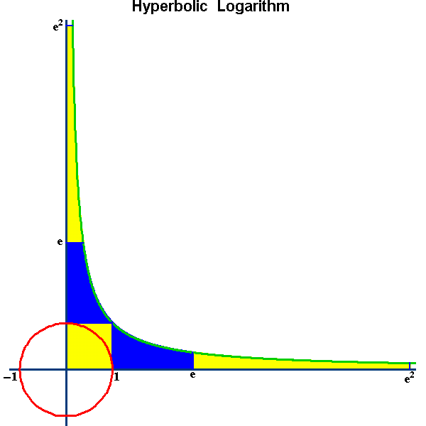
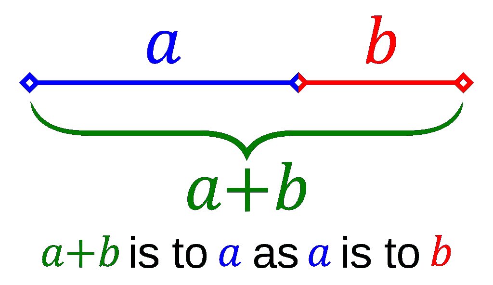

# 分享π:尊重被忽视的数学常数

> 原文：<https://towardsdatascience.com/share-the-%CF%80-honoring-neglected-mathematical-constants-f651d101e87b?source=collection_archive---------14----------------------->

## 酷数学的有趣回顾

圆周率得到了一切——一年中有两天(当然是 3 月 14 日和 7 月 22 日)享受甜蜜的放纵；一种人类对记忆和计算更多位数的执念(注意 39 位数计算可观测宇宙的周长精确到一个原子)；流行文化中的大量引用。


Source: [https://en.wikipedia.org/wiki/Pi#/media/File:Record_pi_approximations.svg](https://en.wikipedia.org/wiki/Pi#/media/File:Record_pi_approximations.svg)

当然，圆周率很酷，但不是因为这些原因。圆周率在数学中无处不在——这是一个非常深刻的现实。欧拉恒等式使用圆周率将 5 个最重要的数字联系在一起。海森堡测不准原理包含圆周率，说明物体的位置和速度不能同时精确测量。Pi 是许多公式中的归一化常数，包括高斯/正态分布。在 2 处评估的 Reimann 函数收敛到π的因子。


但是这篇文章将向那些不太受重视、有时被遗忘、被忽视的数学常数致敬。深度不亚于圆周率，魅力不亚于圆周率，让我们开始吧！

# 欧拉数:***e***

T4 有几个特征。它是唯一的基数 *a* ，通过它，y = *a* ^x 是它自己的导数，在 x = 0 时有一个 1。也是无限指数增长的极限。它满足下面蓝色突出显示区域所示的积分范围。



The five colored regions are of equal area, and define units of hyperbolic angle along the hyperbola. Source: [https://en.wikipedia.org/wiki/E_(mathematical_constant)#/media/File:Part38figure02.gif](https://en.wikipedia.org/wiki/E_(mathematical_constant)#/media/File:Part38figure02.gif)

*e* 可以写成连分数，下面是其中的两个。


这一现实产生了一个有趣的程序，叫做 spigot 算法，可以用来计算许多数字 *e* (还有圆周率……)。一个为 *e* 编写的 spigot 算法的 Python 实现是这里的，我在下面做了一些修改。

```
import numpy as npdef continued_fraction(a, b, n, base=10):

    (p0, q0), (p1, q1) = (a(0), 1), (a(1) * a(0) + b(1), a(1))
    k = 1

    cnt = 0
    while cnt <= n:
        (d0, r0), (d1, r1) = divmod(p0, q0), divmod(p1, q1)

        if d0 == d1:
            cnt += len(str(d1))
            yield d1
            p0, p1 = base * r0, base * r1
        else:
            k = k + 1
            x, y = a(k), b(k)
            #print(x)
            #print(y)
            (p0, q0), (p1, q1) = (p1, q1), (x * p1 + y * p0, x * q1 + y * q0)#Generate 
e = ''
for digit in continued_fraction(lambda k: 1 if k <= 1 else 4 * k - 2,
                                lambda k: 2 if k <= 1 else 1,
                                500000): 
    e += str(digit)
```

其工作原理是使用连分式在两个分数估计值(p0/q0 和 p1/q1)之间迭代。当观察到的那些分数的小数收敛时，你可以去掉一致的数字(例如:23/27 = 0.315068 和 34/108 = 0.314815 会让你去掉 0.31)。更有帮助的是，我们可以在去掉那些数字并保持分数的分子/分母小的情况下，对分数进行“重组”。

函数中的λ函数表示连分数的分子/分母。我们将数据存储为一个字符串，以简化成千上万位数字的存储。我通过另一个列表验证了 100k 位的算法。

2004 年，一个著名的谷歌广告牌上写着 *e.*


现代的 CPU、编程语言和 Google 本身使得解决这个问题变得容易得多，但它仍然超级有趣！在生成足够多的数字 *e* 开始工作后，我们需要生成 10 位数的素数——素数将是我们的下一个“常数”。

# **质数**

好吧…质数并不是真正的常数，但它们仍然非常酷。最基本的是，质数是一个大于只能被 1 整除的数。这几乎是初等的，但是回想一下，任何本身不是质数的数都可以写成质数的*唯一*乘积。也就是说，质数是所有其他数的积木！从几个方面来说都是如此:

高达 4*10 ⁸的哥德巴赫猜想证明，每个大于 2 的整数都可以写成两个素数之和(例如 12 = 7 + 5)。一个令人信服的启发指出，随着数字的增长，有越来越多的机会来构建两个这样的数字:例如，100 有 6 对(3+97，11+89，17+83，29+71，41+59，47+53)。下图通过散点图说明了这一点。


Scatter Plot of Available pairs that satisfy Goldbach’s conjecture.

拉格朗日证明了每一个正整数都是四个平方的和(即 310 = 17 + 4 + 2 + 1。假设这个公式是这样的:在公式 x + 3y + 5z 中，3 个数产生一个正方形(例如 2+ 1*4 + 4*2 = 25，也就是 5)。

另一个超级酷的事实是:蝉一生中的大部分时间都是在地下度过的，但在 7、13 或 17 年后会在地面上飞行、繁殖，并在几周内死亡。生物学家假设，质数繁殖周期长度是一种进化策略，以防止捕食者与它们的繁殖周期同步。

素数有很多种，其中一种会出现在下面计算的常数中。“孪生素数”是指比另一个素数多 2 或少 2 的素数(例如 13 是孪生素数，因为它比 11 多 2)。斐波纳契素数是指同时也是斐波纳契数的素数。梅森素数有助于生成非常大的素数，它遵循 2^n — 1 的形式。

已知最大的素数有超过 2490 万位数，但没有生成素数的“公式”。许多算法是已知的，其中最容易理解的被称为厄拉多塞筛。该算法首先列出从 2 到 n 的所有整数，或者从 3 到 n 的所有奇数，以便进行一些初始性能调整。接下来(使用第一个公式)，计算 2 的所有因子(即 2*1 = 2，2*2 = 4，2*3 = 6，等等。)，并从您的列表中删除这些项目。移动到你清单中剩下的下一个项目(3)，去掉所有的因素。当你移动到下一个项目时，4 不再在列表中，所以你移动到 5。随着你的前进，你逐渐从列表中剔除非素数。

下面的算法使用这种基本逻辑，效率很低。关于模数计算的一些编程注意事项:

//是楼师。7//2 返回 3(并丢弃 0.5 余数)。

%是模数运算符。7%2 返回 1(因为 7/2 = 3 + **1** /2)

|是位二进制 or 运算符。13|14(在二进制 1101 和 1110 中)对整数逐个取或，所以结果是二进制的 1111，也就是 15。

```
def primes(n):
    """ Input n>=6, Returns a array of primes, 2 <= p < n """
    sieve = np.ones(n//3 + (n%6==2), dtype=np.bool)
    for i in range(1,int(n**0.5)//3+1):
        if sieve[i]:
            k=3*i+1|1
            sieve[k*k//3 : : 2*k] = False
            sieve[k*(k-2*(i&1)+4)//3 : : 2*k] = False
    return np.r_[2,3,((3*np.nonzero(sieve)[0][1:]+1)|1)]
```

厄拉多塞的正常筛子大约在多项式时间内运行，这意味着随着 n(你的最大可能素数)的增长，时间增长 n(大约…)。直观地说，这里的问题是你在多次消去同一个数:5M 的 n 将分别消去 4，849，845 次(3，5，7，11，13，17，19)，但只有 1 次是必需的。上面的算法通过使用两个不同且更复杂的公式来计算非素数列表，减少了这种重复。

回到我们的谷歌广告牌。我们将 e_list 分割成 10 位数，然后使用素数列表检查它们是否是素数。我们只需要检查 100，000，因为 100，000 不是 11 位数字。

```
x10 = primes(int(1e5))
print(np.max(x10))e_list = [int(e[i : i+10]) for i in range(0, len(e))]for i in range(len(e_list)):
    print(i)
    n = 0

    for j in range(len(x10)):
        n += 1 if e_list[i] % x10[j] == 0 else 0

    if n == 0:
        print(e_list[i])
        break
```

结果是第 99 位数字给我们 7，427，466，391，这是一个 10 位数的质数！后续事件相当普遍。

# **布伦和梅塞尔-默滕斯常数**

质数出现在我们接下来要讨论的两个迷人的常数中。

布伦常数的形式如下——所有素数对的倒数之和。


数字收敛速度极慢，这本身就很迷人。这些分数的分母迅速减小——问题是，即使对于非常大的数，素数对也相对常见。事实上，布伦常数是未知的。使用所有孪生素数直到 10 ⁶(即 10 万亿亿)时，它被估计为~1.902160583104，但仅被证明小于 2.347。

回到谷歌:在破产的北电公司的专利拍卖中，该公司以出价 1902160540 美元收购布伦常量而闻名。随后的出价为 2，614，972，128 美元，反映了梅塞尔-默滕斯常数(约为 0.26149……)。

Meissel-Mertens 常数也称为质数倒数常数，其定义如下:


这个数字也不是确切知道，虽然收敛速度比布伦常数快得多。

# 黄金比例和斐波那契数

从欧几里得时代开始研究，黄金分割率在几何中起着重要的作用，并且有许多几何表示。



**Left:** Let A and B be midpoints of the sides EF and ED of an equilateral triangle DEF. Extend AB to meet the circumcircle of DEF at C. The ratio of AB/BC = AC/AB = The Golden Ratio. **Right:** A pentagram colored to distinguish its line segments of different lengths. The four lengths are in golden ratio to one another.


**Left:** The golden ratio in a regular pentagon can be computed using Ptolemy’s theorem. **Right:** A Fibonacci spiral which approximates the golden spiral, using Fibonacci sequence square sizes up to 34\. The spiral is drawn starting from the inner 1×1 square and continues outwards to successively larger squares.

最后一个螺旋图像被称为斐波那契螺旋，代表了黄金分割率的一个迷人的特性:取连续斐波那契数的比率收敛到黄金分割率，我们将在下面讨论。

斐波那契数的形式是 F(n) = F(n-1) + F(n-2)。序列的开始是 1，1，2，3，5，8，13，21，34，55，89，144。

斐波那契数的一些有趣的性质:每个正整数都可以写成斐波那契数的和，其中任何一个数只使用一次。当你考虑到序列前面部分相对于后面部分的密度时，这可能是直观的。斐波纳契数是帕斯卡三角形对角线的总和(由上面两个数的总和构成的每一连续层构成)。


The Fibonacci numbers are the sums of the “shallow” diagonals (shown in red) of Pascal’s triangle.

如上所述，当你取连续的斐波那契数的比率时，黄金分割率收敛。比如 89/55 = 1.61818，接近真实值 1.61803。黄金分割率可以用无理数根 5 来精确定义。


黄金分割率也可以表示为一个连分式，所以我们可以使用上面的 or *e-* 生成算法来生成黄金分割率的数字。具体来说:


```
phi = ''
for digit in continued_fraction(lambda k: 1,
                                lambda k: 1,
                                500000): 
    phi += str(digit)
```

你会注意到，与 *e* 代码相比，运行上面的代码要花一些时间。500，000 要求算法返回 500，000 位，而不考虑连分数需要迭代多少次。黄金分割连分数收敛很慢，这有一定的道理:分母中的数字越大，重复出现的加法分数就越小。

# 结论

我们可以讨论更多的常量，但是这篇文章已经有点漫无边际了！我们没有得到第一个大二学生的梦想常数(由 0 和 1 之间的曲线 x^x 界定的区域，因不正确但如此方便的恒等式而得名(x+y)^n = x^n + y^n，这将使这样的积分更容易解决))；统计数据中出现的 Gamma 和 Reimann zeta 函数的值；、或在随机随机行走和其他分析应用中出现的任何其他常数。

这篇文章的主要观点:数学超级酷！而且谷歌很有幽默感！