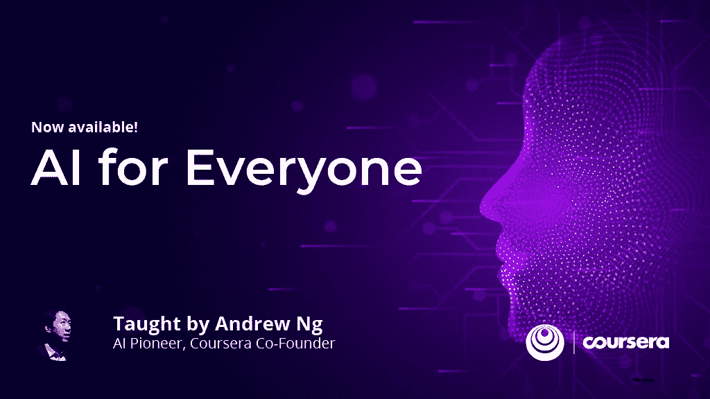

# 分享:上不上“AI for Everyone”课程？deeplearning.ai 的课程

> 原文：<https://towardsdatascience.com/sharing-take-ai-for-everyone-course-or-not-a-course-by-deeplearning-ai-79db73f6dae8?source=collection_archive---------11----------------------->

## 参加吴恩达教授的“AI for Everyone”课程后的分享

[**https://www.coursera.org/learn/ai-for-everyone/**](https://www.coursera.org/learn/ai-for-everyone/)

最近刚上了上图所示的课程，一门 AI 非技术入门课程，**教授吴恩达**， **deeplearning.ai** ，通过 **Coursera** 授课的**AI for everybody**。我不是在做广告，还是详细说说课程内容吧。相反，我想谈谈我的分享。下面是链接:[https://www.coursera.org/learn/ai-for-everyone/](https://www.coursera.org/learn/ai-for-everyone/)。( [Sik-Ho Tsang](https://medium.com/u/aff72a0c1243?source=post_page-----79db73f6dae8--------------------------------) @中)

# 概述

1.  **包括哪些？**
2.  **真的适合所有人吗？**
3.  **懂 AI 的人需要吗？**
4.  已经学过吴恩达教授深度学习专业的人还需要吗？

# 1.包括哪些内容？

课程中有四个主要主题:

*   **什么是 AI？**
*   **打造 AI 项目**
*   **在你的公司建立人工智能**
*   **AI 与社会**

## 1.1.AI 是什么？

我们可以看到，在第一节，它以一种大家都能理解的非常笼统的方式讲了**什么是 AI 和机器学习(ML)。**

## 1.2.**打造 AI 项目**

在这一节中，它谈到了如果我们需要应用 AI，ML 或数据科学，**我们应该做些什么来将它们应用到我们的工作中？以及我们如何应用人工智能并与其他团队合作，以便公司可以降低成本或获得更多利润。**

在本节中，也有一些简单的用例来说明。

## 1.3.**在贵公司建立人工智能**

在这一部分，它在**中提到了更多关于如何在公司中建立人工智能的细节。**还描述了更详细的用例。当启动一个人工智能项目时，我们应该避免哪些事情。当我们想在一个公司内部开始一个项目时，我们应该做些什么。

## 1.4. **AI 与社会**

最后，还提到了人工智能的伦理和偏见。我们如何减少 AI 的偏见等等。以及人工智能在未来如何影响我们的工作、社会和经济。

# 2.真的适合所有人吗？

是的，它是为每个人特别是那些以前不知道人工智能的人准备的。这里不涉及数学。每个人都可以很容易地理解材料。

对于那些正在经营企业的人，或者一些管理级别的人，如董事和经理，值得阅读一下它，以**了解他们可以应用人工智能来改变业务的任何机会**。

另外，**了解人工智能的优缺点也很重要**。

如果有现有的 AI 团队，了解 AI 的一些概念肯定有助于和 AI 团队的沟通。因为了解了 AI，就能知道 AI 能做什么，不能做什么。这也是**对每个需要和 AI 团队**一起工作的员工有用的地方。

# 3.**懂 AI 的人需要吗？**

是也不是。

对于这个问题，我觉得对于懂 AI，懂业务的人来说是不需要的。比如说，如果你已经在一个 AI 团队工作，并且和其他非 AI 团队合作得很好，我觉得没必要上这门课。

对于我来说，我只知道一些机器学习或深度学习，特别是在计算机视觉领域。我是[深度学习专业化](https://www.coursera.org/specializations/deep-learning)第四期课程(CNN)的导师(也是吴恩达教授讲授的深度学习系列课程。).对我来说，我也从这门课中学到了很多。

上了这门课，我可以**了解更多计算机视觉(或者你的领域)之外的用例**，比如制造业，临床诊断，招聘，市场营销，甚至农业等。(当然，有很多方法可以了解 AI 的用例比如在网上看文章或视频，或者参加 AI 研讨会讲座。如果你只是想了解更多的用例，我认为不值得参加这个课程。)

我学会了**需要做什么才能让人工智能和业务团队相互交流**。而且我还了解到了**AI 团队内部的工作岗位**。至少，当我需要在大学之外找工作时，它是有用的。

# **4。已经学过吴恩达教授深度学习专业的人还需要吗？**

是也不是。

还是那句话，懂 AI 的，懂业务的，不需要。比如说，如果你已经在一个 AI 团队工作，并且和其他非 AI 团队合作得很好，我觉得没必要上这门课。

但如果你只上过[深度学习专精](https://www.coursera.org/specializations/deep-learning)，那么也值得上这门课。如前所述，它更多地谈论了 AI 团队如何在公司内部进行交互，以及如何与业务团队进行交互，这些都不包括在[深度学习专业化](https://www.coursera.org/specializations/deep-learning)中。

如果你不懂 AI，又想有一份 AI 的工作，我建议把“[深度学习专精](https://www.coursera.org/specializations/deep-learning)”和“ [AI for Everyone](https://www.coursera.org/learn/ai-for-everyone/) ”都上。两者兼而有之，才是进入 AI 领域的第一步。之后更有可能对人工智能进行更多的研究。

如果只是想学习深度学习的核心，不如去上[深度学习专精](https://www.coursera.org/specializations/deep-learning)学技术的东西。当然，我只能分享我在课程中学到的东西。也许对你来说不是这样的。但希望这个故事能提供一些帮助。:)