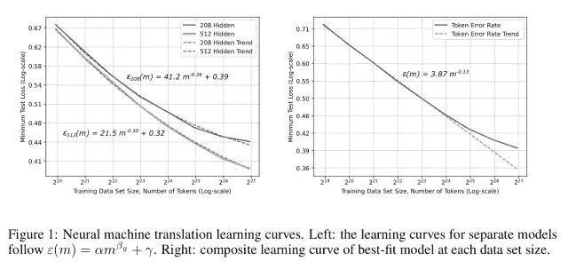
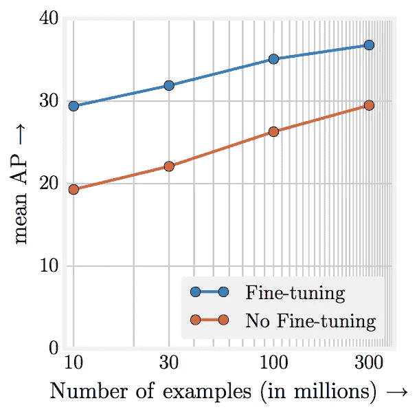

# 嘘…建造伟大人工智能的秘密

> 原文：<https://towardsdatascience.com/shh-the-secret-to-building-great-ai-c9dc04e94cdd?source=collection_archive---------32----------------------->

我为这个有点点击诱饵的标题道歉，但在看到埃隆·马斯克的推文后，我不得不创造了上面的迷因:

我认为那很好笑…不管怎样，回到你的常规编程。

> 当你完成机器学习的博士学位时，他们会把你带到一个特别的房间，向你解释伟大的数据比你刚刚学到的所有花哨的数学和算法更重要

至少，我是这样想象的。我没有博士学位，所以我不能肯定地说，但似乎有可能。

# 数据>>算法

这就是构建伟大的人工智能系统的秘密——拥有大量的数据。我可以在这里结束这篇文章，但是让我们看看一些支持的事实:

F 这是论文结论的一部分[深度学习的扩展是可预测的，来自百度一个小组的经验](https://arxiv.org/pdf/1712.00409.pdf)。这是他们研究结果的图表之一:

上述图表根据经验显示，“随着我们为最先进的(SOTA)模型架构增加训练集，深度学习模型的准确性以幂律形式提高。”基本上，您可以使用幂定律来预测在训练数据增加的情况下，您的模型的性能会提高多少。现在，停下来想一想。**改善深度学习模型的一个几乎肯定的方法是收集更多数据。对于无休止的模型调整和发明新架构的尝试，很难说同样的话。谷歌在他们 2009 年的论文[数据的不合理有效性](https://static.googleusercontent.com/media/research.google.com/en//pubs/archive/35179.pdf)中也看到了这一点。**

其次，GitHub 充满了开源的最先进的算法，但公开的数据却少得多。想要代码运行最新的深度学习模型吗？你可以在 GitHub 上找到它的一些版本。想要一些关于谷歌搜索结果表现或网飞收视率的数据吗？祝好运。公司意识到数据优势几乎总是优于算法优势。例如，Deep Mind 被谷歌以大约 5 亿多美元的价格收购。这是对惊人的天赋和算法的购买。两年前，脸书以 10 亿美元收购了 Instagram。为什么照片分享应用的价值是 Deep Mind 的两倍？在我看来，一个最大的原因就是数据。正如这篇[福布斯](https://www.google.com/amp/s/www.forbes.com/sites/kashmirhill/2012/04/11/ten-reasons-why-facebook-bought-instagram/amp/)文章所引用的

> 脸书的数据库需要这些信息来优化它将带给你的媒体。这些数据非常有价值！想象一下，你是一个滑雪胜地，想要接触滑雪爱好者，Instagram 将为他们提供一种新的方式，同时比脸书更有针对性。

如果你坐下来创建一份“伟大”人工智能公司的名单，你几乎肯定会发现，它们都是伟大的数据公司。如果你能从大量数据入手，构建近乎神奇的人工智能会容易得多。

L 这是报纸上的一张图表:

Source: [Revisiting Unreasonable Effectiveness of Data in Deep Learning Era](https://arxiv.org/pdf/1707.02968.pdf)

这表明性能随着训练数据量的增加而呈对数增长。论文结尾还有一段惊人的引言:

> 而大量的时间花在工程和参数扫描上；很少甚至没有时间花在数据上。**我们的论文试图将焦点放回到数据上。**

# 将焦点放回到数据上

今天有多少公司在谈论建立一个数据科学团队？我明白了——雇佣那个极其聪明的麻省理工博士生很性感。我并不是说这是一件坏事。酪这些公司中有多少在谈论投资建立更大更好的数据集？我经常看到公司将数据视为固定资产，或者他们对数据投资非常怀疑。来吧，要求 10 万美元来创建您自己的专有数据集，这将使您的数据规模增加 10-1000 倍。让我知道这次谈话的进展(不过，这位高管可能会对雇佣另一位数据科学家更感兴趣)。

我希望我已经说服你更战略性地思考数据及其在人工智能工作中的价值。我向你发出挑战**今天坐下来，思考你如何为你试图解决的任何问题获得更多更好的数据**。这可能就像为你刚起步的电子商务商店打开谷歌分析一样简单。你未来雇佣的数据科学独角兽会感谢你的。

这篇文章也可以在[这里](https://learningwithdata.com/posts/tylerfolkman/shh-the-secret-to-building-great-ai-c9dc04e94cdd/)找到。

我读了很多关于数据科学和领导力的书。我认为这可能有助于其他人每周发送一封电子邮件，其中包含我本周最喜欢的 3 篇文章。如果你有兴趣，就在下面报名吧！