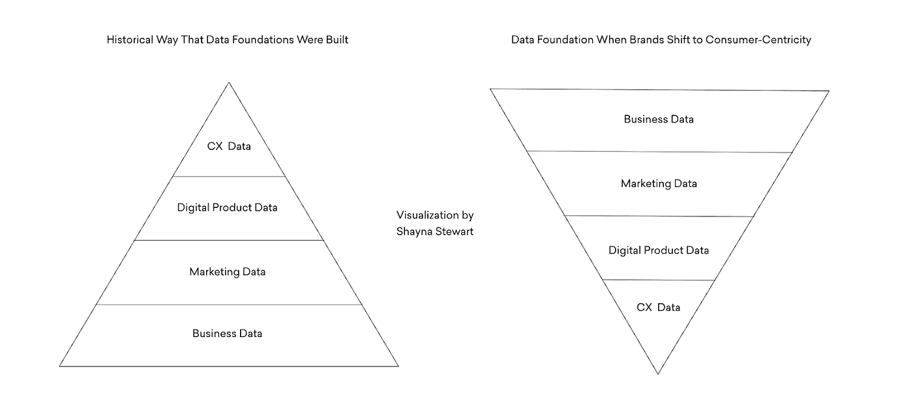
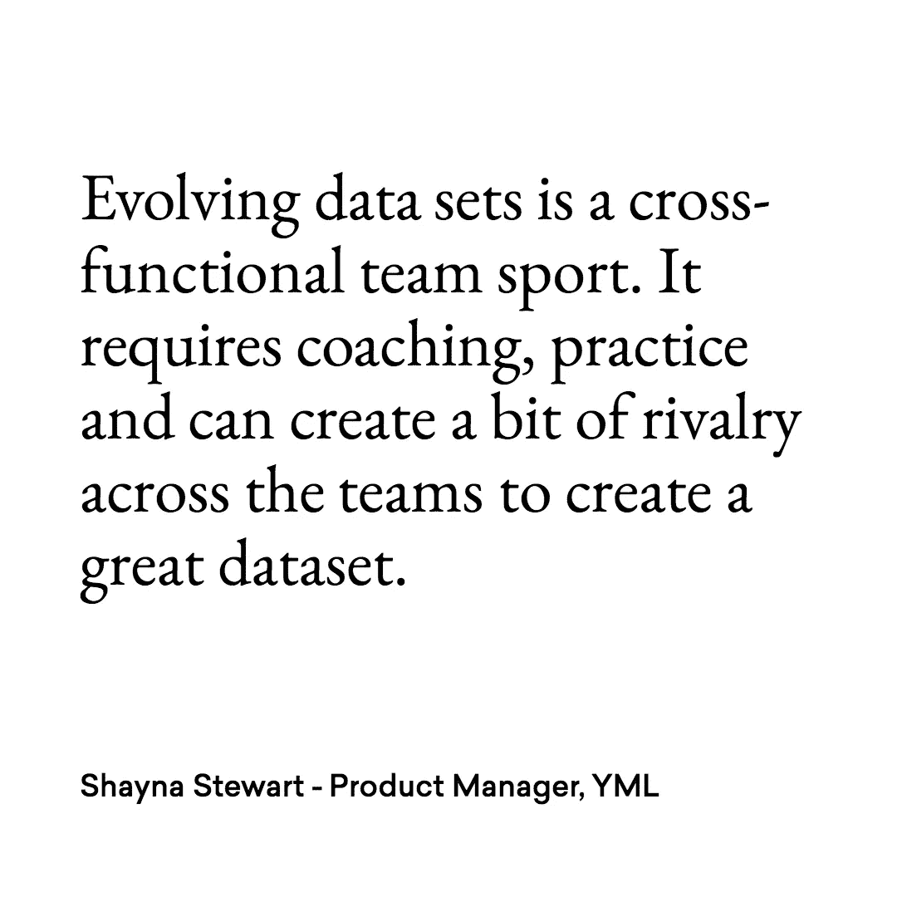
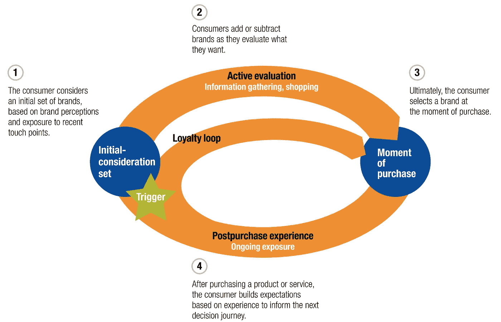
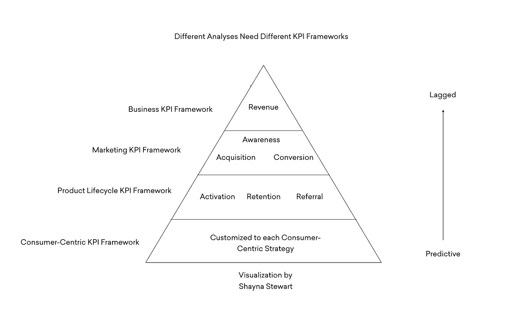
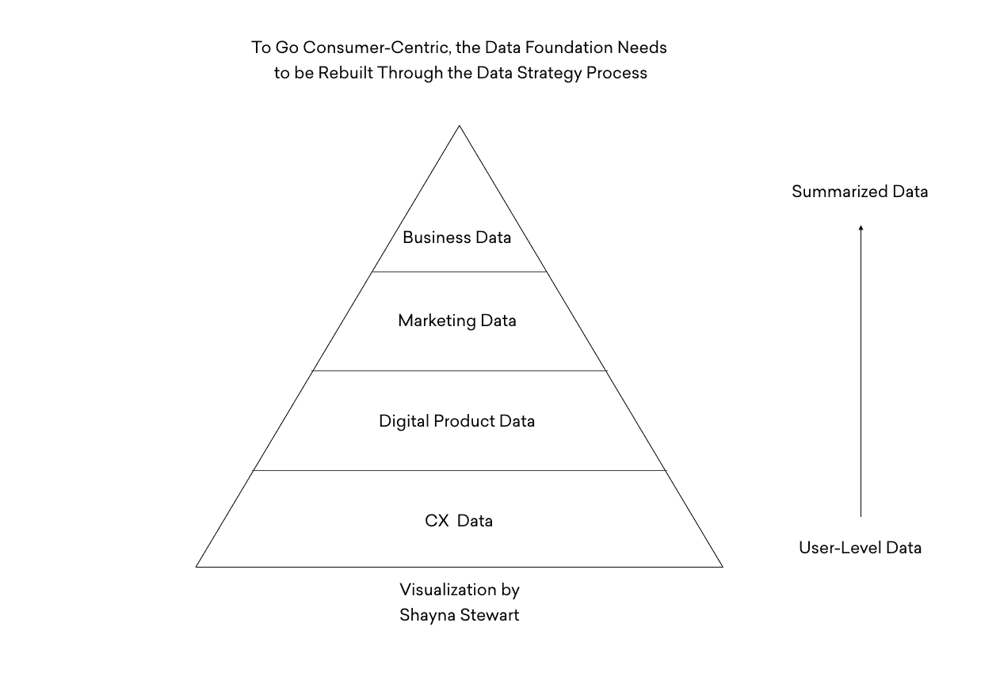

# 为什么以消费者为中心的战略需要正确的数据集

> 原文：<https://towardsdatascience.com/shifting-the-analytics-paradigm-to-consumer-centric-41b4010ab3e8?source=collection_archive---------31----------------------->

## 将产品和管理团队转变为以消费者体验为导向的思维模式。

*作者:夏娜·斯图尔特——产品经理，* [*YML*](https://ymedialabs.com)

如果你已经成功地将你的产品和高管团队转变为消费者体验驱动的思维模式——在产品体验中优先考虑对消费者的同情，你应该受到表扬。

然而，在培训团队和建立新流程的所有工作之后，你的产品和分析团队可能会经历一点摩擦。

成长的烦恼之所以会出现，是因为随着问题从以业务为中心发展到以消费者为中心，数据集并没有发展:

1.  分析团队只能在业务分析和营销分析范式中运作。
2.  因此，他们很难进入以产品和消费者为中心的分析范式。

专注于客户满意度是一件好事——[并且是整个品牌业内公认的游戏规则改变者。](https://ymedialabs.com/kpis-customer-satisfaction)

通常，转向消费者体验思维模式的团队会意外地将业务或营销数据误认为是产品数据，所以你需要停止关注量化的行为数据。

以下是方法。

# 以消费者为中心对数据结构来说很难

这主要与数据结构的构建方式有关:

数据结构是你所提问题的函数。

从历史上看，业务数据集是最古老的。他们被设计来回答这样的问题，“我赚了多少钱，我有多少付费客户？

引入营销数据集是为了回答围绕营销活动的执行、范围和影响的问题。

除了这两种，大多数公司都停止构建数据结构。现在，各种品牌都在努力通过一个过时的系统来回答营销和业务开发团队的关键问题。

你可能想知道:

*在数据量以秒为单位呈指数增长的时代，我们怎么可能在一天中缺少数据集？*

又一个很棒的问题！🧐

现实情况是，数据需要特定的结构来回答特定的问题。通常，数据是以非结构化的方式捕获的，然后需要重新结构化，以回答关键的产品和以消费者为中心的问题。

# 发展您的数据集

构建这些数据集是一项跨职能的团队运动。这是一项运动，因为它需要指导和练习，并且可以在团队之间产生一些竞争，以创建一个伟大的数据集。

# 第一步

*👉有一个清晰简洁的以消费者为中心的战略。*

以消费者为中心的策略需要有一个消费者之旅，当用户在消费者之旅中移动时，消费者的反馈和基于消费者需求的状态会通知这个消费者之旅。一旦完成，确保每个人都知道并同意这个策略。

Source: [The consumer decision journey](https://www.mckinsey.com/business-functions/marketing-and-sales/our-insights/the-consumer-decision-journey), McKinsey

如果人们开始动摇他们对战略的认同程度，以消费者为中心的分析就会失败，因为分析旨在提供关于战略执行情况的反馈。

如果人们开始不同意该战略或遵循不同的战略，那么以消费者为中心的分析框架将不会提供关于该战略执行情况的信息。

# 第二步

*👉从头开始构建 KPI 结构，首先从以消费者为中心的 KPI 开始。*

您的以消费者为中心的 KPI 应该描述您在消费者旅程研究中确定为战略行动的基于消费者需求的状态。他们还应该预测你的业务和营销关键绩效指标。

# 第三步

*👉确定业务、营销、产品和以消费者为中心的问题之间的差异。*

我们建议分析团队成员对他们经常被问到的问题进行分类。更进一步，开始对哪些团队提出了什么问题进行分类。

这将有助于稍后建立您的数据民主化策略。不是每个人都有兴趣得到所有问题的答案。为了重温不同类型的分析，**看看这篇文章。**

# 第四步

*👉选择正确的工具和/或更新您的实施，以确保回答所有问题。*

以消费者为中心的问题总是最难回答的，因为它们需要最复杂的数据能力来回答。因此，您的需求应该由以消费者为中心的分析需求引导，然后向后工作，以确保您的工具能够回答更简单的三个问题。

# 最后

要真正拥有以消费者为中心的数据集，每个人都必须具备一些关键要求:

1.  访问围绕用户总结的数据，而不是围绕访问量或页面。
2.  跨平台链接用户数据的策略，即身份解析系统
3.  建立用户群组并基于这些群组开发定制营销和产品体验的计划和承诺

—

*Shayna 是一名产品经理，热衷于以消费者为中心的产品战略和设计，并倡导以消费者为导向的数据战略。*

*最初发表于 YML —* [*为什么以消费者为中心的战略需要正确的数据集*](https://ymedialabs.com/consumer-centric-strategy-datasets) *。*